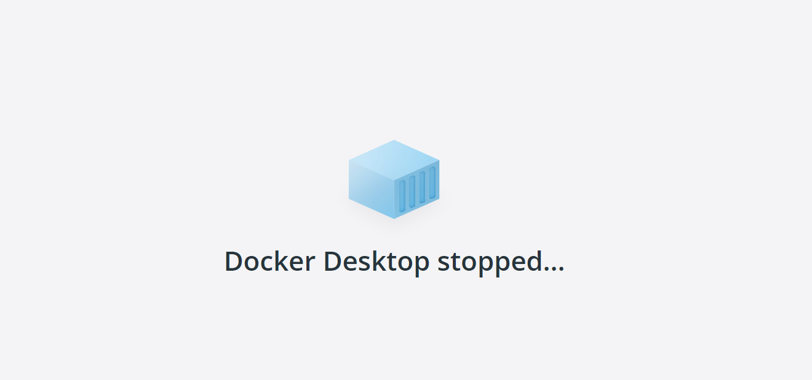
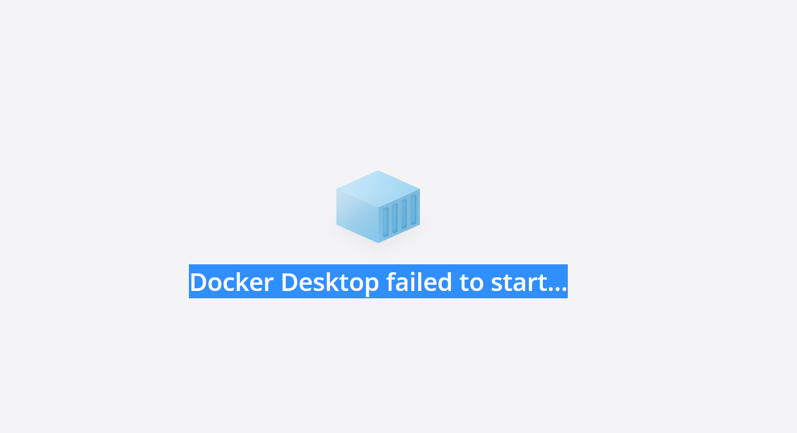

文档 https://docker.easydoc.net/

# Docker 简介和安装

### Docker 是什么

Docker 是一个应用打包、分发、部署的工具
你也可以把它理解为一个轻量的虚拟机，它只虚拟你软件需要的运行环境，多余的一点都不要，
而普通虚拟机则是一个完整而庞大的系统，包含各种不管你要不要的软件。

### 跟普通虚拟机的对比

| 特性   | 普通虚拟机                                                   | Docker                                               |
| ------ | ------------------------------------------------------------ | ---------------------------------------------------- |
| 跨平台 | 通常只能在桌面级系统运行，例如 Windows/Mac，无法在不带图形界面的服务器上运行 | 支持的系统非常多，各类 windows 和 Linux 都支持       |
| 性能   | 性能损耗大，内存占用高，因为是把整个完整系统都虚拟出来了     | 性能好，只虚拟软件所需运行环境，最大化减少没用的配置 |
| 自动化 | 需要手动安装所有东西                                         | 一个命令就可以自动部署好所需环境                     |
| 稳定性 | 稳定性不高，不同系统差异大                                   | 稳定性好，不同系统都一样部署方式                     |

### 打包、分发、部署

**打包**：就是把你软件及其运行所需的依赖、第三方库打包到一起，变成一个**安装包**
**分发**：你可以把你打包好的“安装包”**上传到一个镜像仓库**，其他人可以非常方便的获取和安装
**部署**：拿着“安装包”就可以一个命令运行起来你的应用，自动模拟出一摸一样的运行环境，不管是在 Windows/Mac/Linux。


### Docker 部署的优势

常规应用开发部署方式：自己在 Windows 上开发、测试 --> 到 Linux 服务器配置运行环境部署。

> 问题：我机器上跑都没问题，怎么到服务器就各种问题了

用 Docker 开发部署流程：自己在 Windows 上开发、测试 --> 打包为 Docker 镜像（可以理解为软件安装包） --> 各种服务器上只需要一个命令部署好

> 优点：确保了不同机器上跑都是一致的运行环境，不会出现我机器上跑正常，你机器跑就有问题的情况。

例如 [易文档](https://easydoc.net/)，[SVNBucket](https://svnbucket.com/) 的私有化部署就是用 Docker，轻松应对客户的各种服务器。

### Docker 通常用来做什么

- 应用分发、部署，方便传播给他人安装。特别是开源软件和提供私有部署的应用
- 快速安装测试/学习软件，用完就丢（类似小程序），不把时间浪费在安装软件上。例如 Redis / MongoDB / ElasticSearch / ELK
- 多个版本软件共存，不污染系统，例如 Python2、Python3，Redis4.0，Redis5.0
- Windows 上体验/学习各种 Linux 系统

### 重要概念：镜像、容器

**镜像**：可以理解为软件安装包，可以方便的进行传播和安装。
**容器**：软件安装后的状态，每个软件运行环境都是独立的、隔离的，称之为容器。

### 安装

桌面版：https://www.docker.com/products/docker-desktop
服务器版：https://docs.docker.com/engine/install/#server

**4.5+版本不稳定，容易崩溃**

### 启动报错解决



卸载，重新安装4.4.4版本

https://docs.docker.com/desktop/release-notes/#docker-desktop-444




  在 Docker.ApiServices.WSL2.WslShortLivedCommandResult.LogAndThrowIfUnexpectedExitCode(String prefix, ILogger log, Int32 expectedExitCode) 位置 C:\workspaces\PR-17132\src\github.com\docker\pinata\win\src\Docker.ApiServices\WSL2\WslCommand.cs:行号 146

cmd> wsl 参考的对象类型不支持尝试的操作。

管理员  `netsh winsock reset`  

 


win10启动闪退

​	重新启动

报错截图


**解决方法**：
控制面板->程序->启用或关闭 windows 功能，开启 Windows 虚拟化和 Linux 子系统（WSL2)

**Windows Subsystem for Linux**　allows Linux programs to run natively on Windows


**命令行安装 Linux 子系统（这步可能不需要，因为 docker 安装时有说自动安装 wsl）**
`wsl --install -d Ubuntu`

> 命令行安装可能太慢，你也可以打开微软商店 Microsoft Store 搜索 Linux 进行安装

**设置开机启动 Hypervisor**
`bcdedit /set hypervisorlaunchtype auto`

> 注意要用管理员权限打开 PowerShell

**确保 BIOS 已开启虚拟化，下图检查是否已开启好**

> 如果是已禁用，请在开机时按 F2 进入 BIOS 开启一下，不会设置的可以网上搜索下自己主板的设置方法，Intel 和 AMD 的设置可能稍有不同


**出现下图错误，点击链接安装最新版本的 WSL2**
https://wslstorestorage.blob.core.windows.net/wslblob/wsl_update_x64.msi


### 镜像加速源

| 镜像加速器          | 镜像加速器地址                          |
| ------------------- | --------------------------------------- |
| Docker 中国官方镜像 | https://registry.docker-cn.com          |
| DaoCloud 镜像站     | http://f1361db2.m.daocloud.io           |
| Azure 中国镜像      | https://dockerhub.azk8s.cn              |
| 科大镜像站          | https://docker.mirrors.ustc.edu.cn      |
| 阿里云              | https://<your_code>.mirror.aliyuncs.com |
| 七牛云              | https://reg-mirror.qiniu.com            |
| 网易云              | https://hub-mirror.c.163.com            |
| 腾讯云              | https://mirror.ccs.tencentyun.com       |


```
{
  "registry-mirrors":["http://f1361db2.m.daocloud.io"],
   "debug":true

}
```


# Docker 快速安装软件

### 直接安装的缺点

- 安装麻烦，可能有各种依赖，运行报错。例如：WordPress，ElasticSearch，Redis，ELK
- 可能对 Windows 并不友好，运行有各种兼容问题，软件只支持 Linux 上跑
- 不方便安装多版本软件，不能共存。
- 电脑安装了一堆软件，拖慢电脑速度。
- 不同系统和硬件，安装方式不一样

### Docker 安装的优点

- 一个命令就可以安装好，快速方便
- 有大量的镜像，可直接使用
- 没有系统兼容问题，Linux 专享软件也照样跑
- 支持软件多版本共存
- 用完就丢，不拖慢电脑速度
- 不同系统和硬件，只要安装好 Docker 其他都一样了，一个命令搞定所有

### 演示 Docker 安装 Redis

Redis 官网：https://redis.io/

> 官网下载安装教程只有源码安装方式，没有 Windows 版本。想要自己安装 windows 版本需要去找别人编译好的安装包。

Docker 官方镜像仓库查找 Redis ：https://hub.docker.com/


一个命令跑起来：`docker run -d -p 6380:6379 --name redis redis［:latest］`

Docker Repositories are used to store or host the same images with multiple tags or versions

-p --publish Publish a container's port(s) to the host  container's port：6379   host ：6380

image_name=Repository_name:tag

没有指定版本默认latest

**命令参考：https://docs.docker.com/engine/reference/commandline/run/**


### 安装 Wordpress

### what is

简单来说,就是网站管理后台,可以搭建门户、下载站、淘宝客、论坛、多博客等网站.

docker-compose.yml

```
version: '3.1'

services:

  wordpress:
    image: wordpress
    restart: always
    ports:
      - 8080:80
    environment:
      WORDPRESS_DB_HOST: db
      WORDPRESS_DB_USER: exampleuser
      WORDPRESS_DB_PASSWORD: examplepass
      WORDPRESS_DB_NAME: exampledb
    volumes:
      - wordpress:/var/www/html

  db:
    image: mysql:5.7
    restart: always
    environment:
      MYSQL_DATABASE: exampledb
      MYSQL_USER: exampleuser
      MYSQL_PASSWORD: examplepass
      MYSQL_RANDOM_ROOT_PASSWORD: '1'
    volumes:
      - db:/var/lib/mysql

volumes:
  wordpress:
  db:
```

在文件所在路径下,shift+右键 打开power shell 

``` docker-compose up -d 
	docker-compose up -d 
```

Volume "_wordpress"  **Error**                                                                              
Error response from daemon: create _wordpress: "_wordpress" includes invalid characters for a local volume name, only "[a-zA-Z0-9][a-zA-Z0-9_.-]" are allowed. If you intended to pass a host directory, use absolute path

### Docker volume

 **it is a storage mechanism that is used for persistent data storage generated by Docker containers.** Docker volumes are managed by Docker itself. It is better to store data in a volume rather than storing it in a container’s writable layer as it does not increase the size of the container; also, containers are ephemeral, which means container lifetime is short, and containers get destroyed, and so the data as well. **Docker volume can be shared with more than one container**.

### 安装 ELK

```
docker run -p 5601:5601 -p 9200:9200 -p 5044:5044 -it --name elk sebp/elk
```

[内存不够解决方法](https://docs.microsoft.com/en-us/windows/wsl/wsl-config#global-configuration-options-with-wslconfig)
转到用户目录 `cd ~`，路径类似这个：`C:\Users\<UserName>`
创建 `.wslconfig` 文件填入以下内容

```
[wsl2]
memory=10GB # Limits VM memory in WSL 2 to 4 GB
processors=2 # Makes the WSL 2 VM use two virtual processors
```

生效配置，命令行运行 `wsl --shutdown`

### 更多相关命令

`docker ps` 查看当前运行中的容器
`docker images` 查看镜像列表
`docker rm container　-id` 删除指定 id 的容器
`docker stop/start container　-id` 停止/启动指定 id 的容器
`docker rmi image　-id` 删除指定 id 的镜像
`docker volume ls` 查看 volume 列表
`docker network ls` 查看网络列表

# 制作自己的镜像

### 为自己的 Web 项目构建镜像

示例项目代码：https://github.com/gzyunke/test-docker
这是一个 Nodejs + Koa2 写的 Web 项目，提供了简单的两个演示页面。
软件依赖：nodejs
项目依赖库：koa、log4js、koa-router

### 编写 Dockerfile

```
FROM node:11
MAINTAINER easydoc.net

# 复制代码
ADD . /app

# 设置容器启动后的默认运行目录
WORKDIR /app

# 运行命令，安装依赖
# RUN 命令可以有多个，但是可以用 && 连接多个命令来减少层级。
# 例如 RUN npm install && cd /app && mkdir logs
RUN npm install --registry=https://registry.npm.taobao.org

# CMD 指令只能一个，是容器启动后执行的命令，算是程序的入口。
# 如果还需要运行其他命令可以用 && 连接，也可以写成一个shell脚本去执行。
# 例如 CMD cd /app && ./start.sh
CMD node app.js
```

[Dockerfile文档](https://docs.docker.com/engine/reference/builder/#run)

> 实用技巧：
> 如果你写 Dockerfile 时经常遇到一些运行错误，依赖错误等，你可以直接运行一个依赖的底，然后进入终端进行配置环境，成功后再把做过的步骤命令写道 Dockerfile 文件中，这样编写调试会快很多。
> 例如上面的底是`node:11`，我们可以运行`docker run -it -d node:11 bash`，跑起来后进入容器终端配置依赖的软件，然后尝试跑起来自己的软件，最后把所有做过的步骤写入到 Dockerfile 就好了。

### Build 为镜像（安装包）和运行

编译 `docker build -t test:v1 .`

> `-t` 设置镜像名字和版本号
> 命令参考：https://docs.docker.com/engine/reference/commandline/build/

运行 `docker run -p 8080:8080 --name test-hello test:v1`

> `-p` 映射容器内端口到宿主机
> `--name` 容器名字
> `-d` 后台运行
> 命令参考文档：https://docs.docker.com/engine/reference/run/

### springboot项目

1. 创建springboot项目

2. 配置maven插件

   ```xml
    <plugin>
                   <groupId>org.apache.maven.plugins</groupId>
                   <artifactId>maven-resources-plugin</artifactId>
                   <version>3.1.0</version>
               </plugin>
               <plugin>
                   <groupId>com.spotify</groupId>
                   <artifactId>dockerfile-maven-plugin</artifactId>
                   <version>1.4.9</version>
                   <executions>
                       <execution>
                           <id>default</id>
                           <goals>
                               <goal>build</goal>
                           </goals>
                       </execution>
                   </executions>
                   <configuration>
                       <!--repository of the image-->
                       <repository>org.example/${project.artifactId}</repository>
                       <!--tag of the image-->
                       <tag>${project.version}</tag>
                       <!--buildArgs是在docker构建镜像过程中的参数，此处定义的JAR_FILE参数在执行docker build 的时候会消费-->
                       <buildArgs>
                           <JAR_FILE>${project.build.finalName}.jar</JAR_FILE>
                       </buildArgs>
                   </configuration>
               </plugin>
   ```

3. 配置dockerfile(和 pom.xml 文件同级)

   ```text
   FROM openjdk:8-jdk-alpine
   VOLUME /tmp
   EXPOSE 8082
   ARG JAR_FILE
   COPY target/${JAR_FILE} /app.jar
   ENTRYPOINT ["java","-jar","/app.jar"]
   ```

   * 先从中央仓库https://hub.docker.com/或者你配置的代理仓库（如阿里云镜像仓库）拉取 openjdk 镜像
   * 然后设置一个挂载点；
   * 拷贝 target 目录下的 Spring boot 项目运行包，并改名为 app.jar;
   * 设置启动命令 java -jar app.jar

   ```bash
   #Base images
   FROM centos
   
   #MAINTAINER 维护人
   MAINTAINER test
   
   #ADD 添加本地文件到镜像
   ADD pcre-8.37.tar.gz /usr/local/src
   ADD nginx-1.9.3.tar.gz /usr/local/src
   
   #RUN 在镜像中执行命令
   RUN yum install -y wget gcc_c++ make openssl-devel
   RUN useradd -s /sbin/nologin -M www
   
   #WORKDIR 镜像中切换到目录
   WORKDIR /usr/local/src/nginx-1.9.3
   
   RUN yum install -y gcc gcc-c++
   RUN ./configure --prefix=/usr/local/nginx --user=www --group=www --with-http_ssl_module --with-http_stub_status_module --with-pcre=/usr/local/src/pcre-8.37 && make && make install
   RUN echo "daemon off;">>/usr/local/nginx/conf/nginx.conf
   
   #配置环境变量
   ENV PATH /usr/local/nginx/sbin:$PATH
   
   #声明运行时容器提供服务端口(在运行时并不会因为这个声明应用就会开启这个端口的服务)
   EXPOSE 80
   
   #CMD 容器启动命令,用于指定默认的容器主进程的启动命令
   CMD  ["nginx"]
   ```

4. 生成镜像& 容器

   ``` 
   mvn package dockerfile:build -Dmaven.test.skip=true
   ```

   **Error: Connect to localhost:2375** 

   ​	check  Expose daemon on tcp://localhost:2375 without TLS(**Transport Layer Security**)

   相当于

   ```bash
   docker build -t[--tag] -image . 
   ```

5. 启动服务

```bash
docker run -d -p 9090:8080 -image:version
```

9090为外部访问项目端口,8080为项目配置文件指定的端口

# 目录挂载

### 现存问题

- 使用 Docker 运行后，我们改了项目代码不会立刻生效，需要重新`build`和`run`，很是麻烦。
- 容器里面产生的数据，例如 log 文件，数据库备份文件，容器删除后就丢失了。

> 目录挂载解决以上问题

### 几种挂载方式

- `bind mount` 直接把宿主机目录映射到容器内，适合挂代码目录和配置文件。可挂到多个容器上
- `volume` 由容器创建和管理，创建在宿主机，所以删除容器不会丢失，官方推荐，更高效，Linux 文件系统，适合存储数据库数据。可挂到多个容器上
- `tmpfs mount` 适合存储临时文件，存宿主机内存中。不可多容器共享。

文档参考：https://docs.docker.com/storage/


### 挂载演示

```
bind mount` 方式用绝对路径 `-v D:/code:/app
volume` 方式，只需要一个名字 `-v db-data:/app
```

示例：
`docker run -p 9090:8080 --name test-hello -v C:\Users\Administrator\IdeaProjects\spring-boot-parent\redis-demo:/app -d org.example/redis-demo:0.0.1-SNAPSHOT`

**对spring项目而言,跑的是jar包,文件的更改并没有意义**

# 多容器通信

### 学习目标

项目往往都不是独立运行的，需要数据库、缓存这些东西配合运作。
这节我们把前面的 Web 项目增加一个 Redis 依赖，多跑一个 Redis 容器，演示如何多容器之间的通信。

### 创建虚拟网络

要想多容器之间互通，从 Web 容器访问 Redis 容器，我们只需要把他们放到同个网络中就可以了。

文档参考：<https://docs.docker.com/engine/reference/commandline/network/>

### 演示

##### 创建一个名为`test-net`的网络：

`docker network create test-net`

##### 运行 Redis 在 `test-net` 网络中，别名`redis`

`docker run -d --name redis --network test-net --network-alias redis redis:latest`

##### 修改代码中访问`redis`的地址为网络别名


##### 运行 Web 项目，使用同个网络

`docker run -p 8080:8080 --name test -v D:/test:/app --network test-net -d test:v1`

##### 查看数据

`http://localhost:8080/redis`
容器终端查看数据是否一致

springboot+redis:

```
docker run -d --name springboot-redis-demo --network springboot-net  --network-alias app --link redis_test -p 9090:8081 -v E:\ideaProjects\my-spring-boot-starter\redis:/app -w /app  org.example/redis:0.0.1-SNAPSHOT
```

```
docker run -d --name springboot-redis -p 6379:6379 --network springboot-net --network-alias redis_test -w /redis -v E:\docker\redis:/app redis:6.0 redis-server /app/redis.conf
```

**注意：必须要为每个容易设置网络别名，不然不能成功访问**（桥接网络） --network-alias  xxx

Docker容器互访的三种方式 https://blog.csdn.net/golden_zjy/article/details/100132718

redis.conf 

- protected-mode  no
- \#bind 127.0.0.1
- timeout 50

# Docker compose

##现存问题

在上节，我们运行了两个容器：Web 项目 + Redis
如果项目依赖更多的第三方软件，我们需要管理的容器就更加多，每个都要单独配置运行，指定网络。
这节，我们**使用 docker-compose 把项目的多个服务集合到一起，一键运行**。

## 安装 Docker Compose

- 如果你是安装的桌面版 Docker，不需要额外安装，已经包含了。
- 如果是没图形界面的服务器版 Docker，你需要单独安装 [安装文档](https://docs.docker.com/compose/install/#install-compose-on-linux-systems)
- 运行`docker-compose`检查是否安装成功

## 编写脚本

要把项目依赖的多个服务集合到一起，我们需要编写一个`docker-compose.yml`文件，描述依赖哪些服务
参考文档：<https://docs.docker.com/compose/>

```
version: "3.7"

services:
  app:
    build: ./
    ports:
      - 80:8080
    volumes:
      - ./:/app
    environment:
      - TZ=Asia/Shanghai
  redis:
    image: redis:5.0.13
    volumes:
      - redis:/data
    environment:
      - TZ=Asia/Shanghai

volumes:
  redis:
```

> 容器默认时间不是北京时间，增加 TZ=Asia/Shanghai 可以改为北京时间

## 跑起来

在`docker-compose.yml` 文件所在目录，执行：`docker-compose up`就可以跑起来了。
命令参考：<https://docs.docker.com/compose/reference/up/>


注意点:

1. `docker-compose.yml`与pom.xml同级

2. Image for service app was built because it did not already exist. To rebuild this image you must use `docker-compo
   se build` or `docker-compose up --build`

3. dockerdile的JAR_FILE之前是通过maven pom.xml传入 现在需要指定参数

   ```
   ADD target/redis-0.0.1-SNAPSHOT.jar /app.jar
   # Run bash -c "touch /app.jar"
   ```

4. ls -al 可以看到系统自带目录结构（ls不行）

5. 第一次build的时候，网络会创建但并不会自动将connect container 需在之后手动

   ``` 
   docker network connect [OPTIONS] NETWORK CONTAINER
   
   docker network connect springboot-net springboot-redis
    docker network connect springboot-net springboot-redis-demo
   
   ```

   

6. network不生效 docker-compose之前先删掉要创建的network

```
version: "3.9" #Compose文件版本支持特定的Docker版本

services:       #本工程的服务配置列表
  app:   #spring boot的服务名，服务名自定义
    container_name: springboot-redis-demo
      #本spring boot服务之后启动的容器实例的名字，如果指定，按照这个命名容器，如果未指定，容器命名规则是
      #【[compose文件所在目录]_[服务名]_1】，例如【swappingdockercompose_swapping_1】
      #如果多启动，也就是docker-compose scale swapping=3 mysql=2的话，就不需要指定容器名称，否则会报错 容器名重复存在的问题
    build:
      context: . #代表当前目录，也可以指定绝对路径[/path/test/Dockerfile]或相对路径[../test/Dockerfile]，尽量放在当前目录，便于管理
      dockerfile: dockerfile #指定Dockerfile文件名。如果context指定了文件名，这里就不用本属性
#      args:  #      args 构建参数，只能在构建过程中访问的环境变量
#        buildno:
    ports:
      - "9091:8081" #建议使用字符串格式，指定宿主机端口映射到本容器的端口
    volumes:  #挂载属性
      - ./:/app #挂载路径在compose配置文件中只能指定容器内的目录，而docker run命令可以指定[宿主机目录：容器内目录]的挂载方式。可以使用:ro对容器内目录设置只读，来保护宿主机的文件系统
    depends_on: #本服务启动，需要依赖哪些别的服务
      - redis_test
    links: #与depends_on相对应，上面控制启动顺序，这个控制容器连接问题
      - redis_test #值可以是- mysql[- 服务名]，也可以是- "mysql:mysql"[- "服务名：别名"]
    restart: always                #是否随docker服务启动重启
    networks: #加入指定网络
      - springboot-net                #自定义的网络
    environment: #environment 和 Dockerfile 中的 ENV 指令一样会把变量一直保存在镜像、容器中，类似 docker run -e 的效果。设置容器的环境变量
      - TZ=Asia/Shanghai
  redis_test:
    image: redis:6.0
    container_name: springboot-redis
    networks:
      - springboot-net
    volumes:
      - 'E:\docker\redis\data:/data'
      - 'E:\docker\redis:/app'
    environment:
      - TZ=Asia/Shanghai
    ports:
      - 6379:6379
#    command: [  #使用 command 可以覆盖容器启动后默认执行的命令(配置文件)
#       'touch /redis.conf',
#       'redis-server /redis.conf'
#    ]
    command: /bin/bash -c "redis-server /app/redis.conf"
# 一个目录或者一个已存在的数据卷容器
# 分为 单个服务定义的一部分 + 可重用命名卷
# [host_SOURCE:]container_TARGET[:MODE]
#volumes:
#  /app:
networks:                        #关于compose中的networks的详细使用https://blog.csdn.net/Kiloveyousmile/article/details/79830810
  springboot-net:                    #自定义的网络，会在第一次构建时候创建自定义网络，默认是bridge
```


#发布和部署

## 镜像仓库介绍

镜像仓库用来存储我们 build 出来的“安装包”，Docker 官方提供了一个 [镜像库](https://hub.docker.com/)，里面包含了大量镜像，基本各种软件所需依赖都有，要什么直接上去搜索。

我们也可以把自己 build 出来的镜像上传到 docker 提供的镜像库中，方便传播。
当然你也可以搭建自己的私有镜像库，或者使用国内各种大厂提供的镜像托管服务，例如：阿里云、腾讯云

### 上传我们的镜像

- 首先你要先 注册一个账号 https://hub.docker.com/

- 创建一个镜像库
  

- 命令行登录账号：
  `docker login -u username -p xxxx`

- 新建一个tag image，username 必须跟你注册账号一样

  docker tag： Create a tag TARGET_IMAGE that refers to SOURCE_IMAGE 

   命名格式应为: **dockerhub用户名/镜像名**   **且 要跟远程仓库名称一致否则denied: requested access to the resource is denied**

  docker tag org.example/redis:0.0.1-SNAPSHOT jinjianou/org.example/redis:v1

- 推上去

  docker push：Push an image or a repository to a registry 

  tag TARGET_IMAGE

  `docker push username/test:v1`

- 部署试下

  ```
  docker run -d --name springboot-redis-demo --network springboot-net  --network-alias app --link redis_test -p 9090:8081 -v E:\ideaProjects\my-spring-boot-starter\redis:/app -w /app  org.example/redis:0.0.1-SNAPSHOT
  ```

  `docker run -dp 8080:8080 username/test:v1`

### docker-compose 中也可以直接用这个镜像了

```
version: "3.7"

services:
  app:
#    build: ./
    image: helloguguji/test:v1
    ports:
      - 80:8080
    volumes:
      - ./:/app
    environment:
      - TZ=Asia/Shanghai
  redis:
    image: redis:5.0.13
    volumes:
      - redis:/data
    environment:
      - TZ=Asia/Shanghai

volumes:
  redis:
```

### 阿里云容器托管

docker 官方的镜像托管有时候上传和下载都太慢了，如果你想要更快的速度，可以使用阿里云的免费镜像托管
登录 [阿里云](https://www.aliyun.com/)


```
 docker rmi $(docker images | grep "筛选关键字" | awk '{print $3}') 
```

1. 登录

    docker login --username=jinjianou registry.cn-hangzhou.aliyuncs.com

2. 打tag

   docker tag org.example/redis:0.0.1-SNAPSHOT registry.cn-hangzhou.aliyuncs.com/jinjianou/spring-boot-demo:v1

3. push

   docker push registry.cn-hangzhou.aliyuncs.com/jinjianou/spring-boot-demo:v1

4. pull

   docker pull registry.cn-hangzhou.aliyuncs.com/jinjianou/spring-boot-demo:v1

5. 测试

# 备份和迁移

## 迁移方式介绍

容器中的数据，如果没有用挂载目录，删除容器后就会丢失数据。
前面我们已经讲解了如何 [挂载目录](doc:kze7f0ZR)
如果你是用`bind mount`直接把宿主机的目录挂进去容器，那迁移数据很方便，直接复制目录就好了
如果你是用`volume`方式挂载的，由于数据是由容器创建和管理的，需要用特殊的方式把数据弄出来。

## 备份和导入 Volume 的流程

备份：

- 运行一个 ubuntu 的容器，挂载需要备份的 volume 到容器，并且挂载宿主机目录到容器里的备份目录。
- 运行 tar 命令把数据压缩为一个文件
- 把备份文件复制到需要导入的机器

导入：

- 运行 ubuntu 容器，挂载容器的 volume，并且挂载宿主机备份文件所在目录到容器里
- 运行 tar 命令解压备份文件到指定目录

### 备份 MongoDB 数据演示

- 运行一个 mongodb，创建一个名叫`mongo-data`的 volume 指向容器的 /data 目录
  `docker run -p 27018:27017 --name mongo -v mongo-data:/data -d mongo:4.4`

- 运行一个 Ubuntu 的容器，挂载`mongo`容器的所有 volume，映射宿主机的 backup 目录到容器里面的 /backup 目录，然后运行 tar 命令把数据压缩打包
  `docker run --rm --name ubuntu18_04  --volumes-from mongo4_4 -v E:\docker\backup\:/backup   ubuntu:18.04 tar cvf /backup/backup.tar /data/`

  **--rm 不会生成容器**

最后你就可以拿着这个 backup.tar 文件去其他地方导入了。

### 恢复 Volume 数据演示

- 运行一个 ubuntu 容器，挂载 mongo 容器的所有 volumes，然后读取 /backup 目录中的备份文件，解压到 /data/ 目录
  `docker run --rm --volumes-from mongo -v d:/backup:/backup ubuntu bash -c "cd /data/ && tar xvf /backup/backup.tar --strip 1"`

> 注意，volumes-from 指定的是容器名字
> strip 1 表示解压时去掉前面1层目录，因为压缩时包含了绝对路径


# 其他

查看ip    IpAddress

docker inspect container name|id