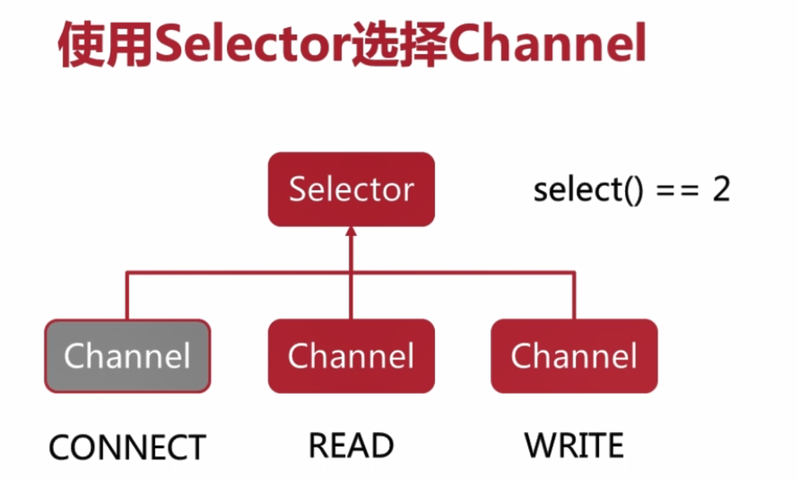

# 初始

java1.4以前 BIO

java1.4 NIO

java1.7 AIO


# 前置

1. DNS


还有一种递归查询

1. 如果当级域名知道请求域名对应的ip,直接返回客户端
2. 否则,交给它所知道的下级域名


2. 网络模型

   


# 网络编程概述

网络编程的本质就是**进程间通信**,通信的基础是**IO模型**


## IO stream

1. DataInputStream: A data input stream lets an application read primitive java data types from an underlying(底层的) input stream in a machine-independent way.

2. 装饰器模式

   BufferedInpustream(FileInpustream)
   
   

## Scoket

1. scoket也是一种数据源
2. socket是网络通信的端点
3. unix kernal会维护一个文件描述符表(已打开文件的索引),同时每个进程都会维护一个文件描述符表(最终映射到内核的文件描述符)


1. 生成抽象的socket
2. 找到网卡对应的驱动程序,并将socket和其绑定起来
3. 应用程序发送数据到socket
4. 驱动程序从socket中读取数据,并通过网卡发送到网络


## 同步/异步,堵塞/非堵塞

同步指两个或两个以上随时间变化的量在变化过程中保持一定的相对关系(通信机制) 简单理解: **保持在线通信**

​	数据同步和过程同步

异步 **调用快速结束 结果需要处理后才能返回**

堵塞 **调用过程中调用者需要等待一个事件的变化而处于某个状态中** ( 调用状态 )


## 线程池


reuse threads

CachedThreadPool 和 fiexedThreadPool 的区别在于 

​	create new threads when previously constaructed threads are not available

 ScheduledThreadPool

​	can  schedule commands to run after a given delay or to execute periodicallys


# Scoket


accept() blocks until a connection is made


需求

1. client由键盘输入,发送到server,server读取打印并回复给client,client接收打印
2. 当client输入quit时 client断开连接

Server

```
public class Server {
    private static final int PORT=8088;

    public static void main(String[] args) throws IOException {
        ServerSocket server = new ServerSocket(PORT);
        System.out.println("启动服务器,监听端口"+PORT);
        while (true){
            Socket cli = server.accept();
            System.out.println("[客户端] "+cli.getPort()+"已连接");
            try(BufferedReader reader=new BufferedReader(
                    new InputStreamReader(cli.getInputStream()))){
                try(BufferedWriter writer=new BufferedWriter(
                        new OutputStreamWriter(cli.getOutputStream()))){
                    String msg;
                    //cli直接输入回车,readLine为"" 当cli quit时会发送给server null,readLine为null
                    while ((msg = reader.readLine())!=null){
                        System.out.println("[客户端] "+cli.getPort()+" 发来消息: "+msg);

                        writer.write("[服务器] 回复: ack");
                        writer.newLine();
                        writer.flush();
                    }
                }
            }
        }
    }
}
```


client

```
public class Client {
    private static final int PORT=8088;
    private static final String IP="127.0.0.1";
    private static final String QUIT="quit";

    public static void main(String[] args) throws IOException {
        Socket socket = new Socket(IP, PORT);
        String msg;
        try(BufferedReader reader=new BufferedReader(
                new InputStreamReader(System.in))){
            try(BufferedWriter writer=new BufferedWriter(
                    new OutputStreamWriter(socket.getOutputStream()))){
                try(BufferedReader serverReader=new BufferedReader(
                        new InputStreamReader(socket.getInputStream()))){
                    while (true){
                        msg = reader.readLine();
                        if(StringUtils.isBlank(msg)) continue;
                        if(Objects.equals(msg.toLowerCase(),QUIT)) break;

                        writer.write(msg);
                        writer.newLine();
                        writer.flush();

                        System.out.println(serverReader.readLine());
                    }

                }
            }
        }
        socket.close();
        System.out.println("关闭socket");
    }
}
```

注意: 

0. **当有一方close socket 表示这个socket两端(cli,server)的连接都断开了 ,outputstream不可用,inputstream读取为null**

1. **退出serverReader等try-with代码块会JVM自动关闭socket 准确的说 scoket的inputstream/outpuststream close,socket都会close** 

如

```
for (Socket socket : clis) {
    try(BufferedWriter writer=new BufferedWriter(
            new OutputStreamWriter(socket.getOutputStream()))) {
        writer.write(msg);
        writer.newLine();
        writer.flush();
    } catch (IOException e) {
        e.printStackTrace();
    }
}
```

写完就会关闭所有socket

# BIO


## 多人聊天室

需求

1. 基于BIO模型
2. 支持多人在线
3. 每个用户的发言都会被转发给其他在线用户


分析:

1. sever端  main线程充当Acceptor,当有一个client请求,创建一个与之绑定的handler线程

   维护一个List<Socket>

2. client端 由于输入调用也是堵塞的,为了即时接受到其他用户的发言,可以分为2个线程.


**自研**

```
public class ChatClient {
    private static final int PORT=8088;
    private static final String IP="127.0.0.1";


    public static void main(String[] args) throws IOException {
        Socket socket = new Socket(IP, PORT);

        UserInputhandler handler = new UserInputhandler(socket);
        new Thread(handler).start();
        BufferedReader serverReader=null;
        String msg;
        try {
             serverReader = new BufferedReader(
                    new InputStreamReader(socket.getInputStream()));
            while ((msg=serverReader.readLine())!=null) {
                System.out.println(msg);
            }
        }catch (Exception ex){
            ex.printStackTrace();
        }finally {
            if (serverReader!=null) {
                serverReader.close();
            }
            socket.close();
        }
    }
}
class UserInputhandler implements Runnable {
    private Socket socket;
//    private volatile boolean flag=true;
    private static final String QUIT = "quit";

    public UserInputhandler(Socket socket) {
        this.socket = socket;
    }

/*    public void stop(){flag=false; }
    public boolean getFlag(){ return flag;}*/
    @Override
    public void run() {
        BufferedReader reader=null;
        BufferedWriter writer;
        try {
            reader = new BufferedReader(
                    new InputStreamReader(System.in));
            writer = new BufferedWriter(
                    new OutputStreamWriter(socket.getOutputStream()));
            String msg;

            while ((msg = reader.readLine()) != null) {
                //发送给server ChatHandler 由它分发给其他client
                writer.write(msg);
                writer.newLine();
                writer.flush();

                //停止输入
                if (Objects.equals(msg.toLowerCase(), QUIT)) break;
            }

        } catch (IOException e) {
            e.printStackTrace();
            }finally{
                if (reader!=null) {
                    try {
                        reader.close();
                    } catch (IOException e) {
                        e.printStackTrace();
                    }
                }
            }
        }
}
```

```
public class ChatServer {
    private static final int PORT=8088;
    private static final List<Socket> clis=new ArrayList<>();


    //main 充当 Acceptor
    public static void main(String[] args) throws IOException {
        ServerSocket server = new ServerSocket(PORT);
        System.out.println("启动服务器,监听端口"+PORT);
        ExecutorService threadPool = Executors.newCachedThreadPool();
        while (true){
            Socket cli = server.accept();
            System.out.println("[客户端] "+cli.getPort()+"已连接");

            ChatHandler handler = new ChatHandler(cli,clis);
            threadPool.execute(handler);
        }
    }
}
class ChatHandler implements Runnable{
    private Socket cli;
    private List<Socket> clis;
    private static final String QUIT = "quit";

    public ChatHandler(Socket socket,List<Socket> clis) {
        this.cli = socket;
        this.clis=clis;
    }

    @Override
    public void run() {
        //addClient
        clis.add(cli);

        try(BufferedReader reader=new BufferedReader(
                new InputStreamReader(cli.getInputStream()))){
            String msg;
            while ((msg = reader.readLine())!=null){
                System.out.println("[客户端] "+cli.getPort()+" 发来消息: "+msg);
                BufferedWriter writer;
                if (Objects.equals(msg.toLowerCase(), QUIT)) break;
                //分发给多个client
                for (Socket socket : clis) {
                    try{
                        writer=new BufferedWriter(
                            new OutputStreamWriter(socket.getOutputStream()));
                        writer.write(msg);
                        writer.newLine();
                        writer.flush();
                    } catch (IOException e) {
                        e.printStackTrace();
                    }
                }

            }
            clis.remove(cli);
        }catch (IOException e) {
            e.printStackTrace();
        }
    }
}

```

​	上述更多是面向过程的思想


**面向对象**

server

```
public class ChatServer {
    private static final int DEFAULT_PORT=8090;
    private static final String QUIT = "quit";
    private ServerSocket serverSocket;
    private Map<Integer,BufferedWriter> connectedClients;

    public  ChatServer(){
        connectedClients=new ConcurrentHashMap<>();
    }

    public void addClient(Socket socket){
        if(socket!=null){
            try {
                int port=socket.getPort();
                connectedClients.put(port,
                        new BufferedWriter(new OutputStreamWriter(socket.getOutputStream())));
                System.out.println("[客户端] "+port+"已连接");
            } catch (IOException e) {
                e.printStackTrace();
            }
        }
    }

    public void removeClient(Socket socket) throws IOException {
        if(socket!=null) {
            int port=socket.getPort();
            if(connectedClients.containsKey(port)){
                connectedClients.get(port).close();
            }
            connectedClients.remove(port);
            System.out.println("[客户端] " + port + "已断开连接");
        }
    }

    //广播(除了本身)
    public void forwardMessage(Socket socket,String msg) throws IOException {
        int port=socket.getPort();
        for (Map.Entry<Integer, BufferedWriter> entry : connectedClients.entrySet()) {
            if(!Objects.equals(entry.getKey(),port)){
                BufferedWriter writer = entry.getValue();
                writer.write("客户端["+entry.getKey()+ "]: "+msg);
                writer.newLine();
                writer.flush();
            }
        }
    }

    public boolean readyToQuit(String msg){
        return Objects.equals(msg.toLowerCase(), QUIT);
    }

    //启动服务器
    public void start() throws IOException {
        serverSocket=new ServerSocket(DEFAULT_PORT);
        System.out.println("启动服务器,监听端口"+DEFAULT_PORT);
        ExecutorService threadPool = Executors.newCachedThreadPool();


        try {
            while (true) {
                Socket socket = serverSocket.accept();

                ChatHandler handler = new ChatHandler(this, socket);
                threadPool.execute(handler);
            }
        }catch (Exception ex){
            ex.printStackTrace();
        }finally {
           if(serverSocket!=null){
            serverSocket.close();
            }
        }
    }

    public static void main(String[] args) {
        try {
            ChatServer server = new ChatServer();
            server.start();
        } catch (IOException e) {
            e.printStackTrace();
        }
    }

}
class ChatHandler implements Runnable{
    private ChatServer server;
    private Socket socket;
    private BufferedReader reader;

    public ChatHandler(ChatServer server, Socket socket) {
        this.server = server;
        this.socket = socket;
    }

    private void close(){
        if(reader!=null){
            try {
                reader.close();
            } catch (IOException e) {
                e.printStackTrace();
            }
        }
    }

    @Override
    public void run() {
        try {
            server.addClient(socket);
            reader=new BufferedReader(
                    new InputStreamReader(socket.getInputStream()));
            String msg;
            while ((msg=reader.readLine())!=null){
                System.out.println("[客户端] "+socket.getPort()+" 发来消息: "+msg);

                server.forwardMessage(socket,msg);
                if (server.readyToQuit(msg)) break;
            }
            server.removeClient(socket);
        } catch (IOException e) {
            e.printStackTrace();
        }finally {
            close();
        }
    }
}
```

client

```
public class ChatClient {
    private static final int PORT=8090;
    private static final String IP="127.0.0.1";
    private static final String QUIT = "quit";

    private Socket socket;
    private BufferedWriter writer;
    private BufferedReader reader;


    public void sendMessage(String msg) throws IOException {
        if(!socket.isOutputShutdown()) {
            writer.write(msg);
            writer.newLine();
            writer.flush();
        }

    }

    public String receive() throws IOException {
        String msg=null;
        if(!socket.isInputShutdown()){
            msg=reader.readLine();
        }
        return msg;
    }

    public void close(){
        if(writer!=null){
            try {
                writer.close();
            } catch (IOException e) {
                e.printStackTrace();
            }
        }
    }

    public boolean readyToQuit(String msg){
        return Objects.equals(msg.toLowerCase(), QUIT);
    }

    public void start() throws IOException {
        try {
            socket = new Socket(IP, PORT);
            reader = new BufferedReader(
                    new InputStreamReader(socket.getInputStream()));
            writer = new BufferedWriter(
                    new OutputStreamWriter(socket.getOutputStream()));

            new Thread(new UserInputhandler(this)).start();
            //读取服务器转发的消息
            String msg;
            while ((msg=receive())!=null){
                System.out.println(msg);
            }
        } catch (IOException e) {
            e.printStackTrace();
        } finally {
            close();
            System.out.println("关闭socket");
        }
    }

    public static void main(String[] args) {
        ChatClient chatClient = new ChatClient();
        try {
            chatClient.start();
        } catch (IOException e) {
            e.printStackTrace();
        }
    }


}
class UserInputhandler implements Runnable {
    private ChatClient client;
    private BufferedReader consoleReader;

    public UserInputhandler(ChatClient client) {
        this.client = client;
    }

    private void close(){
        if(consoleReader!=null){
            try {
                consoleReader.close();
            } catch (IOException e) {
                e.printStackTrace();
            }
        }
    }

    @Override
    public void run() {
        try {
            consoleReader = new BufferedReader(
                    new InputStreamReader(System.in));
            String msg;
            while ((msg = consoleReader.readLine()) != null) {
               client.sendMessage(msg);
               if (client.readyToQuit(msg)) break;
            }
        } catch (Exception e) {
            e.printStackTrace();
        } finally {
           close();
        }
    }
}
```


**缺陷**

每一个client连入都需要分配一个线程,占据大量系统资源

**线程池**  也就是


# NIO

**BIO堵塞之处**

1. serverSocket.accept()

2. inputstream.read/outputstream.write

3. 无法在同一个线程里处理多个Stream I/O

   多线程 

   1. context swapping when threads num exceed cpu num
   2. 系统资源


**改进**

1. 使用channel替代stream

   **channel 双向且提供堵塞/非堵塞两种模式**

2. 使用Selector监控多条channel

3. 可以在一个线程里处理多个Channel I/O


写了4个的数据


**切换到读模式** 

​	flip(翻动)切换指针 position->0 limit->3


​	切换到读模式


**切换到写模式**

1. 之前读取了全部数据

   clear()  positioon->0 limit-capacity

   

   

   

2. 只读取了部分数据就切换

   compact() 未读取的n个数据从0开始覆盖,position->n,

   ​				limit->capacity

   


## Channel


## FileChannel

```
FileCopyRunner noBufferStreamCopy=new FileCopyRunner() {
    @Override
    public void copyFile(File source, File target) {
        InputStream is=null;
        OutputStream os=null;
        try {
            is=new FileInputStream(source);
            os=new FileOutputStream(target);
            int c;
            while ((c=is.read())!=-1){
                os.write(c);
            }
        } catch (Exception e) {
            e.printStackTrace();
        } finally {
            close(is);
            close(os);
        }
    }
};
```

```
FileCopyRunner bufferedStreamCopy= new FileCopyRunner() {
    @Override
    public void copyFile(File source, File target) {
        InputStream bis=null;
        OutputStream bos=null;
        try {
            bis=new FileInputStream(source);
            bos=new FileOutputStream(target);
            byte[] data = new byte[1024];
            int len;
            while ((len=bis.read(data))!=-1){
                bos.write(data,0,len);
            }
        } catch (Exception e) {
            e.printStackTrace();
        } finally {
            close(bis);
            close(bos);
        }
    }
};
```

```
FileCopyRunner nioBufferCopy=new FileCopyRunner() {
    @Override
    public void copyFile(File source, File target) {
        FileChannel fin=null;
        FileChannel fout=null;
        try {
            fin=new FileInputStream(source).getChannel();
            fout=new FileOutputStream(target).getChannel();
            //get buffer
            ByteBuffer buffer = ByteBuffer.allocate(1024);
            // from fc to buffer
            while (fin.read(buffer)!=-1){
                // read -> write
                buffer.flip();
                //reading
                while (buffer.hasRemaining()) { //ensure all read
                    fout.write(buffer); // from buffer to fc
                }
                // write ->  read
                buffer.clear();
            }
        } catch (IOException e) {
            e.printStackTrace();
        } finally {
            close(fin);
            close(fout);
        }
    }
};
```

```
FileCopyRunner nioTransferCOpy=new FileCopyRunner() {
    @Override
    public void copyFile(File source, File target) {
        FileChannel fin=null;
        FileChannel fout=null;

        try {
            fin=new FileInputStream(source).getChannel();
            fout=new FileOutputStream(target).getChannel();
            long len=fin.size();
            long transferred=0L;
            //ensure all transfer
            while (transferred!=len) {
                transferred += fin.transferTo(0, len, fout);
            }
        } catch (IOException e) {
            e.printStackTrace();
        } finally {
            close(fin);
            close(fout);
        }
    }
};
```


benchmark 100 times copy

```
copy 1M file......
elapse: 475872  8minute
elapse: 805
elapse: 1053
elapse: 234

copy 40M file......
elapse: 41796
elapse: 49285
elapse: 6373


```


**推荐使用 	nioBufferCopy**

## Selector


**channel可操作的状态**


**selector 选择 channel**




## NIO编程模型


 