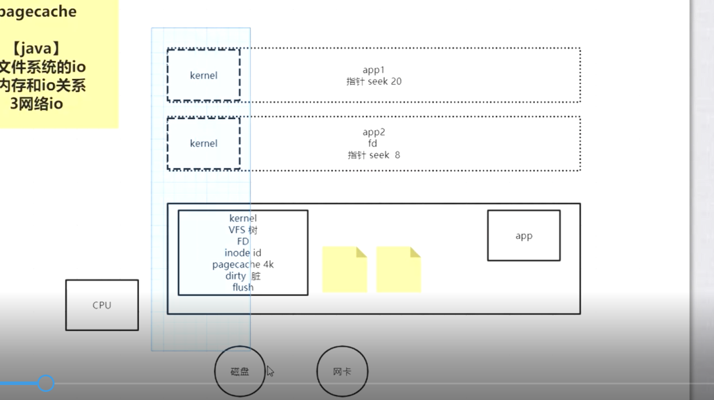
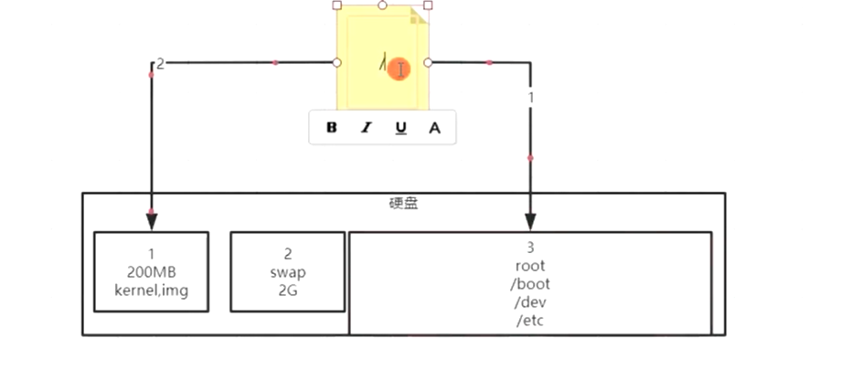

# 系统IO原理(偏向linux)

 

/

df -h

unmount /boot

mount /dev/sda1 /boot

读到第5个

1. VFS virtual file system

2. FD

3. PageCache

4. java

   a. 文件系统的io

   b. 内存和i关系

   c. 网络io

# 命令

1. ln

   修改一者另外一者的数据也会变化

   - 硬连接: ln	source_file taget_link

     两者innode一样,代表同一个文件

     但删除一者另外一者仍然存在,只是 引用数-1

     类似java中的对象引用

   - 软连接: ln -s	source_file taget_link

     inode不同 引用数不变

     source_file删除了 taget_link失效

     类似windows 快捷方式

   

   

2. 

问题:

1. 有/home/root吗

   没有  /home  当前的普通用户名

   root的~ 即 /root

2. ps -aux

    ps -l  列出与本次登录有关的进程信息

     top 

   kill -9 pid 

   /proc/[pid]/ 目录  

   ​	/proc/[pid]/stat`和 `/proc/[pid]/statm

   

