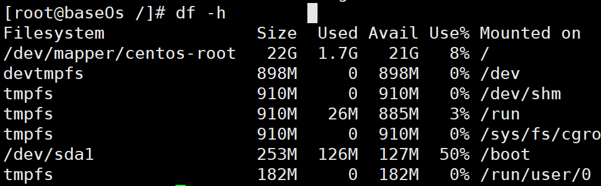
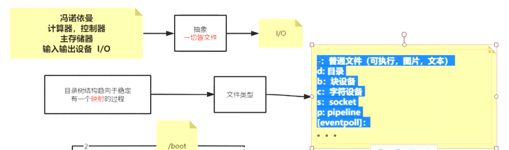
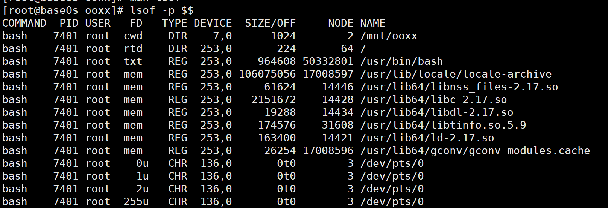
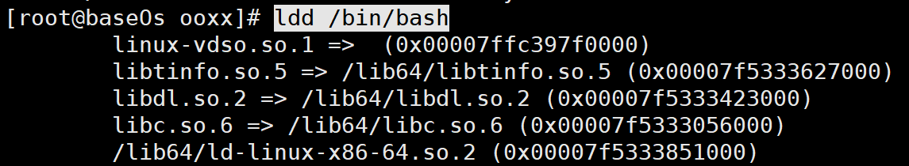

# 系统IO原理(偏向linux)


 

/

df -h [file]（report file system disk(也就是file，省略file代表全部) space usage）



umount /boot (不在/boot目录下)

​	重启后会自动重新将/dev/sda1挂载到/boot

mount /dev/sda1 /boot


1. VFS virtual file system

2. FD

3. PageCache

4. java

   a. 文件系统的io

   b. 内存和i关系

   c. 网络io


# 命令

1. ln

   修改一者另外一者的数据也会变化

   - 硬连接: ln	source_file taget_link

     两者innode一样,代表同一个文件(通过`stat`命令查看)

     但删除一者另外一者仍然存在,只是 引用数-1

     类似java中的对象引用

   	 软连接: ln -s	source_file taget_link

     inode不同 引用数不变

     source_file删除了 taget_link失效

     类似windows 快捷方式


# 文件类型




b    块设备，是一些提供系统存取数据的接口设备，例如硬盘。 

c   字符设备，是一些串行端口的接口设备，例如键盘、鼠标、打印机、tty终端。 

s   套接字文件（socket），用于进程之间的通信。 


**指令说明**

> yum install -y lsof

lsof-list open files

-p  selects the listing of files for the processes



**fd**

cwd current working directory

rtd root directory

txt 程序的可执行文件 

mem 内存映射文件 	

0u standrd input  u表示该文件被打开并处于读取/写入模式 （ r 表示只读模式，w 表示只写模式 ）

1u standrd output

2u standrd error


**type**

DIR d

REG -

CHR c


**device**

指定磁盘的名称 


**size/off**

off 即offset 也就是seek指针的位置


**node**

inode号


**例子**

>exec 8<a.txt #8r   REG
>
>read  a 0<&8     #从fd8中读取一行到a变量中  
>
>lsof -op $$  -> 0t12
>
>此时新开一个连接 off还是0t0 但是读的是内存中同一份文件


# 模仿制作docker image

0. mkdir -p ~/mnt/jinjianou/

1.  dd - convert and copy a file

   if=FILE read from FILE instead of stdin

   of=FILE write to FILE instead of stdout

   bs=BYTES read and write up to BYTES bytes at a time

   count=N copy only N input blocks

   /*dev*/*zero*在被读取时会提供无限的空字符（ASCII NUL, 0x00）。它的典型用法包括用它提供的字符流来覆盖信息，以及产生一个特定大小的空白文件 

   > dd  if=/dev/zero of=mydisk.img bs=1048576 count=100

2. losetup - set up and control loop devices

      losetup [-o offset][--sizelimit size]  [-Pr][--show] -f|loopdev file

   >losetup /dev/loop0 mydisk.img

3. mke2fs - create an ext2/ext3/ext4 filesystem(格式化)

   > mke2fs  /dev/loop0

4. mkdir -p /mnt/ooxx

5. mount -t ext2  /dev/loop0 /mnt/ooxx

6. /mnt/ooxx目录下

   > mkdir bin
   >
   > cp /bin/bash bin

7. ldd=List Dynamic Dependencies 

   > ldd /bin/bash
   >
   > mkdir lib64
   >
   > cp /lib64/{libtinfo.so.5,libdl.so.2,libc.so.6,ld-linux-x86-64.so.2} lib64

   

8. chroot - run command or interactive shell with special root directory

   > chroot ./
   >
   > echo $$   
   >
   > echo "hello world" > /a.txt

    	1. $$ 是脚本运行的当前进程ID号（xshell对centeros的每个连接都不一样）
   		2. ./-$$ 26129 !=  root-$$ 7401 
   	3. a.txt被创建在mnt/ooxx/

# 问题

1. 有/home/root吗

   没有  /home  当前的普通用户名

   root的~ 即 /root


2. **ps** -aux

    -e Select all processes.  Identical(完全相同) to -A

    -f  Do full-format listing

    -l Long format

    -a  Select all processes except both session leaders  and processes not associated with a terminal 跟-e对照

    -u userlist selects the processes whose effective user name or ID （whose file access permissions are used by the process）is in  userlist

    -x Lift（打开） the BSD-style "must have a tty" restriction

    

    

     **top** 

   **kill -9 pid** 

   **/proc/[pid]/ 目录**  

   	/proc/[pid]/stat`和 `/proc/[pid]/statm（ 进程所占用的内存 ）

```
774929 27779 3438 1 0 730809 0
1. Size (pages) 任务虚拟地址空间的大小 VmSize/4
2. Resident(pages) 应用程序正在使用的物理内存的大小 VmRSS/4
3. Shared(pages) 共享页数 0
4. Trs(pages) 程序所拥有的可执行虚拟内存的大小 VmExe/4
5. Lrs(pages) 被映像到任务的虚拟内存空间的库的大小 VmLib/4
6. Drs(pages) 程序数据段和用户态的栈的大小 （VmData+ VmStk ）4
7. dt(pages) 04
```

**查看机器可用内存**

>  free /proc/28248/

total used free shared buffers cached

Mem: 1023788 926400 97388 0 134668 503688

-/+ buffers/cache: 288044 735744

Swap: 1959920 89608 1870312

我们通过free命令查看机器空闲内存时，会发现free的值很小。这主要是因为，在linux中有这么一种思想，内存不用白不用，因此它尽可能的cache和buffer一些数据，以方便下次使用。但实际上这些内存也是可以立刻拿来使用的。

所以 空闲内存=free+buffers+cached=total-used

   

**改名的方式（在同一目录下）**

1. mv xxx yyy
2. rename xxx yyy  xxx(substring,replacement,file)