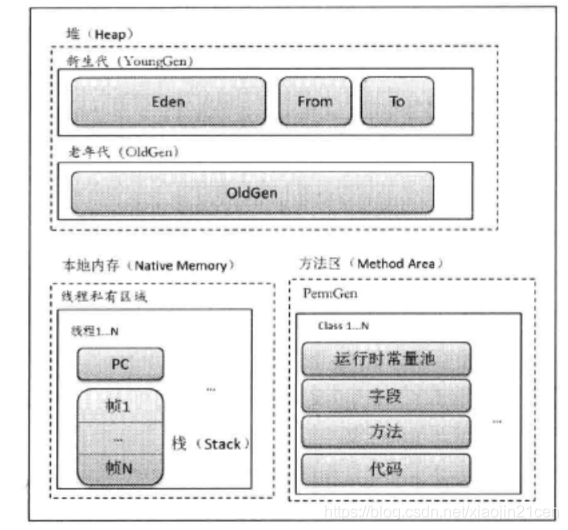

JVM基础知识

GraalVM+JVM=大多数语言的平台 js go python c c++...


# GC

## **什么是垃圾**

申请之后不需要的内存对象

c/c++ 手动回收内存(忘了回收-内存泄露,多次回收-误删别的程序需要的内存)

c 语言申请内存 malloc free

c++ new delete


java: new ? 自动内存回收


## **定位垃圾**

- 引用计数法(reference count)：对象被引用时，其引用计数器+1,0被回收 

  缺点：

  1. 每个对象都需要保存一个计数器,增加了空间开销
  2. 每个对象的引用变化都需要更新计数器,增加了时间开销

  3. 无法识别对象间互相引用（ detect the unreachable objects ）

     

     a,b更该其引用后,new A() newB()对象仍然不会被GC回收

- Root Searching 根可达算法

  GC ROOTS: 线程（虚拟机）栈的本地变量，静态变量，本地方法栈的变量等等

  **简单理解,main方法中声明的引用**

  

  

## **垃圾回收算法**

Any garbage collection algorithm must perform 2 basic operations. One, it should be able to detect all the unreachable objects and secondly, it must reclaim(回收) the heap space used by the garbage objects and make the space available again to the program. 

1. 检测不可达对象 2.回收其对象空间,使程序可用


-  **标记-清除（mark-sweep）**：标记阶段+清除阶段 

  1. 标记:  初始化是0 标记阶段root可达的对象都是1
  2. 清除: 清除不可达对象空间,将可达对象重设为0

  缺点:  1. 位置不连续,**产生碎片** 2.效率偏低(两次扫描)


- **复制算法**

  复制算法就是将**内存空间二等分**, 每次只使用其中一块. 当执行GC时, 将A部分的所有**活动对象集体移到**B中, 就可以将A全部释放 mark-copy-sweep

  没有碎片,**效率高(顺序操作)** 浪费空间

  

- **标记-整理**（mark-compact）：mark-compact-sweep

  没有碎片,空间利用率高 效率偏低(需要再标记结束后,整理所有存活对象的引用地址)


​	**效率问题需要结合具体场景分析**


## Gc Collectors


左边6个组合的是分代(一般是上下两两配合,最常用的是Parallel),右边3个是分区

Epsilon是JDK11提出,用于做测试的GC

### 分类

**分代**


新生代：新创建的对象先放入新生代（复制算法）

​	新生代对象大多朝生夕灭，存活时间短，占内存小，minor gc非常频繁，所以用copy算法以较小的空间换时间是合理的。 

老年代：经过几次gc仍存活，放入老年代，常驻内存（标记-清除或标记-整理）

​	老年代对象大而且生存时间长

### 分代GC

1. 当年轻代内存空间被用完时，就会触发垃圾回收,这个垃圾回收叫做Minor GC

2. 老年代的垃圾收集叫做Old GC/Major GC，Major GC通常是跟full GC是等价的，收集整个GC堆。

3. Mixed GC：收集整个young gen以及部分old gen的GC 只有G1有这个模式

**分区**


JDK8 默认分代模型,可切换到G1分区模型

JDK9+ 默认G1分区模型


## Serial

JDK1.0


stw stop-the-world 

single gc thread


## Parallel Scavenge


## CMS

parNew 相当于parallel scavenge 配合CMS 在young工作

CMS Concurrent mark sweep,**其中Concurrent 指的是业务线程和gc线程并发**


### 三色标记算法

**三色标记算法指的是将所有对象分为白色、黑色和灰色三种类型。黑色表示从 GCRoots 开始，已扫描过它全部引用的对象，灰色指的是扫描过对象本身，还没完全扫描过它全部引用的对象，白色指的是还没扫描过的对象。**

但仅仅将对象划分成三个颜色还不够，真正关键的是：**实现根可达算法的时候，将整个过程拆分成了初始标记、并发标记、重新标记、并发清除四个阶段。**

- 初始标记阶段，指的是标记 GCRoots 直接引用的节点，将它们标记为灰色，这个阶段需要 「Stop the World」。
- 并发标记阶段，指的是从灰色节点开始，去扫描整个引用链，然后将它们标记为黑色，这个阶段不需要「Stop the World」。
- 重新标记阶段，指的是去校正并发标记阶段的错误，这个阶段需要「Stop the World」。
- 并发清除，指的是将已经确定为垃圾的对象清除掉，这个阶段不需要「Stop the World」。


问题1: A->B引用断了

**多标指的是原本应该回收的对象，被多余地标记为黑色存活对象，从而导致该垃圾对象没有被回收**

因为在并发标记阶段，有可能之前已经被标记为存活的对象(灰色)，其引用被删除，从而变成了不可达对象

假设我们的应用在并发标记阶段,标记B之前,执行A=null

那么此刻之后,B/C应被回收,但却会被标记称黑色而不会被回收.

多标问题会导致内存产生浮动垃圾，但好在其可以在下次 GC 的时候被回收，因此问题还不算很严重。


问题2: A->D增加,B->D消失

**漏标问题指的是原本应该被标记为存活的对象，被遗漏标记为黑色，从而导致该垃圾对象被错误回收。**

假设我们的应用在并发标记阶段,标记B之前,执行A.g=g;

b.g=null;  

由于A对象是黑色,不会再扫描其引用;而B对象又没有了对D的引用,因此D为白色,会被gc回收

漏标问题就非常严重了，其会导致存活对象被回收，会严重影响程序功能。

**解决:**

漏标问题要发生需要满足如下两个充要条件：

1. 有至少一个黑色对象在自己被标记之后指向了这个白色对象
2. 所有的灰色对象在自己引用扫描完成之前删除了对白色对象的引用


- CMS解决方案: Incremental Update

  破坏第1个条件

  JVM通过写屏障(切面),在执行A.x=D的时候,判断A是黑色&&d是白色,那么就把A标成灰色

  **该方案依然可能存在漏标(非常隐蔽)**

  ​	m1(垃圾回收线程)正在标记A,已经标记完属性1,正在标记属性2,此时m2(业务逻辑线程)A->D增加,B->D消失.当 属性2标记完毕,把A标成黑色,结果D被漏标

  **所以,CMS的remark阶段,必须从头扫描一次**

- G1 原始快照方案  SATB  snapshot at the beginning

  破坏第2个条件

  在B->D要消失的时候,把这个引用推到GC的堆栈,保证D还能被GC扫描到,配合Rset(Rememberset),只需要扫描哪些region引用到了D

  **这种方式有个缺点，就是会产生浮动垃圾。**


## G1

Azul是一家专门开发JVM的公司,其GC是C4.后来hotspot推出了对标C4的ZGC;OpenJdk推出了shenandoah


 动态调整作为新生代/老年代


## JVM-GC

1. 查看JVM使用的GC

   - jinfo pid

   ```
   VM Flags:
   Non-default VM flags: -XX:CICompilerCount=4 -XX:InitialHeapSize=132120576 -XX:MaxHeapSize=2088763392 -XX:MaxNewSize=696254464 -XX:MinHe
   apDeltaBytes=524288 -XX:NewSize=44040192 -XX:OldSize=88080384 -XX:+UseCompressedClassPointers -XX:+UseCompressedOops -XX:+UseFastUnorde
   redTimeStamps -XX:-UseLargePagesIndividualAllocation -XX:+UseParallelGC
   ```

   - java -XX:+PrintCommandLineFlags -version (全局)

     ```
     -XX:InitialHeapSize=130425152 -XX:MaxHeapSize=2086802432 -XX:+PrintCommandLineFlags -XX:+UseCompressedClassPointers -XX:+UseCompressedO
     ops -XX:-UseLargePagesIndividualAllocation -XX:+UseParallelGC
     java version "1.8.0_202"
     Java(TM) SE Runtime Environment (build 1.8.0_202-b08)
     Java HotSpot(TM) 64-Bit Server VM (build 25.202-b08, mixed mode)
     
     ```

     -XX:+UseParalleGC/UseParalleOldGC=parallel scavenge+parallel Old(1.8 默认)

     -XX:+UseG1GC=G1

     -XX:+UseConcMarkSweepGC=ParNew+CMS+Serial Old

2. 


## GC配置参数

```
-XX:+PrintGCDetails:打印gc日志详细信息
 
-XX:+PrintGCTimeStamps:打印gc发生时相对jvm启动的时间戳，（后来加入了PrintGCDateStamps，打印gc发生的日期）
 
-Xloggc:设置gc日志的生成位置
 
-Xms4096M:堆容量初始值
 
-Xmx4096M:堆容量最大值
 
-Xmn1024M:新生代容量，所以老年代容量 = 堆容量 - 新生代容量 = 3072M
 
-Xss256K:线程堆栈空间大小
 
-XX:MaxDirectMemorySize:Direct Buffer Memory大小
 
-XX:NewRatio 用来来指定新生代和整个堆的大小比例，或者直接用–XX:NewSize来指定所需的新生代空间
 
-XX:SurvivorRatio Eden区与Survivor区的大小比值
 
-XX:MaxTenuringThreshold 设置对象在新生代中最大的存活次数,最大值15,并行回收机制默认为15,CMS默认为4。每经过一次YGC，年龄加1，当survivor区的对象年龄达到TenuringThreshold时，表示该对象是长存活对象，就会直接晋升到老年代
 
-XX:TargetSurvivorRatio 设定survivor区的目标使用率。默认50，即survivor区对象目标使用率为50%，最高90%
 
-XX:PretenureSizeThreshold 对象超过多大是直接在旧生代分配
 
-XX:+CMSParallelRemarkEnabled 降低标记停顿
 
-XX:MaxPermSize:设置持久代最大值 物理内存的1/4
-XX:PermSize:设置持久代(perm gen)初始值 	物理内存的1/64
```


## Parallel 配置参数

```
-XX:+UseParNewGC:在新生代使用并行收集器
 
-XX:+UseParallelOldGC:老年代使用并行回收收集器
 
-XX:ParallelGCThreads:设置用于垃圾回收的线程数。通常情况下可以和CPU数量相等，但在CPU数量较多的情况下，设置相对较小的数值也是合理的。
 
-XX:MaxGCPauseMillis:设置最大垃圾收集停顿时间。他的值是一个大于0的整数。收集器在工作时，会调整Java堆大小或者其他参数，尽可能把停顿时间控制在MaxGCPauseMillis以内。
 
-XX:GCTimeRatio:设置吞吐量大小。它是0-100的整数。假设GCTimeRatio的值为n，那么系统将花费不超过1/(1+n)的时间用于垃圾收集。
 
-XX:+UseAdaptiveSizePolicy:打开自适应GC策略。在这种模式下，新生代的大小、eden和survivor的比例、晋升老年代的对象年龄等参数会被自动调整，已达到在堆大小、吞吐量和停顿时间之间的平衡点。
```


## G1配置参数

```
-XX:+UseG1GC:使用G1回收器
 
-XX:MaxGCPauseMillis:设置最大垃圾收集停顿时间
建议值,G1会尝试调整Young区的块数来达到这个值 STW
 
 -XX:G1HeapRegionSize
 分区大小,建议主键增加该值 1 2 4 8 16 32
 随着size增加,垃圾存活时间更长,GC间隔更长,但每次GC时间也更长  ZGC做了改进(动态区块大小)
 
 G1NewSizePercent 新生代最小比例 默认5%
 G1MaxNewSizePercent 新生代最大比例 默认60%

 
-XX:GCPauseIntervalMillis:设置停顿间隔时间
-XX:+DisableExplicitGC:禁用显式GC
 
-XX:+ExplicitGCInvokesConcurrent:使用并发方式处理显式GC
```

https://blog.csdn.net/qq_27529917/article/details/87072130


# JVM


## Class File Format

idea 插件 -BinED 查看class hex

**文件结构**

1. Magic Number 

2. Minior Version

3. Major Version(jdk7: 51.0  jdk8: 52.0 )

4. constant_pool_count

5. constant_pool表 长度为constant_pool_count-1

   CONSTANT_Utf8_info

    一个CONSTANT_Utf8_info是一个CONSTANT_Utf8类型的常量池数据项， 它存储的是一个常量字符串。 常量池中的所有字面量几乎都是通过CONSTANT_Utf8_info描述的。

   tag决定常量池数据项类型  一共11种常量池数据类型

   **tag占一个字节， length占2个字节， bytes代表存储的字符串， 占length字节**

   

   CONSTANT_NameAndType_info
   CONSTANT_Integer_info
   CONSTANT_Float_info
   CONSTANT_Long_info
   CONSTANT_Double_info
   CONSTANT_String_info

   CONSTANT_Class_info

   ​	tag:7

   ​	index:2字节 指向类的权限定名项的索引

   

   CONSTANT_NameAndType_info

   比如 name: <<init>> descriptor <()V> 即无参构造(return void )

6. access_flags

   ACC_SUPER 0x0020 JDK1.0后 必须为true 指明invokespecial指令使用新语义

   ACC_PUBLIC 0x0001 public

   .... 

7. this_class

8. super_class

9. interfaces_count

10. interfaces

11. fields_count

12. fields

13. methods_count

14. methods

15. attributes_count  -u2(unsined 2bytes)

16. attributes


将hex翻译成文件结构的自然语言

1. jsonp
2. JBE
3. JClassLib IDEA插件之一


## 构成


### VM stack

每个线程创建的时候,都会创建一个虚拟机栈(线程栈)

内部保存一个个栈帧

栈帧(StackFrame):

1. 局部变量表
2. 操作数栈
3. 指向常量池的栈指针
4. 方法出口 return[Address]

### PC

bcp bytecode pointer 

取址的时候取当前选中地址,取完+1

### 本地方法栈

vm使用到的native方法服务


当前3者称为运行时数据区,**线程私有**

### 方法区和堆



方法区， 是 《JVM 规范》 定义的，所有虚拟机必须有的

JDK7及之前 `PermGen space` (永久代)则是 HotSpot 虚拟机基于《 JVM 规范》 对 `方法区` 的一个落地实现。
只有 **HotSpot** 才有 `PermGen space`， 而比如 JRockit（Oracle）、J9（IBM） 虚拟机就没有 `PermGen space`。这块内存主要是被JVM存放**Class和Meta信息**的， Class 在被 Loader 时就会被放到 `PermGen space` 中

**JDK8及之后**， `PermGen space` 被移除， 换成 **`Metaspace`（元空间），也是对 `方法区` 的新的实现**。

```
静态变量` + `常量` + `类信息/字节码(构造方法/接口定义)` + `运行时常量池`
```

以上，只是逻辑上的定义。**在HotSpot中**，方法区仅仅只是逻辑上的独立，**实际上还是包含在Java堆中**，也是就说，**方式区在物理上属于Java堆区中的一部分**，而`永久区（Permanent Generation）`就是方法区的实现

| JDK版本     | 方法区的实现            | 字符串常量池所在的位置  |
| ----------- | ----------------------- | ----------------------- |
| JDK6 及之前 | PermGen space（永久代） | PermGen space（永久代） |
| JDK7        | PermGen space（永久代） | Heap（堆）              |
| JDK8        | Metaspace（元空间）     | Heap（堆）              |


堆 在逻辑上分为三部分 新生区 + 养老区 + 永久区（Perm）

新生代（Young Generation，常称为YoungGen），位于堆空间；
老年代（Old Generation，常称为OldGen、TenuringGen），位于堆空间；
永久代（Permanent Generation，常称为PermGen），位于非堆空间。


### 执行引擎


如果想让一个Java程序运行起来、执行引擎的任务就是将字节码指令**解释/编译为对应平台上的本地机器指令**才可以。简单来说，JVM中的执行引擎充当了将高级语言翻译为机器语言的译者


JIT just-in-time 

​	JVM运行模式有三种：interpreted mode、compiled mode、mixed mode

​	解释模式（Interpreted Mode）：只使用解释器（-Xint 强制JVM使用解释模式），执行一行JVM字节码就编译一行为机器码
​	编译模式（Compiled Mode）：只使用编译器（-Xcomp JVM使用编译模式），先将所有的JVM字节码一次编译为机器码，然后一次性执行所有机器码
​	混合模式（Mixed Mode）：(-Xmixed 设置JVM使用混合模式)依然使用解释模式执行代码，但是对于一些“热点”代码采取编译器模式执行，**这些热点代码对应的机器码会被缓存起来**，下次执行无需再编译。JVM一般采用混合模式执行代码


静态编译就是在编译时，把所有模块都编译进可执行文件里，当启动这个可执行文件时，所有模块都被加载进来；

动态编译是将应用程序需要的模块都编译成动态链接库，**启动程序（初始化）时，这些模块不会被加载，运行时用到哪个模块就调用哪个**


## 类加载机制


### 类加载器


resolution: 符号引用转为能直接引用的内存地址


**按需加载+双亲委派**

```
//null  即由bootstrapClassLoader加载
System.out.println(String.class.getClassLoader());
//null
System.out.println(sun.awt.HKSCS.class.getClassLoader());
//sun.misc.Launcher$ExtClassLoader@12a3a380
System.out.println(sun.net.spi.nameservice.dns.DNSNameService.class.getClassLoader());
//sun.misc.Launcher$AppClassLoader@18b4aac2
System.out.println(T0100_BYTECODE01.class.getClassLoader());
```

```
//null
System.out.println(sun.net.spi.nameservice.dns.DNSNameService.class.getClassLoader().getClass().getClassLoader());
//null
System.out.println(T0100_BYTECODE01.class.getClassLoader().getClass().getClassLoader());
```

​	**类加载器的加载器都是BootstrapClassloader(自定义ClassLoader由App加载)**

```
//Returns the parent class loader for delegation ExtClassLoader
System.out.println(T0100_BYTECODE01.class.getClassLoader().getParent());
```

​	如果想知道父加载器 getParent


```
String bootstrapJars = System.getProperty("sun.boot.class.path");
String extJars = System.getProperty("java.ext.dirs");
String appJars =System.getProperty("java.class.path");
```

   获取各个classLoader加载的jars


## Linking

1. Verification

   验证文件是否符合JVM规定

2. preparation

   静态成员变量赋默认值

3. Resolution

   符号引用解析为指针/偏移量等内存地址的直接引用

   比如 ldc #2,  #2指的是 <org.example.Lazyloading$P>符号引用,转到实际的内存地址


## Class Initializing

```
public class Intializing {
    public static void main(String[] args) {
        System.out.println(T.count);
    }
}
class T{
    public static int count=2;
    public static T t=new T();

    private T(){
        count++;
    }
}
```

​	output: 3


```
public class Intializing {
    public static void main(String[] args) {
        System.out.println(T.count);
    }
}
class T{
	public static T t=new T();
    public static int count=2;
    
    private T(){
        count++;
    }
}
```

​	output: 2


				## Create instance(new Class) Intializing


### parent delegation Model

**安全性**

Parent delegation model is a mechanism(机制) for Java to load classes ()


* Bootstrap ClassLoader：Responsible for loading virtual machine-recognized (name-by-name) **class libraries into JVM** on paths specified by parameters in the**% JAVA_HOME%/lib directory or - Xboot classpath** 

* Extension ClassLoader: responsible for loading all class libraries in**% JAVA_HOME%/lib/ext**

* Application ClassLoader: Responsible for class libraries **in ClassPath**

  1.  the loading request will eventually(最终) be delegated to Bootstrap ClassLoader ，ensures that all loaders load the same class of Object classes 
  2.  Every class loader will try to load from top to bottom 

  

   	1. First, check if the class has already been loaded

  2. if not，get parent classLoader 

  3. repeat step 2 until parent is null,then return bootstrap classLoader 

  4. from top to bottom find class wheter is in scope

  

  ```
  protected Class<?> loadClass(String name, boolean resolve)
      throws ClassNotFoundException
  {
      synchronized (getClassLoadingLock(name)) {
          // First, check if the class has already been loaded
          Class<?> c = findLoadedClass(name);
          if (c == null) {
              long t0 = System.nanoTime();
              try {
                  if (parent != null) {
                      c = parent.loadClass(name, false);
                  } else {
                      c = findBootstrapClassOrNull(name);
                  }
              } catch (ClassNotFoundException e) {
                  // ClassNotFoundException thrown if class not found
                  // from the non-null parent class loader
              }
  
              if (c == null) {
                  // If still not found, then invoke findClass in order
                  // to find the class.
                  long t1 = System.nanoTime();
                  c = findClass(name);
  
                  // this is the defining class loader; record the stats
                  sun.misc.PerfCounter.getParentDelegationTime().addTime(t1 - t0);
                  sun.misc.PerfCounter.getFindClassTime().addElapsedTimeFrom(t1);
                  sun.misc.PerfCounter.getFindClasses().increment();
              }
          }
          if (resolve) {
              resolveClass(c);
          }
          return c;
  ```

  * System.out.println(System.getProperty("java.class.path"));  

    lib、target/classes、.m2\repository

  * 模块class libray加载的顺序 jdk->modlue souce->depdency

    

  * ClassNotFoundException Vs NoClassDefFoundError 

    1. 前者 当动态加载Class的时候找不到类会抛出该异常  

       后者 程序**在编译时可以找到所依赖的类，但是在运行时找不到指定的类文件**，运行过程中Class找不到导致抛出该错误 

    2. 前者 一般在执行Class.forName()、ClassLoader.loadClass()或ClassLoader.findSystemClass()的时候抛出 

       后者J VM或者ClassLoader实例尝试加载类的时候，找不到类的定义而发生，通常在**import和new一个类的时候触发** 

    3. Exception vs Error

       原因： 要加载的类不存在；类名书写错误  vs jar包缺失(classpath)；**调用初始化失败的类**


### 自定义类加载器

extends ClassLoder override loadClass

```
public class MyClassLoader extends ClassLoader{
  @Override
    protected Class<?> findClass(String name) throws ClassNotFoundException {
        FileInputStream fis=null;
        ByteArrayOutputStream baos=null;
        try {
            //复制T0100_BYTECODE01.class到非classpath下 并删除target下的class
            // "\\" character to be escaped is missing
            // Matcher.quoteReplacement(File.separator) "\\\\"
          /*  File clFile = new File("E:\\"
                    , name.replaceAll("\\.", Matcher.quoteReplacement(File.separator))+".class");*/
            File clFile = new File("E:/"
                    , name.replaceAll("\\.", "/").concat(".class"));
            fis=new FileInputStream(clFile);
            baos=new ByteArrayOutputStream();
            byte[] bytes = new byte[1024];
            int len;
            while ((len=fis.read(bytes))!=-1){
                baos.write(bytes,0,len);
            }
            byte[] byteArr = baos.toByteArray();

            //Converts an array of bytes into an instance of class
            return defineClass(name,byteArr,0,byteArr.length);
        } catch (Exception e) {
            e.printStackTrace();
        } finally {
           close(fis);
           close(baos);
        }

        return super.findClass(name);
    }  @Override
    protected Class<?> findClass(String name) throws ClassNotFoundException {
        FileInputStream fis=null;
        ByteArrayOutputStream baos=null;
        try {
            //复制T0100_BYTECODE01.class到非classpath下 并删除target下的class
            // "\\" character to be escaped is missing
            // Matcher.quoteReplacement(File.separator) "\\\\"
          /*  File clFile = new File("E:\\"
                    , name.replaceAll("\\.", Matcher.quoteReplacement(File.separator))+".class");*/
            File clFile = new File("E:/"
                    , name.replaceAll("\\.", "/").concat(".class"));
            fis=new FileInputStream(clFile);
            baos=new ByteArrayOutputStream();
            byte[] bytes = new byte[1024];
            int len;
            while ((len=fis.read(bytes))!=-1){
                baos.write(bytes,0,len);
            }
            byte[] byteArr = baos.toByteArray();

            //Converts an array of bytes into an instance of class
            return defineClass(name,byteArr,0,byteArr.length);
        } catch (Exception e) {
            e.printStackTrace();
        } finally {
           close(fis);
           close(baos);
        }

        return super.findClass(name);
    }
    
    public static void main(String[] args) throws ClassNotFoundException, IllegalAccessException, InstantiationException, InvocationTargetException, NoSuchMethodException {
        MyClassLoader loader = new MyClassLoader();

        Class<?> clazz = loader.loadClass("org.example.T0100_BYTECODE01");
        Object o = clazz.newInstance();
        Method m = clazz.getMethod("m");
        m.invoke(o);

		//sun.misc.Launcher$AppClassLoader@18b4aac2
        System.out.println(clazz.getClassLoader().getClass().getClassLoader());
        //sun.misc.Launcher$AppClassLoader@18b4aac2
        System.out.println(clazz.getClassLoader().getParent());
    }
```


**加密**

对class文件加密(each byte^SEED), 在findClass的时候解密(each byte^SEED)

```
private  void encFile(String name){
    FileInputStream fis=null;
    FileOutputStream fos=null;
    try {
        File originFile = new File("E:/"
                , name.replaceAll("\\.", "/").concat(".class"));
        File encFile=new File("E:/"
                , name.replaceAll("\\.", "/").concat(".encclass"));

        fis=new FileInputStream(originFile);
        fos=new FileOutputStream(encFile);
        int chr;
        while ((chr=fis.read())!=-1){
            fos.write(chr^SEED);
        }
    } catch (Exception e) {
        e.printStackTrace();
    } finally {
        close(fis);
        close(fos);
    }
}
```


### idea 整合javap插件

settings--external tools

C:\Program Files\Java\jdk1.8.0_202\bin\javap.exe

-c $FileClass$     //不加c反编译成java 加c编译成汇编

$OutputPath$


右键 external tools-javap

### 初始化

lazyloading/lazyInitializing

JVM sepc并没有规定何时加载


```
    public static class P{
       final static int i=8;
       static int j=10;
       static {
           System.out.println("P");
       }
    }
    static class X extends P{
        public X(){
            System.out.println("X");
        }
    }
```

```
P p;
System.out.println(P.j); // static变量并会初始化
System.out.println(P.i); // final变量并不会初始化
X x = new X(); // 初始化父类(不是初始化实例) 但不会重复初始化
Class.forName("org.example.Lazyloading$P"); //包含invokestatic过程 初始化
```

## 编译器


# 指令手册

**将常量压入栈的指令 **

aconst_null 将null对象引用压入栈

iconst_m1 将int类型常量-1压入栈

iconst_0 将int类型常量0压入栈

iconst_1 将int类型常量1压入栈

iconst_2 将int类型常量2压入栈

iconst_3 将int类型常量3压入栈

iconst_4 将int类型常量4压入栈

iconst_5 将int类型常量5压入栈

lconst_0 将long类型常量0压入栈

lconst_1 将long类型常量1压入栈

fconst_0 将float类型常量0压入栈

fconst_1 将float类型常量1压入栈

dconst_0 将double类型常量0压入栈

dconst_1 将double类型常量1压入栈

bipush 将一个8位带符号整数压入栈

sipush 将16位带符号整数压入栈

ldc 把常量池中的项压入栈

ldc_w 把常量池中的项压入栈（使用宽索引）

ldc2_w 把常量池中long类型或者double类型的项压入栈（使用宽索引）

**从栈中的局部变量中装载值的指令 **

iload 从局部变量中装载int类型值(到操作数栈或其他)

lload 从局部变量中装载long类型值

fload 从局部变量中装载float类型值

dload 从局部变量中装载double类型值

aload 从局部变量中装载引用类型值（refernce）

iload_0 从局部变量0中装载int类型值

iload_1 从局部变量1中装载int类型值

iload_2 从局部变量2中装载int类型值

iload_3 从局部变量3中装载int类型值

lload_0 从局部变量0中装载long类型值

lload_1 从局部变量1中装载long类型值

lload_2 从局部变量2中装载long类型值

lload_3 从局部变量3中装载long类型值

fload_0 从局部变量0中装载float类型值

fload_1 从局部变量1中装载float类型值

fload_2 从局部变量2中装载float类型值

fload_3 从局部变量3中装载float类型值

dload_0 从局部变量0中装载double类型值

dload_1 从局部变量1中装载double类型值

dload_2 从局部变量2中装载double类型值

dload_3 从局部变量3中装载double类型值

aload_0 从局部变量0中装载引用类型值

aload_1 从局部变量1中装载引用类型值

aload_2 从局部变量2中装载引用类型值

aload_3 从局部变量3中装载引用类型值

iaload 从数组中装载int类型值

laload 从数组中装载long类型值

faload 从数组中装载float类型值

daload 从数组中装载double类型值

aaload 从数组中装载引用类型值

baload 从数组中装载byte类型或boolean类型值

caload 从数组中装载char类型值

saload 从数组中装载short类型值

**将栈中的值存入局部变量的指令 **

istore 将int类型值存入局部变量

lstore 将long类型值存入局部变量

fstore 将float类型值存入局部变量

dstore 将double类型值存入局部变量

astore 将将引用类型或returnAddress类型值存入局部变量

istore_0 将int类型值存入局部变量0

istore_1 将int类型值存入局部变量1

istore_2 将int类型值存入局部变量2

istore_3 将int类型值存入局部变量3

lstore_0 将long类型值存入局部变量0

lstore_1 将long类型值存入局部变量1

lstore_2 将long类型值存入局部变量2

lstore_3 将long类型值存入局部变量3

fstore_0 将float类型值存入局部变量0

fstore_1 将float类型值存入局部变量1

fstore_2 将float类型值存入局部变量2

fstore_3 将float类型值存入局部变量3

dstore_0 将double类型值存入局部变量0

dstore_1 将double类型值存入局部变量1

dstore_2 将double类型值存入局部变量2

dstore_3 将double类型值存入局部变量3

astore_0 将引用类型或returnAddress类型值存入局部变量0

astore_1 将引用类型或returnAddress类型值存入局部变量1

astore_2 将引用类型或returnAddress类型值存入局部变量2

astore_3 将引用类型或returnAddress类型值存入局部变量3

iastore 将int类型值存入数组中

lastore 将long类型值存入数组中

fastore 将float类型值存入数组中

dastore 将double类型值存入数组中

aastore 将引用类型值存入数组中

bastore 将byte类型或者boolean类型值存入数组中

castore 将char类型值存入数组中

sastore 将short类型值存入数组中

wide指令

wide 使用附加字节扩展局部变量索引

**通用(无类型）栈操作  **

nop 不做任何操作

pop 弹出栈顶端一个字长的内容

pop2 弹出栈顶端两个字长的内容

dup 复制栈顶部一个字长内容

dup_x1 复制栈顶部一个字长的内容，然后将复制内容及原来弹出的两个字长的内容压入栈

dup_x2 复制栈顶部一个字长的内容，然后将复制内容及原来弹出的三个字长的内容压入栈

dup2 复制栈顶部两个字长内容

dup2_x1 复制栈顶部两个字长的内容，然后将复制内容及原来弹出的三个字长的内容压入栈

dup2_x2 复制栈顶部两个字长的内容，然后将复制内容及原来弹出的四个字长的内容压入栈

swap 交换栈顶部两个字长内容

** 类型转换  **

i2l 把int类型的数据转化为long类型

i2f 把int类型的数据转化为float类型

i2d 把int类型的数据转化为double类型

l2i 把long类型的数据转化为int类型

l2f 把long类型的数据转化为float类型

l2d 把long类型的数据转化为double类型

f2i 把float类型的数据转化为int类型

f2l 把float类型的数据转化为long类型

f2d 把float类型的数据转化为double类型

d2i 把double类型的数据转化为int类型

d2l 把double类型的数据转化为long类型

d2f 把double类型的数据转化为float类型

i2b 把int类型的数据转化为byte类型

i2c 把int类型的数据转化为char类型

i2s 把int类型的数据转化为short类型

 ** 整数运算  **

iadd 执行int类型的加法

ladd 执行long类型的加法

isub 执行int类型的减法

lsub 执行long类型的减法

imul 执行int类型的乘法

lmul 执行long类型的乘法

idiv 执行int类型的除法

ldiv 执行long类型的除法

irem 计算int类型除法的余数

lrem 计算long类型除法的余数

ineg 对一个int类型值进行取反操作

lneg 对一个long类型值进行取反操作

iinc 把一个常量值加到一个int类型的局部变量上	

	iinc variable,value variable+=value  不压栈即栈顶元素不变 

**移位操作 **

ishl 执行int类型的向左移位操作

lshl 执行long类型的向左移位操作

ishr 执行int类型的向右移位操作

lshr 执行long类型的向右移位操作

iushr 执行int类型的向右逻辑移位操作

lushr 执行long类型的向右逻辑移位操作

**按位布尔运算 **

iand 对int类型值进行“逻辑与”操作

land 对long类型值进行“逻辑与”操作

ior 对int类型值进行“逻辑或”操作

lor 对long类型值进行“逻辑或”操作

ixor 对int类型值进行“逻辑异或”操作

lxor 对long类型值进行“逻辑异或”操作

**浮点运算 **

fadd 执行float类型的加法

dadd 执行double类型的加法

fsub 执行float类型的减法

dsub 执行double类型的减法

fmul 执行float类型的乘法

dmul 执行double类型的乘法

fdiv 执行float类型的除法

ddiv 执行double类型的除法

frem 计算float类型除法的余数

drem 计算double类型除法的余数

fneg 将一个float类型的数值取反

dneg 将一个double类型的数值取反

 ** 对象和数组 **

**对象操作指令 **

new 创建一个新对象

checkcast 确定对象为所给定的类型

getfield 从对象中获取字段

putfield 设置对象中字段的值

getstatic 从类中获取静态字段

putstatic 设置类中静态字段的值

instanceof 判断对象是否为给定的类型

**数组操作指令

newarray 分配数据成员类型为基本上数据类型的新数组

anewarray 分配数据成员类型为引用类型的新数组

arraylength 获取数组长度

multianewarray 分配新的多维数组

 **控制流 **

**条件分支指令 **

ifeq 如果等于0，则跳转

ifne 如果不等于0，则跳转

iflt 如果小于0，则跳转

ifge 如果大于等于0，则跳转

ifgt 如果大于0，则跳转

ifle 如果小于等于0，则跳转

if_icmpcq 如果两个int值相等，则跳转

if_icmpne 如果两个int类型值不相等，则跳转

if_icmplt 如果一个int类型值小于另外一个int类型值，则跳转

if_icmpge 如果一个int类型值大于或者等于另外一个int类型值，则跳转

if_icmpgt 如果一个int类型值大于另外一个int类型值，则跳转

if_icmple 如果一个int类型值小于或者等于另外一个int类型值，则跳转

ifnull 如果等于null，则跳转

ifnonnull 如果不等于null，则跳转

if_acmpeq 如果两个对象引用相等，则跳转

if_acmpnc 如果两个对象引用不相等，则跳转

**比较指令 **

lcmp 比较long类型值

fcmpl 比较float类型值（当遇到NaN时，返回-1）

fcmpg 比较float类型值（当遇到NaN时，返回1）

dcmpl 比较double类型值（当遇到NaN时，返回-1）

dcmpg 比较double类型值（当遇到NaN时，返回1）

**无条件转移指令 **

goto 无条件跳转

goto_w 无条件跳转（宽索引）

**表跳转指令 **

tableswitch 通过索引访问跳转表，并跳转

lookupswitch 通过键值匹配访问跳转表，并执行跳转操作

**异常 **

athrow 抛出异常或错误

finally子句

jsr 跳转到子例程

jsr_w 跳转到子例程（宽索引）

rct 从子例程返回

 **方法调用与返回 **

**方法调用指令 **

invokcvirtual 运行时按照对象的类来调用实例方法

invokespecial 根据编译时类型来调用实例方法

invokestatic 调用类（静态）方法

invokcinterface 调用接口方法

**方法返回指令 **

ireturn 从方法中返回int类型的数据

lreturn 从方法中返回long类型的数据

freturn 从方法中返回float类型的数据

dreturn 从方法中返回double类型的数据

areturn 从方法中返回引用类型的数据

return 从方法中返回，返回值为void

**线程同步 **

montiorenter 进入并获取对象监视器

monitorexit 释放并退出对象监视器

 ** JVM指令助记符 **

变量到操作数栈：iload,iload_,lload,lload_,fload,fload_,dload,dload_,aload,aload_

操作数栈到变量：istore,istore_,lstore,lstore_,fstore,fstore_,dstore,dstor_,astore,astore_

常数到操作数栈：bipush,sipush,ldc,ldc_w,ldc2_w,aconst_null,iconst_ml,iconst_,lconst_,fconst_,dconst_

加：iadd,ladd,fadd,dadd

减：isub,lsub,fsub,dsub

乘：imul,lmul,fmul,dmul

除：idiv,ldiv,fdiv,ddiv

余数：irem,lrem,frem,drem

取负：ineg,lneg,fneg,dneg

移位：ishl,lshr,iushr,lshl,lshr,lushr

按位或：ior,lor

按位与：iand,land

按位异或：ixor,lxor

类型转换：i2l,i2f,i2d,l2f,l2d,f2d(放宽数值转换)

i2b,i2c,i2s,l2i,f2i,f2l,d2i,d2l,d2f(缩窄数值转换)

创建类实便：new

创建新数组：newarray,anewarray,multianwarray

访问类的域和类实例域：getfield,putfield,getstatic,putstatic

把数据装载到操作数栈：baload,caload,saload,iaload,laload,faload,daload,aaload

从操作数栈存存储到数组：bastore,castore,sastore,iastore,lastore,fastore,dastore,aastore

获取数组长度：arraylength

检相类实例或数组属性：instanceof,checkcast

操作数栈管理：pop,pop2,dup,dup2,dup_xl,dup2_xl,dup_x2,dup2_x2,swap

有条件转移：ifeq,iflt,ifle,ifne,ifgt,ifge,ifnull,ifnonnull,if_icmpeq,if_icmpene,

if_icmplt,if_icmpgt,if_icmple,if_icmpge,if_acmpeq,if_acmpne,lcmp,fcmpl

fcmpg,dcmpl,dcmpg

复合条件转移：tableswitch,lookupswitch

无条件转移：goto,goto_w,jsr,jsr_w,ret

调度对象的实便方法：invokevirtual

调用由接口实现的方法：invokeinterface

调用需要特殊处理的实例方法：invokespecial

调用命名类中的静态方法：invokestatic

方法返回：ireturn,lreturn,freturn,dreturn,areturn,return

异常：athrow

finally关键字的实现使用：jsr,jsr_w,ret

