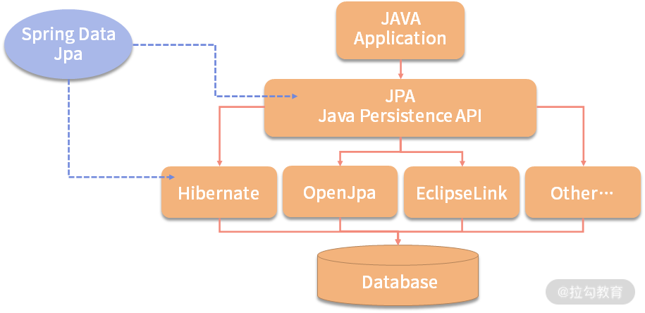
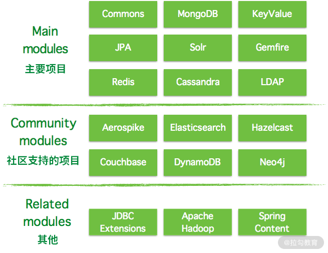
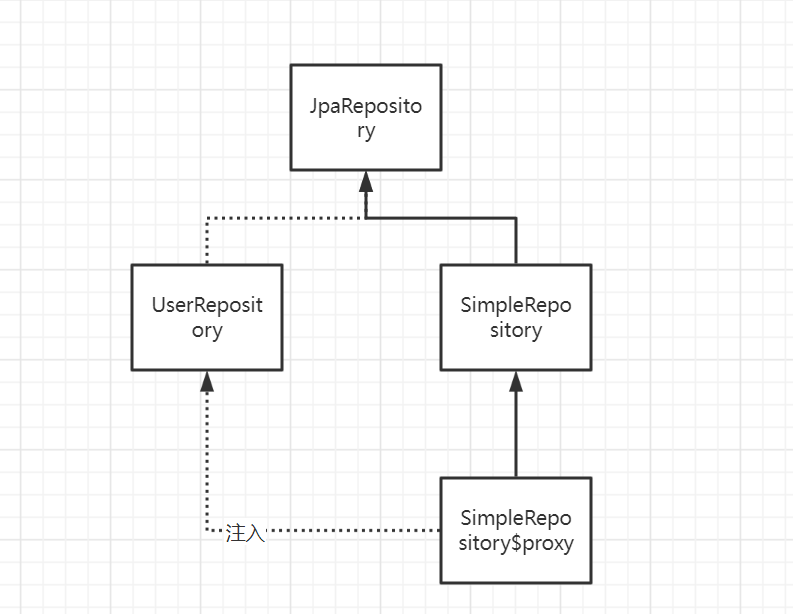

# 初识

JPA （Java Persistence API）Java**持久化**API。是一套Sun公司Java官方制定的**ORM** 方案,是规范，是标准 ，sun公司自己并没有实现


1. 市场上 ORM 框架比对
下表是市场上比较流行的 ORM 框架，这里我罗列了 MyBatis、Hibernate、Spring Data JPA 等，并对比了下它们的优缺点。

经过对比，你可以看到我们正在学习的 Spring Data JPA 还是比较前卫的，很受欢迎，继承了 Hibernate 的很多优点，上手又比较简单。所以，我非常建议你好好学习一下。
2. Java Persistence API 介绍和开源实现
JPA 是 JDK 5.0 新增的协议，通过相关持久层注解（@Entity 里面的各种注解）来描述对象和关系型数据里面的表映射关系，并将 Java 项目运行期的实体对象，通过一种Session持久化到数据库中。
想象一下，一旦协议有了，大家都遵守了此种协议进行开发，那么周边开源产品就会大量出现，比如我们在后面要介绍的第 29 课时（Spring Data Rest 是什么？和 JPA 是什么关系？）就可以基于这套标准，进而对 Entity 的操作再进行封装，从而可以得到更加全面的 Rest 协议的 API接口。
再比如 JSON API（https://jsonapi.org/）协议，就是雅虎的大牛基于 JPA 的协议的基础，封装制定的一套 RESTful 风格、JSON 格式的 API 协议，那么一旦 JSON API 协议成了标准，就会有很多周边开源产品出现。比如很多 JSON API 的客户端、现在比较流行的 Ember 前端框架，就是基于 Entity 这套 JPA 服务端的协议，在前端解析 API 协议，从而可以对普通 JSON 和 JSON API 的操作进行再封装。
所以规范是一件很有意思的事情，突然之间世界大变样，很多东西都一样了，我们的思路就需要转换了。
JPA 的内容分类


一套 API 标准定义了一套接口，在 javax.persistence 的包下面，用来操作实体对象，执行 CRUD 操作，而实现的框架（Hibernate）替代我们完成所有的事情，让开发者从烦琐的 JDBC 和 SQL 代码中解脱出来，更加聚焦自己的业务代码，并且使架构师架构出来的代码更加可控。

定义了一套基于对象的 SQL：Java Persistence Query Language（JPQL），像 Hibernate 一样，我们通过写面向对象（JPQL）而非面向数据库的查询语言（SQL）查询数据，避免了程序与数据库 SQL 语句耦合严重，比较适合跨数据源的场景（一会儿 MySQL，一会儿 Oracle 等）。


ORM（Object/Relational Metadata）对象注解映射关系，JPA 直接通过注解的方式来表示 Java 的实体对象及元数据对象和数据表之间的映射关系，框架将实体对象与 Session 进行关联，通过操作 Session 中不通实体的状态，从而实现数据库的操作，并实现持久化到数据库表中的操作，与 DB 实现同步。


详细的协议内容你感兴趣的话也可以看一下官方的文档。
JPA 的开源实现
JPA 的宗旨是为 POJO 提供持久化标准规范，可以集成在 Spring 的全家桶使用，也可以直接写独立 application 使用，任何用到 DB 操作的场景，都可以使用，极大地方便开发和测试，所以 JPA 的理念已经深入人心了。Spring Data JPA、Hibernate 3.2+、TopLink 10.1.3 以及 OpenJPA、QueryDSL 都是实现 JPA 协议的框架，他们之间的关系结构如下图所示：

俗话说得好：“未来已经来临，只是尚未流行”，大神资深开发用 Spring Data JPA，编程极客者用 JPA；而普通 Java 开发者，不想去挑战的 Java“搬砖者”用 Mybatis。
到这里，相信你已经对 JPA 有了一定的认识，接下来我们了解一下 Spring Data，看看它都有哪些子项目。
Spring Data 认识

1. Spring Data 介绍
Spring Data 项目是从 2010 年开发发展起来的，Spring Data 利用一个大家熟悉的、一致的、基于“注解”的数据访问编程模型，做一些公共操作的封装，它可以轻松地让开发者使用数据库访问技术，包括关系数据库、非关系数据库（NoSQL）。同时又有不同的数据框架的实现，保留了每个底层数据存储结构的特殊特性。
Spring Data Common 是 Spring Data 所有模块的公共部分，该项目提供了基于 Spring 的共享基础设施，它提供了基于 repository 接口以 DB 操作的一些封装，以及一个坚持在 Java 实体类上标注元数据的模型。
Spring Data 不仅对传统的数据库访问技术如 JDBC、Hibernate、JDO、TopLick、JPA、MyBatis 做了很好的支持和扩展、抽象、提供方便的操作方法，还对 MongoDb、KeyValue、Redis、LDAP、Cassandra 等非关系数据的 NoSQL 做了不同的实现版本，方便我们开发者触类旁通。
其实这种接口型的编程模式可以让我们很好地学习 Java 的封装思想，实现对操作的进一步抽象，我们也可以把这种思想运用在自己公司写的 Framework 上面。
下面来看一下 Spring Data 的子项目都有哪些。
2. Spring Data 的子项目有哪些
下图为目前 Spring Data 的框架分类结构图，里面都有哪些模块可以一目了然，也可以知道哪些是我们需要关心的项目。

主要项目（Main Modules）：


Spring Data Commons，相当于定义了一套抽象的接口，下一课时我们会具体介绍


Spring Data Gemfire


Spring Data JPA，我们关注的重点，对 Spring Data Common 的接口的 JPA 协议的实现


Spring Data KeyValue


Spring Data LDAP


Spring Data MongoDB


Spring Data REST


Spring Data Redis


Spring Data for Apache Cassandra


Spring Data for Apache Solr


社区支持的项目（Community Modules）：


Spring Data Aerospike


Spring Data Couchbase


Spring Data DynamoDB


Spring Data Elasticsearch


Spring Data Hazelcast


Spring Data Jest


Spring Data Neo4j


Spring Data Vault


其他（Related Modules）：


Spring Data JDBC Extensions


Spring for Apache Hadoop


Spring Content

关于 Spring Data 的子项目，除了上面这些，还有很多开源社区版本，比如 Spring Data、MyBatis 等，这里就不一一介绍了，感兴趣的同学可以到 Spring 社区，或者 GitHub 上进行查阅。






# Hello World

0.

```
spring.datasource.url=jdbc:mysql://localhost:3306/jpa?useUnicode=true&characterEncoding=UTF-8&autoReconnect=true&serverTimezone=Asia/Shanghai
spring.datasource.username=root
spring.datasource.password=123456
# If this is set to true, Spring Boot will ask the respective JPA vendor to initialize the database based on the entity definition.
spring.jpa.generate-ddl=true 
```


1.

```
        <dependency>
            <groupId>org.springframework.boot</groupId>
            <artifactId>spring-boot-starter-data-jpa</artifactId>
        </dependency>
```

**如果依赖爆红,先取本地仓库清除掉上次生成的未完全下载的文件**

2.

```
//Specifies that the class is an entity
@Entity
@Data
public class User {
	//Demarcates(划分) an identifier
    @Id
    //Provides generation strategies for the
 values of primary keys. 
     /**
     * TABLE: assign primary keys  for the entity using an underlying(潜在的) database table 
     * SEQUENCE: assign primary  for the entity keys using a database sequence
     * IDENTITY: assign primary  for the entity keys using a identity column
     * AUTO:
     */
    @GeneratedValue(strategy= GenerationType.AUTO)
    private Long id;
    private String name;
    private String email;
}
```

- TABLE：使用一个特定的数据库表格来保存主键。

- SEQUENCE：根据底层数据库的序列来生成主键，条件是数据库支持序列。

  配合 SEQUENCEGenerator#name

  name 生成策略名称

  SEQUENCEName 表示生成策略用到的数据库序列名称

- IDENTITY：主键由数据库自动生成（主要是自动增长型）

- AUTO：主键由程序控制。

  如果不指定主键生成策略，默认为AUTO


​	JPA 报错 SQLGrammarException: error performing isolated work

strategy= GenerationType.AUTO ->strategy= GenerationType.IDENTITY

3.

```
public interface UserRepository extends JpaRepository<User,Long> {
}
```

4.

```
 @Autowired
   private UserRepository userRepository;
 
 @PostMapping(path = "user",consumes = {MediaType.APPLICATION_JSON_VALUE})
   public User addNewUser(@RequestBody User user) {
      return userRepository.save(user);
   }
```

5.

```
POST /api/v1/user HTTP/1.1
Host: 127.0.0.1:8080
Content-Type: application/json
Cache-Control: no-cache

{"name":"jack","email":"123@126.com"}
```

6. 测试用例

   jpaTest use embedded database default

   //Determines what type of existing DataSource bean can be replaced

   spring.test.database.replace: none

   

   @DataJpaTest

    @Autowired
      private UserRepository userRepository;

总结: @DataJpaTest默认使用内存数据库，且case具有事务性，会自动回滚插入的数据。如果想使用自己配置的数据库，不要使用这个注解 


# Spring Data Common

定义很多公用的接口和一些相对数据操作的公共实现

​	(例如分页排序,结果映射,事务等)

spring data jpa就是其关系数据库的查询实现

## 核心-Repository

顶级父类接口,操作db的入口

1. interface repository

2. interface crudRepository

3. interface PagingAndSortingRepository

   ```
   @GetMapping("getUsers")
   //自动注入PageRequest.of(0,20,"UNSORTED")
   public List<User> getAll(Pageable request) {
       return userRepository.findAll(request).toList();
   }
   ```

4. interface JpaRepository

   4 extends 3 extends  2 extends 1

5. class SimpleJpaRepository implements JpaRepository

   bean创建后 afterPropertiesSet 动态代理生成

   **每个用户自定义JpaRepository接口在容器中的bean实际上保存的是一个JpaRepositoryFactoryBean**对象，这是一个FactoryBean。对这样一个bean进行注入时，会调用FactoryBean#getObject获取真正要注入的SimpleJpaRepository代理对象

   

   具体源码实现 https://blog.csdn.net/andy_zhang2007/article/details/84064862

   ```
       @Transactional
       public <S extends T> S save(S entity) {
           Assert.notNull(entity, "Entity must not be null.");
           if (this.entityInformation.isNew(entity)) {
               this.em.persist(entity);
               return entity;
           } else {
               return this.em.merge(entity);
           }
       }
       
       
           @Transactional
       public void delete(T entity) {
           Assert.notNull(entity, "Entity must not be null!");
           if (!this.entityInformation.isNew(entity)) {
               Class<?> type = ProxyUtils.getUserClass(entity);
               T existing = this.em.find(type, this.entityInformation.getId(entity));
               if (existing != null) {
                   this.em.remove(this.em.contains(entity) ? entity : this.em.merge(entity));
               }
           }
       }
   ```

   

# DQM

defining query methods

不用写接口即可直接调用

1. extends Repository接口可以实现DQM功能
2. extends Repository接口或者自定义接口 可以选择性暴露SimpleJpaRepository 已实现的基础方法
3. 