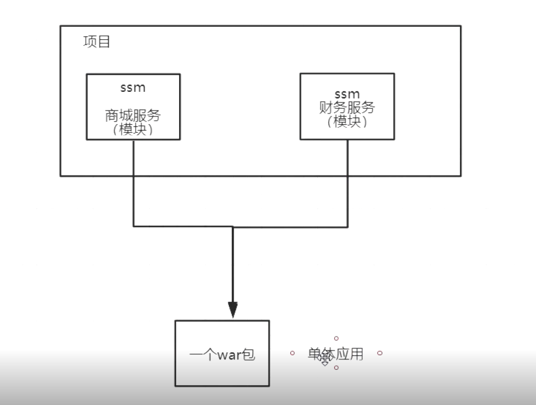
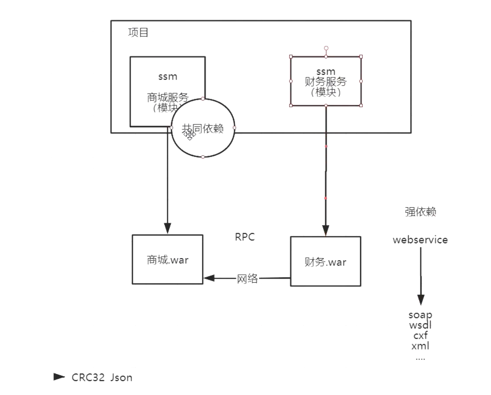

# 技术框架演进

1. 单体应用

看似用maven创建了聚合项目,有服务多个模块,部署一个war包,仍是单体应用.

2. 面向服务(第一阶段)

SOA Service-Oriented Architecture
ESB Enterprise Service Bus 传统中间件技术与XML、Web服务等技术结合的产物

存在的问题: 

1. 强依赖,耦合性太高(共同依赖放在某个war里)
2. xml解析效率低

3. 面向服务(第二阶段 微服务)

   面向需求/应用维度 微小粒度