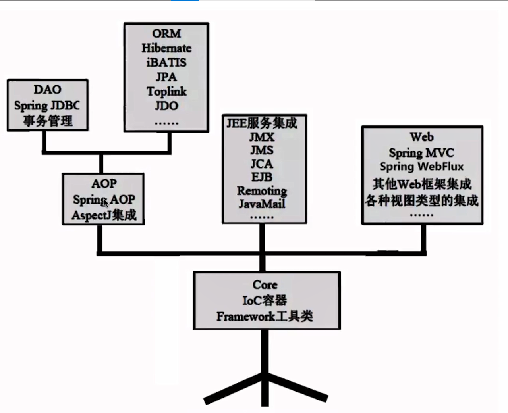
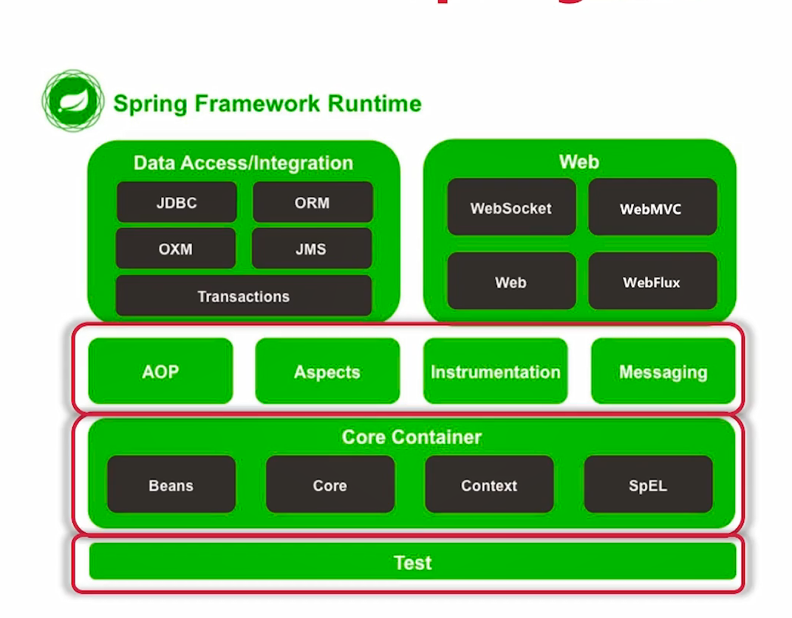
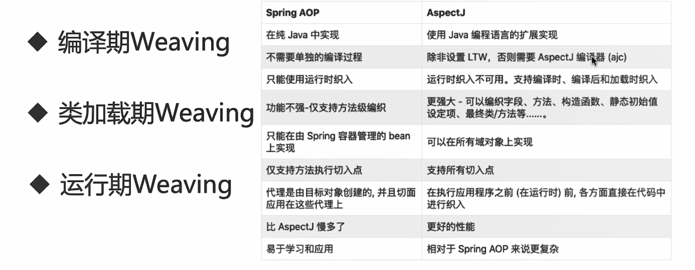

# 概念

轻量级: 最少的侵入,与应用程序低耦合,接入成本低

# 模块梳理

**spring-core**

**Spring架构**

spring-instrument： 在特定的应用程序服务器中支持类和类加载器的实现，比如Tomcat.是 AOP 的一个支援模块,主要作用是在 JVM 启用时， 生成一个代理类， 程序员通过代理类在运行时修改类的字节(主要是有状态的类)， 从而改变一个类的功能， 实现 AOP 的功能

**核心模块**

Spring-core

Spring-beans

Spring-context

Spring-aop 最小化的动态代理实现 

- JDK
- Cglib
- 仅运行时织入+方法级
- 仅Xml  注解需要aspectj   

AspectJ

- spring-aspectj+spring-instrument=full Aspectj

- 

  编译期+类加载期	