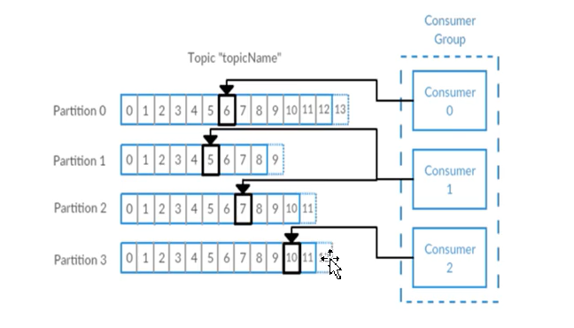
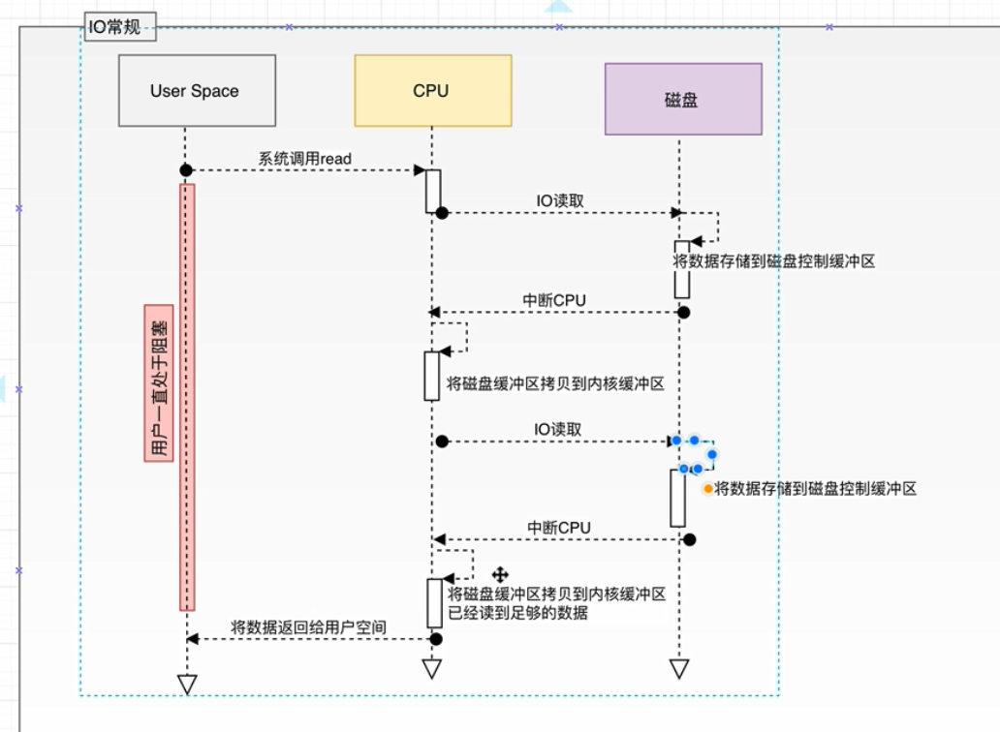
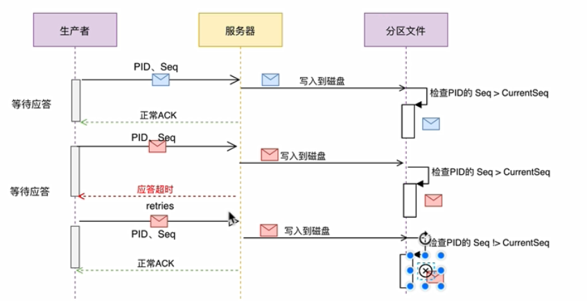

# 初识


1. AMQP

		Advanced Message Queuing Protocol

		提供统一消息服务的应用层标准高级消息队列协议\
		
		rabbitmq是其中一个实现


2. 消息队列

   分类：

   1. **至多一次**: 消息队列中的数据只允许被一个消费者消费，不允许被重复消费(会被消息服务器主动删除)
   2. **没有限制**: 消息可以被多个消费者消费，且消费者允许多次消费消费服务器中同一条记录，消息服务器可以长时间存储海量数据

   

   

3. Kafa

**特点**

1. 流式处理

2. 天生分布式

3. 存储数据(磁盘)

   

**场景**


​     **术语**





注意： **Leader负责该分区数据的全部读写操作，follower只负责同步改分区的数据**

 1. 消息(数据单元,记录)-字节数组,可以把它看作数据库表中某一行的记录

 2. 批次: 为了提高效率， 消息会 分批次 写入 Kafka，批次就代指的**是一组消息**

 3. 主题:消息的**种类**称为 `主题`（Topic）,可以说一个主题代表了一类消息。相当于是对消息进行分类。主题就像是数据库中的表。

 4. 分区:主题可以被分为若干个分区（partition），同一个主题中的分区可以不在一个机器上，有可能会部署在多个机器上，由此来实现 kafka 的`伸缩性`，单一主题中的分区有序，但是无法保证主题中所有的分区有序

    1. 防止某个topic对应的消息过多(压力过大),可能导致吞吐瓶颈
    2. 存储海量数据

 5. 生产者(发布者) 消费者(订阅者)

 6. 偏移量 元数据,不断递增的整数值

 7. 消费者群组

    表示不同的业务组/服务

    一个partition只能被**同一个消费者群组**一个消费者消费;

    一个消费者能消费多个partition

    Rebalance

 8. broker  一个独立的 Kafka 服务器就被称为broker,broker 接收来自生产者的消息，为消息设置偏移量，并提交消息到磁盘保存;消费者消费

 9. 重平衡：Rebalance。消费者组内某个消费者实例挂掉后，其他消费者实例自动重新分配订阅主题分区的过程。Rebalance 是 Kafka 消费者端实现高可用的重要手段。

 10. broker 集群：broker 是`集群` 的组成部分，broker 集群由一个或多个 broker 组成，每个集群都有一个 broker 同时充当了`集群控制器`的角色（自动从集群的活跃成员中选举出来,也就是broker leader

 11. 副本：Kafka 中**消息的备份又叫做 `副本`（Replica）**，副本的数量是可以配置的，Kafka 定义了两类副本：领导者副本（Leader Replica） 和 追随者副本（Follower Replica），前者对外提供服务，后者只是被动跟随。


**补充**

1. 每组日志分区是一个有序的不可变的日志序列，分区中的每一个record都被分配了唯一一个序列编号offset。kafka器群会持久化所有发布到topic中的record(key/value/timestamp)信息

   持久化 默认策略(7天  1G)   

   > log.retention.hours=168


# 为什么选择kafka


# 高性能的原因

## 写性能


1. 对于顺序I/O而言，缓存用处不大，从而节省了大量的内存开销，也会导致JVM垃圾回收的频次。

关于IO，现有的[数据库](https://cloud.tencent.com/solution/database?from=10680)中一般都同时使用顺序IO和随机IO。随机IO从缓存中受益良多，我们设想有这样一个场景，它混合了精确查找和多行范围查找，当它的"热点"数据随机分布的时候，如果我们对这些热数据进行缓存，就可以避免时间代价比较大的磁盘寻址，这无疑会提高数据库的性能，如果没有缓存，从磁盘随机寻址和应用进行交互，那个时间可想而知。相对于随机IO寻址，顺序IO就快的多，缓存对于顺序IO的意义不大。关于顺序IO和随机IO在磁盘和内存中的差异，可以大概用下面的数据了解下：

在磁盘上，随机读和顺序读的差距大概5000量级倍。

在内存中，随机读和顺序读的差距大约在20倍左右。

内存随机访问的速度比磁盘随机访问的速度大概快2500倍。

   另外，随机读取查询的行，冗余数据页比较多，而顺序读取的时候，会读取某个页面上的所有数据行，这样更加符合成本效益。如果负担得起，**增加内存是解决随机IO读取问题的最好办法**。

磁盘中顺序写< 内存中顺序写  内存中随机读<磁盘中顺序读< 内存中顺序读

2. 


## 读性能


**常规IO**



***中断*源向CPU发出的请求*中断*处理*信号*称为*中断*请求，而CPU收到*中断*请求后转到相应的事件处理程序称为*中断*响应** 


**常规IO优化**


DMA  协程处理器

Direct Memory Access，直接存储器访问


4次拷贝  内存空间->用户空间->内存空间

**Zero Copy**


# 安装和配置

## 单机&集群环境搭建


需要用到zk集群

用到的版本是2.11-2.3.0

https://archive.apache.org/dist/kafka/2.3.0/kafka_2.11-2.3.0.tgz

2.11代表scala版本 scala是一种编程语言

Scala 是 Scalable Language 的简写，是一门多范式(范式/编程方式[面向对象/函数式编程])的编程语言,以java虚拟机（JVM）为运行环境


1. jdk8
2. zookeeper
3. kafka

## 单机版

0. 开3台主机形成zk集群 

   > zkServer.sh start-foreground

1.  wget https://archive.apache.org/dist/kafka/2.3.0/kafka_2.11-2.3.0.tgz

2. tar -zxvf kafka_2.11-2.3.0.tgz -C /usr/

3. cd /usr/kafka_2.11-2.3.0

4. cp ./config/server.properties ./config/server.properties.default

5. 修改server.properties

   > listeners=PLAINTEXT://zk_node01:9092
   >
   > log.dirs=/usr/kafka-logs
   >
   > zookeeper.connect=zk_node01:2181

6. ./bin/kafka-server-start.sh -daemon ./config/server.properties

7. jps 测试


问题：kafka-run-class.sh: line 299: /usr/kafka_2.11-2.3.0/latest/bin/java: No such file or directory

解决：注意java的环境变量


## conf

| 参数                                    | 说明(解释)                                                   |
| --------------------------------------- | ------------------------------------------------------------ |
| broker.id =0                            | 每一个broker在集群中的唯一表示，要求是正数，kafka及其根据id来识别broker机器。当该服务器的IP地址发生改变时，broker.id没有变化，则不会影响consumers的消息情况 |
| log.dirs=/kafka/kafka-logs              | kafka数据的存放地址，多个地址的话用逗号分割/kafka/kafka-logs-1，/kafka/kafka-logs-2 |
| port =9092                              | broker server服务端口                                        |
| message.max.bytes =6525000              | 表示消息体的最大大小，单位是字节                             |
| num.network.threads =4                  | broker处理消息的最大线程数，一般情况下不需要去修改           |
| num.io.threads =8                       | broker处理磁盘IO的线程数，数值应该大于你的硬盘数             |
| background.threads =4                   | 一些后台任务处理的线程数，例如过期消息文件的删除等，一般情况下不需要去做修改 |
| queued.max.requests =500                | 等待IO线程处理的请求队列最大数，若是等待IO的请求超过这个数值，那么会停止接受外部消息，应该是一种自我保护机制。 |
| host.name                               | broker的主机地址，若是设置了，那么会绑定到这个地址上，若是没有，会绑定到所有的接口上，并将其中之一发送到ZK，一般不设置 |
| socket.send.buffer.bytes=100*1024       | socket的发送缓冲区，socket的调优参数SO_SNDBUFF               |
| socket.receive.buffer.bytes =100*1024   | socket的接受缓冲区，socket的调优参数SO_RCVBUFF               |
| socket.request.max.bytes =100*1024*1024 | socket请求的最大数值，防止serverOOM，message.max.bytes必然要小于socket.request.max.bytes，会被topic创建时的指定参数覆盖 |

**Kafka中log日志的参数配置** 

| log.segment.bytes =1024*1024*1024              | topic的分区是以一堆segment文件存储的，这个控制每个segment的大小，会被topic创建时的指定参数覆盖 |
| ---------------------------------------------- | ------------------------------------------------------------ |
| log.roll.hours =24*7                           | 这个参数会在日志segment没有达到log.segment.bytes设置的大小，也会强制新建一个segment会被 topic创建时的指定参数覆盖 |
| log.cleanup.policy = delete                    | 日志清理策略选择有：delete和compact主要针对过期数据的处理，或是日志文件达到限制的额度，会被 topic创建时的指定参数覆盖 |
| log.retention.minutes=3days                    | 数据存储的最大时间超过这个时间会根据log.cleanup.policy设置的策略处理数据，也就是消费端能够多久去消费数据;log.retention.bytes和log.retention.minutes任意一个达到要求，都会执行删除，会被topic创建时的指定参数覆盖 |
| log.retention.bytes=-1                         | topic每个分区的最大文件大小，一个topic的大小限制 =分区数*log.retention.bytes。-1没有大小限log.retention.bytes和log.retention.minutes任意一个达到要求，都会执行删除，会被topic创建时的指定参数覆盖 |
| log.retention.check.interval.ms=5minutes       | 文件大小检查的周期时间，是否处罚 log.cleanup.policy中设置的策略 |
| log.cleaner.enable=false                       | 是否开启日志压缩                                             |
| log.cleaner.threads = 2                        | 日志压缩运行的线程数                                         |
| log.cleaner.io.max.bytes.per.second=None       | 日志压缩时候处理的最大大小                                   |
| log.cleaner.dedupe.buffer.size=500*1024*1024   | 日志压缩去重时候的缓存空间，在空间允许的情况下，越大越好     |
| log.cleaner.io.buffer.size=512*1024            | 日志清理时候用到的IO块大小一般不需要修改                     |
| log.cleaner.io.buffer.load.factor =0.9         | 日志清理中hash表的扩大因子一般不需要修改                     |
| log.cleaner.backoff.ms =15000                  | 检查是否处罚日志清理的间隔                                   |
| log.cleaner.min.cleanable.ratio=0.5            | 日志清理的频率控制，越大意味着更高效的清理，同时会存在一些空间上的浪费，会被topic创建时的指定参数覆盖 |
| log.cleaner.delete.retention.ms =1day          | 对于压缩的日志保留的最长时间，也是客户端消费消息的最长时间，同log.retention.minutes的区别在于一个控制未压缩数据，一个控制压缩后的数据。会被topic创建时的指定参数覆盖 |
| log.index.size.max.bytes =10*1024*1024         | 对于segment日志的索引文件大小限制，会被topic创建时的指定参数覆盖 |
| log.index.interval.bytes =4096                 | 当执行一个fetch操作后，需要一定的空间来扫描最近的offset大小，设置越大，代表扫描速度越快，但是也更好内存，一般情况下不需要搭理这个参数 |
| log.flush.interval.messages=None               | log文件”sync”到磁盘之前累积的消息条数,因为磁盘IO操作是一个慢操作,但又是一个”数据可靠性"的必要手段,所以此参数的设置,需要在"数据可靠性"与"性能"之间做必要的权衡.如果此值过大,将会导致每次"fsync"的时间较长(IO阻塞),如果此值过小,将会导致"fsync"的次数较多,这也意味着整体的client请求有一定的延迟.物理server故障,将会导致没有fsync的消息丢失. |
| log.flush.scheduler.interval.ms =3000          | 检查是否需要固化到硬盘的时间间隔                             |
| log.flush.interval.ms = None                   | 仅仅通过interval来控制消息的磁盘写入时机,是不足的.此参数用于控制"fsync"的时间间隔,如果消息量始终没有达到阀值,但是离上一次磁盘同步的时间间隔达到阀值,也将触发. |
| log.delete.delay.ms =60000                     | 文件在索引中清除后保留的时间一般不需要去修改                 |
| log.flush.offset.checkpoint.interval.ms =60000 | 控制上次固化硬盘的时间点，以便于数据恢复一般不需要去修改     |
| auto.create.topics.enable =true                | 是否允许自动创建topic，若是false，就需要通过命令创建topic    |
| default.replication.factor =1                  | 是否允许自动创建topic，若是false，就需要通过命令创建topic    |
| num.partitions =1                              | 每个topic的分区个数，若是在topic创建时候没有指定的话会被topic创建时的指定参数覆盖 |


**Kafka中leader、replicas参数配置** 

| controller.socket.timeout.ms =30000                 | partition leader与replicas之间通讯时,socket的超时时间        |
| --------------------------------------------------- | ------------------------------------------------------------ |
| controller.message.queue.size=10                    | partition leader与replicas数据同步时,消息的队列尺寸          |
| replica.lag.time.max.ms =10000                      | replicas响应partition leader的最长等待时间，若是超过这个时间，就将replicas列入ISR(in-sync replicas)，并认为它是死的，不会再加入管理中 |
| replica.lag.max.messages =4000                      | 如果follower落后与leader太多,将会认为此follower[或者说partition relicas]已经失效;##通常,在follower与leader通讯时,因为网络延迟或者链接断开,总会导致replicas中消息同步滞后;##如果消息之后太多,leader将认为此follower网络延迟较大或者消息吞吐能力有限,将会把此replicas迁移到其他follower中.;##在broker数量较少,或者网络不足的环境中,建议提高此值. |
| replica.socket.timeout.ms=30*1000                   | follower与leader之间的socket超时时间                         |
| replica.socket.receive.buffer.bytes=64*1024         | leader复制时候的socket缓存大小                               |
| replica.fetch.max.bytes =1024*1024                  | replicas每次获取数据的最大大小                               |
| replica.fetch.wait.max.ms =500                      | replicas同leader之间通信的最大等待时间，失败了会重试         |
| replica.fetch.min.bytes =1                          | fetch的最小数据尺寸,如果leader中尚未同步的数据不足此值,将会阻塞,直到满足条件 |
| num.replica.fetchers=1                              | leader进行复制的线程数，增大这个数值会增加follower的IO       |
| replica.high.watermark.checkpoint.interval.ms =5000 | 每个replica检查是否将最高水位进行固化的频率                  |
| controlled.shutdown.enable =false                   | 是否允许控制器关闭broker ,若是设置为true,会关闭所有在这个broker上的leader，并转移到其他broker |
| controlled.shutdown.max.retries =3                  | 控制器关闭的尝试次数                                         |
| controlled.shutdown.retry.backoff.ms =5000          | 每次关闭尝试的时间间隔                                       |
| leader.imbalance.per.broker.percentage =10          | leader的不平衡比例，若是超过这个数值，会对分区进行重新的平衡 |
| leader.imbalance.check.interval.seconds =300        | 检查leader是否不平衡的时间间隔                               |
| offset.metadata.max.bytes                           | 客户端保留offset信息的最大空间大小                           |


**kafka中zookeeper的参数配置**

| zookeeper.connect = localhost         | 2181                                                         | 必须配置项：：：zookeeper集群的地址，可以是多个，多个之间用逗号分割，一般端口都为2181；hostname1 | port1,hostname2 | port2,hostname3 | port3 |
| ------------------------------------- | ------------------------------------------------------------ | ------------------------------------------------------------ | --------------- | --------------- | ----- |
| zookeeper.session.timeout.ms=6000     | ZooKeeper的最大超时时间，就是心跳的间隔，若是没有反映，那么认为已经死了，不易过大 |                                                              |                 |                 |       |
| zookeeper.connection.timeout.ms =6000 | ZooKeeper的连接超时时间                                      |                                                              |                 |                 |       |
| zookeeper.sync.time.ms =2000          | ZooKeeper集群中leader和follower之间的同步实际那              |                                                              |                 |                 |       |


## 常见脚本命令

启动 

USAGE: ./bin/kafka-server-start.sh [-daemon] server.properties [--override property=value]*

> ./bin/kafka-server-start.sh -daemon ./config/server.properties

关闭

> ./bin/kafka-server-stop.sh


## 集群部署

1. 多台机器 

   - jdk

   - /etc/hosts 配置结点映射文件

   - /etc/profile  ~/.bashrc 环境变量

     **/etc/profile**： **此文件为系统的每个用户设置环境信息**,当用户第一次登录时,该文件被执行。是系统全局针对终端环境的设置，它是login时最先被系统加载的，是它调用了/etc/bashrc

     **~/.bashrc**:**是用户相关的终端（shell）的环境设置**，通常打开一个新终端时，默认会load里面的设置，在这里的设置不影响其它人。

     **/etc/bashrc**: 是**系统全局针对终端环境的设置**，修改了它，会影响所有用户的终端环境，这里一般配置终端**如何与用户进行交互的增强功能等**（比如sudo提示、命令找不到提示安装什么包等），新开的终端，已经load了这个配置，最后才load用户自己的 ~/.bashrc。

- 时钟同步

  > yum install -y ntp
  >
  > ntpdate cn.pool.ntp.org
  >
  > 或
  >
  > ntpdate ntp[1-7].aliyun.com  //选择一个时钟源 如ntp1
  >
  > clock -w

- zookeeper

  > zkServer.sh start

- kafka 修改配置 config/server.properties

> broker.id=0...n # 根据序列来
>
> listeners=PLAINTEXT://zk_node01:9092 #根据机器来
>
> log.dirs=/usr/kafka-logs
>
> zookeeper.connect=zk_node01:2181,zk_node02:2181,zk_node03:2181

并拷贝到其他集群主机，并修改相应配置

> mkdir -p /usr/kafka-logs

> ./bin/kafka-server-start.sh config/server.properties


## 单机操作

### topic操作

创建topic

> ./bin/kafka-topics.sh --bootstrap-server zk_node01:9092 --create --topic topic01 --partitions 3 --replication-factor  1

查看topic(所有topic，而不是只是bootstrap-server的）

> ./bin/kafka-topics.sh --bootstrap-server zk_node01:9092 --list


### 生产者/消费者代码

一个终端代表一个生产者/消费者

消费者

>./bin/kafka-console-consumer.sh --bootstrap-server zk_node01:9092 --topic topic01 --group group1

生产者

>./bin/kafka-console-producer.sh --broker-list zk_node01:9092 --topic topic01


## 集群操作

创建

> ./bin/kafka-topics.sh --bootstrap-server zk_node01:9092,zk_node02:9092,zk_node03:9092 --create --topic topic02 --partitions 3 --replication-factor  2

3分区*2副本[因子]/3主机=2分区/主机 


查看特定分区

> ./bin/kafka-topics.sh --bootstrap-server zk_node01:9092,zk_node02:9092,zk_node03:9092 --describe --topic topic02


修改

> ./bin/kafka-topics.sh --bootstrap-server zk_node01:9092,zk_node02:9092,zk_node03:9092 --alter --topic topic02 --partitions 2

注意： 修改后的partitions要大于原有的


删除

> ./bin/kafka-topics.sh --bootstrap-server zk_node01:9092,zk_node02:9092,zk_node03:9092 --delete --topic topic02 


消费者

> ./bin/kafka-console-consumer.sh --bootstrap-server zk_node01:9092,zk_node02:9092,zk_node03:90 --group g1 --topic topic02 --property print.key=true --property print.value=true --property key.seperator=,

生产者

> ./bin/kafka-console-producer.sh --broker-list zk_node01:9092,zk_node02:9092,zk_node03:9092 --topic topic02
>
> ./bin/kafka-consumer-groups.sh --bootstrap-server zk_node01:9092,zk_node02:9092,zk_node03:9092 --list

消费者群组

> ./bin/kafka-consumer-groups.sh --bootstrap-server zk_node01:9092,zk_node02:9092,zk_node03:9092 --describe --group  g1

**注意： 在任何部署了kafka的机器上都能执行上述命令**


# 基础API

```
    <dependency>
      <groupId>org.apache.kafka</groupId>
      <artifactId>kafka-clients</artifactId>
      <version>2.2.0</version>
    </dependency>
<!--    log4j1-->
    <dependency>
      <groupId>log4j</groupId>
      <artifactId>log4j</artifactId>
      <version>1.2.17</version>
    </dependency>
    <dependency>
      <groupId>log4j</groupId>
      <artifactId>log4j</artifactId>
      <version>1.2.17</version>
    </dependency>
    <dependency>
      <groupId>org.slf4j</groupId>
      <artifactId>slf4j-api</artifactId>
      <version>1.7.25</version>
    </dependency>
    <dependency>
      <groupId>org.slf4j</groupId>
      <artifactId>slf4j-log4j12</artifactId>
      <version>1.7.25</version>
    </dependency>
    <!--    log4j2 log4j-core(引入依赖log4j-api)  log4j-slf4j-impl-->
    <!--    log4j2弃用了.properties方式，采用的是.xml，.json或者.jsn这种方式来做-->
```

```
# INFO日志级别
log4j.rootLogger=INFO,console
# 输出到控制台
log4j.appender.console=org.apache.log4j.ConsoleAppender
# 设置输出样式
log4j.appender.console.layout=org.apache.log4j.PatternLayout
# 日志输出信息格式为
log4j.appender.console.layout.ConversionPattern=%-d{yyyy-MM-dd HH:mm:ss}-%5p : %m%n
```


## Topic基本操作 DML管理

```
//1. 创建KafkaAdminClient
Properties props = new Properties();
//注意要将主机名和ip映射配置在hosts下
props.put(AdminClientConfig.BOOTSTRAP_SERVERS_CONFIG
        ,"zk_node01:9092,zk_node02:9092,zk_node03:9092");
KafkaAdminClient client = (KafkaAdminClient)KafkaAdminClient.create(props);
//2. create topic
client.createTopics(Collections.singletonList(
        new NewTopic("topic03",3,(short) 2)));
//3. list topics
ListTopicsResult topicsResult = client.listTopics();
System.out.println(topicsResult.names().get());
client.close();
```

注意： createTopics是异步非堵塞的( KafkaFuture) topicsResult.names().get()无法获取新创建的topic

 ```
      //同步创建
      CreateTopicsResult newTopicFuture = client.createTopics(Collections.singletonList(
                new NewTopic("topic04", 3, (short) 2)));
        newTopicFuture.all().get();
 ```


删除topic

```
client.deleteTopics(Collections.singletonList("topic04")).all().get();
```


查看topic详情

```
DescribeTopicsResult topic02 = client.describeTopics(Collections.singletonList("topic02"));
Map<String, TopicDescription> descriptionMap = topic02.all().get();
for (Map.Entry<String, TopicDescription> entry : descriptionMap.entrySet()) {
    //key是topicName
    System.out.println(entry.getKey()+": "+entry.getValue());
}
```

## 生产者& 消费者 sub/assign

**consumer**

```
 //1. create Consumer
        Properties props=new Properties();
        props.put(ConsumerConfig.BOOTSTRAP_SERVERS_CONFIG
                ,"zk_node01:9092,zk_node02:9092,zk_node03:9092");
        props.put(ConsumerConfig.KEY_DESERIALIZER_CLASS_CONFIG, StringDeserializer.class.getName());
        props.put(ConsumerConfig.VALUE_DESERIALIZER_CLASS_CONFIG, StringDeserializer.class.getName());
        props.put(ConsumerConfig.GROUP_ID_CONFIG,"g1");
        KafkaConsumer<String, String> consumer = new KafkaConsumer<String, String>(props);
        //2. consume subscribe
        consumer.subscribe(Pattern.compile("^topic.+"));
        // iter
        while (true){
            ConsumerRecords<String, String> records = consumer.poll(Duration.ofSeconds(1));
            if(!records.isEmpty()){
                for (ConsumerRecord<String, String> record : records) {
                    String topic = record.topic();
                    int partition = record.partition();
                    long offset = record.offset();

                    String key = record.key();
                    String value = record.value();
                    long timestamp = record.timestamp();
                    System.out.println(topic+"\t"+partition+"\t"+offset+"\t"+key+"\t"+value+"\t"+timestamp);
                }
            }
        }
        //3. close
//        consumer.close();
```

**producer**

```
//1.create producer
Properties props=new Properties();
props.put(ProducerConfig.BOOTSTRAP_SERVERS_CONFIG
        ,"zk_node01:9092,zk_node02:9092,zk_node03:9092");
props.put(ProducerConfig.KEY_SERIALIZER_CLASS_CONFIG, StringSerializer.class.getName());
props.put(ProducerConfig.VALUE_SERIALIZER_CLASS_CONFIG, StringSerializer.class.getName());
KafkaProducer<String,String> producer = new KafkaProducer<String,String>(props);

//2.send msg
for (int i = 0; i < 10; i++) {
    ProducerRecord<String, String> record
            = new ProducerRecord<String, String>("topic02","key-"+i,"value"+i);
    producer.send(record);
}

//3. close producer
producer.close();
```

## 自定义分区

> consumer.subscribe  需要指定group，自动分配分区

> consumer.assign 手动指定消费分区，失去组管理特性
>
> consumer.seek  offset

```
List<TopicPartition> partitions = Collections.singletonList(new TopicPartition("topic02", 2));
consumer.assign(partitions);
consumer.seek(partitions.get(0),2);
```


**默认分区策略**

1. Record指定了分区
2. Record未设置key则轮询放入partition
3. 否则根据hash(key)%partition_size放置


**自定义分区策略**

```
this.compareAndSwapInt(var1, var2, var5, var5 + var4)  if var2==var5   var1=var5 + var4
```

```
props.put(ProducerConfig.PARTITIONER_CLASS_CONFIG,ProducerPartitioner.class.getName());


public class ProducerPartitioner implements Partitioner {
    AtomicInteger counter = new AtomicInteger(0);
    @Override
    public int partition(String topic, Object key, byte[] keyBytes, Object value, byte[] valueBytes, Cluster cluster) {
        List<PartitionInfo> partitions = cluster.partitionsForTopic(topic);
        int numPartitions = partitions.size();

        if (keyBytes == null) {
            //round-robin fashion
            return (counter.getAndIncrement() & Integer.MAX_VALUE) % numPartitions;
        }else {
            //hash
            return Utils.toPositive(Utils.murmur2(keyBytes)) % numPartitions;
        }
    }
    @Override
    public void close() {
        System.out.println("close");
    }

    @Override
    public void configure(Map<String, ?> configs) {
        System.out.println("configure");
    }
}

```

## 消息的序列化

**自定义序列化器**

```
public class UserSerializer implements Serializer<User> {
    private String encoding = "UTF8";
    private static ObjectMapper objectMapper
            =new ObjectMapper();

    @Override
    public void configure(Map<String, ?> configs, boolean isKey) {
        String propertyName = isKey ? "key.serializer.encoding" : "value.serializer.encoding";
        Object encodingValue = configs.get(propertyName);
        if (encodingValue == null)
            encodingValue = configs.get("serializer.encoding");
        if (encodingValue instanceof String)
            encoding = (String) encodingValue;
    }

    @Override
    public byte[] serialize(String topic, User data) {
        try {
            if (data == null)
                return null;
            else{
                String json = objectMapper.writeValueAsString(data);
                return json.getBytes(encoding);
            }
        } catch (UnsupportedEncodingException e) {
            throw new SerializationException("Error when serializing string to byte[] due to unsupported encoding " + encoding);
        }catch (Exception ex){
            throw new SerializationException("Error when serializing  User Object" );
        }
    }

}
```

```
public class UserDeserializer implements Deserializer<User> {
    private String encoding = "UTF8";
    private static ObjectMapper objectMapper
            =new ObjectMapper();

    @Override
    public void configure(Map<String, ?> configs, boolean isKey) {
        String propertyName = isKey ? "key.deserializer.encoding" : "value.deserializer.encoding";
        Object encodingValue = configs.get(propertyName);
        if (encodingValue == null)
            encodingValue = configs.get("deserializer.encoding");
        if (encodingValue instanceof String)
            encoding = (String) encodingValue;
    }

    @Override
    public User deserialize(String topic, byte[] data) {
        try {
            if (data == null)
                return null;
            else
                return objectMapper.readValue(data,User.class);
        } catch (UnsupportedEncodingException e) {
            throw new SerializationException("Error when deserializing byte[] to string due to unsupported encoding " + encoding);
        }catch (Exception e){
            throw new SerializationException("Error when deserializing byte[] to User obj ");
        }
    }
```

**java类需不需要实现Serializable接口？**

> **转换成二进制字节流的形式**

**这种需要序列化的类必须实现Serializable**。
常见的例子：把对象存储在Redis服务器中、RPC形式的远程方法调用（微服务使用Dubbo）

> **转换成JSON字符串的形式**

**这种类就可以不需要实现Serializable了**
常见的例子：后端暴露的接口返回的JSON格式对象、HTTP形式的远程方法调用（微服务使用的Feign）

## 拦截器

```
public class UserDefineProducerInterceptor implements ProducerInterceptor {
    //send方法的回调
    @Override
    public ProducerRecord onSend(ProducerRecord record) {
        System.out.println("=========onSend=========");
        User user = (User) (record.value());
        user.setUsername(user.getUsername()+"+_jinjianou");
        record=new ProducerRecord(record.topic(), record.key(),user);
        return record;
    }


    //This method is called when the record sent to the server has been acknowledged, 
    // or when sending the record fails before it gets sent to the server.
    @Override
    public void onAcknowledgement(RecordMetadata metadata, Exception exception) {
        System.out.println("metadata="+metadata+", exception="+exception);
    }

    //最后执行且执行一次（interceptor.close后）
    @Override
    public void close() {
        System.out.println("========close============");
    }

    //最先执行且执行一次
    @Override
    public void configure(Map<String, ?> configs) {
        System.out.println("========configure============");
    }
}
```

```
props.put(ProducerConfig.INTERCEPTOR_CLASSES_CONFIG,UserDefineProducerInterceptor.class.getName());
```


# API 高级特性

## Offset自动控制

1. Kafka消费者默认对于之前未订阅过该topic的消费者（**也就是系统中（consumer-group）并没有存储该消费者的这个消费分区的记录信息**），**基于此消费者默认的首次消费记录是latest**


> auto.offset.reset=latest
>
> earliest 最早的偏移量
>
> latest  默认，最新的偏移量（**消费者启动后，以当前各分区最新的偏移量开始计算**）
>
> none   throw exception to the consumer if **no previous offset is found for the** **consumer's group** 
>
> 

对p0发送3条msg

**latest** g1


此时将g1 auto.offset.reset设置为earliest 并不会resetting offset（此时该消费者已经有了分区偏移量记录）

**earliest  g2**


在此之后，latest和earliset没有区别（此时g2中该消费者已经有了分区偏移量记录）

2. **消费者在消费数据时默认会定期提交消费偏移量**

   > enable.auto.commit=true
   >
   > auto.commit.interval.ms=5000  //**未达到时间间隔，服务关闭重启会重复消费消息**

   如果用户需要自己管理offset的自动提交，enable.auto.commit=false

  **由于offset是下一次消费者抓取数据的位置，用户提交的偏移量永远都要比本次消费的偏移量+1**

```
props.put(ConsumerConfig.ENABLE_AUTO_COMMIT_CONFIG,false);
...


  Map<TopicPartition, OffsetAndMetadata> offsets=new HashMap<>();
  ...
offsets.put(new TopicPartition(topic,partition)
                            ,new OffsetAndMetadata(offset+1));
                    //异步非堵塞
                    consumer.commitAsync(offsets,new OffsetCommitCallback(){
                        @Override
                        public void onComplete(Map<TopicPartition, OffsetAndMetadata> offsets, Exception exception) {
                            System.out.println("offsets= "+offsets+"exception= "+exception);
                        }
                    });
```


## Acks和 Retries

producer在发送完一个消息之后，要求broker在规定的时间内给与Ack应答，如果没有在规定时间内应答，producer会再额外尝试n次重新发送消息


**Isr in-sync replica**

如果producer在规定的时间内，没有得到bnorker的ack，就会开启retries机制

> request.timeout.ms=3000 默认
>
> retries=Integer.MAX_VALUE 默认


**测试**

```
props.put(ProducerConfig.ACKS_CONFIG,"all");
props.put(ProducerConfig.RETRIES_CONFIG,3);
props.put(ProducerConfig.REQUEST_TIMEOUT_MS_CONFIG,1);
```

producer 发送1条消息，已经写入磁盘分区文件，但ack应答失败，retries3次


consumer收到4条消息


**问题**

1. 重复写入记录     


解决： 幂等性&事务


## 幂等性


**开启幂等后**

成功+失败的一次过程	


```
props.put(ProducerConfig.ACKS_CONFIG,"all");
props.put(ProducerConfig.RETRIES_CONFIG,3);
props.put(ProducerConfig.REQUEST_TIMEOUT_MS_CONFIG,1);

props.put(ProducerConfig.ENABLE_IDEMPOTENCE_CONFIG,true);
//The maximum number of unacknowledged requests the client will send on a single connection before blocking.
props.put(ProducerConfig.MAX_IN_FLIGHT_REQUESTS_PER_CONNECTION,1);
```

## 事务控制


# 架构进阶

## 数据同步机制

## eagle 监控

## Flume和kafka sink集成

## sb集成kafaka


