# 初识

高性能 Java网络编程框架,对NIO进行了高级封装,简化了网络应用的而开发过程

**学习路径**

核心组件->拆包/粘包->内存管理->其他

# 前置知识

**I/O请求过程**

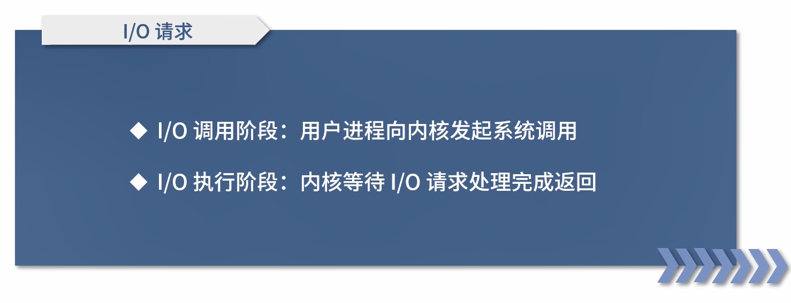

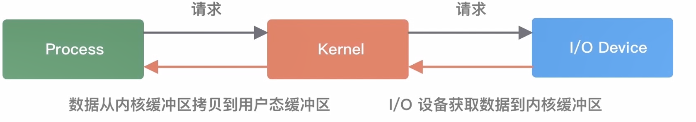

**linux IO模型**

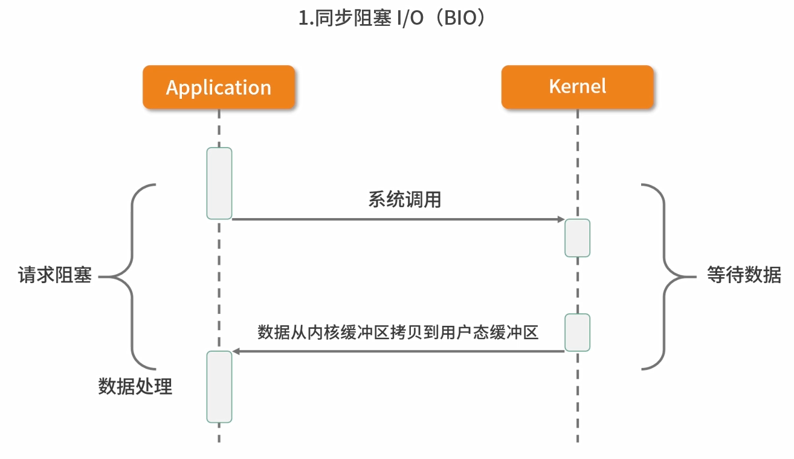

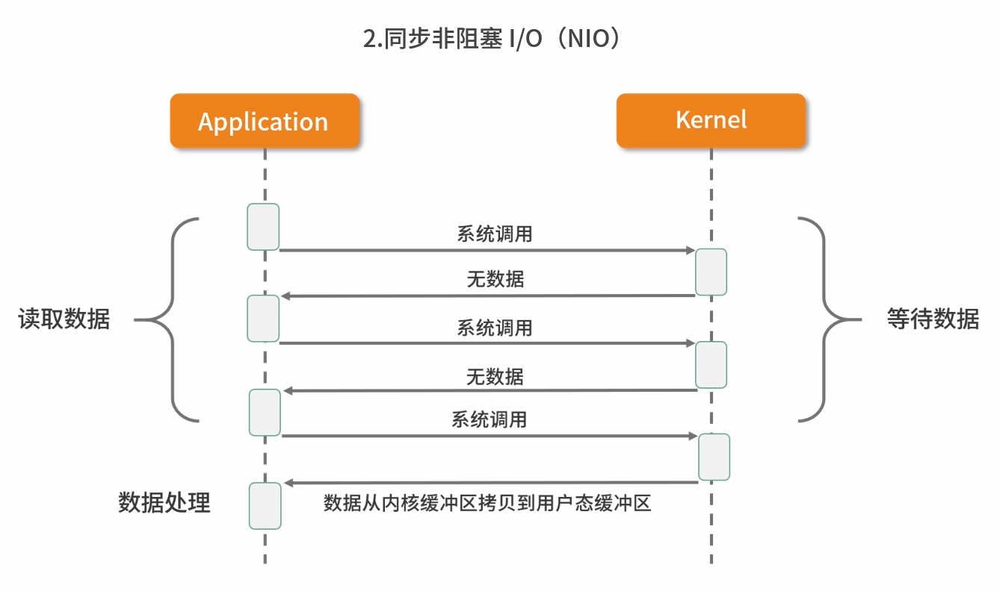

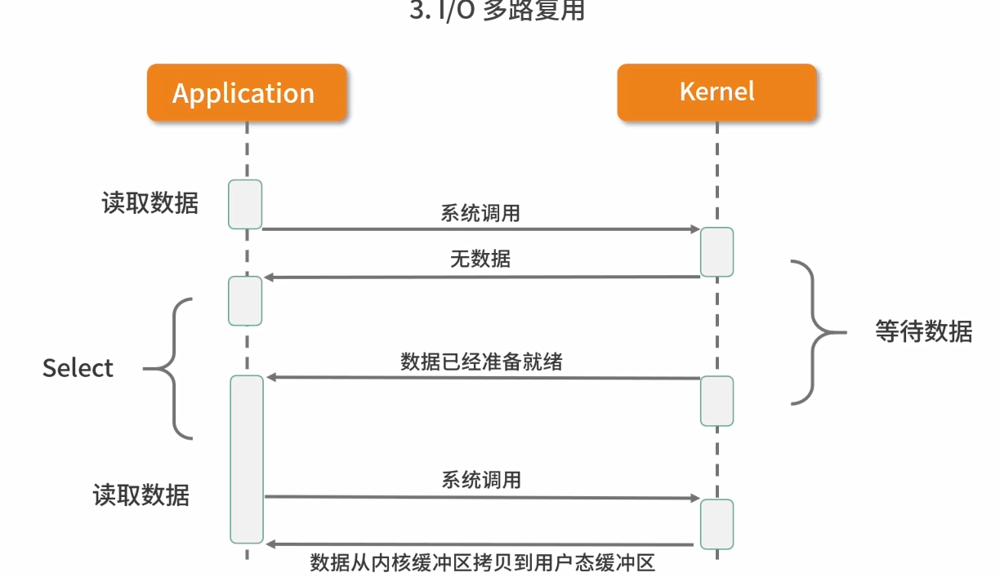

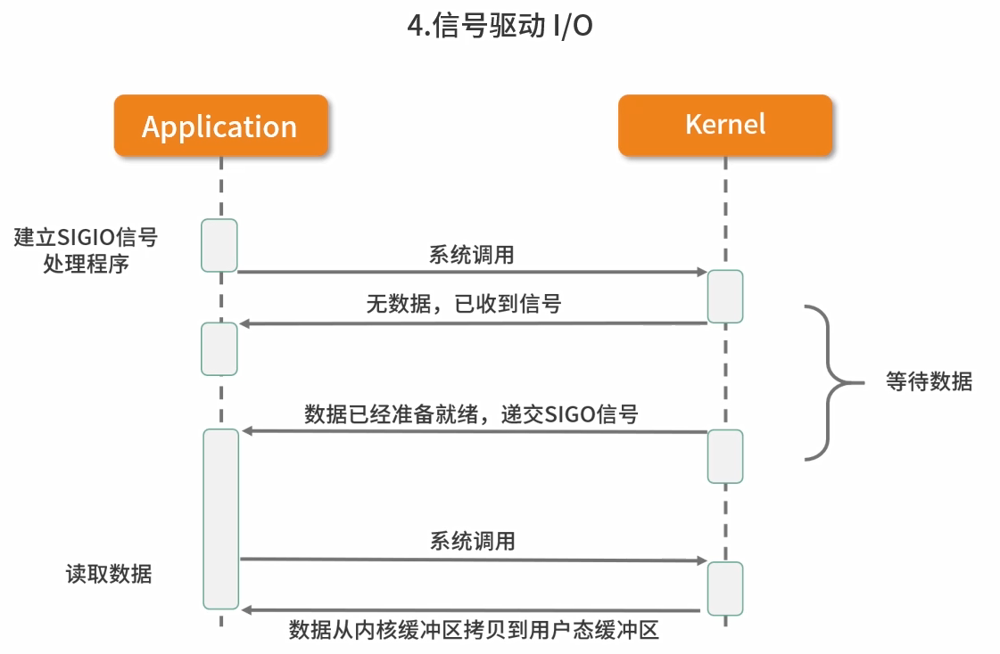

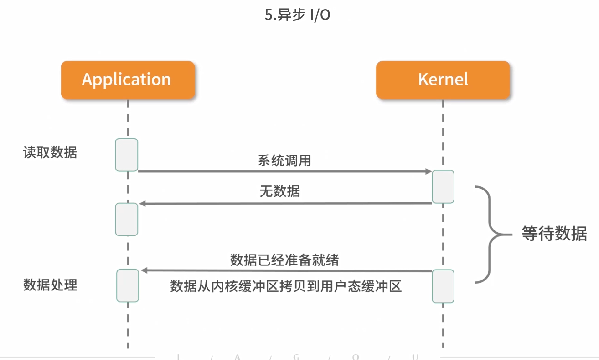

异步和信号驱动IO(半异步)的区别在于

异步是通知数据已经拷贝完毕

信号驱动IO是何时通知数据可以进行拷贝

**Netty如何实现自己的I/O模型**

1. 基于非堵塞I/O实现
2. 底层依赖NIO框架的多路复用器Selector
3. 一个多路复用器Selector可以同时轮询多个Channel

**事件分发器(Event Dispatcher)**

负责将读写事件分发给对应的读写处理器(event Handler)

有两种设计模式 Reactor(同步IO)+Proactor(异步IO)

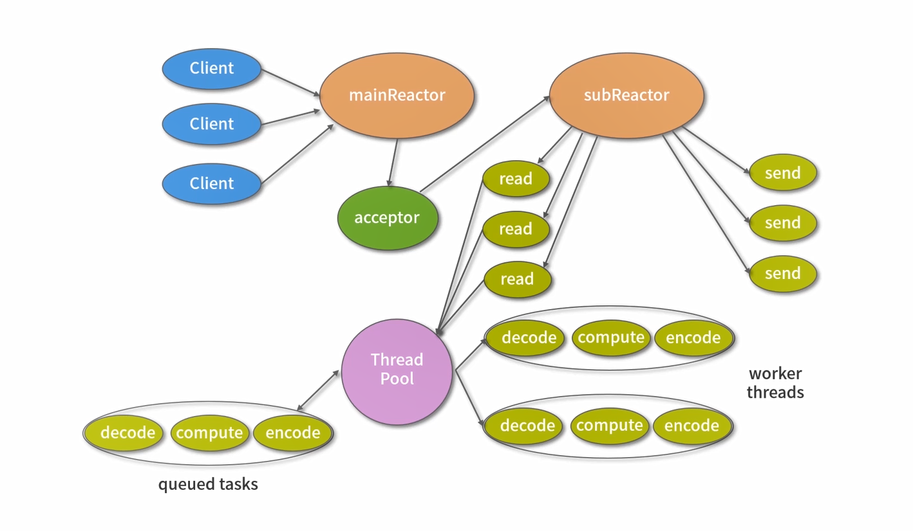

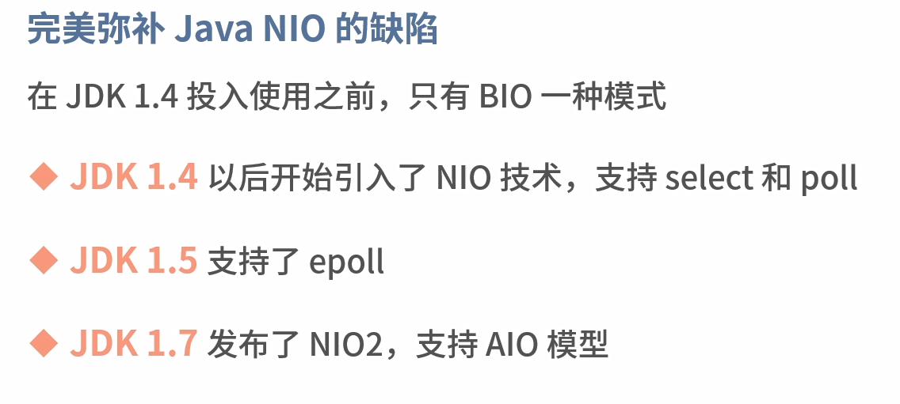

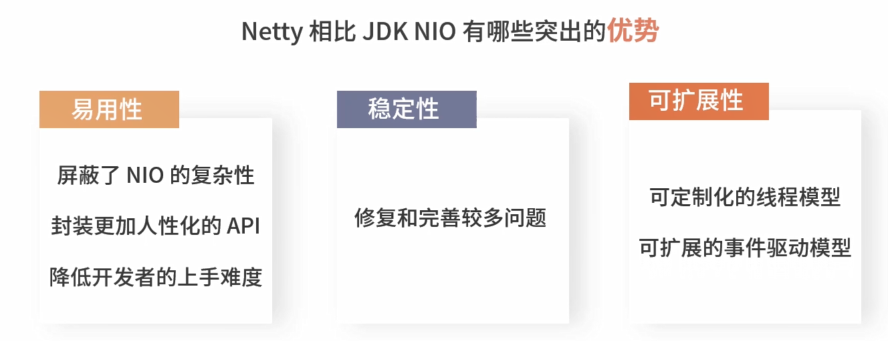

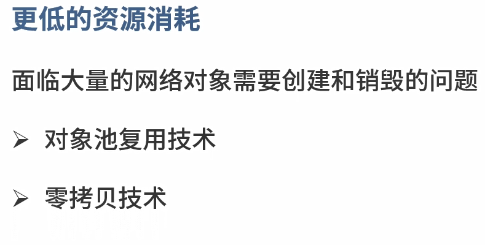

**网络框架的选型**

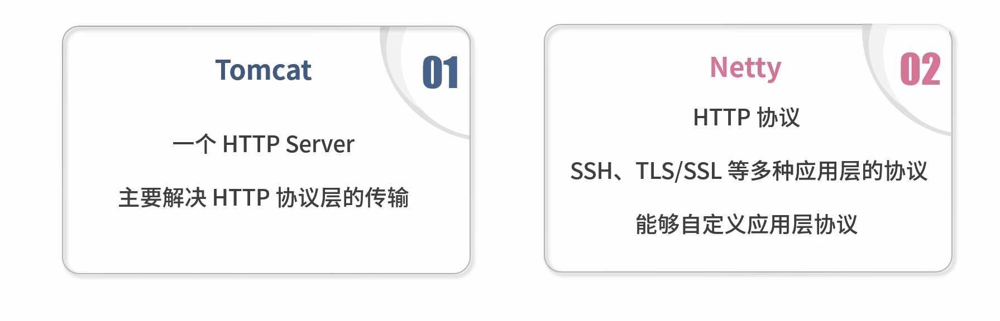

Netty官方提供3.x 4.x的稳定版本(5.x已放弃维护),**尽量不要在生产环境使用任何非稳定版本的组件**