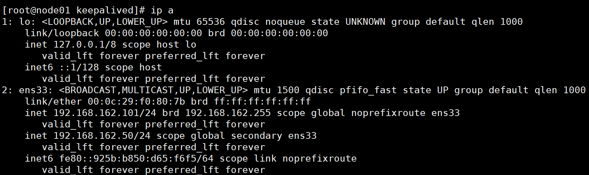

## 架构

* 单体

  * 优点 
    * 迭代周期短，速度快
    * 打包方便，运维省事
  * 缺陷
    * 单节点宕机导致所有服务不可用
    * 耦合度太高（迭代，测试，部署）
    * 单节点并发能力有限

* 集群

  * 优点
    * 提高系统性能
    * 提高系统可用性

  * 注意点
    * 用户会话
    * 定时任务
    * 内网互通

## 概述

enginx(engine x) 高性能Http和**反向代理web服务器**

通过配置文件实现集群和负载均衡


### 常见服务器

* MS IIS asp.net
* weblogic、Jboss 传统行业 ERP/物流/电信/金融
* Tomcat,Jetty j2ee
* Apache、Nginx 静态服务、反向代理

##  Weblogic

* JNDI 在 J2EE 中的角色就是“交换机” —— **J2EE 组件在运行时间接地查找其他**组件、**资源**或服务的通用机制。JNDI 在 J2EE 应用程序中的主要角色就是提供间接层，这样组件就可以发现所需要的资源，而不用了解这些间接性。

* vs tomcat

  * 全面支持J2ee规范，web service,ssl,xml,,ejb等 vs 只支持部分j2ee规范
  * Web控制器进行组件、jdbc、管理和配置 vs 差
    * 较好的支持热部署(debug) vs 差
  * 收费 vs 免费

  

## 代理

* 正向代理
  * 客户端请求目标服务器之间的一个代理服务器
* 反向代理
  * 用户访问目标服务器，由代理服务决定访问哪个ip
  * 例  报名表(用户请求）->教务处（反向代理服务器）->班级(目标服务器)
  * 路由功能
    * Routing is *the* *process* *of* *selecting* *a* *path* *for* *traffic* *in* *a* *network* *or* *between* *or* *across* *multiple* *networks*。路由发生在OSI网络参考模型中的第三层即网络层。

## 安装

* 在线linux 环境

  * shell:  [ Online Bash Compiler - Online Bash Editor - Online Bash IDE - Bash Coding Online - Practice Bash Online - Execute Bash Online - Compile Bash Online - Run Bash Online (tutorialspoint.com)](https://www.tutorialspoint.com/unix_terminal_online.php)

* [JS/UIX - Terminal (masswerk.at)](https://www.masswerk.at/jsuix/index.html) 用户名 guest

* 安装nginx

  wget  wgetGNU Wget(常常简称为wget）是一个网络上进行下载的简单而强大的自由软件 

  yum  （ Yellow dog Updater, Modified）是一个在 Fedora 和 RedHat 以及 SUSE 中的 Shell 前端软件包管理器。 

  1. 装gcc-c++

     yum install gcc-c++ 

     yum install -y openssl openssl-devel

  2. 安装pcre

     yum install -y pcre pcre-devel

  3. 安装zlib

     yum install -y zlib zlib-devel

  4. mkdir -p /usr/local/nginx

  5. wget https://nginx.org/download/nginx-1.22.0.tar.gz

  6. tar -zxvf nginx-1.19.9.tar.gz

     cd nginx-1.19.9

  7. 默认配置

     ./configure

  8. 编译安装

     make 

     make install

  9. 查找安装路径

     whereis nginx

  10. 进入其中sbin目录

      ./nginx

  11. ps -ef | grep nginx
  12. linux ip(port默认80)

若防火墙开启，默认inux80端口访问不到，可让端口号开放

查看防火墙是否开启

​	systemctl status firewalld

​	systemctl restart  firewalld

查看开放的端口号

​	firewall-cmd --list-all

设置开放的端口号(需重启防火墙)

firewall-cmd --zone=public  --add-port=80/tcp --permanent 

firewall-cmd  --add-service=http --permanent 

重启防火墙

​	firewall-cmd --reload

# 命令

查看版本号

​	./nginx -v

停止

​	./nginx -s stop

启动

​	./nginx 

重新加载 conf/nginx.conf

​	./nginx -s  reload


# 配置文件

/usr/local/nginx/conf/nginx.conf

这个配置文件一共由三部分组成，分别为**全局块、events块和http块**。在http块中，又包含http全局块、多个server块。每个server块中，可以包含server全局块和多个location块。 

配置文件支持大量可配置的指令，绝大多数指令不是特定属于某一个块的。 同一个指令放在不同层级的块中，其作用域也不同，一般情况下，高一级块中的指令可以作用于自身所在的块和此块包含的所有低层级块。如果某个指令在两个不同层级的块中同时出现，则采用“就近原则”，即以较低层级块中的配置为准。比如，某指令同时出现在http全局块中和server块中，并且配置不同，则应该以server块中的配置为准。 

整个配置文件的结构大致如下：

```shell
#全局块
#user  nobody;
worker_processes  1;

#event块
events {
    worker_connections  1024;
}

#http块
http {
    #http全局块
    include       mime.types;
    default_type  application/octet-stream;
    sendfile        on;
    keepalive_timeout  65;
    #server块
    server {
        #server全局块
        listen       8000;
        server_name  localhost;
        #location块
        location / {
            root   html;
            index  index.html index.htm;
        }
        error_page   500 502 503 504  /50x.html;
        location = /50x.html {
            root   html;
        }
    }
    #这边可以有多个server块
    server {
      ...
    }
}
```

## 全局块

主要设置一些影响Nginx服务器整体运行的配置指令，因此，这些指令的作用域是Nginx服务器全局。 

通常包括配置运行Nginx服务器的用户（组）、允许生成的worker process数、Nginx进程PID存放路径、日志的存放路径和类型以及配置文件引入等。 

```shell
# 指定可以运行nginx服务的用户和用户组，只能在全局块配置
# user [user] [group]
# 将user指令注释掉，或者配置成nobody的话所有用户都可以运行
# user nobody nobody;
# user指令在Windows上不生效，如果你制定具体用户和用户组会报小面警告
# nginx: [warn] "user" is not supported, ignored in D:\software\nginx-1.18.0/conf/nginx.conf:2

# 指定工作线程数，可以制定具体的进程数，也可使用自动模式，这个指令只能在全局块配置
# worker_processes number | auto；
# 列子：指定4个工作线程，这种情况下会生成一个master进程和4个worker进程
# worker_processes 4;

# 指定pid文件存放的路径，这个指令只能在全局块配置
# pid logs/nginx.pid;

# 指定错误日志的路径和日志级别，此指令可以在全局块、http块、server块以及location块中配置。(在不同的块配置有啥区别？？)
# 其中debug级别的日志需要编译时使用--with-debug开启debug开关
# error_log [path] [debug | info | notice | warn | error | crit | alert | emerg] 
# error_log  logs/error.log  notice;
# error_log  logs/error.log  info;
```

##  Events

events块涉及的指令主要影响Nginx服务器与用户的网络连接。常用到的设置包括是否开启对多worker process下的网络连接进行序列化，是否允许同时接收多个网络连接，选取哪种事件驱动模型处理连接请求，每个worker process可以同时支持的最大连接数等。

这一部分的指令对Nginx服务器的性能影响较大，在实际配置中应该根据实际情况灵活调整。

```
# 当某一时刻只有一个网络连接到来时，多个睡眠进程会被同时叫醒，但只有一个进程可获得连接。如果每次唤醒的进程数目太多，会影响一部分系统性能。在Nginx服务器的多进程下，就有可能出现这样的问题。
# 开启的时候，将会对多个Nginx进程接收连接进行序列化，防止多个进程对连接的争抢
# 默认是开启状态，只能在events块中进行配置
# accept_mutex on | off;

# 如果multi_accept被禁止了，nginx一个工作进程只能同时接受一个新的连接。否则，一个工作进程可以同时接受所有的新连接。 
# 如果nginx使用kqueue连接方法，那么这条指令会被忽略，因为这个方法会报告在等待被接受的新连接的数量。
# 默认是off状态，只能在event块配置
# multi_accept on | off;

# 指定使用哪种网络IO模型，method可选择的内容有：select、poll、kqueue、epoll、rtsig、/dev/poll以及eventport，一般操作系统不是支持上面所有模型的。
# 只能在events块中进行配置
# use method
# use epoll

# 设置允许每一个worker process同时开启的最大连接数，当每个工作进程接受的连接数超过这个值时将不再接收连接
# 当所有的工作进程都接收满时，连接进入logback，logback满后连接被拒绝
# 只能在events块中进行配置
# 注意：这个值不能超过超过系统支持打开的最大文件数，也不能超过单个进程支持打开的最大文件数，具体可以参考这篇文章：https://cloud.tencent.com/developer/article/1114773
# worker_connections  1024;

```

## http

http块是Nginx服务器配置中的重要部分，代理、缓存和日志定义等绝大多数的功能和第三方模块的配置都可以放在这个模块中。

前面已经提到，http块中可以包含自己的全局块，也可以包含server块，server块中又可以进一步包含location块，在本书中我们使用“http全局块”来表示http中自己的全局块，即http块中不包含在server块中的部分。

可以在http全局块中配置的指令包括文件引入、MIME-Type定义、日志自定义、是否使用sendfile传输文件、连接超时时间、单连接请求数上限等。

### http全局

``` shell
# 常用的浏览器中，可以显示的内容有HTML、XML、GIF及Flash等种类繁多的文本、媒体等资源，浏览器为区分这些资源，需要使用MIME Type。换言之，MIME Type是网络资源的媒体类型。Nginx服务器作为Web服务器，必须能够识别前端请求的资源类型。

# include指令，用于包含其他的配置文件，可以放在配置文件的任何地方，但是要注意你包含进来的配置文件一定符合配置规范，比如说你include进来的配置是worker_processes指令的配置，而你将这个指令包含到了http块中，着肯定是不行的，上面已经介绍过worker_processes指令只能在全局块中。
# 下面的指令将mime.types包含进来，mime.types和ngin.cfg同级目录，不同级的话需要指定具体路径
# include  mime.types;

# 配置默认类型，如果不加此指令，默认值为text/plain。
# 此指令还可以在http块、server块或者location块中进行配置。
# default_type  application/octet-stream;

# access_log配置，此指令可以在http块、server块或者location块中进行设置
# 在全局块中，我们介绍过errer_log指令，其用于配置Nginx进程运行时的日志存放和级别，此处所指的日志与常规的不同，它是指记录Nginx服务器提供服务过程应答前端请求的日志
# access_log path [format [buffer=size]]
# 如果你要关闭access_log,你可以使用下面的命令
# access_log off;

# log_format指令，用于定义日志格式，此指令只能在http块中进行配置
# log_format  main '$remote_addr - $remote_user [$time_local] "$request" '
#                  '$status $body_bytes_sent "$http_referer" '
#                  '"$http_user_agent" "$http_x_forwarded_for"';
# 定义了上面的日志格式后，可以以下面的形式使用日志
# access_log  logs/access.log  main;

# 开启关闭sendfile方式传输文件，可以在http块、server块或者location块中进行配置
# sendfile  on | off;

# 设置sendfile最大数据量,此指令可以在http块、server块或location块中配置
# sendfile_max_chunk size;
# 其中，size值如果大于0，Nginx进程的每个worker process每次调用sendfile()传输的数据量最大不能超过这个值(这里是128k，所以每次不能超过128k)；如果设置为0，则无限制。默认值为0。
# sendfile_max_chunk 128k;

# 配置连接超时时间,此指令可以在http块、server块或location块中配置。
# 与用户建立会话连接后，Nginx服务器可以保持这些连接打开一段时间
# timeout，服务器端对连接的保持时间。默认值为75s;header_timeout，可选项，在应答报文头部的Keep-Alive域设置超时时间：“Keep-Alive:timeout= header_timeout”。报文中的这个指令可以被Mozilla或者Konqueror识别。
# keepalive_timeout timeout [header_timeout]
# 下面配置的含义是，在服务器端保持连接的时间设置为120 s，发给用户端的应答报文头部中Keep-Alive域的超时时间设置为100 s。
# keepalive_timeout 120s 100s

# 配置单连接请求数上限，此指令可以在http块、server块或location块中配置。
# Nginx服务器端和用户端建立会话连接后，用户端通过此连接发送请求。指令keepalive_requests用于限制用户通过某一连接向Nginx服务器发送请求的次数。默认是100
# keepalive_requests number;
```


### server

server块和“虚拟主机”的概念有密切联系。

虚拟主机，又称虚拟服务器、主机空间或是网页空间，它是一种技术。该技术是为了节省互联网服务器硬件成本而出现的。这里的“主机”或“空间”是由实体的服务器延伸而来，硬件系统可以基于服务器群，或者单个服务器等。虚拟主机技术主要应用于HTTP、FTP及EMAIL等多项服务，将一台服务器的某项或者全部服务内容逻辑划分为多个服务单位，对外表现为多个服务器，从而充分利用服务器硬件资源。从用户角度来看，一台虚拟主机和一台独立的硬件主机是完全一样的。

虚拟主机技术使得Nginx服务器可以在同一台服务器上只运行一组Nginx进程，就可以运行多个网站。

在前面提到过，每一个http块都可以包含多个server块，而每个server块就相当于一台虚拟主机，它内部可有多台主机联合提供服务，一起对外提供在逻辑上关系密切的一组服务（或网站）。

和http块相同，server块也可以包含自己的全局块，同时可以包含多个location块。在server全局块中，最常见的两个配置项是本虚拟主机的监听配置和本虚拟主机的名称或IP配置。


#### server 全局

1. listen指令

server块中最重要的指令就是listen指令，这个指令有三种配置语法。这个指令默认的配置值是：listen *:80 | *:8000；只能在server块种配置这个指令。

```less
//第一种
listen address[:port] [default_server] [ssl] [http2 | spdy] [proxy_protocol] [setfib=number] [fastopen=number] [backlog=number] [rcvbuf=size] [sndbuf=size] [accept_filter=filter] [deferred] [bind] [ipv6only=on|off] [reuseport] [so_keepalive=on|off|[keepidle]:[keepintvl]:[keepcnt]];

//第二种
listen port [default_server] [ssl] [http2 | spdy] [proxy_protocol] [setfib=number] [fastopen=number] [backlog=number] [rcvbuf=size] [sndbuf=size] [accept_filter=filter] [deferred] [bind] [ipv6only=on|off] [reuseport] [so_keepalive=on|off|[keepidle]:[keepintvl]:[keepcnt]];

//第三种（可以不用重点关注）
listen unix:path [default_server] [ssl] [http2 | spdy] [proxy_protocol] [backlog=number] [rcvbuf=size] [sndbuf=size] [accept_filter=filter] [deferred] [bind] [so_keepalive=on|off|[keepidle]:[keepintvl]:[keepcnt]];
```

listen指令的配置非常灵活，可以单独制定ip，单独指定端口或者同时指定ip和端口。

```perl
listen 127.0.0.1:8000;  #只监听来自127.0.0.1这个IP，请求8000端口的请求
listen 127.0.0.1; #只监听来自127.0.0.1这个IP，请求80端口的请求（不指定端口，默认80）
listen 8000; #监听来自所有IP，请求8000端口的请求
listen *:8000; #和上面效果一样
listen localhost:8000; #和第一种效果一致
```

关于上面的一些重要参数做如下说明：

- address：监听的IP地址（请求来源的IP地址），如果是IPv6的地址，需要使用中括号“[]”括起来，比如[fe80::1]等。
- port：端口号，如果只定义了IP地址没有定义端口号，就使用80端口。**这边需要做个说明：要是你压根没配置listen指令，那么那么如果nginx以超级用户权限运行，则使用`\*`:80，否则使用`\*`:8000**。多个虚拟主机可以同时监听同一个端口,但是server_name需要设置成不一样；
- default_server：假如通过Host没匹配到对应的虚拟主机，则通过这台虚拟主机处理。具体的可以参考这篇[文章](https://segmentfault.com/a/1190000015681272)，写的不错。
- backlog=number：设置监听函数listen()最多允许多少网络连接同时处于挂起状态，在FreeBSD中默认为-1，其他平台默认为511。
- accept_filter=filter，设置监听端口对请求的过滤，被过滤的内容不能被接收和处理。本指令只在FreeBSD和NetBSD 5.0+平台下有效。filter可以设置为dataready或httpready，感兴趣的读者可以参阅Nginx的官方文档。
- bind：标识符，使用独立的bind()处理此address:port；一般情况下，对于端口相同而IP地址不同的多个连接，Nginx服务器将只使用一个监听命令，并使用bind()处理端口相同的所有连接。
- ssl：标识符，设置会话连接使用SSL模式进行，此标识符和Nginx服务器提供的HTTPS服务有关。

listen指令的使用看起来比较复杂，但其实在一般的使用过程中，相对来说比较简单，并不会进行太复杂的配置。

2. server_name

用于配置虚拟主机的名称。语法是：

```makefile
Syntax:	server_name name ...;
Default:	
server_name "";
Context:	server
```

对于name 来说，可以只有一个名称，也可以由多个名称并列，之间用空格隔开。每个名字就是一个域名，由两段或者三段组成，之间由点号“.”隔开。比如

```undefined
server_name myserver.com www.myserver.com
```

在该例中，此虚拟主机的名称设置为myserver.com或www. myserver.com。Nginx服务器规定，第一个名称作为此虚拟主机的主要名称。

在name 中可以使用通配符“*”，但通配符只能用在由三段字符串组成的名称的首段或尾段，或者由两段字符串组成的名称的尾段，如：

```undefined
server_name myserver.* *.myserver.com
```

另外name还支持正则表达式的形式。这边就不详细展开了。

由于server_name指令支持使用通配符和正则表达式两种配置名称的方式，因此在包含有多个虚拟主机的配置文件中，可能会出现一个名称被多个虚拟主机的server_name匹配成功。那么，来自这个名称的请求到底要交给哪个虚拟主机处理呢？Nginx服务器做出如下规定：

a. 对于匹配方式不同的，按照以下的优先级选择虚拟主机，排在前面的优先处理请求。

- ① 准确匹配server_name
- ② 通配符在开始时匹配server_name成功
- ③ 通配符在结尾时匹配server_name成功
- ④ 正则表达式匹配server_name成功

b. 在以上四种匹配方式中，如果server_name被处于同一优先级的匹配方式多次匹配成功，则首次匹配成功的虚拟主机处理请求。

有时候我们希望使用基于IP地址的虚拟主机配置，比如访问192.168.1.31有虚拟主机1处理，访问192.168.1.32由虚拟主机2处理。

这时我们要先网卡绑定别名，比如说网卡之前绑定的IP是192.168.1.30，现在将192.168.1.31和192.168.1.32这两个IP都绑定到这个网卡上，那么请求这个两个IP的请求才会到达这台机器。

绑定别名后进行以下配置即可：

```css
http
{
	{
	   listen:  80;
	   server_name:  192.168.1.31;
     ...
	}
	{
	   listen:  80;
	   server_name:  192.168.1.32;
     ...
	}
}
```

#### location

每个server块中可以包含多个location块。在整个Nginx配置文档中起着重要的作用，而且Nginx服务器在许多功能上的灵活性往往在location指令的配置中体现出来。

location块的主要作用是，基于Nginx服务器接收到的请求字符串（例如， server_name/uri-string），对除虚拟主机名称（也可以是IP别名，后文有详细阐述）之外的字符串（前例中“/uri-string”部分）进行匹配，对特定的请求进行处理。地址定向、数据缓存和应答控制等功能都是在这部分实现。许多第三方模块的配置也是在location块中提供功能。

在Nginx的官方文档中定义的location的语法结构为：

```css
location [ = | ~ | ~* | ^~ ] uri { ... }
```

其中，uri变量是待匹配的请求字符串，可以是不含正则表达的字符串，如/myserver.php等；也可以是包含有正则表达的字符串，如 .php$（表示以.php结尾的URL）等。为了下文叙述方便，我们约定，不含正则表达的uri称为“标准uri”，使用正则表达式的uri称为“正则uri”。

其中方括号里的部分，是可选项，用来改变请求字符串与 uri 的匹配方式。在介绍四种标识的含义之前，我们需要先了解不添加此选项时，Nginx服务器是如何在server块中搜索并使用location块的uri和请求字符串匹配的。

在不添加此选项时，Nginx服务器首先在server块的多个location块中搜索是否有标准uri和请求字符串匹配，如果有多个可以匹配，就记录匹配度最高的一个。然后，服务器再用location块中的正则uri和请求字符串匹配，当第一个正则uri匹配成功，结束搜索，并使用这个location块处理此请求；如果正则匹配全部失败，就使用刚才记录的匹配度最高的location块处理此请求。

了解了上面的内容，就可以解释可选项中各个标识的含义了：

- “=”，用于标准uri前，要求请求字符串与uri严格匹配。如果已经匹配成功，就停止继续向下搜索并立即处理此请求。
- “^～”，用于标准uri前，要求Nginx服务器找到标识uri和请求字符串匹配度最高的location后，立即使用此location处理请求，而不再使用location块中的正则uri和请求字符串做匹配。
- “～”，用于表示uri包含正则表达式，并且区分大小写。
- “～`*`”，用于表示uri包含正则表达式，并且不区分大小写。注意如果uri包含正则表达式，就必须要使用“～”或者“～*”标识。

> 我们知道，在浏览器传送URI时对一部分字符进行URL编码，比如空格被编码为“%20”，问号被编码为“%3f”等。“～”有一个特点是，它对uri中的这些符号将会进行编码处理。比如，如果location块收到的URI为“/html/%20/data”，则当Nginx服务器搜索到配置为“～ /html/ /data”的location时，可以匹配成功。


1. root

   这个指令用于设置请求寻找资源的根目录，此指令可以在http块、server块或者location块中配置。由于使用Nginx服务器多数情况下要配置多个location块对不同的请求分别做出处理，因此该指令通常在location块中进行设置。

   ```lua
   root path
   ```

   path变量中可以包含Nginx服务器预设的大多数变量，只有documentroot和documentroot和realpath_root不可以使用。

   当用户请求 `/` 地址时，Nginx 就会自动在 **[root](http://wiki.nginx.org/HttpCoreModule#root) 配置指令指定的文件系统目录下**依次寻找 `index.htm` 和`index.html` 这两个文件。如果 `index.htm` 文件存在，则直接发起“内部跳转”到 `/index.htm` 这个新的地址；而如果 `index.htm` 文件不存在，则继续检查 `index.html` 是否存在。如果存在，同样发起“内部跳转”到`/index.html`；如果 `index.html` 文件仍然不存在，则放弃处理权给 `content` 阶段的下一个模块 

   默认值 root html

   如location /blog/ 

   {

    root /usr/local/nginx/html; 

   index index.html index.htm; 

   } 

   请求 **http://127.0.0.1:80/blog/root.html** 这个地址时，那么在服务器里面对应的真正的资源是 **/usr/local/nginx/html/blog/root.html**文件。可以发现真实的路径是root指定的值加上location指定的值。 

2. alias

   location /blog/

    {

    alias /usr/local/nginx/html/; 

   index index.html index.htm;

    } 

   同样请求**http://127.0.0.1:80/blog/alias.html**时，在服务器查找的资源路径是：**/usr/local/nginx/html/alias.html。**正如其名，alias指定的路径是location的别名，不管location的值怎么写，资源的真实路径都是alias指定的路径.。 

3. index 相对root而言没有子路径，就会返回的页面即首页

4. error_page


## 例子

```
######Nginx配置文件nginx.conf中文详解#####

#定义Nginx运行的用户和用户组
user www www;

#nginx进程数，建议设置为等于CPU总核心数。
#Cpu个数  cat /proc/cpuinfo|grep "physical id"|sort|uniq|wc -l
#核数   cat /proc/cpuinfo|grep "core id"|sort|uniq|wc -l
worker_processes 8;
 
#全局错误日志定义类型，[ debug | info | notice | warn | error | crit ]
error_log /usr/local/nginx/logs/error.log info;

#进程pid文件
pid /usr/local/nginx/logs/nginx.pid;

#指定进程可以打开的最大描述符：数目
#工作模式与连接数上限
#这个指令是指当一个nginx进程打开的最多文件描述符数目，理论值应该是最多打开文件数（ulimit -n）与nginx进程数相除，但是nginx分配请求并不是那么均匀，所以最好与ulimit -n 的值保持一致。
#现在在linux 2.6内核下开启文件打开数为65535，worker_rlimit_nofile就相应应该填写65535。
#这是因为nginx调度时分配请求到进程并不是那么的均衡，所以假如填写10240，总并发量达到3-4万时就有进程可能超过10240了，这时会返回502错误。
worker_rlimit_nofile 65535;


events
{
    #参考事件模型，use [ kqueue | rtsig | epoll | /dev/poll | select | poll ]; epoll模型
    #是Linux 2.6以上版本内核中的高性能网络I/O模型，linux建议epoll，如果跑在FreeBSD上面，就用kqueue模型。
    #补充说明：
    #与apache相类，nginx针对不同的操作系统，有不同的事件模型
    #A）标准事件模型
    #Select、poll属于标准事件模型，如果当前系统不存在更有效的方法，nginx会选择select或poll
    #B）高效事件模型
    #Kqueue：使用于FreeBSD 4.1+, OpenBSD 2.9+, NetBSD 2.0 和 MacOS X.使用双处理器的MacOS X系统使用kqueue可能会造成内核崩溃。
    #Epoll：使用于Linux内核2.6版本及以后的系统。  uname -r
    #/dev/poll：使用于Solaris 7 11/99+，HP/UX 11.22+ (eventport)，IRIX 6.5.15+ 和 Tru64 UNIX 5.1A+。
    #Eventport：使用于Solaris 10。 为了防止出现内核崩溃的问题， 有必要安装安全补丁。
    use epoll;

    #单个进程最大连接数（最大连接数=连接数*进程数）
    #根据硬件调整，和前面工作进程配合起来用，尽量大，但是别把cpu跑到100%就行。每个进程允许的最多连接数，理论上每台nginx服务器的最大连接数为。
    worker_connections 65535;

    #客户端请求头部的缓冲区大小。这个可以根据你的系统分页大小来设置，一般一个请求头的大小不会超过1k，不过由于一般系统分页都要大于1k，所以这里设置为分页大小。
    #分页大小可以用命令getconf PAGESIZE 取得。
    #[root@web001 ~]# getconf PAGESIZE
    #4096
    #但也有client_header_buffer_size超过4k的情况，但是client_header_buffer_size该值必须设置为“系统分页大小”的整倍数。
    #directive is not allowed here
    #client_header_buffer_size 4k;

    #这个将为打开文件指定缓存，默认是没有启用的，max指定缓存数量，建议和打开文件数一致，inactive是指经过多长时间文件没被请求后删除缓存。
    open_file_cache max=65535 inactive=60s;

    #这个是指多长时间检查一次缓存的有效信息。
    #语法:open_file_cache_valid time 默认值:open_file_cache_valid 60 使用字段:http, server, location 这个指令指定了何时需要检查open_file_cache中缓存项目的有效信息.
    open_file_cache_valid 80s;

    #open_file_cache指令中的inactive参数时间内文件的最少使用次数，如果超过这个数字，文件描述符一直是在缓存中打开的，如上例，如果有一个文件在inactive时间内一次没被使用，它将被移除。
    #语法:open_file_cache_min_uses number 默认值:open_file_cache_min_uses 1 使用字段:http, server, location  这个指令指定了在open_file_cache指令无效的参数中一定的时间范围内可以使用的最小文件数,如果使用更大的值,文件描述符在cache中总是打开状态.
    open_file_cache_min_uses 1;
    
    #语法:open_file_cache_errors on | off 默认值:open_file_cache_errors off 使用字段:http, server, location 这个指令指定是否在搜索一个文件时记录cache错误.
    open_file_cache_errors on;
}
 
 
 
#设定http服务器，利用它的反向代理功能提供负载均衡支持
http
{
    #文件扩展名与文件类型映射表
    include mime.types;

    #默认文件类型
    default_type application/octet-stream;

    #默认编码
    #charset utf-8;

    #服务器名字的hash表大小
    #保存服务器名字的hash表是由指令server_names_hash_max_size 和server_names_hash_bucket_size所控制的。参数hash bucket size总是等于hash表的大小，并且是一路处理器缓存大小的倍数。在减少了在内存中的存取次数后，使在处理器中加速查找hash表键值成为可能。如果hash bucket size等于一路处理器缓存的大小，那么在查找键的时候，最坏的情况下在内存中查找的次数为2。第一次是确定存储单元的地址，第二次是在存储单元中查找键 值。因此，如果Nginx给出需要增大hash max size 或 hash bucket size的提示，那么首要的是增大前一个参数的大小.
    server_names_hash_bucket_size 128;

    #客户端请求头部的缓冲区大小。这个可以根据你的系统分页大小来设置，一般一个请求的头部大小不会超过1k，不过由于一般系统分页都要大于1k，所以这里设置为分页大小。分页大小可以用命令getconf PAGESIZE取得。
    client_header_buffer_size 32k;

    #客户请求头缓冲大小。nginx默认会用client_header_buffer_size这个buffer来读取header值，如果header过大，它会使用large_client_header_buffers来读取。
    large_client_header_buffers 4 64k;

    #设定通过nginx上传文件的大小
    client_max_body_size 8m;

    #开启高效文件传输模式，sendfile指令指定nginx是否调用sendfile函数来输出文件，对于普通应用设为 on，如果用来进行下载等应用磁盘IO重负载应用，可设置为off，以平衡磁盘与网络I/O处理速度，降低系统的负载。注意：如果图片显示不正常把这个改成off。
    #sendfile指令指定 nginx 是否调用sendfile 函数（zero copy 方式）来输出文件，对于普通应用，必须设为on。如果用来进行下载等应用磁盘IO重负载应用，可设置为off，以平衡磁盘与网络IO处理速度，降低系统uptime。
    sendfile on;

    #开启目录列表访问，合适下载服务器，默认关闭。
    autoindex on;

    #此选项允许或禁止使用socke的TCP_CORK的选项，此选项仅在使用sendfile的时候使用
    tcp_nopush on;
     
    tcp_nodelay on;

    #长连接超时时间，单位是秒
    keepalive_timeout 120;

    #FastCGI相关参数是为了改善网站的性能：减少资源占用，提高访问速度。下面参数看字面意思都能理解。
    fastcgi_connect_timeout 300;
    fastcgi_send_timeout 300;
    fastcgi_read_timeout 300;
    fastcgi_buffer_size 64k;
    fastcgi_buffers 4 64k;
    fastcgi_busy_buffers_size 128k;
    fastcgi_temp_file_write_size 128k;

    #gzip模块设置
    gzip on; #开启gzip压缩输出
    gzip_min_length 1k;    #最小压缩文件大小
    gzip_buffers 4 16k;    #压缩缓冲区
    gzip_http_version 1.0;    #压缩版本（默认1.1，前端如果是squid2.5请使用1.0）
    gzip_comp_level 2;    #压缩等级
    gzip_types text/plain application/x-javascript text/css application/xml;    #压缩类型，默认就已经包含textml，所以下面就不用再写了，写上去也不会有问题，但是会有一个warn。
    gzip_vary on;

    #开启限制IP连接数的时候需要使用
    #limit_zone crawler $binary_remote_addr 10m;


    #负载均衡配置
    upstream jh.w3cschool.cn {
     
        #upstream的负载均衡，weight是权重，可以根据机器配置定义权重。weigth参数表示权值，权值越高被分配到的几率越大。
        server 192.168.80.121:80 weight=3;
        server 192.168.80.122:80 weight=2;
        server 192.168.80.123:80 weight=3;

        #nginx的upstream目前支持4种方式的分配
        #1、轮询（默认）
        #每个请求按时间顺序逐一分配到不同的后端服务器，如果后端服务器down掉，能自动剔除。
        #2、weight
        #指定轮询几率，weight和访问比率成正比，用于后端服务器性能不均的情况。
        #例如：
        #upstream bakend {
        #    server 192.168.0.14 weight=10;
        #    server 192.168.0.15 weight=10;
        #}
        #3、ip_hash
        #每个请求按访问ip的hash结果分配，这样每个访客固定访问一个后端服务器，可以解决session的问题。
        #例如：
        #upstream bakend {
        #    ip_hash;
        #    server 192.168.0.14:88;
        #    server 192.168.0.15:80;
        #}
        #4、fair（第三方）
        #按后端服务器的响应时间来分配请求，响应时间短的优先分配。
        #upstream backend {
        #    server server1;
        #    server server2;
        #    fair;
        #}
        #5、url_hash（第三方）
        #按访问url的hash结果来分配请求，使每个url定向到同一个后端服务器，后端服务器为缓存时比较有效。
        #例：在upstream中加入hash语句，server语句中不能写入weight等其他的参数，hash_method是使用的hash算法
        #upstream backend {
        #    server squid1:3128;
        #    server squid2:3128;
        #    hash $request_uri;
        #    hash_method crc32;
        #}

        #tips:
        #upstream bakend{#定义负载均衡设备的Ip及设备状态}{
        #    ip_hash;
        #    server 127.0.0.1:9090 down;
        #    server 127.0.0.1:8080 weight=2;
        #    server 127.0.0.1:6060;
        #    server 127.0.0.1:7070 backup;
        #}
        #在需要使用负载均衡的server中增加 proxy_pass http://bakend/;

        #每个设备的状态设置为:
        #1.down表示单前的server暂时不参与负载
        #2.weight为weight越大，负载的权重就越大。
        #3.max_fails：允许请求失败的次数默认为1.当超过最大次数时，返回proxy_next_upstream模块定义的错误
        #4.fail_timeout:max_fails次失败后，暂停的时间。
        #5.backup： 其它所有的非backup机器down或者忙的时候，请求backup机器。所以这台机器压力会最轻。

        #nginx支持同时设置多组的负载均衡，用来给不用的server来使用。
        #client_body_in_file_only设置为On 可以讲client post过来的数据记录到文件中用来做debug
        #client_body_temp_path设置记录文件的目录 可以设置最多3层目录
        #location对URL进行匹配.可以进行重定向或者进行新的代理 负载均衡
    }
     
     
     
    #虚拟主机的配置
    server
    {
        #监听端口
        listen 80;

        #域名可以有多个，用空格隔开
        server_name www.w3cschool.cn w3cschool.cn;
        index index.html index.htm index.php;
        root /data/www/w3cschool;

        #对******进行负载均衡
        location ~ .*.(php|php5)?$
        {
            fastcgi_pass 127.0.0.1:9000;
            fastcgi_index index.php;
            include fastcgi.conf;
        }
         
        #图片缓存时间设置
        location ~ .*.(gif|jpg|jpeg|png|bmp|swf)$
        {
            expires 10d;
        }
         
        #JS和CSS缓存时间设置
        location ~ .*.(js|css)?$
        {
            expires 1h;
        }
         
        #日志格式设定
        #$remote_addr与$http_x_forwarded_for用以记录客户端的ip地址；
        #$remote_user：用来记录客户端用户名称；
        #$time_local： 用来记录访问时间与时区；
        #$request： 用来记录请求的url与http协议；
        #$status： 用来记录请求状态；成功是200，
        #$body_bytes_sent ：记录发送给客户端文件主体内容大小；
        #$http_referer：用来记录从那个页面链接访问过来的；
        #$http_user_agent：记录客户浏览器的相关信息；
        #通常web服务器放在反向代理的后面，这样就不能获取到客户的IP地址了，通过$remote_add拿到的IP地址是反向代理服务器的iP地址。反向代理服务器在转发请求的http头信息中，可以增加x_forwarded_for信息，用以记录原有客户端的IP地址和原来客户端的请求的服务器地址。
        log_format access '$remote_addr - $remote_user [$time_local] "$request" '
        '$status $body_bytes_sent "$http_referer" '
        '"$http_user_agent" $http_x_forwarded_for';
         
        #定义本虚拟主机的访问日志
        access_log  /usr/local/nginx/logs/host.access.log  main;
        access_log  /usr/local/nginx/logs/host.access.404.log  log404;
         
        #对 "/" 启用反向代理
        location / {
            proxy_pass http://127.0.0.1:88;
            proxy_redirect off;
            proxy_set_header X-Real-IP $remote_addr;
             
            #后端的Web服务器可以通过X-Forwarded-For获取用户真实IP
            proxy_set_header X-Forwarded-For $proxy_add_x_forwarded_for;
             
            #以下是一些反向代理的配置，可选。
            proxy_set_header Host $host;

            #允许客户端请求的最大单文件字节数
            client_max_body_size 10m;

            #缓冲区代理缓冲用户端请求的最大字节数，
            #如果把它设置为比较大的数值，例如256k，那么，无论使用firefox还是IE浏览器，来提交任意小于256k的图片，都很正常。如果注释该指令，使用默认的client_body_buffer_size设置，也就是操作系统页面大小的两倍，8k或者16k，问题就出现了。
            #无论使用firefox4.0还是IE8.0，提交一个比较大，200k左右的图片，都返回500 Internal Server Error错误
            client_body_buffer_size 128k;

            #表示使nginx阻止HTTP应答代码为400或者更高的应答。
            proxy_intercept_errors on;

            #后端服务器连接的超时时间_发起握手等候响应超时时间
            #nginx跟后端服务器连接超时时间(代理连接超时)
            proxy_connect_timeout 90;

            #后端服务器数据回传时间(代理发送超时)
            #后端服务器数据回传时间_就是在规定时间之内后端服务器必须传完所有的数据
            proxy_send_timeout 90;

            #连接成功后，后端服务器响应时间(代理接收超时)
            #连接成功后_等候后端服务器响应时间_其实已经进入后端的排队之中等候处理（也可以说是后端服务器处理请求的时间）
            proxy_read_timeout 90;

            #设置代理服务器（nginx）保存用户头信息的缓冲区大小
            #设置从被代理服务器读取的第一部分应答的缓冲区大小，通常情况下这部分应答中包含一个小的应答头，默认情况下这个值的大小为指令proxy_buffers中指定的一个缓冲区的大小，不过可以将其设置为更小
            proxy_buffer_size 4k;

            #proxy_buffers缓冲区，网页平均在32k以下的设置
            #设置用于读取应答（来自被代理服务器）的缓冲区数目和大小，默认情况也为分页大小，根据操作系统的不同可能是4k或者8k
            proxy_buffers 4 32k;

            #高负荷下缓冲大小（proxy_buffers*2）
            proxy_busy_buffers_size 64k;

            #设置在写入proxy_temp_path时数据的大小，预防一个工作进程在传递文件时阻塞太长
            #设定缓存文件夹大小，大于这个值，将从upstream服务器传
            proxy_temp_file_write_size 64k;
        }
         
         
        #设定查看Nginx状态的地址
        location /NginxStatus {
            stub_status on;
            access_log on;
            auth_basic "NginxStatus";
            auth_basic_user_file confpasswd;
            #htpasswd文件的内容可以用apache提供的htpasswd工具来产生。
        }
         
        #本地动静分离反向代理配置
        #所有jsp的页面均交由tomcat或resin处理
        location ~ .(jsp|jspx|do)?$ {
            proxy_set_header Host $host;
            proxy_set_header X-Real-IP $remote_addr;
            proxy_set_header X-Forwarded-For $proxy_add_x_forwarded_for;
            proxy_pass http://127.0.0.1:8080;
        }
         
        #所有静态文件由nginx直接读取不经过tomcat或resin
        location ~ .*.(htm|html|gif|jpg|jpeg|png|bmp|swf|ioc|rar|zip|txt|flv|mid|doc|ppt|
        pdf|xls|mp3|wma)$
        {
            expires 15d; 
        }
         
        location ~ .*.(js|css)?$
        {
            expires 1h;
        }
    }
}
######Nginx配置文件nginx.conf中文详解#####
```


# 反向代理

## 案例一

实现效果：  输入www.123.com 跳转到linux tomcat首页

准备：

1. 安装tomcat，使用默认8080端口

   https://mirrors.cnnic.cn/apache/tomcat

   - wget https://mirrors.cnnic.cn/apache/tomcat/tomcat-9/v9.0.65/bin/apache-tomcat-9.0.65.tar.gz

   - 解压

     tar -zxvf  apache-tomcat-9.0.65.tar.gz

   - 配置环境变量

     vim /etc/profile

     export TOMCAT_HOME=/usr/local/tomcat/apache-tomcat-9.0.37  //这里是tomcat 的解压路径
     export PATH=$PATH: $TOMCAT_HOME/bin

     source /etc/profile

   - 启动

     startup.sh

     shutdown.sh

   - 查看日志

     tail -f logs/catalina.out

2. 配置nginx.conf并重启

   


```
 server {
        listen       80;
        server_name  localhost; #这里 192.168.162.100 localhost 127.0.0.1等价


        location / {
            root   html;
            proxy_pass http://127.0.0.1:8080;
            index  index.html index.htm;
        }

```

firewall-cmd --zone=public  --add-port=8080/tcp --permanent 
firewall-cmd --reload

## 案例二


根据访问的路径跳转到不同端口的服务中
如

192.168.162.100:9001/edu/     ->  127.0.0.1:8080
192.168.162.100:9001/vod/     ->   127.0.0.1:8081


新增一个server

```
    server {
        listen       9001;
        server_name  localhost;

        location ~* ^/edu {
            proxy_pass http://127.0.0.1:8080;
        }

        location ~* ^/vod {
            proxy_pass http://127.0.0.1:8081;
        }

    }
```


通过上述配置后访问 http://192.168.162.100:9001/edu/index.html

相当于直接访问 http://192.168.162.100:8080/edu/index.html

# 负载均衡

增加服务器的数量，将原来请求集中到单个服务器上，改为将负载分发到不同的服务器上

## 案例一

请求192.168.162.100/edu/a.html,负载均衡效果，平均分配到8081和8082端口应用中


核心： http块中的upstream

```
http:{
    ...
    upstream myServer{
        server 192.168.162.100:8080 weight=1;
        server 192.168.162.100:8081 weight=1;
    }
}

server{
	...
    location / {
        ...
        proxy_pass http://myServer;
        proxy_connect_timeout 10;
    }
}
```


## nginx分配策略

1. 轮询（默认）

   每个请求按时间顺序逐一分配到后端服务器中，若服务器down掉，则自动剔除

2. weight（权重） 

   为指定的服务器设置权重参数，权重占比为[负载均衡](https://so.csdn.net/so/search?q=%E8%B4%9F%E8%BD%BD%E5%9D%87%E8%A1%A1&spm=1001.2101.3001.7020)决定的一部分。权重越大被分配到负载的概率就大。

   用于服务器性能不均的情况 

   weight=x

3. ip_hash

   每个请求按照访问ip的hash结果分配，这样使得每个访客固定访问某个服务器，可以解决session的问题

       upstream myServer{
       	ip_hash;
           server 192.168.162.100:8080 weight=1;
           server 192.168.162.100:8081 weight=1;
           ...
       }

4. fair(第三方)

   根据服务器的响应时间分配请求，响应时间越短的优先分配

   

   安装fair

   1. 下载ziphttps://github.com/gnosek/nginx-upstream-fair

   2. 解压unzip

   3. 切换到下载的nginx解压目录下

   4. ```
      ./configure  --add-module=/opt/nginx-upstream-fair-master
      ```

      6.  编译make
      7. 复制文件 cp objs/nginx /usr/local/nginx/sbin/nginx 
      8. 验证 ./nginx -V

   

   问题：编译时nginx-upstream-fair/ngx_http_upstream_fair_module.c:543:28: error: ‘ngx_http_upstream_srv_conf_t’ has no member named ‘default_port’ if (us->port == 0 && us->default_port == 0)  

   解决：/src/http/ngx_http_upstream.h   ngx_http_upstream_srv_conf_s模块  新增in_port_t  default_port ;

   

   

   

   upstream myServer{
   	fair;
       server 192.168.162.100:8080 weight=1;
       server 192.168.162.100:8081 weight=1;
       ...
   }

5. least_conn（最少连接数） 

   在一些要求需要更长的时间才能完成的应用情况下， 最少连接可以更公平地控制应用程序实例的负载。使用最少连接负载均衡，[nginx](https://so.csdn.net/so/search?q=nginx&spm=1001.2101.3001.7020)不会向负载繁忙的服务器上分发请求，而是**将请求分发到负载低的服务器上** 

6. url_hash（第三方） 

   按访问url的hash结果来分配请求，使同一个url定向到同一个后端服务器，**后端服务器为缓存时比较有效** 

   upstream myServer{
       hash $request_uri;
       server 192.168.162.100:8080 weight=1;
       server 192.168.162.100:8081 weight=1;
       ...

   }


# Http Status 304

如果客户端（浏览器）发送的是一个条件验证请求,则web服务器可能会返回304响应,这就表明了**客户端中所请求资源的缓存仍然是有效的,也就是说该资源从上次缓存到现在没有被修改过，浏览器会自动识别并读取缓存中的文件来显示**。 如果客户端（浏览器）发送的是一个条件验证请求,则web服务器可能会返回304响应,这就表明了客户端中所请求资源的缓存仍然是有效的,也就是说该资源从上次缓存到现在没有被修改过，浏览器会自动识别并读取缓存中的文件来显示。 **304服务器不会返回网页内容**

在进行条件请求时，一般请求头会带上 If-Modified-Since、 If-None-Match，这两个值分别对应响应头 Last-Modified、 ETag 返回的值 

只有在客户端缓存了对应资源且该资源的响应头中包含了Last-Modified或ETag的情况下,才可能发送条件请求.如果这两个头都不存在,则必须无条件请求该资源,服务器也就必须返回完整的资源数据. 

返回200的情况

1. 资源非最新
2. 服务器认为**客户端资源过期**，服务器就会返回200 OK响应,响应体就是该资源当前最新的内容.**客户端收到200响应后,就会用新的资源覆盖掉旧的缓存资源** 


## 判断缓存过期

**必须是条件验证请求，否则服务器也就会返回完整的资源数据**

设定请求头中的某一个字段来实现的：1、Expires；2、Cache-Control。Cache-Control设置后优先级比Expires高 

1. Cache-Control

   Cache-Control：max-age =86400   (TimeUnit second)

   **当未过期时，不会向服务器发起资源请求，适合不经常变动的资源。**

   **但是会去获取服务器该资源的最后更新时间或ETag,以此决定是200抓取资源还是304**

   

   **直接刷新资源的时候就会让当前的这个文件所设定的过期时间失效**

   

   Last-Modified :

   当第一次请求某一个文件的时候，就会传递回来一个Last-Modified 字段，其内容是这个文件的修改时间。当这个文件缓存过期(失效)，浏览器又向服务器请求这个文件的时候，会自动带一个请求头字段If-Modified-Since，其值是上一次传递过来的Last-Modified的值，拿这个值去和服务器中现在这个文件的最后修改时间做对比，如果If-Modified-Since>=Last-Modified，那么就不会重新拉取这个文件了，返回304让浏览器读过期缓存。否则就重新拉取。此时不会再返回Last-Modified

2. expire

   指定过期时间

   

## ETag

Entity Tag

在HTTP1.1协议中其实就是请求HEAD中的一个属性,用来帮助服务器控制Web端的缓存验证 

原理 :

当浏览器第一次请求服务器的某项资源(A)时, 服务器根据A算出一个哈希值(3f80f-1b6-3e1cb03b)并通过 ETag 返回给浏览器，浏览器把"3f80f-1b6-3e1cb03b" 和 A 同时缓存在本地，当下次再次向服务器请求A时，会通过类似 If-None-Match: “3f80f-1b6-3e1cb03b” 的请求头把ETag发送给服务器，服务器再次计算A的哈希值并和浏览器返回的值做比较，如果发现A发生了变化就把A返回给浏览器(200)，如果发现A没有变化就给浏览器返回一个304未修改。

好处：节省服务器的带宽 ，不需要每次都把全量数据返回给客户 

缺点：严重浪费服务器端资源 ，很多网站默认是禁用ETag的  ->把ETag退化，比如通过资源的版本或者修改时间来生成ETag。 

此时效果和HTTP协议里面的另外一个控制属性(Last-Modified)就雷同 ,使用 Last-Modified 的问题在于它的精度在秒(s)的级别，比较适合不太敏感的静态资源。 

# 动静分离

将动态请求和静态请求分开（非页面的物理分离），nginx使用处理静态页面（可以转发到静态资源服务器），Tomcat处理动态页面

实现：

1. 把静态资源放在独立的服务器上，主流的做法

2. 动静文件混合在一起发布，通过nginx分开

   

root等设置静态资源路径

proxy_pass等设置后台服务器地址


```
 location /todolist {
         root  /vue_data/;
         autoindex on;
         autoindex_localtime on;
        }

```

注意 : location /todolist 没有tail /   当加了之后，只能匹配/todolist/ 而不能匹配/todolist；反之，能两者兼容

## autoindex

[Nginx](https://so.csdn.net/so/search?q=Nginx&spm=1001.2101.3001.7020)默认是不允许列出整个目录的。如需此功能，打开nginx.conf文件或你要启用目录浏览虚拟主机的配置文件，在server或location 段里添加上autoindex on;来启用目录流量，下面会分情况进行说明。

另外Nginx的目录流量有两个比较有用的参数，可以根据自己的需求添加：

| 配置                 | 说明                                                         |
| -------------------- | ------------------------------------------------------------ |
| autoindex_exact_size | 默认为 **on**，显示出文件的确切大小，单位是bytes。 改为 off 后，显示出文件的大概大小，单位是kB或者MB或者GB |
| autoindex_localtime  | 默认为off，显示的文件时间为GMT时间。 改为on后，显示的文件时间为文件的服务器时间 |


# 高可用的集群

  

注意点： 两台机器都要安装nginx和keepalived

 **Keepalived是Linux下一个轻量级别的高可用解决方案。** **作用是检测服务器的状态并切换** 

0. ssh登录免密码  ssh-copy-id 192.168.162.101
   1. 如果还需要密码 etc/ssh/sshd_config  RSAAuthentication
   2. Agent admitted failure to sign using the key  ssh-add ~/.ssh/id-rsa

1. scp /opt/nginx-1.22.0.tar.gz root@192.168.162.101:/opt/

2. 安装nginx

3. 安装keepalived

   yum install -y keepalived

   1. The GPG keys listed for the "MySQL 8.0 Community Server" repository are already installed but they are not correct for this packa
      ge.Check that the correct key URLs are configured for this repository

      解决：rpm --import https://repo.mysql.com/RPM-GPG-KEY-mysql-2022  && yum update

4. 日志文件在 /etc/keepalived

5. 启动nginx和keepalived

   **systemctl start keepalived**

   

## 案例

1. 192.168.162.50是否能访问

   能访问，并且访问的是master(master已经绑定到了这个虚拟主机)

   

2. master 192.168.162.100 nginx宕机了，是否能保证高可用

   当nginx宕机了 ，nginx_check.sh脚本会先重启，如果重启失败，停掉keepalived

   问题：脚本并没有被自动执行

   解决：tail -f /var/log/messages 通过分析

   ​	   在/etc/hosts配置LVS_DEVEL服务器名称的映射ip

   

​     问题：**主备数据同步的问题**


## Keepalived配置文件

1、全局配置

2、VRRP配置

虚拟路由冗余协议VRRP（Virtual Router Redundancy Protocol）是一种用于提高网络可靠性的容错协议。通过VRRP，可以在主机的下一跳设备出现故障时，及时将业务切换到备份设备，从而保障网络通信的连续性和可靠性。 

3、LVS配置

 LVS（Linux Virtual Server）即Linux虚拟服务器，是由章文嵩博士主导的开源负载均衡项目，目前LVS已经被集成到Linux内核模块中。该项目在Linux内核中实现了基于IP的数据请求负载均衡调度方案，终端互联网用户从外部访问公司的外部负载均衡服务器，终端用户的Web请求会发送给LVS调度器，调度器根据自己预设的算法决定将该请求发送给后端的某台Web服务器


ARP 地址解析协议（Address Resolution Protocol），其基本功能为透过目标设备的IP地址，查询目标设备的MAC地址，以保证通信的顺利进行。 


```
#-------------------------全局配置 Start----------------------------------------
#可以在这里实现邮件发送的功能，但是比较鸡肋。通常在vrrp中实现
global_defs {
   notification_email {
     acassen@firewall.loc
   }
   notification_email_from Alexandre.Cassen@firewall.loc
   smtp_server 192.168.200.1
   smtp_connect_timeout 30
   router_id LVS_DEVEL  #是运行keepalived的一个表示，多个集群设置会不同
   vrrp_skip_check_adv_addr
   vrrp_strict
   vrrp_garp_interval 0
   vrrp_gna_interval 0
}
#-------------------------全局配置 End----------------------------------------
#-------------------------高可用VRRP Start------------------------------------
 
vrrp_script chk_nginx {    #外部脚本，默认的配置文件没有这个,一般放在vrrp_instance上面
    script "/usr/local/script/nginx_check.sh" #脚本存放的地址
    interval 2    #调用间隔时间，每2秒一次
    weight -2
}
 
vrrp_instance VI_1 {
    state MASTER    #标识节点角色（MASTER：主节点；BACKUP：备节点），一定要大写
    interface eth0  #需要监控的网卡，使用ip addr查看。一般为ens33
    virtual_router_id 51 #虚拟路由ID,主备必须相同，表示在同一个虚拟路由器里面
    priority 100    #节点的优先级，备节点一般比主节点低
    advert_int 1    #检查间隔时间，这里每隔1秒检查一次
    nopreempt   #设为非抢占模式，主机恢复之后不会自动切回来，主备的state都应该设置为BACKUP。
    authentication {
        auth_type PASS    #认证类型，主备必须保持一致
        auth_pass 1111    #认证密码，主备必须保持一致
    }
    virtual_ipaddress {
        192.168.200.16/24    #虚拟IP，VIP；“/24”指24为子网掩码
    }
    track_script{    #调用脚本，默认的配置文件没有这个
        chk_nginx
    }
}
#-------------------------高可用VRRP End------------------------------------
#-------------------------负载均衡LVS Start---------------------------------
virtual_server 192.168.200.100 443 {
    delay_loop 6    #健康检查时间间隔
    lb_algo rr    #负载均衡调度算法
    lb_kind NAT    #负载均衡转发规则 
    persistence_timeout 50
    protocol TCP    #协议
 
    real_server 192.168.201.100 443 { #要监控的real_server的ip和端口号
        weight 1    #权重
        SSL_GET {
            url {
              path /
              digest ff20ad2481f97b1754ef3e12ecd3a9cc
            }
            url {
              path /mrtg/
              digest 9b3a0c85a887a256d6939da88aabd8cd
            }
            connect_timeout 3
            nb_get_retry 3
            delay_before_retry 3
        }
    }
}
 
virtual_server 10.10.10.2 1358 {
    delay_loop 6
    lb_algo rr 
    lb_kind NAT
    persistence_timeout 50
    protocol TCP
 
    sorry_server 192.168.200.200 1358
 
    real_server 192.168.200.2 1358 {
        weight 1
        HTTP_GET {
            url { 
              path /testurl/test.jsp
              digest 640205b7b0fc66c1ea91c463fac6334d
            }
            url { 
              path /testurl2/test.jsp
              digest 640205b7b0fc66c1ea91c463fac6334d
            }
            url { 
              path /testurl3/test.jsp
              digest 640205b7b0fc66c1ea91c463fac6334d
            }
            connect_timeout 3
            nb_get_retry 3
            delay_before_retry 3
        }
    }
 
    real_server 192.168.200.3 1358 {
        weight 1
        HTTP_GET {
            url { 
              path /testurl/test.jsp
              digest 640205b7b0fc66c1ea91c463fac6334c
            }
            url { 
              path /testurl2/test.jsp
              digest 640205b7b0fc66c1ea91c463fac6334c
            }
            connect_timeout 3
            nb_get_retry 3
            delay_before_retry 3
        }
    }
}
 
virtual_server 10.10.10.3 1358 {
    delay_loop 3
    lb_algo rr 
    lb_kind NAT
    persistence_timeout 50
    protocol TCP
 
    real_server 192.168.200.4 1358 {
        weight 1
        HTTP_GET {
            url { 
              path /testurl/test.jsp
              digest 640205b7b0fc66c1ea91c463fac6334d
            }
            url { 
              path /testurl2/test.jsp
              digest 640205b7b0fc66c1ea91c463fac6334d
            }
            url { 
              path /testurl3/test.jsp
              digest 640205b7b0fc66c1ea91c463fac6334d
            }
            connect_timeout 3
            nb_get_retry 3
            delay_before_retry 3
        }
    }
 
    real_server 192.168.200.5 1358 {
        weight 1
        HTTP_GET {
            url { 
              path /testurl/test.jsp
              digest 640205b7b0fc66c1ea91c463fac6334d
            }
            url { 
              path /testurl2/test.jsp
              digest 640205b7b0fc66c1ea91c463fac6334d
            }
            url { 
              path /testurl3/test.jsp
              digest 640205b7b0fc66c1ea91c463fac6334d
            }
            connect_timeout 3
            nb_get_retry 3
            delay_before_retry 3
        }
    }
}
 
#-------------------------负载均衡LVS End---------------------------------
```

### 简单配置实例

```
global_defs {
   router_id LVS_DEVEL #路由主机
}


vrrp_script chk_nginx {    #外部脚本，默认的配置文件没有这个,一般放在vrrp_instance上面
    script "/usr/local/script/nginx_check.sh" #脚本存放的地址
    interval 2    #调用间隔时间，每2秒一次
    weight -2
}
 
vrrp_instance VI_1 {
    state MASTER    #标识节点角色（MASTER：主节点；BACKUP：备节点），一定要大写
    interface ens33  #需要监控的网卡，使用ip addr查看。一般为ens33
    virtual_router_id 51 #虚拟路由ID,主备必须相同，表示在同一个虚拟路由器里面
    priority 100    #节点的优先级，备节点一般比主节点低
    advert_int 1    #检查间隔时间，这里每隔1秒检查一次
    nopreempt   #设为非抢占模式，主机恢复之后不会自动切回来，主备的state都应该设置为BACKUP。
    authentication {
        auth_type PASS    #认证类型，主备必须保持一致
        auth_pass 1111    #认证密码，主备必须保持一致
    }
    virtual_ipaddress {
        192.168.162.50/24    #虚拟IP，VIP；“/24”指24为子网掩码
    }
    track_script {    #调用脚本，默认的配置文件没有这个
        chk_nginx
    }
}
```

vrrp_script.weight:

keepalived会**定时执行脚本**并**对脚本执行的结果进行分析**，动态调整vrrp_instance的优先级。

如果脚本执行结果**为0**，并且**weight**配置的值**大于0**，则优先级相应的**增加**

如果脚本执行结果**非0**，并且**weight**配置的值**小于0**，则优先级相应的**减少**

**其他情况，维持原本配置的优先级**，即配置文件中priority对应的值。

这里需要注意的是：

1） 优先级不会不断的提高或者降低

2） **可以编写多个检测脚**本并为每个检测脚本设置**不同的weight**

3） 不管提高优先级还是降低优先级，最终优先级的**范围是在[1,254]**，不会出现优先级小于等于0或者优先级大于等于255的情况

这样可以做到利用脚本检测业务进程的状态，并动态调整优先级从而实现主备切换。


nginx_check.sh 脚本

```
#!/bin/bash
res=`ps -C nginx --no-header | wc -l`
if [ $res -eq 0 ];then
        /usr/local/nginx/sbin/nginx
        sleep 2
        if [ `ps -C nginx --no-header | wc -l` -eq 0 ];then
                killall keepalived
        fi
fi

```

```
  killall [选项]  name
```

   killall: command not found

​	 yum -y  install psmisc 


# 原理

## 文件描述符

**Linux一切皆文件**

文件描述符：简称fd，当应用程序请求内核打开/新建一个文件时，内核会返回一个文件描述符用于对应这个打开/新建的文件，其fd本质上就是一个非负整数，读写文件也是需要使用这个文件描述符来指定待读写的文件的 

###内核

操作系统的核心叫内核，是一个独立的软件  

操作系统为每一个进程维护了一个文件描述符表，该表的索引值都从从0开始的，所以在不同的进程中可以看到相同的文件描述符，这种情况下相同的文件描述符可能指向同一个文件，也可能指向不同的文件，

 


#### node

inode是 UNIX 操作系统中的一种数据结构，其本质是结构体，它包含了与文件系统中各个文件相关的一些重要信息。 简单来说，就是存储文件的元数据信息，也就索引节点

硬盘的最小存储单位叫做”扇区”  512字节

文件存取的最小单位叫做块    4K

stat file 就可以查看inode

操作系统自动将硬盘分成两个区域。一个是数据区，存放文件数据；另一个是inode区（inode table），存放inode所包含的信息 

Unix/Linux系统内部不使用文件名，而使用inode号码来识别文件;文件名只是inode的别名


当一个应用程序刚刚启动的时候，0是标准输入，1是标准输出，2是标准错误。如果此时去打开一个新的文件，它的文件描述符会是3。POSIX标准要求每次打开文件时（含socket）必须使用当前进程中最小可用的文件描述符号

 **表面上，用户通过文件名，打开文件。实际上，系统内部这个过程分成三步：首先，系统找到这个文件名对应的inode号码；其次，通过inode号码，获取inode信息；最后，根据inode信息，找到文件数据所在的block，读出数据。** 


### fd补充

1. 限制

   文件描述符是一个重要的系统资源，理论上系统内存多大就应该可以打开多少个文件描述符，但是实际情况是，内核会有系统级限制，以及用户级限制（不让某一个应用程序进程消耗掉所有的文件资源，可以使用ulimit -n 查看，系统限制用户层面，文件描述符表数量=最大进程数）

2. 文件描述符唯一性  进程 + 文件描述符ID 

3. 进程结构图：

 

 

 

 


## IO多路复用

### 是什么

**单线程/单进程同时监测若干个文件描述符是否可以执行IO操作的能力** . 在nginx中就是master监测多个woker进程的fd是否可以执行io

### 解决什么问题

#### 说在前头

应用程序通常需要处理来自多条事件流中的事件，比如我现在用的电脑，需要同时处理键盘鼠标的输入、中断信号等等事件，再比如web服务器如nginx，需要同时处理来来自N个客户端的事件。

> 逻辑控制流在时间上的重叠叫做 **并发**(单个cpu)

而CPU单核在同一时刻只能做一件事情，一种解决办法是对CPU进行**时分复用**(多个事件流将CPU切割成多个时间片，不同事件流的时间片交替进行)。在计算机系统中，我们用线程或者进程来表示一条执行流，通过不同的线程或进程在操作系统内部的调度，来做到对CPU处理的时分复用。这样多个事件流就可以并发进行，不需要一个等待另一个太久，在用户看起来他们似乎就是并行在做一样。

但凡事都是有成本的。线程/进程也一样，有这么几个方面：

1. 线程/进程创建成本
2. CPU切换不同线程/进程成本 [Context Switch](https://link.zhihu.com/?target=https%3A//en.wikipedia.org/wiki/Context_switch)
3. 多线程的资源竞争

有没有一种可以在单线程/进程中处理多个事件流的方法呢？一种答案就是IO多路复用。

因此IO多路复用解决的本质问题是在**用更少的资源完成更多的事**。

为了更全面的理解，先介绍下在Linux系统下所有IO模型。

#### I/O模型

目前Linux系统中提供了5种IO处理模型

1. 阻塞IO
2. 非阻塞IO
3. IO多路复用
4. 信号驱动IO
5. 异步IO


- 阻塞IO

这是最常用的简单的IO模型。阻塞IO意味着当我们发起一次IO操作后一直等待成功或失败之后才返回，在这期间程序不能做其它的事情。阻塞IO操作只能对单个文件描述符进行操作，详见[read](https://link.zhihu.com/?target=http%3A//man7.org/linux/man-pages/man2/read.2.html)或[write](https://link.zhihu.com/?target=http%3A//man7.org/linux/man-pages/man2/write.2.html)。


- 非阻塞IO

我们在发起IO时，通过对文件描述符设置O_NONBLOCK flag来指定该文件描述符的IO操作为非阻塞。非阻塞IO通常发生在一个for循环当中，因为每次进行IO操作时要么IO操作成功，要么当IO操作会阻塞时返回错误EWOULDBLOCK/EAGAIN，然后再根据需要进行下一次的for循环操作，这种类似轮询的方式会浪费很多不必要的CPU资源，是一种糟糕的设计。和阻塞IO一样，非阻塞IO也是通过调用[read](https://link.zhihu.com/?target=http%3A//man7.org/linux/man-pages/man2/read.2.html)或write[write](https://link.zhihu.com/?target=http%3A//man7.org/linux/man-pages/man2/write.2.html)来进行操作的，也只能对单个描述符进行操作。


- IO多路复用

IO多路复用在Linux下包括了三种，[select](https://link.zhihu.com/?target=http%3A//man7.org/linux/man-pages/man2/select.2.html)、[poll](https://link.zhihu.com/?target=http%3A//man7.org/linux/man-pages/man2/poll.2.html)、[epoll](https://link.zhihu.com/?target=http%3A//man7.org/linux/man-pages/man7/epoll.7.html)，抽象来看，他们功能是类似的，但具体细节各有不同：**首先都会对一组文件描述符进行相关事件的注册，然后阻塞等待某些事件的发生或等待超时**。更多细节详见下面的 "具体怎么用"。IO多路复用都可以关注多个文件描述符，但对于这三种机制而言，不同数量级文件描述符对性能的影响是不同的，下面会详细介绍。


- 信号驱动IO

[信号驱动IO](https://link.zhihu.com/?target=http%3A//man7.org/linux/man-pages/man7/signal.7.html)是利用信号机制，让内核告知应用程序文件描述符的相关事件。这里有一个信号驱动IO相关的[例子](https://link.zhihu.com/?target=https%3A//github.com/troydhanson/network/blob/master/tcp/server/sigio-server.c)。

但信号驱动IO在网络编程的时候通常很少用到，因为在网络环境中，和socket相关的读写事件太多了，比如下面的事件都会导致SIGIO信号的产生：

1. TCP连接建立
2. 一方断开TCP连接请求
3. 断开TCP连接请求完成
4. TCP连接半关闭
5. 数据到达TCP socket
6. 数据已经发送出去(如：写buffer有空余空间)

上面所有的这些都会产生SIGIO信号，但我们没办法在SIGIO对应的信号处理函数中区分上述不同的事件，SIGIO只应该在IO事件单一情况下使用，比如说用来监听端口的socket，因为只有客户端发起新连接的时候才会产生SIGIO信号。


- 异步IO

异步IO和信号驱动IO差不多，但它比信号驱动IO可以多做一步：相比信号驱动IO需要在程序中完成数据从用户态到内核态(或反方向)的拷贝，异步IO可以把拷贝这一步也帮我们完成之后才通知应用程序。我们使用 [aio_read](https://link.zhihu.com/?target=http%3A//man7.org/linux/man-pages/man3/aio_read.3.html) 来读，[aio_write](https://link.zhihu.com/?target=http%3A//man7.org/linux/man-pages/man3/aio_write.3.html) 写。

> 同步IO vs 异步IO 1. 同步IO指的是程序会一直阻塞到IO操作如read、write完成 2. 异步IO指的是IO操作不会阻塞当前程序的继续执行
> 所以根据这个定义，上面阻塞IO当然算是同步的IO，非阻塞IO也是同步IO，因为当文件操作符可用时我们还是需要阻塞的读或写，同理IO多路复用和信号驱动IO也是同步IO，只有异步IO是完全完成了数据的拷贝之后才通知程序进行处理，没有阻塞的数据读写过程。

### 目前有哪些IO多路复用的方案

解决方案总览

Linux: select、poll、epoll

MacOS/FreeBSD: kqueue

Windows/Solaris: [IOCP](https://link.zhihu.com/?target=https%3A//en.wikipedia.org/wiki/Input/output_completion_port)


### 常见软件的IO多路复用方案

redis: Linux下 epoll(level-triggered)，没有epoll用select

nginx: Linux下 epoll(edge-triggered)，没有epoll用select

###  具体怎么用

我在工作中接触的都是Linux系统的服务器，所以在这里只介绍Linux系统的解决方案

#### select

相关函数定义如下

```
/* According to POSIX.1-2001, POSIX.1-2008 */
    #include <sys/select.h>

    /* According to earlier standards */
    #include <sys/time.h>
    #include <sys/types.h>
    #include <unistd.h>

    int select(int nfds, fd_set *readfds, fd_set *writefds,
                fd_set *exceptfds, struct timeval *timeout);

    int pselect(int nfds, fd_set *readfds, fd_set *writefds,
                fd_set *exceptfds, const struct timespec *timeout,
                const sigset_t *sigmask);

    void FD_CLR(int fd, fd_set *set);
    int  FD_ISSET(int fd, fd_set *set);
    void FD_SET(int fd, fd_set *set);
    void FD_ZERO(fd_set *set);
```

**select的调用会阻塞到有文件描述符可以进行IO操作或被信号打断或者超时才会返回**。

select将监听的文件描述符分为三组，每一组监听不同的需要进行的IO操作。readfds是需要进行读操作的文件描述符，writefds是需要进行写操作的文件描述符，exceptfds是需要进行[异常事件](https://link.zhihu.com/?target=http%3A//man7.org/linux/man-pages/man2/poll.2.html)处理的文件描述符。这三个参数可以用NULL来表示对应的事件不需要监听。

当select返回时，每组文件描述符会被select过滤，只留下可以进行对应IO操作的文件描述符。

FD_xx系列的函数是用来操作文件描述符组和文件描述符的关系。

FD_ZERO用来清空文件描述符组。每次调用select前都需要清空一次。

```
fd_set writefds;
FD_ZERO(&writefds)
```

FD_SET添加一个文件描述符到组中，FD_CLR对应将一个文件描述符移出组中

```
FD_SET(fd, &writefds);
FD_CLR(fd, &writefds);
```

FD_ISSET检测一个文件描述符是否在组中，我们用这个来检测一次select调用之后有哪些文件描述符可以进行IO操作

```
if (FD_ISSET(fd, &readfds)){
  /* fd可读 */
}
```

select可同时监听的文件描述符数量是通过FS_SETSIZE来限制的，在Linux系统中，该值为1024，当然我们可以增大这个值，但随着监听的文件描述符数量增加，select的效率会降低，我们会在『不同IO多路复用方案优缺点』一节中展开。

pselect和select大体上是一样的，但有一些细节上的[区别](https://link.zhihu.com/?target=http%3A//man7.org/linux/man-pages/man2/select.2.html)。

[打开链接查看完整的使用select的例子](https://link.zhihu.com/?target=https%3A//gist.github.com/hechen0/c134d2722fe8861288e060dd11e0f9c4)

### poll

相关函数定义

```
    #include <poll.h>

    int poll(struct pollfd *fds, nfds_t nfds, int timeout);

    #include <signal.h>
    #include <poll.h>

    int ppoll(struct pollfd *fds, nfds_t nfds,
            const struct timespec *tmo_p, const sigset_t *sigmask);

    struct pollfd {
        int fd; /* file descriptor */
        short events; /* requested events to watch */
        short revents; /* returned events witnessed */
    };
```

和select用三组文件描述符不同的是，**poll只有一个pollfd数组，数组中的每个元素都表示一个需要监听IO操作事件的文件描述符。events参数是我们需要关心的事件，revents是所有内核监测到的事件**。合法的事件可以参考[这里](https://link.zhihu.com/?target=http%3A//man7.org/linux/man-pages/man2/poll.2.html)。

[打开链接查看完整的使用poll的例子](https://link.zhihu.com/?target=https%3A//gist.github.com/hechen0/1bbc107793ec6cc3b00cbe7d3a54dd29)

### [epoll](https://link.zhihu.com/?target=http%3A//man7.org/linux/man-pages/man7/epoll.7.html)

相关函数定义如下

```
    #include <sys/epoll.h>

    int epoll_create(int size);
    int epoll_create1(int flags);

    int epoll_ctl(int epfd, int op, int fd, struct epoll_event *event);

    int epoll_wait(int epfd, struct epoll_event *events,
                int maxevents, int timeout);
    int epoll_pwait(int epfd, struct epoll_event *events,
                int maxevents, int timeout,
                const sigset_t *sigmask);
```

[epoll_create](https://link.zhihu.com/?target=http%3A//man7.org/linux/man-pages/man2/epoll_create.2.html)&[epoll_create1](https://link.zhihu.com/?target=http%3A//man7.org/linux/man-pages/man2/epoll_create.2.html)用于创建一个epoll实例，而[epoll_ctl](https://link.zhihu.com/?target=http%3A//man7.org/linux/man-pages/man2/epoll_ctl.2.html)用于往epoll实例中增删改要监测的文件描述符，[epoll_wait](https://link.zhihu.com/?target=http%3A//man7.org/linux/man-pages/man2/epoll_wait.2.html)则用于阻塞的等待可以执行IO操作的文件描述符直到超时。

[打开链接查看完整的使用epoll的例子](https://link.zhihu.com/?target=https%3A//github.com/millken/c-example/blob/master/epoll-example.c)

### level-triggered and edge-triggered

这两种底层的事件通知机制通常被称为水平触发和边沿触发，真是翻译的词不达意，如果我来翻译，我会翻译成：**状态持续通知和状态变化通知**。

这两个概念来自电路，triggered代表电路激活，也就是有事件通知给程序，level-triggered表示只要有IO操作可以进行比如某个文件描述符有数据可读，每次调用epoll_wait都会返回以通知程序可以进行IO操作，edge-triggered表示只有在文件描述符状态发生变化时，调用epoll_wait才会返回，如果第一次没有全部读完该文件描述符的数据而且没有新数据写入，再次调用epoll_wait都不会有通知给到程序，因为文件描述符的状态没有变化。

**select和poll都是状态持续通知的机制，且不可改变，只要文件描述符中有IO操作可以进行，那么select和poll都会返回以通知程序。而epoll两种通知机制可选**。

### 状态变化通知(edge-triggered)模式下的epoll

在epoll状态变化通知机制下，有一些的特殊的地方需要注意。考虑下面这个例子

1. 服务端文件描述符rfd代表要执行read操作的TCP socket，rfd已被注册到一个epoll实例中
2. 客户端向rfd写了2kb数据
3. 服务端调用epoll_wait返回，rfd可执行read操作
4. 服务端从rfd中读取了1kb数据
5. 服务端又调用了一次epoll_wait

在第5步的epoll_wait调用不会返回，而对应的客户端会因为服务端没有返回对应的response而超时重试，原因就是我上面所说的，epoll_wait只会在状态变化时才会通知程序进行处理。第3步epoll_wait会返回，是因为客户端写了数据，导致rfd状态被改变了，第3步的epoll_wait已经消费了这个事件，所以第5步的epoll_wait不会返回。

我们需要配合非阻塞IO来解决上面的问题：

1. 对需要监听的文件描述符加上非阻塞IO标识
2. 只在read或者write返回EAGAIN或EWOULDBLOCK错误时，才调用epoll_wait等待下次状态改变发生

通过上述方式，我们可以确保每次epoll_wait返回之后，我们的文件描述符中没有读到一半或写到一半的数据。

## 不同IO多路复用方案优缺点

## poll vs select

poll和select基本上是一样的，poll相比select好在如下几点：

1. poll传参对用户更友好。比如不需要和select一样计算很多奇怪的参数比如nfds(值最大的文件描述符+1)，再比如不需要分开三组传入参数。
2. poll会比select性能稍好些，因为select是每个bit位都检测，假设有个值为1000的文件描述符，select会从第一位开始检测一直到第1000个bit位。但poll检测的是一个数组。
3. select的时间参数在返回的时候各个系统的处理方式不统一，如果希望程序可移植性更好，需要每次调用select都初始化时间参数。

而select比poll好在下面几点

1. 支持select的系统更多，兼容更强大，有一些unix系统不支持poll
2. select提供精度更高(到microsecond)的超时时间，而poll只提供到毫秒的精度。

但总体而言 select和poll基本一致。

## epoll vs poll&select

epoll优于select&poll在下面几点：

1. 在需要同时监听的文件描述符数量增加时，select&poll是O(N)的复杂度，epoll是O(1)，在N很小的情况下，差距不会特别大，但如果N很大的前提下，一次O(N)的循环可要比O(1)慢很多，所以高性能的网络服务器都会选择epoll进行IO多路复用。
2. epoll内部用一个文件描述符挂载需要监听的文件描述符，这个epoll的文件描述符可以在多个线程/进程共享，所以epoll的使用场景要比select&poll要多。


## nginx 原理

 


1. woker数最多与cpu数相同

2. 一个请求占用几个连接数？ 2（静态）或4（非静态）

3. 每个worker支持的最大连接数是1024,假设一个master下有4个worker,求最大并发数

   1024（work_connections）*4(work_processes) /2或4


# 部署Vue+springboot项目

https://blog.csdn.net/kung_com/article/details/96113183

listen 192.168.162.100:80

前端资源部署路径到nginx html/dist

linux后端tomcat8080

​	部署springboot不需要再启动tomcat,直接java -jar -Dserver.port=8088 xxx.jar

​	得先配置spring-boot-maven-plugin，则没main class

 ## vue单页应用打包时存在的相对/绝对路径问题

修改webpack配置

 1. 使用相对路径

    config-index.js

    build: { 

    ​	...

    ​	assetsPublicPath: './'

    }

 2. 图片路径问题

    build-utils.js

      if (options.extract) {

    ​      return ExtractTextPlugin.extract({

    ​        use: loaders,

    ​        fallback: 'vue-style-loader',

    ​	publicPath: '../../'

    ​      })

    ​    }


## 配置

```
    server {
			listen       80;
			server_name  localhost;

	location / {
		root html/wiki/dist;
		index index.html index.htm index.jsp;
		try_files $uri $uri/ @router;
	}

	location @router {
		# rewrite regex replacement [flag]
		#last：本条重写规则匹配完成后，终止匹配后续重写规则，并重新发起请求继续匹配新的location URI规则；浏览器地址栏URL地址不变
		rewrite ^(.+)$ /index.html last;
	}
}

    server {
			listen       8088;
			server_name  localhost;

location /test {
	proxy_pass http://127.0.0.1:8088;
	proxy_connect_timeout 3; 
	proxy_send_timeout 30;
	proxy_read_timeout 30; proxy_set_header X-Forwarded-Host $host; proxy_set_header X-Forwarded-Server $host; proxy_set_header X-Forwarded-For $proxy_add_x_forwarded_for; client_max_body_size 100m;
	}
}

```

问题： 8088只监听浏览器输入端口的访问，后台接口访问无效

解决：

1. 前端的requestUrl  http://localhost:8088/xxx  这里的localhost指的是浏览器所在的主机 而后台实际部署到了虚拟机上 192.168.162.100
2. 去掉后一个server
3. 前端配置跨域
   - 在后端解决（已解决）
   - 在nginx解决 解决的是http://localhost/test/xxx的跨域

```
location / {//此处是跨域设置
	# 以下都是解决跨域需要添加的请求头信息
	proxy_set_header Host $http_host;
   	proxy_set_header X-Real-IP $remote_addr;
   	proxy_set_header X-Forwarded-For $proxy_add_x_forwarded_for;
   	add_header Access-Control-Allow-Origin *;
   	add_header Access-Control-Allow-Headers "Origin, X-Requested-With, Content-Type, Accept";
   	add_header Access-Control-Allow-Methods "GET, POST, OPTIONS";	

  	# 把cookie中的path部分从/api替换成/service
      proxy_cookie_path /api /;
      # 把cookie的path部分从localhost:8080替换成your.domain.name
      proxy_cookie_domain localhost:80 http://localhost:8088;


            root  ...
            index ...           
        }


```

- 在前端解决（**未解决**)

  vue.config.js 或者 webpack.js

   '/api': {
        	// 后台接口真实地址
          target: 'http://localhost:8080/',
          changeOrigin: true,
          pathRewrite: {
             // 将 步骤1 中设置的请求中的 /api/ 重写为 /project/
             // 加上上面的target， 请求最终会变为 http://localhost:8080/project/
             '^/api': 'project'
           }

