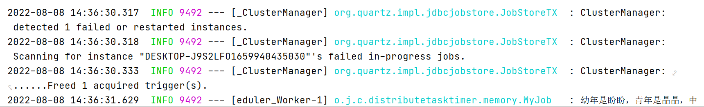

# 定时组件

## Linux Crotab

## Spring Task 不支持集群

## Timer 基于堆 

### 定义： 堆是一种**完全二叉树** ，**左右节点大小限制**，用数组存储 

### 分类： 最大堆（大顶堆）或最小堆 （小顶堆）

* 插入  插入位置为完全二叉树的最大的位置， 要插入的元素向上渗透
* 删除 取出（删除）栈顶元素，将尾部元素放在堆顶并下沉

### java.util.Timer

* 任务调度基于绝对时间，对系统时间敏感
* 取任务是比较高频的操作，当任务比较多的时候，顶堆消耗性能

```
currentTime = System.currentTimeMillis();
executionTime = task.nextExecutionTime;
if (taskFired = (executionTime<=currentTime)) {
    if (task.period == 0) { // Non-repeating, remove
        queue.removeMin();
        task.state = TimerTask.EXECUTED;
    } else { // Repeating task, reschedule
        queue.rescheduleMin(
          task.period<0 ? currentTime   - task.period
                        : executionTime + task.period);
    }
}
```

```public class timedemo {
public class TimeDemo {
    public static void main(String[] args) {
        //任务队列启动
        //mainLoop
        Timer timer = new Timer();
        for (int i = 0; i < 2; i++) {
            TimerTask timerTask = new MyTimerTask("A" + i);
            //预设的执行时间nextExecutionTime
            //executionTime + task.period 严格按照预设时间 可能会导致执行时间混乱
            timer.scheduleAtFixedRate(timerTask,new Date(),2000);
            //currentTime + task.period 取决与于上一个任务执行的执行时间 可能会丢失任务
//            timer.schedule(timerTask,new Date(),2000);
            
        }
    }

}

//TimerTask implements Runnable
class MyTimerTask extends TimerTask {

    private String name;

    public MyTimerTask(String name) {
        this.name = name;
    }

    @SneakyThrows
    @Override
    public void run() {
        System.out.println(name+"startDate="+new Date());
        Thread.sleep(3000);
        System.out.println(name+"endDate="+new Date());
    }
}
```

由于task.run()是单线程 任务堵塞 任务超时

解决方案在MyTimerTask中启用线程池

```
public class ThreadPoolTimerDemo {
    public static void main(String[] args) {
        ScheduledThreadPoolExecutor poolExecutor = new ScheduledThreadPoolExecutor(2);
        for (int i = 0; i < 2; i++) {
            poolExecutor.scheduleAtFixedRate(new MyTimerTask2("A"+i),0,2,TimeUnit.SECONDS);

        }
    }
}


class MyTimerTask2 extends TimerTask {

    private String name;

    public MyTimerTask2(String name) {
        this.name = name;
    }

    @SneakyThrows
    @Override
    public void run() {
        System.out.println(name+"startDate="+new Date());
        Thread.sleep(4000);
        System.out.println(name+"endDate="+new Date());
    }
}
```

leader-follow模式

一堆待执行的任务（存放在排好序的队列），所有的工作线程中只有一个是leader线程，其他的是follower线程，只有leader线程能执行任务，其他的处于休眠状态。当leader拿到任务后，自己变成follower同时选出新leader，然后再取执行任务。避免没必要的唤醒和堵塞操作。

###  binary search tree bst 左<根<右

### Outer.this.property 

* 内部类访问外部类属性或方法
* cannot be referenced from a static context（必须在非static class and method中声明）

### 为了区分局部变量和实例变量 this不可省略（构造中为了可读性不省略）

# 时间轮算法 quarter

对timer而言，取任务是比较高频的操作，当任务比较多的时候，顶堆消耗性能

* 数组+链表 

  while-true-sleep

  遍历数组，每个下标放置一个链表，链表节点放置任务，遍历到了就取出执行

* round时间轮
  解决上一种方式的扩展困难的问题

  在此基础上，每个任务记录一个round,遍历到了就round-1,为0时取出执行.需要遍历所有任务多次，效率不高

* 分层时间轮

  使用多个不同时间维度的轮：月轮(几号执行)，天轮(几点执行)...

  月轮遍历到了，将任务取出放入到天轮

## QUARTZ HelloWorld

<dependency>
    <groupId>org.quartz-scheduler</groupId>
    <artifactId>quartz</artifactId>
    <version>2.3.2</version>
</dependency>

```
//创建一个scheduler
Scheduler scheduler = StdSchedulerFactory.getDefaultScheduler();

//创建一个Trigger
Trigger trigger = TriggerBuilder.newTrigger()
        .withIdentity("trigger1", "group1")
        .withSchedule(SimpleScheduleBuilder.simpleSchedule().withIntervalInSeconds(3)
                .repeatForever()).build();
trigger.getJobDataMap().put("t2", "tv2");

//创建一个job
//在job类中，不应该定义有状态的数据属性，因为在job的多次执行中，这些属性的值不会保留。
//一个Job类可以关联多个JobDetail实例
JobDetail job = JobBuilder.newJob(HelloJob.class)
        .usingJobData("j1", "jv1")
        .usingJobData("moon","曾经跨过山和大海")
        .withIdentity("myjob", "mygroup").build();
job.getJobDataMap().put("j2", "jv2");

//绑定job,trigger并启动scheduler
scheduler.scheduleJob(job,trigger);
scheduler.start();
```

```
public class HelloJob implements Job {
    @Override
    public void execute(JobExecutionContext context) throws JobExecutionException {
    //如果你使用的是持久化的存储机制（本教程的JobStore部分会讲到），在决定JobDataMap中存放什么数据的时候需要小心，因为JobDataMap中存储的对象都会被序列化，因此很可能会导致类的版本不一致的问题
    //context.getMergedJobDataMap()是JobDetail中的JobDataMap和Trigger中的JobDataMap的并集，但是如果存在相同的数据，则后者会覆盖前者的值。
        JobDataMap jobDataMap = context.getJobDetail().getJobDataMap();
        System.out.println(jobDataMap.getString("moon"));
    }
}
```

## 细节


### trigger

* forJob: indicate the bounded job with jobKey

* withSchedule(dailyAtHourAndMinute(9, 30)) execute job daily at 9:30

* modifiedByCalendar("holidy")

  ```
  WeeklyCalendar holiday=new WeeklyCalendar();
  holiday.setDayExcluded(Calendar.THURSDAY,true);
  scheduler.addCalendar("holiday",holiday,false,false);
  ```

#### SimpleTrigger

在具体的时间点执行一次，或者在具体的时间点执行，并且以指定的间隔重复执行若干次. 开始时间、结束时间、重复次数以及重复的间隔.重复的间隔，必须是0，或者long型的正数，表示毫秒。**当是0时以scheduler可以处理的近似并发数**。endTime属性的值会覆盖设置重复次数的属性值endTime属性的值会覆盖设置重复次数的属性值，所以可以将重复次数设置的很大

misfire策略，错过job后的策略

MISFIRE_INSTRUCTION_IGNORE_MISFIRE_POLICY MISFIRE_INSTRUCTION_FIRE_NOW MISFIRE_INSTRUCTION_RESCHEDULE_NOW_WITH_EXISTING_REPEAT_COUNT MISFIRE_INSTRUCTION_RESCHEDULE_NOW_WITH_REMAINING_REPEAT_COUNT MISFIRE_INSTRUCTION_RESCHEDULE_NEXT_WITH_REMAINING_COUNT MISFIRE_INSTRUCTION_RESCHEDULE_NEXT_WITH_EXISTING_COUNT

默认Trigger.MISFIRE_INSTRUCTION_SMART_POLICY相当于withMisfireHandlingInstructionFireNow

#### CronTrigger

比SimpleTrigger更好的基于日历的概念

* cron expressions

  1. Seconds
  2. Minutes
  3. Hours
  4. Day-of-Month
  5. Month
  6. Day-of-Week
  7. Year (optional field)

  上述自表达式用空格隔开

  second 是最小单位 `* * * * * *`表示每s执行一次

    “0 0 12？* WED“ - 这意味着”每个星期三下午12:00“

  分钟 0/15 0,15都表示从0开始每隔15分钟

  *每个可能的值（枚举）

  ？表示无特定值的日期和星期几 表达式中只有1个?

  L

  * 月 月末
  * 周 7或SAT
  * 6L 或 FRIL本月最后一个周五

  W 指定最近给定日期的工作日（星期一至星期五） 15W表示最近15日的工作日

  “6＃3”或“FRI＃3” 本月的第3个星期5

* ```
  MISFIRE_INSTRUCTION_FIRE_ONCE_NOW
  MISFIRE_INSTRUCTION_DO_NOTHING
  ```

### Listeners

TriggerListener

JobListener

schedulerListeners 添加job/触发器，删除job/触发器，调度程序中的严重错误，关闭调度程序的通知等

scheduler.getListenerManager().addJobListener(myJobListener，KeyMatcher.jobKeyEquals(new JobKey("myJobName"，"myJobGroup"))

scheduler.getListenerManager().removeSchedulerListsenr(mySchedListener)

### JobStore

负责跟踪提供给调度程序的所有“工作数据”：jobs，triggers，日历等

通过配置指定使用哪个JobStore而非直接使用JobStore实例

* RAMJobStore 最简单的JobStore，它也是性能最高的(在内存) 默认

  org/quartz/quartz.properties

  org.quartz.jobStore.class = org.quartz.simpl.RAMJobStore

* JDBCStore

  通过JDBC将其所有数据保存在数据库中

  class:jobStoreTx

  useProperties:true

  tablePrefix:QRTZ_

  org.quartz.jobStore.driverDelegateClass =org.quartz.impl.jdbcjobstore.StdJDBCDelegate
  org.quartz.jobStore.dataSource = myDS（myDS已经在其他配置属性定义）

  org.quartz.dataSource.myDS.driver=

  执行下载包里自带的建表脚本


# 与springboot 整合

1. Quartz 存储方式有两种：MEMORY 和 JDBC。默认是内存形式维护任务信息
2. Quartz 提供了单机版和集群版，默认就是单机版


# MEMORY

1. 定义Job类

   ```
   @Slf4j
   public class MyJob extends QuartzJobBean {
       //具体要执行的任务
       @Override
       protected void executeInternal(JobExecutionContext context) throws JobExecutionException {
           log.info("幼年是盼盼，青年是晶晶，中年是冰墩墩，生活见好逐渐发福");
       }
   }
   ```

2. 定义JobDetail和对应trigger

   ```
   @Configuration
   public class QuartzConfig {
       @Bean
       public JobDetail jobDetail() {
   //        System.out.println(EmbeddedDatabaseConfiguration.class.getSimpleName());
   //        System.out.println("=======================");
           return JobBuilder.newJob(MyJob.class)
                   // 指定任务的名称
                   .withIdentity("myJob")
                   // 任务描述
                   .withDescription("任务描述：用于输出冬奥欢迎语")
                   // 每次任务执行后进行存储
                   //Jobs added with no trigger must be durable
                   .storeDurably()
                   .build();
       }
   
   
       @Bean
       public Trigger trigger() {
           //创建触发器
           return TriggerBuilder.newTrigger()
                   // 绑定工作任务
                   .forJob(jobDetail())
                   // 每隔 5 秒执行一次 job
                   .withSchedule(CronScheduleBuilder.cronSchedule("40 39 11 * * ?"))
                   .build();
       }
   }
   ```


# JDBC


## 下载sql

 http://www.quartz-scheduler.org/downloads/

解压缩后 执行 quartz-xxx.SNAPSHOT\src\org\quartz\impl\jdbcjobstore\tables_mysql.sql

```mysql
｜qrtz_blob_triggers       |
| qrtz_calendars           |
| qrtz_cron_triggers       |
| qrtz_fired_triggers      |
| qrtz_job_details         |
| qrtz_locks               |
| qrtz_paused_trigger_grps |
| qrtz_scheduler_state     |
| qrtz_simple_triggers     |
| qrtz_simprop_triggers    |
| qrtz_triggers
```

## 导入依赖

```
<dependency>
    <groupId>org.springframework.boot</groupId>
    <artifactId>spring-boot-starter-quartz</artifactId>
</dependency>
<dependency>
    <groupId>mysql</groupId>
    <artifactId>mysql-connector-java</artifactId>
    <version>8.0.18</version>
</dependency>
<dependency>
    <groupId>com.mchange</groupId>
    <artifactId>c3p0</artifactId>
    <version>0.9.5.4</version>
</dependency>
```

## 配置

### spring 配置

通过org.quartz-scheduler:quartz
官方配置  (http://www.quartz-scheduler.org/documentation/quartz-2.3.0/configuration/)

```
 推荐配置   #========================================================================#

#                                 主配置                                 #

#========================================================================#
#调度器实例名称——用于在同一程序中使用多个实例时区分调度器#
#集群中同一调度器名称必须一致#
org.quartz.scheduler.instanceName
#调度器唯一，可以使用AUTO自动生成ID#
org.quartz.scheduler.instanceId
#可以实现InstanceIdGenerator接口，指定生成ID策略(instanceId需为AUTO)#
org.quartz.scheduler.instanceIdGenerator.class
#调度程序线程名称#
org.quartz.scheduler.threadName
#调度程序是否以守护线程运行#
org.quartz.scheduler.makeSchedulerThreadDaemon
#使用的JobFactory的类名#
org.quartz.scheduler.jobFactory.class
#调度程序节点一次允许获取(用于触发)的最大触发器数量#
org.quartz.scheduler.batchTriggerAcquisitionMaxCount
#========================================================================#

#                                线程池配置                              #

#========================================================================#
#使用的线程池实现的名称#
org.quartz.threadPool.class=org.quartz.simpl.SimpleThreadPool
#线程数#
org.quartz.threadPool.threadCount
#线程优先级，默认为5#
org.quartz.threadPool.threadPriority
#========================================================================#

#                             全局监视器配置                             #

#========================================================================#
org.quartz.triggerListener.NAME.class
org.quartz.triggerListener.NAME.propName
org.quartz.triggerListener.NAME.prop2Name
org.quartz.jobListener.NAME.class
org.quartz.jobListener.NAME.propName
org.quartz.jobListener.NAME.prop2Name
#========================================================================#

#                             RAMJobStore配置                            #

#========================================================================#
#将调度程序的JobStore设置为RAMJobStore#
org.quartz.jobStore.class=org.quartz.simpl.RAMJobStore
#RAMJobStore可以通过下面属性进行调优#
#调度程序将容忍触发器通过下一次触发时间的毫秒数，然后才被认为是未触发，默认60000#
org.quartz.jobStore.misfireThreshold
#========================================================================#

#                           JDBC-JobStoreTX配置                          #

#========================================================================#
#驱动程序代表理解不同数据库系统的特定方言，许多数据库使用StdJDBCDelegate#
org.quartz.jobStore.driverDelegateClass=org.quartz.impl.jdbcjobstore.StdJDBCDelegate
#配置属性文件中定义的数据源的名称#
org.quartz.jobStore.dataSource
#Quartz表的前缀#
org.quartz.jobStore.tablePrefix
#JobDataMaps中的所有值都是字符串#
org.quartz.jobStore.useProperties
#调度程序将容忍触发器通过下一次触发时间的毫秒数，然后才被认为是未触发，默认60000#
org.quartz.jobStore.misfireThreshold
#是否为集群。如果多个Quartz实例使用同一数据库，必须为true，否则会造成严重破坏#
org.quartz.jobStore.isClustered
#此实例与集群的其他实例签入的频率(毫秒)。影响检测失败实例的速度#
org.quartz.jobStore.clusterCheckinInterval
#为true时Quartz在从数据源获得的连接上不要调用setAutoCommit(false)#
org.quartz.jobStore.dontSetAutoCommitFalse
#SQL字符串，它选择LOCKS表中的一行，并在该行上放置一个锁#
#默认SELECT * FROM {0}LOCKS WHERE SCHED_NAME = {1} AND LOCK_NAME = ?#
#{0}：TABLE_PREFIX {1}：调度程序的名称
org.quartz.jobStore.selectWithLockSQL
#为true时Quartz在JDBC连接上调用setTransactionIsolation(Connection.TRANSACTION_SERIALIZABLE)#
org.quartz.jobStore.txIsolationLevelSerializable
#========================================================================#

#                            DataSources配置                             #

#========================================================================#
#数据库JDBC驱动程序类#
org.quartz.dataSource.NAME.driver
#连接quartz数据库的url#
org.quartz.dataSource.NAME.URL
#用户名#
org.quartz.dataSource.NAME.user
#密码#
org.quartz.dataSource.NAME.password
#数据源创建的最大连接数#
org.quartz.dataSource.NAME.maxConnections
```

### springboot参数配置

通过org.springframework.boot:spring-boot-starter-quartz

spring.datasource.driver-class-name=com.mysql.jdbc.Driver
spring.datasource.url=jdbc:mysql://localhost:3306/quartz?characterEncoding=utf8&serverTimezone=UTC
spring.datasource.username=root
spring.datasource.password=151310

spring.quartz.properties.org.quartz.scheduler.instanceName=DefaultQuartzScheduler
spring.quartz.properties.org.quartz.scheduler.instanceId=AUTO
spring.quartz.properties.org.quartz.scheduler.rmi.export=false
spring.quartz.properties.org.quartz.scheduler.rmi.proxy=false


spring.quartz.job-store-type=jdbc

spring.quartz.properties.org.quartz.jobStore.class=org.quartz.impl.jdbcjobstore.JobStoreTX
spring.quartz.properties.org.quartz.jobStore.driverDelegateClass=org.quartz.impl.jdbcjobstore.StdJDBCDelegate
spring.quartz.properties.org.quartz.jobStore.tablePrefix=QRTZ_
spring.quartz.properties.org.quartz.jobStore.isClustered=false
spring.quartz.properties.org.quartz.jobStore.useProperties=false
spring.quartz.properties.org.quartz.jobStore.misfireThreshold=60000
spring.quartz.properties.org.quartz.threadPool.class=org.quartz.simpl.SimpleThreadPool
spring.quartz.properties.org.quartz.threadPool.threadCount=10
spring.quartz.properties.org.quartz.threadPool.threadPriority=5
spring.quartz.properties.org.quartz.threadPool.threadsInheritContextClassLoaderOfInitializingThread=true


spring.quartz.properties.org.quartz.dataSource.myDS.URL=jdbc:mysql:///quartz?characterEncoding=utf8&serverTimezone=UTC
spring.quartz.properties.org.quartz.dataSource.myDS.user=root
spring.quartz.properties.org.quartz.dataSource.myDS.password=151310
spring.quartz.properties.org.quartz.dataSource.myDS.driver=com.mysql.jdbc.Driver
spring.quartz.properties.org.quartz.dataSource.myDS.maxConnections=5

```
spring:
  quartz:
    job-store-type: jdbc
    jdbc:
      # 设置每次启动项目是否重建表结构，并且清空里面的数据
      initialize-schema: never
    scheduler-name: testScheduler
    properties:
      org:
        quartz:
          scheduler:
            # Schedule调度器的实体名字 默认QuartzScheduler
            instanceName: DefaultQuartzScheduler
            # 生成intanceId的时候可以设置为AUTO
            # 从系统属性org.quartz.scheduler.instanceId取值时可以设置为SYS_PROP
            #默认 NON_CLUSTERED
            instanceId: AUTO
            rmi:
              export: false
              proxy: false
          jobStore:
            # 管理事务
            # If you need Quartz to work along with other transactions,you should use JobStoreCMT - in which case Quartz will let the app server container manage the transactions.
            class: org.quartz.impl.jdbcjobstore.JobStoreTX
            # The DriverDelegate is responsible for doing any JDBC work that may be needed for your specific database
            # 屏蔽db之间的差异
            driverDelegateClass: org.quartz.impl.jdbcjobstore.StdJDBCDelegate
            tablePrefix: QRTZ_
            # 使用的数据源名称 与后面配置的dataSouce对应
            dataSource:  myDS
            isClustered: false
            # whether JobDataMaps的数据全部是String
            useProperties: false
            misfireThreshold: 60000
          dataSource:
            myDS:
#              type: com.alibaba.druid.pool.DruidDataSource
              URL: jdbc:mysql://localhost:3306/quartz?characterEncoding=utf8&useSSL=false&serverTimezone=UTC&rewriteBatchedStatements=true
              user: root
              password: 123456
              driver: com.mysql.cj.jdbc.Driver
              maxConnections: 5

```

* 最近版本（忽略spring.quartz.properties.*）

```
#数据库链接
spring.datasource.driver-class-name=com.mysql.cj.jdbc.Driver
spring.datasource.username=root
spring.datasource.password=123456
spring.datasource.url=jdbc:mysql://localhost:3306/quartz?characterEncoding=utf8&useSSL=false&serverTimezone=UTC&rewriteBatchedStatements=true
#quartz配置
spring.quartz.job-store-type=jdbc
spring.quartz.jdbc.initialize-schema=always
spring.quartz.scheduler-name=testScheduler

server.port=8080
```


### FactoryBean:

Interface to be implemented by objects used within a BeanFactory which(修饰Objects) are themselves factories for individual objects. If a bean implements this interface, it is used as a factory for an object to expose, not directly as a bean instance that will be exposed itself.

暴露的是一个对象工厂而不是bean实例本身

NB: A bean that implements this interface **cannot be used as a normal bean**. A FactoryBean is defined in a bean style, but the object exposed for bean references (getObject()) is always the object that it creates.
FactoryBeans can support singletons and prototypes, and can either create objects lazily on demand or eagerly on startup. The SmartFactoryBean interface allows for exposing more fine-grained behavioral metadata.

SmartFactoryBean =FactoryBean+isPrototype()+ isEagerInit()


This interface is heavily used within the framework itself, for example for the AOP org.springframework.aop.framework.ProxyFactoryBean or the org.springframework.jndi.JndiObjectFactoryBean. It can be used for custom components as well; however, this is only common for infrastructure(基础设施) code.
FactoryBean is a programmatic contract. Implementations are not supposed to rely on（依靠） annotation-driven injection or other reflective facilities. **getObjectType() getObject() invocations may arrive early in the bootstrap proces**s, even ahead of any post-processor setup. If you need access to other beans, implement BeanFactoryAware and obtain them programmatically.

FactoryBean  的实现不能通过注解或者其他反射功能

The container is only responsible for managing the lifecycle of the FactoryBean instance, not the lifecycle of the objects created by the FactoryBean. Therefore, a destroy method on an exposed bean object (such as java.io.Closeable.close() will not be called automatically. Instead, a FactoryBean should implement DisposableBean and delegate any such close call to the underlying object.
Finally, FactoryBean objects participate in the containing BeanFactory's synchronization of bean creation. There is usually no need for internal synchronization other than for purposes of lazy initialization within the FactoryBean itself (or the like).
Since:
08.03.2003
See Also:
BeanFactory, org.springframework.aop.framework.ProxyFactoryBean, org.springframework.jndi.JndiObjectFactoryBean
Author:
Rod Johnson, Juergen Hoeller
Type parameters:
<T> – the bean type

```
@Configuration
public class QuartzConfig {

    @Autowired
    private JobFactory jobFactory;

    @Autowired
    private AutowireCapableBeanFactory capableBeanFactory;

    /**
     * 当触发器触发时，与之关联的任务被Scheduler中配置的JobFactory实例化，也就是每触发一次，就会创建一个任务的实例化对象
     * (如果缺省)则调用Job类的newInstance方法生成一个实例
     * (这里选择自定义)并将创建的Job实例化交给IoC管理
     * @return
     */
    @Bean
    public JobFactory jobFactory(){
        return new AdaptableJobFactory() {
            @Override
            protected Object createJobInstance(TriggerFiredBundle bundle) throws Exception {
                Object jobInstance = super.createJobInstance(bundle);
                capableBeanFactory.autowireBean(jobInstance);
                return jobInstance;
            }
        };
    }

    @Bean
    public SchedulerFactoryBean schedulerFactoryBean(){
        SchedulerFactoryBean schedulerFactoryBean = new SchedulerFactoryBean();
        schedulerFactoryBean.setJobFactory(jobFactory);
        //延迟启动
        schedulerFactoryBean.setStartupDelay(1);
//        schedulerFactoryBean.setConfigLocation(new ClassPathResource("/quartz.properties"));
        return schedulerFactoryBean;
    }

    @Bean
    public Scheduler scheduler(){
        return schedulerFactoryBean().getScheduler();
    }


}
```


## 创建任务

任务跟MEMORY相同或者向以下一样手动添加


```
public class HelloJob extends QuartzJobBean {
    @Override
    protected void executeInternal(JobExecutionContext context) throws JobExecutionException {
        System.out.println(DateTime.now().toString("yyyy-MM-dd HH:mm:ss")+"Hello world");
    }
}
```

## 创建service

```
public interface QuartzService {
    void addJob(String job,String jobGroup
            ,String trigger,String triggerGroup,String cron) throws SchedulerException;
}
```

## 创建实现

```
@Service
public class QuartzServiceImpl implements QuartzService{
    @Autowired
    private Scheduler scheduler;

    @Override
    public void addJob(String job, String jobGroup, String trigger, String triggerGroup, String cron) throws SchedulerException {
        JobDetail jobDetail = JobBuilder.newJob(HelloJob.class)
                .withIdentity(job, jobGroup)
                .build();

        CronTrigger cronTrigger = TriggerBuilder.newTrigger()
                .withIdentity(trigger, triggerGroup)
                .withSchedule(CronScheduleBuilder.cronSchedule(cron))
                .build();

        scheduler.scheduleJob(jobDetail,cronTrigger);
        scheduler.start();
    }
}
```

## 创建测试controller


```
@RestController
public class QuartzController {
    @Autowired
    private QuartzService quartzService;

    @RequestMapping("/insert")
    public String insert(String job, String jobGroup, String trigger, String triggerGroup, String cron) throws SchedulerException {
        quartzService.addJob(job, jobGroup,  trigger, triggerGroup,  cron);
        return "添加成功";
    }
}
```


# 集群

1. spring.quartz.properties.org.quartz.jobStore.isClustered=true

2. spring.quartz.properties.org.quartz.scheduler.instanceName=DefaultQuartzScheduler

   注意 Quartz 使用同一组数据库表作集群时，只需要配置相同的 instanceName 实例名称就可以

3. 为了方便启动多实例验证server.port=${random.int[10000,19999]}

4. 启动多个实例

   allow parallel run 

此时APP1运行定时任务,APP2无

停掉APP1,发现APP2开始运行




