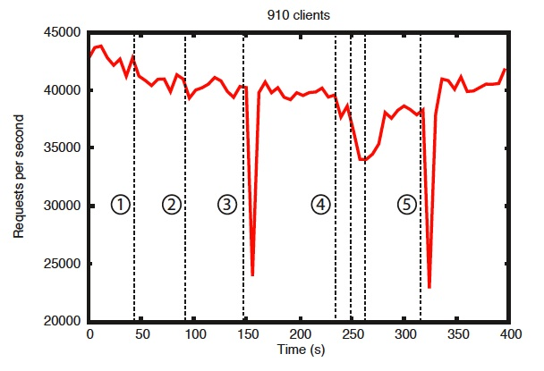
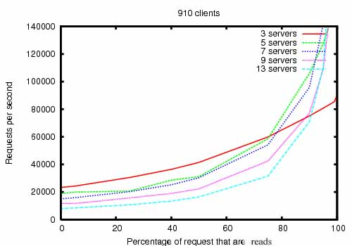
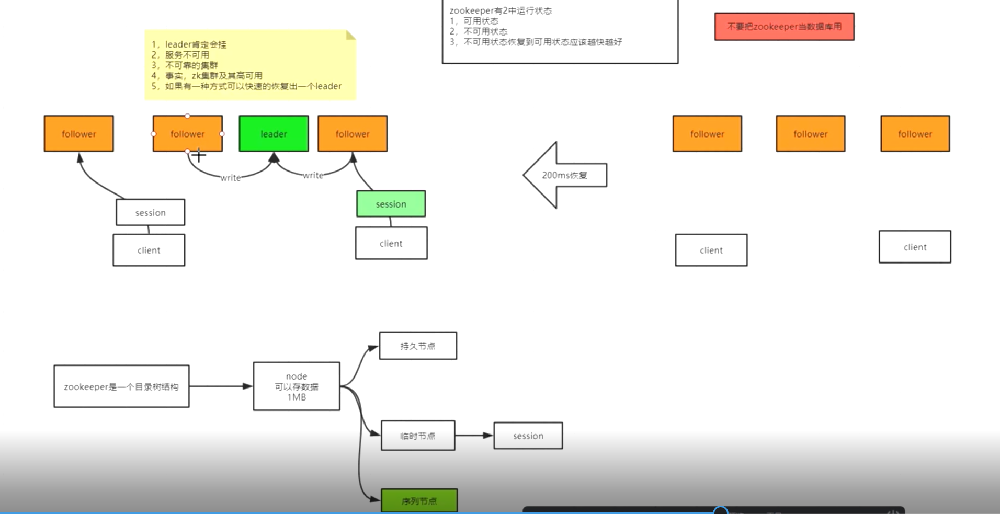
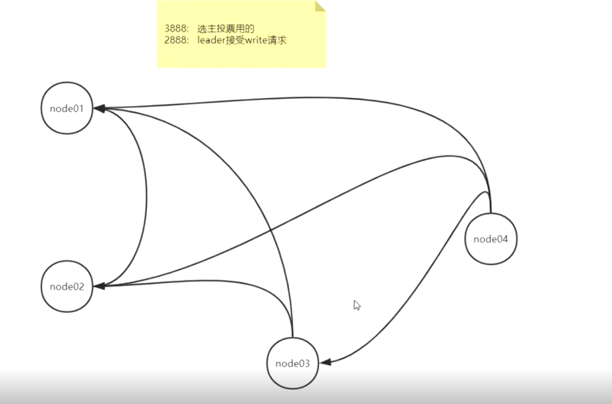
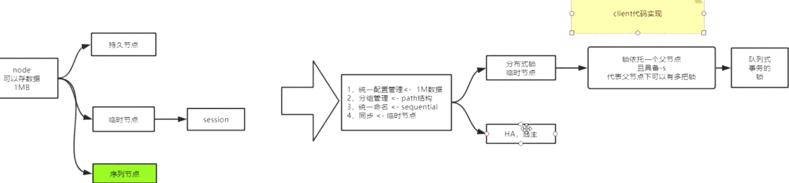
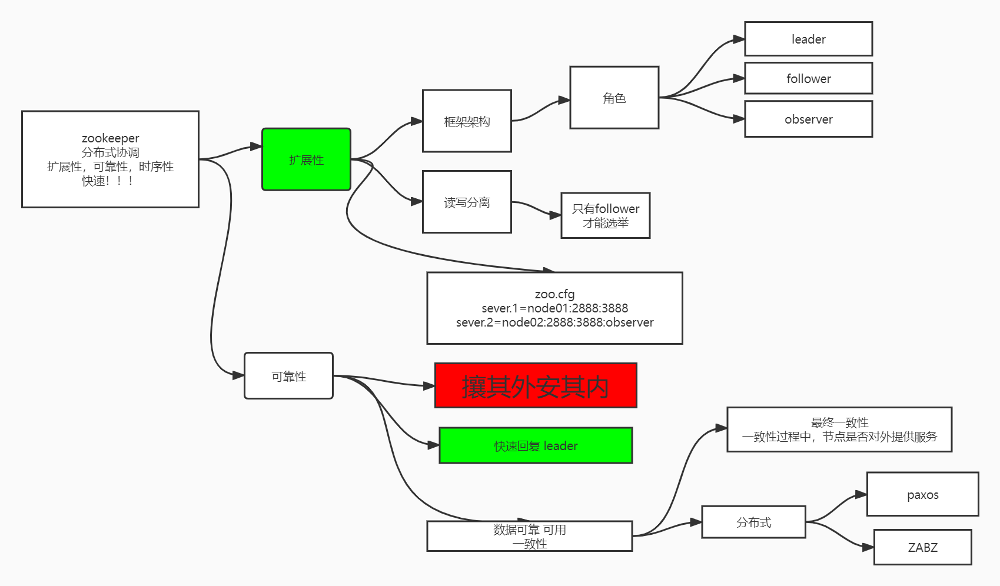
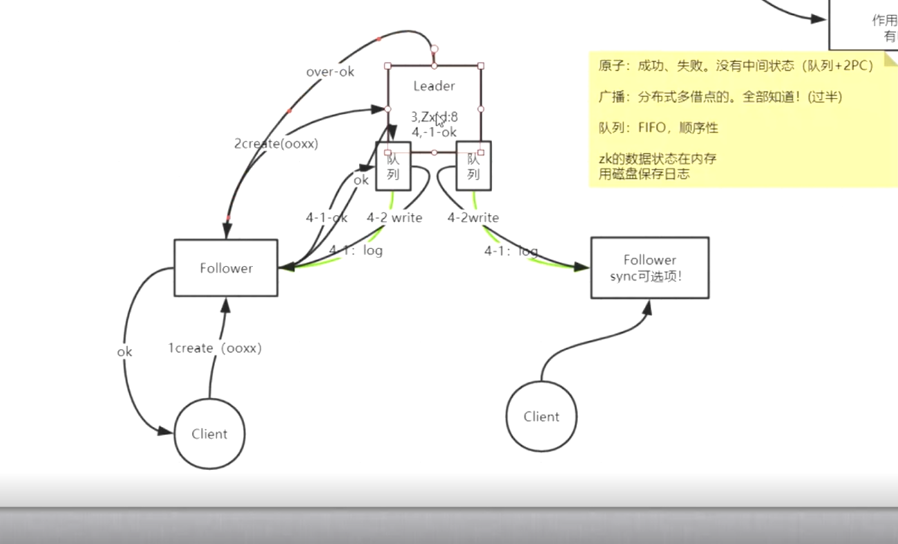
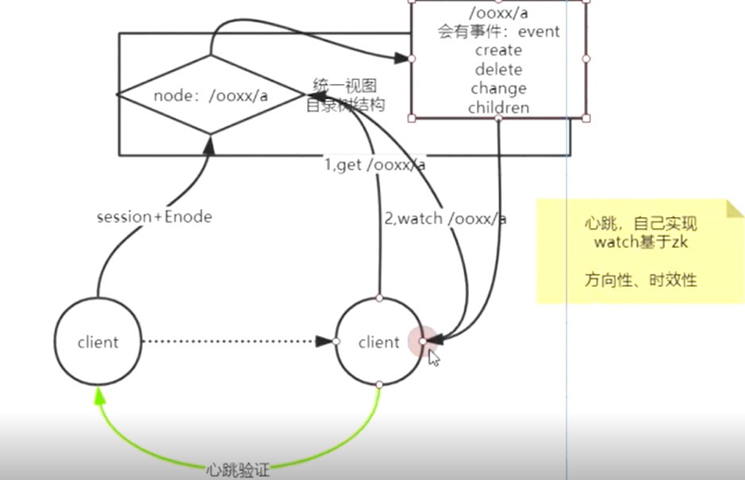
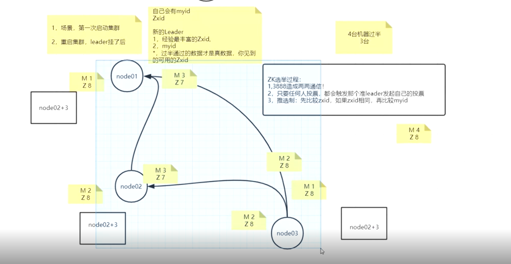
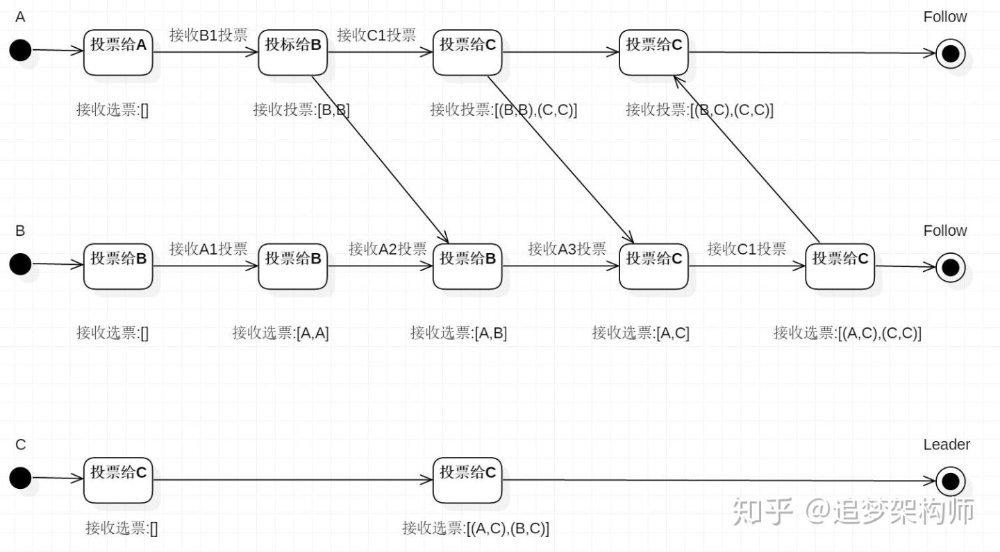

# 介绍&安装

A Distributed Coordination Service for Distributed Applications

1. The namespace provided by ZooKeeper is much like that of a standard file system

2. 主从复制

   

   

假设leader挂掉->服务就会不可用->不可靠的集群

事实,zk集群及其高可用->有一种方式可以快速恢复



3,5 leader失败后快速恢复


3. 读写分离 且读越多性能越高

   

   

   

4. 节点

   zk是个目录树->节点->持久节点&临时节点(session) 两者都支持序列化

   不要把zk当作数据库使用(一般每个节点存储不超过1M,对外提供快速服务,减少网络带宽和通信时延)

5. 保证
   1. 顺序一致性(写) 主从模型-leader单机通过排队轻松实现
   2. 原子性 最终一致性而非强一致性
   3. 单系统镜像 主从模型同步
   4. 可靠性 持久化
   5. 及时性 最终一致性




## 实例

1. 创建当前快照，转到虚拟机初始化状态（保证有jdk），并据此快照完整克隆3台主机

   vi /etc/sysconfig/network-scripts/ifcfg-ens33

   修改ip为192.168.162.151~154 

   source&重启查看是否生效

2. 安装zk

   wget https://www.apache.org/dyn/closer.lua/zookeeper/zookeeper-3.7.1/apache-zookeeper-3.7.1-bin.tar.gz

   **以下均为3.7.1版本结果**

3. cp zoo_sample.cfg zoo.cfg

4. 修改配置文件

   ```
   dataDir=/var/zookeeper
   
   server.1=zk_node01:2888:3888
   server.2=zk_node02:2888:3888
   server.3=zk_node03:2888:3888
   server.4=zk_node04:2888:3888
   ```

5. scp分发

   scp -r /opt/apache-zookeeper-3.7.1-bin/ root@zk_node02:`pwd`   此时的目录路径是/opt

6. 新建myid

   mkdir -p /var/zookeeper
   echo 1 > /var/zookeeper/myid 

   同样的把其他主机的myid同样配置好

7. 配置zk环境变量

8. node1->4依次启动，由于3个就可以投票选举leader（2个 looking），所以id最大的node3是leader,后面启动的4自动变成follower

   zkServer.sh start-foreground

   zkServer.sh status

   node1->3启动会报Connection refused (Connection refused)

9. 停止node3 此时node4会被选举为new leader


问题：ssh: Could not resolve hostname zk_node02: Name or service not known
解决： 
在/etc/hosts配置好主机名和ip的映射，并分发到其他主机
scp /etc/hosts root@zk_node02:/etc/





# 配置文件详解

### 最低配置

| 参数名                                | 默认    | 描述                                                         |
| ------------------------------------- | ------- | ------------------------------------------------------------ |
| clientPort                            |         | 服务的监听端口                                               |
| dataDir                               |         | 用于存放内存数据快照的文件夹，同时用于集群的myid文件也存在这个文件夹里 |
| tickTime                              | 2000    | Zookeeper的时间单元。**Zookeeper中所有时间都是以这个时间单元的整数倍去配置的。**例如，session的最小超时时间是2*tickTime。（单位：毫秒） |
| **dataLogDir**                        |         | 事务日志写入该配置指定的目录，而不是“ dataDir ”所指定的目录。这将允许使用一个专用的日志设备并且帮助我们避免日志和快照之间的竞争 |
| globalOutstandingLimit                | 1000    | 最大请求堆积数。默认是1000。Zookeeper运行过程中，尽管Server没有空闲来处理更多的客户端请求了，但是还是允许客户端将请求提交到服务器上来，以提高吞吐性能。当然，为了防止Server内存溢出，这个请求堆积数还是需要限制下的。 |
| preAllocSize                          | 64M     | 预先开辟磁盘空间，用于后续写入事务日志。默认是64M，每个事务日志大小就是64M。如果ZK的快照频率较大的话，建议适当减小这个参数。 |
| snapCount                             | 100,000 | 每进行snapCount次事务日志输出后，触发一次快照， 此时，Zookeeper会生成一个snapshot.*文件，同时创建一个新的事务日志文件log.*。默认是100,000. |
| raceFile                              |         | 用于记录所有请求的log，一般调试过程中可以使用，但是生产环境不建议使用，会严重影响性能。 |
| maxClientCnxns                        | 10      | 最大并发客户端数，用于防止DOS的，默认值是10，设置为0是不加限制 |
| clientPortAddress / maxSessionTimeout |         | 对于多网卡的机器，可以为每个IP指定不同的监听端口。默认情况是所有IP都监听 clientPort 指定的端口 |
| minSessionTimeout                     |         | Session超时时间限制，如果客户端设置的超时时间不在这个范围，那么会被强制设置为最大或最小时间。默认的Session超时时间是在2 *  tickTime ~ 20 * tickTime 这个范围 |
| fsync.warningthresholdms              | 1000ms  | 事务日志输出时，如果调用fsync方法超过指定的超时时间，那么会在日志中输出警告信息。默认是1000ms。 |
| autopurge.snapRetainCount             |         | 参数指定了需要保留的事务日志和快照文件的数目。默认是保留3个。和autopurge.purgeInterval搭配使用 |
| autopurge.purgeInterval               |         | 在3.4.0及之后版本，Zookeeper提供了自动清理事务日志和快照文件的功能，这个参数指定了清理频率，单位是小时，需要配置一个1或更大的整数，默认是0，表示不开启自动清理功能 |
| syncEnabled                           |         | Observer写入日志和生成快照，这样可以减少Observer的恢复时间。默认为true。 |
|                                       |         |                                                              |
|                                       |         |                                                              |
|                                       |         |                                                              |
|                                       |         |                                                              |


### 集群选项

参数名  默认  描述

| 参数名                            | 默认   | 描述                                                         |
| --------------------------------- | ------ | ------------------------------------------------------------ |
| electionAlg                       |        | 之前的版本中， 这个参数配置是允许我们选择leader选举算法，但是由于在以后的版本中，只有“FastLeaderElection ”算法可用，所以这个参数目前看来没有用了。 |
| initLimit                         | 10**** | **Observer和Follower启动时，从Leader同步最新数据时，Leader允许initLimit * tickTime的时间内完成**。如果同步的数据量很大，可以相应的把这个值设置的大一些。 |
| leaderServes                      | yes    | 默 认情况下，Leader是会接受客户端连接，并提供正常的读写服务。但是，如果你想让Leader专注于集群中机器的协调，那么可以将这个参数设置为 no，这样一来，会大大提高写操作的性能。一般机器数比较多的情况下可以设置为no，让Leader不接受客户端的连接。默认为yes |
| server.x=[hostname]:nnnnn[:nnnnn] |        | **“x”是一个数字，与每个服务器的myid文件中的id是一样的。hostname是服务器的hostname，右边配置两个端口，第一个端口用于Follower和Leader之间的数据同步和其它通信，第二个端口用于Leader选举过程中投票通信**。 |
| syncLimit                         |        | 表示Follower和Observer与Leader交互时的最大等待时间，只不过是**在与leader同步完毕之后，进入正常请求转发或ping等消息交互时的超时时间** |
| group.x=nnnnn[:nnnnn]             |        | “x”是一个数字，与每个服务器的myid文件中的id是一样的。对机器分组，后面的参数是myid文件中的ID |
| weight.x=nnnnn                    |        | “x”是一个数字，与每个服务器的myid文件中的id是一样的。机器的权重设置，后面的参数是权重值 |
| cnxTimeout                        | 5s     | 选举过程中打开一次连接的超时时间，默认是5s                   |
| standaloneEnabled                 |        | 当设置为false时，服务器在复制模式下启动                      |
|                                   |        | https://blog.csdn.net/qianshangding0708/article/details/50067483 |


认证和授权选项
只有在3.2之后才支持。

参数名

默认

描述

 

zookeeper.DigestAuthenticationProvider.superDigest

disabled	启用超级管理员的用户去访问znode.
可 以使用org.apache.zookeeper.server.auth.DigestAuthenticationProvider来生成一个 superDigest，参数格式为："super:<password>"，一旦当前连接addAuthInfo超级用户验证通过，后续所 有操作都不会checkACL。
实验选项/功能
Read Only Mode Server
    (java系统属性: readonlymode.enabled)
    在3.4.0之后支持，设置这个值为true，就支持只读模式。
不安全选项
以下的变量都是非常有用的，但是使用的时候还是要注意。

参数名

默认

描述

forceSync


该参数确定了是否需要在事务日志提交的时候调用 FileChannel .force来保证数据完全同步到磁盘。对应的java系统属性：zookeeper.forceSync

jute.maxbuffer

 	该参数只能设置为java系统属性。没有zookeeper前缀。它指定了Znode可以存储最大的数据量的大小。默认是1M。如果要改变该配置，就必须在所有服务器和客户端中设置。
skipACL

 

跳过ACL检查，这样可以是Zookeeper的吞吐量增加。只是会使所有用户都有访问权限。对应的java系统属性：zookeeper.skipACL

quorumListenOnAllIPs

false

该参数设置为true，Zookeeper服务器将监听所有可用IP地址的连接。他会影响ZAB协议和快速Leader选举协议。默认是false。

性能调整选项
只有在3.5.0之后才支持。

参数名

默认

描述

zookeeper.nio.numSelectorThreads


NIO选择器的线程数量。建议使用多个选择器线程来扩大客户端的连接数，默认值是（CPU核心数/2）

 

zookeeper.nio.numWorkerThreads


NIO工作线程数。如果工作线程数设置为0，那么选择器线程就可以直接输出。默认值是（CPU核心数 * 2）

zookeeper.commitProcessor.numWorkerThreads

 

提交处理器工作线程数。如果该工作线程数设置为0，那么主线程就直接处理请求。默认是（CPU核心数）

AdminServer配置
AdminServer只有在3.5.0之后才支持。

参数名

默认

描述

admin.enableServer

true

设置为“false”禁用AdminServer。默认情况下，AdminServer是启用的。对应java系统属性是：zookeeper.admin.enableServer

admin.serverPort

8080

Jetty服务的监听端口，默认是8080。对应java系统属性是：zookeeper.admin.serverPort

admin.commandURL

"/commands"

访问路径


# zkCli 命令

```shell
addWatch [-m mode] path # optional mode is one of [PERSISTENT, PERSISTENT_RECURSIVE] - default is PERSISTENT_RECURSIVE
	addauth scheme auth
	close 
	config [-c] [-w] [-s]
	connect host:port
	create [-s] [-e] [-c] [-t ttl] path [data] [acl]
	delete [-v version] path
	deleteall path [-b batch size]
	delquota [-n|-b|-N|-B] path
	get [-s] [-w] path
	getAcl [-s] path
	getAllChildrenNumber path
	getEphemerals path
	history 
	listquota path
	ls [-s] [-w] [-R] path
	printwatches on|off
	quit 
	reconfig [-s] [-v version] [[-file path] | [-members serverID=host:port1:port2;port3[,...]*]] | [-add serverId=host:port1
:port2;port3[,...]]* [-remove serverId[,...]*]	redo cmdno
	removewatches path [-c|-d|-a] [-l]
	set [-s] [-v version] path data
	setAcl [-s] [-v version] [-R] path acl
	setquota -n|-b|-N|-B val path
	stat [-w] path
	sync path
	version 
	whoami
```

跟linux命令用法一致


1. get 

   老版除了存储的数据，还包含

   - cZxid=0x200000002

     创建节点的事务id,后32位表示步进器（即第几次操作 c,m,p），前32表示leader的纪元（第几个leader）

   - mZxid modify

   - pZxid 当前节点下最大的create事务id

     注意：sessionId的创建和销毁都会占用事务id，也就是说不仅仅zk节点是统一视图（每个客户端看到的节点数据都一致），client上的sessionId也会随着关联的follower变化而变化

2. create

   -e  ephemeral

   ephemeralOwner 0x0  表示没有临时归属 即持久节点

   ephemeralOwner sessionId 


   -s  sequence

  多个客户端写同一 个文件， file0...01  file0...02 以此类推

如果删除节点，则会创建max+1,比如之前创建了1,2 删除这些后下个文件为3


## ACL

访问控制列表ACL（Access Control List）是由一条或多条规则组成的集合。所谓规则，是指描述报文匹配条件的判断语句，这些条件可以是报文的源地址、目的地址、端口号等。

ACL本质上是一种报文过滤器，规则是过滤器的滤芯。设备基于这些规则进行报文匹配，可以过滤出特定的报文，并根据应用ACL的业务模块的处理策略来允许或阻止该报文通过。


# 概念




**200ms 选举的实现**





## paxos

一个基于消息传递的一致性算法，Leslie Lamport在1990年提出，近几年被广泛应用于分布式计算中，Google的Chubby，Apache的Zookeeper都是基于它的理论来实现的，Paxos还被认为是到目前为止唯一的分布式一致性算法，其它的算法都是Paxos的改进或简化。有个问题要提一下，Paxos有一个前提：只有在一个可信的计算环境中才能成立，这个环境是不会被入侵所破坏的。 

Paxos描述了这样一个场景，有一个叫做Paxos的小岛(Island)上面住了一批居民，岛上面所有的事情由一些特殊的人决定，他们叫做议员(Senator)。议员的总数(Senator Count)是确定的，不能更改。岛上每次环境事务的变更都需要通过一个提议(Proposal)，每个提议都有一个编号(PID)，这个编号是一直增长的，不能倒退。每个提议都需要超过半数((Senator Count)/2 +1)的议员同意才能生效。每个议员只会同意大于当前编号的提议，包括已生效的和未生效的。如果议员收到小于等于当前编号的提议，他会拒绝，并告知对方：你的提议已经有人提过了。这里的当前编号是每个议员在自己记事本上面记录的编号，他不断更新这个编号。整个议会不能保证所有议员记事本上的编号总是相同的。现在议会有一个目标：保证所有的议员对于提议都能达成一致的看法。  

好，现在议会开始运作，所有议员一开始记事本上面记录的编号都是0。（1）有一个议员发了一个提议：将电费设定为1元/度。他首先看了一下记事本，嗯，当前提议编号是0，那么我的这个提议的编号就是1，于是他给所有议员发消息：1号提议，设定电费1元/度。其他议员收到消息以后查了一下记事本，哦，当前提议编号是0，这个提议可接受，于是他记录下这个提议并回复：我接受你的1号提议，同时他在记事本上记录：当前提议编号为1。（2）发起提议的议员收到了超过半数的回复，立即给所有人发通知：1号提议生效！收到的议员会修改他的记事本，将1号提议由记录改成正式的法令，当有人问他电费为多少时，他会查看法令并告诉对方：1元/度。 

现在看冲突的解决：假设总共有三个议员S1-S3，S1和S2同时发起了一个提议:1号提议，设定电费。S1想设为1元/度, S2想设为2元/度。结果S3先收到了S1的提议，于是他做了和前面同样的操作。紧接着他又收到了S2的提议，结果他一查记事本，咦，这个提议的编号小于等于我的当前编号1，于是他拒绝了这个提议：对不起，这个提议先前提过了。于是S2的提议被拒绝，S1正式发布了提议: 1号提议生效。S2向S1或者S3打听并更新了1号法令的内容（S1广播），然后他可以选择继续发起2号提议。 

小岛(Island)——ZK Server Cluster 
 议员(Senator)——ZK Server 

 提议(Proposal)——ZNode Change(Create/Delete/SetData…)  

提议编号(PID)——Zxid(ZooKeeper Transaction Id)  

正式法令——所有ZNode及其数据 


 貌似关键的概念都能一一对应上，但是等一下，Paxos岛上的议员应该是人人平等的吧，而ZK Server好像有一个Leader的概念。没错，其实Leader的概念也应该属于Paxos范畴的。如果议员人人平等，在某种情况下会由于提议的冲突而产生一个“活锁”（所谓活锁我的理解是大家都没有死，都在动，但是一直解决不了冲突问题）（比如上述有s1-s3都同时发出提议，永不过半）。Paxos的作者Lamport在他的文章”The Part-Time Parliament“中阐述了这个问题并给出了解决方案——在所有议员中设立一个总统，只有总统有权发出提议，如果议员有自己的提议，必须发给总统并由总统来提出。好，我们又多了一个角色：总统。  

总统——ZK Server Leader  

又一个问题产生了，总统怎么选出来的？oh, my god! It’s a long story. 在淘宝核心系统团队的Blog上面有一篇文章是介绍如何选出总统的，有兴趣的可以去看看：<http://rdc.taobao.com/blog/cs/?p=162>  现在我们假设总统已经选好了，下面看看ZK Server是怎么实施的。  

情况一：  屁民甲(Client)到某个议员(ZK Server)那里询问(Get)某条法令的情况(ZNode的数据)，议员毫不犹豫的拿出他的记事本(local storage)，查阅法令并告诉他结果，同时声明：我的数据不一定是最新的。你想要最新的数据？没问题，等着，等我找总统Sync一下再告诉你。  

情况二：  屁民乙(Client)到某个议员(ZK Server)那里要求政府归还欠他的一万元钱，议员让他在办公室等着，自己将问题反映给了总统，总统询问所有议员的意见，多数议员表示欠屁民的钱一定要还，于是总统发表声明，从国库中拿出一万元还债，国库总资产由100万变成99万。屁民乙拿到钱回去了(Client函数返回)。  

情况三：  总统突然挂了，议员接二连三的发现联系不上总统，于是各自发表声明，推选新的总统，总统大选期间政府停业，拒绝屁民的请求。 

## ZAB

zookeeper automic boardcast(原子广播)

对paxos进行了简化




注意: **Zxid是过半通过后才会步进，这时候才是真的数据**


## watch



https://blog.csdn.net/LuckFairyLuckBaby/article/details/95963320

ServiceCenter 

​	start: 

 	1. 启动服务器socket 8080端口 也就是心跳客户端监听8080端口
	2. 启动HeartbeatListener 监听器的作用 1. 检测节点是否有效  2.移除失效节点
	3. 永远监听客户端的TCP连接，并将其封装成task，由线程池执行

## API

zk client

2181端口 对客户端提供服务

```
public ZooKeeper(String connectString, int sessionTimeout, Watcher watcher);
    public ZooKeeper(String connectString, int sessionTimeout, Watcher watcher,
            ZKClientConfig conf);
```

```
To create a ZooKeeper client object, the application needs to pass a connection string containing a comma separated list of host:port pairs, each corresponding to a ZooKeeper server.
Session establishment(会话建立) is asynchronous. This constructor will initiate connection to the server and return immediately - potentially (usually) before the session is fully established. The watcher argument specifies the watcher that will be notified of any changes in state.(watcher 参数指定将被通知任何状态变化的观察者) This notification can come at any point before or after the constructor call has returned.(此通知可以在构造函数调用返回之前或之后的任何时间出现。)
```

//注意： watch的注册值发生在都读类型调用，get,exist....


### Hello world

```
<dependency>
    <groupId>org.apache.zookeeper</groupId>
    <artifactId>zookeeper</artifactId>
    <version>3.4.6</version>
</dependency>
```

```
 ZooKeeper zk = new ZooKeeper("192.168.162.151:2181,192.168.162.152:2181,192.168.162.153:2181"
                , 3000, new Watcher() {
            @Override
            public void process(WatchedEvent event) {
                System.out.println(event.toString());
                Event.KeeperState state = event.getState();
                Event.EventType type = event.getType();
                switch (state) {
                    case Unknown:
                        break;
                    case Disconnected:
                        break;
                    case NoSyncConnected:
                        break;
                    case SyncConnected:
                        System.out.println("SyncConnected....");
                        break;
                    case AuthFailed:
                        break;
                    case ConnectedReadOnly:
                        break;
                    case SaslAuthenticated:
                        break;
                    case Expired:
                        break;
                    case Closed:
                        break;
                }
                switch (type) {
                    case None:
                        break;
                    case NodeCreated:
                        break;
                    case NodeDeleted:
                        break;
                    case NodeDataChanged:
                        break;
                    case NodeChildrenChanged:
                        break;
                    case DataWatchRemoved:
                        break;
                    case ChildWatchRemoved:
                        break;
                }
            }
        });

        ZooKeeper.States state = zk.getState();
        switch (state) {
            case CONNECTING:
                System.out.println("CONNECTING......");
                break;
            case ASSOCIATING:
                break;
            case CONNECTED:
                System.out.println("CONNECTED......");
                break;
            case CONNECTEDREADONLY:
                break;
            case CLOSED:
                break;
            case AUTH_FAILED:
                break;
            case NOT_CONNECTED:
                break;
        }
```

output: CONNECTING...... 

 This constructor initiated connection but session is not fully estiblished


如果想要zk object（含session）完全建立后才继续执行 可以采用CountDownLatch


**创建**

```
    public String create(final String path, byte data[], List<ACL> acl,
            CreateMode createMode);
     //asynchrous
 public void create(String path, byte[] data, List<ACL> acl, CreateMode createMode, StringCallback cb, Object ctx);
```

The flags argument specifies whether the created node will be ephemeral or not.

```
String pathName = zk.create("/xxoo", "hello zk".getBytes(StandardCharsets.UTF_8)
        , ZooDefs.Ids.OPEN_ACL_UNSAFE, CreateMode.EPHEMERAL);
```


**获取**


## callback

reactive 响应式编程，更充分的压榨OS,HW资源，性能


# 选举


这篇主要分析leader的选择机制，zookeeper提供了三种方式：

- LeaderElection
- AuthFastLeaderElection
- FastLeaderElection

默认的算法是FastLeaderElection，所以这篇主要分析它的选举机制。




注意： 初始化1 2 3 4启动，

1. 4挂了，1 2 3  zxid前后32位都相同 3myid大，3为leader
2. 此时3挂了 1 2选举leader 不过半 服务不可用
3. 此时4 恢复  1 2 zxid前后32位 > 3的  2myid大  2为leader


## **选择机制中的概念**

### **服务器ID**

比如有三台服务器，编号分别是1,2,3。

> 编号越大在选择算法中的权重越大。

### **数据ID**

服务器中存放的最大数据ID.

> 值越大说明数据越新，在选举算法中数据越新权重越大。

### **逻辑时钟**

或者叫投票的次数，同一轮投票过程中的逻辑时钟值是相同的。每投完一次票这个数据就会增加，然后与接收到的其它服务器返回的投票信息中的数值相比，根据不同的值做出不同的判断。

### **选举状态**

- LOOKING，竞选状态。
- FOLLOWING，随从状态，同步leader状态，参与投票。
- OBSERVING，观察状态,同步leader状态，不参与投票。
- LEADING，领导者状态。

## **选举消息内容**

在投票完成后，需要将投票信息发送给集群中的所有服务器，它包含如下内容。

- 服务器ID
- 数据ID
- 逻辑时钟
- 选举状态

假设全部实例中均没有数据，假设服务器启动顺序分别为：A,B,C。  

目前有5台服务器，每台服务器均没有数据，它们的编号分别是1,2,3,4,5,按编号依次启动，它们的选择举过程如下：

- 服务器1启动，给自己投票，然后发投票信息，由于其它机器还没有启动所以它收不到反馈信息，服务器1的状态一直属于Looking。
- 服务器2启动，给自己投票，同时与之前启动的服务器1交换结果，由于服务器2的编号大所以服务器2胜出，但此时投票数没有大于半数，所以两个服务器的状态依然是LOOKING。
- 服务器3启动，给自己投票，同时与之前启动的服务器1,2交换信息，由于服务器3的编号最大所以服务器3胜出，此时投票数正好大于半数，所以服务器3成为领导者，服务器1,2成为小弟。
- 服务器4启动，给自己投票，同时与之前启动的服务器1,2,3交换信息，尽管服务器4的编号大，但之前服务器3已经胜出，所以服务器4只能成为小弟。
- 服务器5启动，后面的逻辑同服务器4成为小弟。

注意： **过半指的是初始状态的半数，而不是实时状态** 不如原来5台服务器，最少需要存活3台，而不是当还存活3台，有2台同意即可