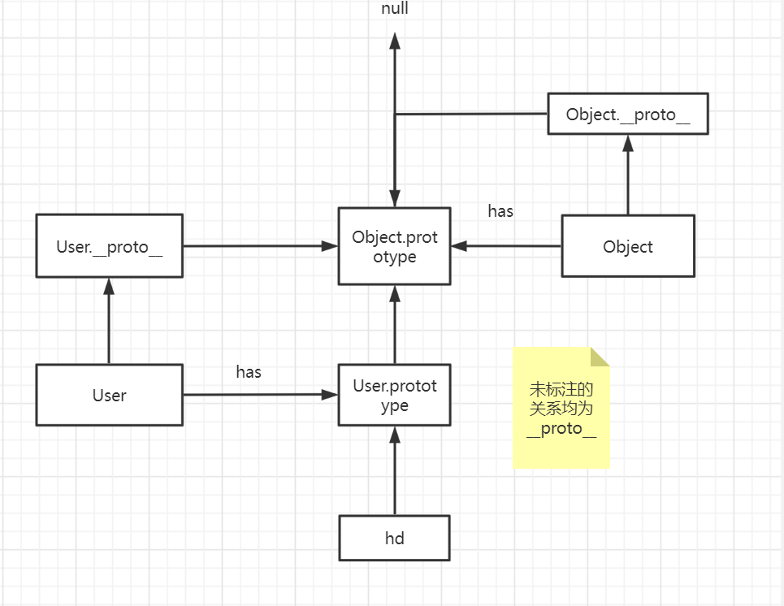

# 概览

## html

* 分组框的效果

  ​    <fieldset>

  ​        <legend>用户注册</legend>

  ​    </fieldset>       

* selectElement.selectedIndex 返回被选中的索引

## BOM

* location.reload() 刷新当前页面
* location.assign("/")  跳转到首页
* confirm/ prompt
* setTimeout (function,milliSeconds)  在milliSeconds执行function 只执行一次
* let t=setInterval(function,milliSeconds)  每隔milliSeconds执行一次function
* clearInterval(t) 注意clear是js保留字 不能用作自定义函数名

## DOM

整个文档 是一个节点  document

元素 是节点  var div1=document.getElementId("div1")

元素属性 是节点 div1.attribute[0]

 元素内容 是节点  div1.childNode[0]


* document.getElementById 

* getElementsByTagName 

* getElementsByClassName 

* getElementsByName : ELEMENT[]

* 因为javascript是解释语言，是顺序执行的。 在执行到 document.getElementById的时候，div标签还没有加载，所以无法获取。

   

  ​    <script>

  ​        var  div1 = document.getElementById("d1");

  ​        document.write(div1);

  ​        </script>

   

  <div id="d1">hello HTML DOM</div>

* nodeName表示一个节点的名字

   document.nodeName 文档的节点名，是 固定的#document 

  div1.nodeName 元素的节点名，是对应的标签名 div 

  div1.attributes[0].nodeName 属性的节点名，是对应的属性名 id

  div1.childNodes[0].nodeName 内容的节点名，是固定的 #text 

`<``div` `id``=``"d1"``>hello HTML DOM</``div``>` 

* nodeValue表示一个节点的值 

   document.nodeValue 文档的节点值，是 null 

  div1.nodeValue 元素的节点值，是null

   div1.attributes[0].nodeValue 属性的节点值，是对应的属性值 d1 

  div1.childNodes[0].nodeValue 内容的节点值，是内容 即：hello HTML DOM 

*  nodeType表示一个节点的类型 

*  元素上的属性，比如id,value 可以通过 . 直接访问

  如果是自定义属性，那么可以通过如下两种方式来获取:

  getAttribute("test")

  attributes["test"].nodeValue

  

  注: 

  class需要通过className获取

* 正则表达式

  text.search(regexp) 并返回子串的起始位置  没有返回-1

  text.replace(regexp,new)

  

  test() 方法是一个正则表达式方法。

  test() 方法用于检测一个字符串是否匹配某个模式，如果字符串中含有匹配的文本，则返回 true，否则返回 false。

  regexp.test(text)

* 一个元素节点的style属性即对应的css 

  d.style.display="none" 

  ` ``d1.style.backgroundColor` 

* ​       <tr >

  ​            <th>id</th>

  ​         </tr>

  ​        table{

  border-collapse:collapse;

  }

  tr{

  border-bottom:solid 1px gray;

  }

  会出现底部连续横线的效果

* 事件

  当组件获取焦点的时候，会触发onfocus事件 当组件失去焦点的时候，会触发onblur事件 


​	当在组件上鼠标按下的时候，会触发onmousedown事件

 	当在组件上鼠标弹起的时候，会触发onmouseup事件


   	当在组件上鼠标经过的时候，会触发onmousemove事件

​    	当在组件上鼠标进入的时候，会触发onmouseover事件

​    	当在组件上鼠标退出的时候，会触发onmouseout事件

​    	注: 当鼠标进入一个组件的时候，onmousemove和onmouseover都会被触发，区别在于无论鼠标在组件上如何移动，onmouseover只会触发一次，onmousemove每次移动都会触发 


记得要先用鼠标选中该组件，然后敲击键盘 :

​	当在组件上键盘按下的时候，会触发onkeydown事件 

​	当在组件上键盘按下的时候，也会触发onkeypress事件

​	 当在组件上键盘弹起的时候，会触发onkeyup事件 


​	当在组件上单击的时候，会触发onclick事件 

​	当在组件上双击的时候，会触发ondblclick事件
注2: 自定义函数不要使用click()，这是保留函数名。 


​	当组件的值发生变化的时候，会触发onchange事件 

注：对于输入框而言，只有在失去焦点的时候，才会触发onchange，所以需要点击一下"按钮" 造成输入框失去焦点 

​	可以在form元素上，监听提交事件 当form元素@提交的时候，会触发onsubmit事件 

​	**当整个文档加载成功，或者一个图片加载成功**，会触发加载事件 当body元素或者img@加载的时候，**会触发onload事件** 

​	this表示触发事件的组件，可以在调用函数的时候，作为参数传进去（Event对象）

​	阻止事件发生E:

​	<form method="post" action="/study/login.jsp" onsubmit="return login()">
账号：<input id="name" type="text" name="name"> <br/>
密码：<input type="password" name="password" > <br/>
<input type="submit" value="登录">
</form>

<script>
  function login(){
   var name = document.getElementById("name");
   if(name.value.length==0){
     alert("用户名不能为空");
     return false;
   }
   return true;

  }
</script>

​	


* parentNode 

  previousSibling /nextSibling 

  ​	标签之间有任何字符、空白、换行都会产生文本元素。 所以获取到的节点是#text. 

  ​	previousElementSibling 则不然

  childNodes 

  ​	开始/结束标签之间有文本、空格、换行，那么firstChild第一个子节点将会是文本节点，不会是第一个元素节点 

  children 

  ​	children 会排除文本节点

  

* createElement(tag) 创建元素节点  appendChild(ele)

  createTextNode  创建文本节点 

  createAttribute 创建属性节点 

* parentNode.removeChild (childNode) 

  node.removeAttribute(attr)

* parentNode.replaceChild (new,old)

  replaceChild 第一个参数是保留的节点，第二个参数是被替换的节点 

* appendChild追加节点。 追加节点一定是把新的节点插在最后面 

  insertBefore  追加节点一定是把新的节点插在指定元素之前

## JSON

* JSON对象由 名称/值对组成 名称和值之间用冒号:隔开 名称必须用双引号" 包含起来 值可以是任意javascript数据类型，字符串，布尔，数字 ，数组甚至是对象 不同的名称/值对之间用 逗号 , 隔开 

* 通过 点.  或 [键]访问JSON对象的属性 

* JavaScript对象 分内置对象([Number](https://how2j.cn/k/javascript/javascript-number/438.html),[String](https://how2j.cn/k/javascript/javascript-string/439.html),[Array](https://how2j.cn/k/javascript/javascript-array/441.html),[Date](https://how2j.cn/k/javascript/javascript-date/440.html),[Math](https://how2j.cn/k/javascript/javascript-math/520.html))和[自定义对象](https://how2j.cn/k/javascript/javascript-object/442.html) JSON就是自定义对象，只不过是以JSON这样的数据组织方式表达出来 所以不存在JSON对象与JavaScript对象的转换问题 

* 字符串转成JSON对象: 转换的时候注意,eval 函数要以（ 开头，）结尾  如:

  ​    let s='{"a":"1","b":2}';

  ​    let obj=eval("("+s+")");

  ​    console.log(obj);

  ​    console.log(typeof(obj));

* JSON对象转字符串:json 对象因为是一个javascript对象，所以如果直接打印(document.write)的话，看不到里面的内 

   JSON.stringify 


# 语法与命令

## 基础
- 引入外部文件在标签体内的脚本不会执行
-放在header的js会导致body延迟加载
-变量提升：解析器会先解析代码，然后把声明的变量的声明提升到最前 
方法体内提升至在方法有效
-let/const 若未声明就是会用会造成TDZ temporary dead zone
-没有任何修饰 全局作用域 容易污染
var没有块级作用域，只有函数作用域
let则都有
-let声明后的变量不允许在同一作用域中重新声明（var可以）
-Object.freeze(obj)不允许修改
-未定义全是defined 函数参数未给或无返回值是为undefined

2. 运算符
   ==	强制类型转换比较
   ===	不会类型转换比较
   checked/selected/required 不能用getAttribute拿
   for-of适合数组（去取其中的值 iterable）
    for-in适合对象（索引 key）

3.基本类型
typeof number/string/boolean undefined Object function
instanceof 判断是否为某个对象的实例
模板字面量 \`后盾人网址是${url}\`
string:
substring 负数变为0
slice 负数从后面开始数
substr 第二个参数为长度
Boolean:
当与boolean类型比较时，会将**两边类型**统一为数字1或0。字符串在与Boolean比较时，两边都为转换为数值类型后
1.使用 !! 转换布尔类型 2.使用 Boolean 函数
Number:
Number.isInteger
toFixed(2)
NaN不能使用 == 比较(跟任何比较都是false)
parseInt pasrseFloat
toString(n) n进制
Date:
date*1 date.getTime()变成时间戳
Date.now()当前时间

4.数组
创建：1.	new Array 2.字面量 3.Array.of 一个参数为包含这个参数的数组 4.使用Array.from可将类数组转换为数组，类数组指包含 length 属性或可迭代的对象
可以outOfBounds
检测：Array.isArray()
数组<->字符串：toString join
解构 let [a,b]  const [...a] = "houdunren.com"
管理元素：push(ele):length/unshift(ele):element pop():element/shift():element(不存在则移除第一个)
slice：不改变原数组，返回一个视图
splice（a,b,c） a是开始删除的位置 b删除的数量 c在a出插入数据
清空数组：1.length=0 2.=[] 3.splice 4.pop
array_obj.copyWithin(target：number, start, end)  //[start,end)复制到target开始的位置，覆盖原数组

find/findIndex   includes:find入参是函数，返回的是要找的对象或索引，可以用来找引用类型/includes返回的是boolean
迭代：1.fori 2.for-of 3.for-of+entries()/keys()/values()

```js
for(const [index, item] of x.entries())
```


方法：every some fitler map(在数组的所有元素上应用函数，用于映射出新的)
reduce 第一个参数是执行函数，第二个参数为初始值
传入第二个参数 pre=第二个参数 ,否则 pre=arr[0] 必须return pre的修改

```js
        console.log(y.reduce((pre, cur) => pre += cur, 0)) //pre=0 cur=y[0]
        console.log(y.reduce((pre, cur) => pre += cur)) //pre=y[0] cur=y[1]
```


5.symbol
防止属性名冲突，值是独一无二的
Symbol() Symbol(description)

```js
			 let hd = Symbol();
            let edu = Symbol();
            console.log(hd); //Symbol()
            console.log(hd == edu); //false

			//传入相同参数Symbol也是独立唯一的
            let hd = Symbol("后盾人");
            let edu = Symbol("后盾人");
            console.log(hd == edu); //false
```


Symbol.for(description) 会登记

根据描述获取Symbol，如果不存在则新建一个Symbol,一个描述只存在一个实例

- 使用Symbol.for会在系统中将Symbol登记

- 使用Symbol则不会登记

  ```
  let hd = Symbol.for("后盾人");
  let edu = Symbol.for("后盾人");
  console.log(hd == edu); //true
  ```


let obj = {

[symbol]: &quot;houdunren.com&quot;
};

可以保证对象属性的唯一 


6.set
严格检测，值唯一
使用对象做为键名时，会将对象转为字符串后使用
创建:new Set()
方法： set.size set.has delete clear
weakset:WeakSet的值必须为对象类型
不会增加引用计数器，垃圾回收不考虑WeakSet ，所以对象不被引用时不管WeakSet是否在使用都将删除 

7.Map
可以接受一个数组作为参数，该数组的成员是一个表示键值对的数组。

```
let m = new Map([
  ['houdunren', '后盾人'],
  ['hdcms', '开源系统']
]);
```

 weakMap:键名必须是对象

8函数
-标准声明优先级高于赋值声明
-立即执行函数：函数定义时立即执行
-函数提升
-默认参数要放在最后面
-arguments 是函数获得到所有参数集合

```
        function func1() {
            console.log(arguments); //伪数组 【1,2,3】
            console.log(Array.from(arguments).reduce((x, y) => x + y)) 
        }

        func1(1, 2, 3)
```


-箭头：函数体为单一表达式时不需要 return 返回处理，系统会**自动返回**表达式计算结果。
-回调函数：在某个时刻**被其他函数调用的函数**称为回调函数
-this 函数调用时的**关联对象**，也称之为函数的上下文
全局环境下this就是window对象的引用
函数为对象的方法时this 指向该对象
不属于对象方法所以指向window
箭头函数和外层函数指向同一个this

```js
        let user = {
            sum() {
                console.log('对象函数', this);  //指向user对象
                let x = [1, 2]
                x.reduce(function (a, b) {
                    console.log('非对象函数', this); //指向window
                })
                x.reduce((a, b) => {
                    console.log('箭头', this); //箭头与所在环境环境即sum函数指向相同,指向user
                })
            }
        }
```


-call apply bind

 用于显示的设置函数的上下文，两个方法作用一样都是将对象绑定到this 
apply 数组 method.apply(obj,arr)
call 可变参数 method.call(obj,...arr)
bind 不会立即执行 复制函数形为会返回新函数  a.bind(hd) 可以理解为将a函数绑定到hd对象上

```js
     function show(title) {
            alert(`${title + this.name}`);
        }
        let lisi = {
            name: '李四'
        };
        let wangwu = {
            name: '王五'
        };
        show.call(lisi, '后盾人'); //后盾人lisi
        show.apply(wangwu, ['HDCMS']); //HDCMSwangwu

```

```
let a = function() {};
let b = a;
console.log(a === b); //true
//bind是新复制函数
let c = a.bind();
console.log(a == c); //false

function hd(a, b) {
  return this.f + a + b;
}

//使用bind会生成新函数
let newFunc = hd.bind({ f: 1 }, 3);

//1+3+2 参数2赋值给b即 a=3,b=2
console.log(newFunc(2));
```

9.作用域
-使用变量时会从当前作用域开始向上查找变量
-如果子函数被使用时父级环境将被保留
-在 for 循环中使用let/const 会在每一次迭代中重新生成不同的变量
-闭包:子函数可以访问外部作用域变量的函数特性 JS中的所有函数都是闭包

10 对象

* 展开语法 {...obj}

* 解构 let {a:x,b:y}=obj ('use strict';)当a=x,b=y可简写为 {a,b}=obj

  数组解构时 [x, , y]  可用,省略一位

  嵌套解构

  ```js
        let x = {
              y: {
                  z: 1
              }
          }
  
          let { y: { z=2 } } = x  //z不存在取默认值2
          console.log(z); //1
  ```

* 属性

  ```js
          let x = [1, 2, 3]
          console.log(x.hasOwnProperty('concat')); //只看自己 false
          console.log('concat' in x); //在自己以及原型链上找 true
  ```

  

* ```
          let c = Object.assign({ 'a': 1 }, { 'b': 2 })//合并两个obj
          console.log(c);  //{a: 1, b: 2}
           console.log(Object.keys(c));
          console.log(Object.values(c));
  ```

* 拷贝

  ```js
  /**
           * 浅拷贝是指将对象中的数值类型的字段拷贝到新的对象中，而对象中的引用型字段则指复制它的一个引用到目标对象。(原对象会随之改变)
           * 深拷贝 对象中的引用型字段是一个完全新的对象(原对象不会随之改变)
          */
          let x = { a: 1, b: 2 }
          let y = { ...x } //浅拷贝推荐这种
  
  
          let m = { a: 1, b: { c: 2 }, d: [1, 2] }
          //深拷贝函数
          function copy(obj) {
              let res = Array.isArray(obj) ? [] : {}
              for (const [key, value] of Object.entries(obj)) {
                  console.log(key, value);
                  res[key] = typeof value === 'object' ? copy(value) : value
              }
              return res;
          }
          n = copy(m)
          n.d.push(3)
          console.log(JSON.stringify(n, null, 2)); //[1,2,3]
          console.log(JSON.stringify(m, null, 2)); //[1,2]
  ```

  

* ```js
          function X() {
    
          }
    
          console.log(new X() instanceof X) //true 构造方法
          console.log(X() instanceof X) //false
  ```

* 封装 防止外部修改

  ```js
        function X(name) {
              let data = { name }
              this.show = function () {
                  console.log(data.name);
              }
          }
  
          x = new X("A")
          x.name = "B"
          x.show() //A 保证属性不被修改
  ```

  

* 获取/定义属性的特征

  ```
   let user = {
              name: 'jinjianou',
              age: 18
          }
  
          //         {
          //   "value": "jinjianou",
          //   "writable": true,
          //   "enumerable": true,
          //   "configurable": true
          // }
          console.log(JSON.stringify(Object.getOwnPropertyDescriptor(user, 'name'), null, 2));
          console.log(JSON.stringify(Object.getOwnPropertyDescriptors(user), null, 2));
          
          
          //定义
          Object.defineProperty(user, 'salary', {
          value: 3000,
          writable: false, //不允许重新赋值
          enumerable: false,  //从遍历中剔除
          configurable: false //不允许删除等
          })
          
          
                //不允许添加属性
          Object.preventExtensions(user)
          if (!Object.isExtensible(user)) {
              console.log(user);
          }
  
          //封闭状态  不允许增删定义,可以修改
          // {
              "name": {
                  "value": "jinjianou",
                      "writable": true,
                          "enumerable": true,
                              "configurable": false
              },
              "age": {
                  "value": 20,
                      "writable": true,
                          "enumerable": true,
                              "configurable": false
              }
          }
          Object.seal(user)
          user.age = 20 //可以
          // delete user.age  //不可以
          user.salary = 1000 //不可以
          console.log(JSON.stringify(user, null, 2));
  
          //冻结状态 
          //         {
          //   "name": {
          //     "value": "jinjianou",
          //     "writable": false,
          //     "enumerable": true,
          //     "configurable": false
          //   },
          //   "age": {
          //     "value": 20,
          //     "writable": false,
          //     "enumerable": true,
          //     "configurable": false
          //   }
          // } 
          Object.freeze(user)
  
                      console.log(JSON.stringify(Object.getOwnPropertyDescriptors(user), null, 2));
                      
                      
                      
  ```

  

* 访问器

  ```js
       //访问器
          const user = {
              data: { name: 'jinjianou', age: 18 },
              set age(age) {
                  console.log('age=', age);
                  this.data.age = age;
              },
              get age() {
                  return this.data.age;
              }
          }
  
          user.age = 20 //使用了访问器就可以按照这种方式get/set
          console.log(user.age);
  
  
  
          //批量设置数据
          const web = {
              name: 'houdunren',
              url: 'hudunren.com',
  
              get site() {
                  return `${this.name}-${this.url}`
              },
              set site(value) {
                  [this.name, this.url] = value.split(',')
              }
          }
  
          web.site = 'baidu,www.baidu.com'
          console.log(web.site);
  
  
        //TOKEN 本地存储
          let Request = {
              set token(content) {
                  localStorage.setItem('token', content)
              },
              get token() {
                  let token = localStorage.getItem('token')
                  if (!token) {
                      alert('请先登录')
                  }
                  return token;
              }
          }
  
          Request.token = 1133131231
          console.log(Request.token);
  
  
          //完全封闭 symbol
          const DATA = Symbol()
          const User = {
              [DATA]: { name: 'jinjianou', age: 18 },
              set age(age) {
                  this[DATA].age = age
              },
              get age() {
                  return this[DATA].age;
              }
          }
          
          
                  //类的方式定义
          const DATA = Symbol()
          class User {
              constructor(name, age) {
                  this[DATA] = { name, age }
              }
              set age(age) {
                  this[DATA].age = age
              }
              get age() {
                  return this[DATA].age
              }
          }
  
          let jinjianou = new User('jinjianou', 20);
          jinjianou.age = 30
          console.log(jinjianou);
  ```

  

* JSON

  ```js
          //JSON 对数组等也有效
          let user = {
              name: '金建欧',
              age: 18,
              //自定义json字符串格式
              toJSON: function () {
                  return {
                      'name': `姓名-${this.name}`,
                      'age': `年龄-${this.age}`
                  }
              }
          }
  
          // console.log(JSON.stringify(user, ['name'], 2)); //第二个参数为需要保留的属性,第三个参数为缩进空格
          console.log(JSON.stringify(user, null, 2));
  
  
          //json串转为json对象
          JsonObj = JSON.parse(jsonStr, (key, value) => {
              if (key == 'name') {
                  value = '[姓名]' + value
              }
              return value;
          });
  ```

11.原型

* 获取原型 Object.getPrototypeOf (obj) 设置 Object.setPrototypeOf(obj,parent)

* ```js
              //无原型的情况
              let jin = Object.create(null, {
                  'name': {
                      value: '金建欧'
                  }
              });
              console.log(jin.hasOwnProperty('name')); //无hasOwnProperty方法 Object继承过来的
    
  ```

* 自己的属性或方法优先于原型的

* ```js
          console.dir(User); //构造函数既有__proto__ 也有prototype原型供实例使用
          let hd = new User()
          console.dir(hd); //实例只有一个__proto__ 原型
          console.log(hd.__proto__ == User.prototype); //true
  ```

* 

  ```js
          function User() { }
          console.log(Object.prototype);  //a lot of function contruct a instance
          console.log(User.prototype.__proto__ == Object.prototype); //true
          console.log(User.__proto__.__proto__ == Object.prototype); //true
          console.log(Object.prototype.__proto__); //null
          console.dir(Object.__proto__); //ƒ anonymous()
          console.dir(Object.__proto__.__proto__ == Object.prototype);  //true Object.prototype
          console.dir(Object.prototype.__proto__);  //null
  	    console.log(User.prototype.constructor == User);  //true
  
  ```

  ```
          function User(name) {
              this.name = name;
          }
  
  		//批量增加方法
          User.prototype = {
              constructor: User,
              show() {
                  console.log('show');
              },
              print() {
                  console.log('print');
              }
          }
  
          let hd = new User.prototype.constructor('hd')
          hd.show();
  ```

* obj instanceof Type 也就是看obj.__proto__即该类型prototype向上找有没有Type

  a.isPototypeof(b) a是b原型链上的一部分

* in  原型链 hasOwnProperty 自己

* 方法一般会放到原型当中复用

* this与原型无关 永远指向调用者

* 演进过程 Object.create->__proto__(属性控制器 get/set)->Object.setprototypeof

* 继承是原型的继承而不是改变构造函数的原型

  

12. 类 面向对象更简单 语法糖

    * class  ownMethod:enumerable false   ownField:enumerable false writable false

      ```js
              let u = new User('jin')
              for (const key in u) {
                  if (u.hasOwnProperty(key)) {
                      console.log(u[key]);
                  }
              }
      
      ```

      

    * 静态属性

      ```js
           class Request {
                  host = 'www.baiduc.com' //非静态属性 所有对象都有 但更改某一对象的不会影响其他对象
                  static mode = 'http' //静态属性 所有对象公用 但更改某一对象的会影响其他对象
              }
      
      
      
              let req1 = new Request();
              console.log(req1); //'www.baiduc.com' http
              Promise.resolve()
              let req2 = new Request();
              req1.host = 'a'
              Request.mode = 'https'
              console.log(req1); //'a' https
              console.log(req2); //'www.baiduc.com' https
      ```

      ```js
              class Member {
                  constructor(name, age) {
                      this.name = name;
                      this.age = age;
                  }
                  static create(...args) {
                      return new this(...args)
                  }
              }
      
              let member = Member.create('jin', 20)
      ```

      

    * private _前缀 (约定) 或者#前缀(强制)

    * protected

    ```js
            const protecteds = Symbol() //所有需要保护的都放进来
            class Common {
                constructor() {
                    this[protecteds] = {}
                    this[protecteds].host = 'http://www.baidu.com'
                }
                set host(host) {
                    this[protecteds].host = host
                }
    
                get host() {
                    return this[protecteds].host
                }
    
            }
            class User extends Common { //父类的属性子类也会继承过来
                constructor(name) {
                    super()
                    this[protecteds].name = name //将name也保存起来
                }
            }
    
            let user = new User('jin')
            user.host = 'a'
            console.log(user);
    ```

    

    * 子类有构造方法，第一行（防止子类属性被覆盖）必须调用父类构造方法
    * 访问父类方法 super.function()

13. 模块

    * 自定义模块模拟

      ```js
      //自定义一个模块管理
              let module = (function () {
                  const moduleList = {}
                  function define(moduleName, dependencies, action) {
                      dependencies.map((name, index) => dependencies[index] = moduleList[name])
                      moduleList[moduleName] = action.apply(null, dependencies) //只在第一次存的时候调用apply初始化
      
                  }
                  return { define }
      
              }
      
              )();
      
      
              module.define('a', [], function () {
                  return {
                      first(arr) {
                          return arr[0]
                      },
                      max(arr) {
                          return arr.sort((a, b) => b - a)[0]
                      }
                  }
      
              })
              module.define('b', ['a'], function (a) {
                  console.log(a.max([1, 2, 3]));
              })
      ```

      

    * 使用

      ```js
      a.js
      let title = 'houdunren'
      let url = 'www.houdunren.com'
      export { title } //导出的属性才能被外部导入使用，否则本文件私有
      或
      export let...
      export function...
      export class...
      
      b.html
          <script type='module'> //Cannot use import statement outside a module
              import { title } from './a.js'; //Relative references must start with either "/", "./", or "../".
              console.log(title);
          </script>
      ```
	导入default导出的值时，最大的特点就是不用添加大括号，同时定义的变量名也不用一一对应
      
* type='module'默认严格模式，且会等所有需要的模块解析完毕再加载 所以可以在dom之前获取到dom（一般得把script写在body的下面）
    
* 特点:
    
  * 每个模块都有自己独立作用域
    
  * 预解析，只解析一次
    
  * 具名导出（具体的名字）
    
  * 可以使用别名 export {name as n} 或 import{name as n } from ...
    
  * 默认导出 export default ... 一个模块只有一个  import时可以用任意名称且要省略{}
    
    在导出变量或对象时要先声明变量，再导出变量
    
  * 具名导出和默认导出可以混用
    
  * 按需动态加载模块 import('./a.js').then({f1,f2...}=>{...})
    
* require commonjs(文件与文件之间的隔离)
    import命令在编译时就会将需要导入的文件或者变量函数等导进来，
	而require是在运行时加载的，有点类似于懒加载
	
  The require () function is only available by default on Node.js environment. 
    
  ```nodejs
      nodeapp.js
      function add(a, b) {
          return a + b
      }
      function subtract(a, b) {
          return a - b
      }
      
      module.exports = { add, subtract }
      
      app.js
      let { add, subtract } = require('./nodeapp')
      console.log('1+2=- ', add(1, 2));
      ```
    
  
    
14. webpack 打包工具

    1. 下载node.js 
    2. 新建个项目文件夹 npm init -y    -> package.json
    3. npm install webpack webpack-cli  --save-dev
    4. 在 package.json scripts对象增加 "dev":"webpack --mode development --watch"
    5. 增加dist src文件夹 index.js
    6. npm run dev

    

# ajax

* 通过AJAX Asynchronous JavaScript And XML 实现异步刷新 
*  


## 基础

* try{ 

  }catch(err){

  }

* 引入外部文件在标签体内的脚本不会执行

* 放在header的js会导致body延迟加载

* 变量提升：解析器会先解析代码，然后把声明的变量的声明提升到最前 
  方法体内提升至在方法有效(针对var)

* let/const 若未声明就是会用会造成TDZ

  如

  ```
  console.log(x);
  let x=1;
  ```

* 没有任何修饰是全局作用域,容易受到污染

* var没有块级作用域，只有函数作用域,let/const则都有

* let声明后的变量不允许在同一作用域中重新声明（var可以）

* Object.freeze(obj) obj的内容不允许修改

* 未定义(赋值)全是defined 使用为声明的变量会报错. 函数参数为传入或无返回值是为undefined

  

## 运算符

* ==	强制类型转换比较
  ===	不强制类型转换比较

* innerText是元素内的文本节点 多用于非表单节点;value是元素的属性,多用于表单节点

* checked/selected/required相应元素可以直接使用

*  for-of适合数组（取其中的值 iterable通用）
   for-in适合对象（数组取的索引 key）

  

## 基本类型

* number/string/boolean/undefined

* typeof的结果有 number/string/boolean/undefined+Object+function

* instanceof 判断是否为某个对象的实例

* 模板字面量 反引号 `后盾人网址是${url}`

* String(null)会返回字符串"null" 

* string的常用函数:

  substring  start/end是负数就都变成0

  slice start/end负数从后面开始数

  substr 第二个参数为长度 

  lastIndexOf(a) 从左到右数最后一个a的位置 不是从有往左数的索引
  splt(seperator,n) 只保留前n个

  replace(old,new) 只会替换第一个 要想替换所有 replace(new RegExp(old,'g'),new)

* Boolean注意点

  数值当与boolean类型比较时，会转为数字1或0比较。字符串在与Boolean比较时，两边都为转换为数值类型后比较

  如 '10'==true => false

  其他类型   1.使用 !! 转换布尔类型  2.使用 Boolean 函数

* Number:

  Number.isInteger 判断是不是整数

  toFixed(2) 小数点2位 四舍五入

  NaN不能使用 == 比较(NAN跟任何比较都是false)

  Number.parseInt / pasrseFloat 字符串里可以有非数字 会进行截取

  Number()和parseInt()一样，都可以用来进行数字的转换 区别在于，当转换的内容包含非数字的时候，Number() 会返回NaN(Not a Number) 

  toString(n)  n进制

  八进制 let x=012 //10

  十六进制 let y=0xA //10

  科学计数法 let z=3.14e2   //314  314.toExponential (3)  //3.140e+2 

  new Number("123") .valueOf()  //number

  Number.MIN_VALUE/Number.MAX_VALUE 

* Date

  date*1 date.getTime() 会将dat转成时间戳

  Date.now()当前时间

  date.getMonth()+1

  getDay()  一个星期的第几天 0-6

  

## 数组

* 创建数组的方式 

  * new Array
  * 字面量
  * Array.of( ...item )  包含item的数组
  * Array.from 可将类数组转换为数组，类数组指包含 length 属性或可迭代的对象

* 可以 outOfBounds 

* 检测：Array.isArray()

* 数组->字符串  toString/join

  字符串->数组- split

* 解构 
  let[a,b]=[1,2].split(",")

   const [...a] = "houdunren.com"

* 管理元素：

  添加: push(ele)返回length /unshift(ele) 

  删除: pop()返回element/shift()

  slice：不改变原数组
  splice（a,b,c） a是开始删除的位置 b删除的数量 c在a出插入数据

* slice：不改变原数组 是原数组的视图
  splice（a,b,c） a是开始删除的位置,b删除的数量,c在a删除数据后再插入数据

* 清空数组的方式:

  1.arr.length=0 	2.arr=[] 	3.arr.splice(0,arr,length)  4.while(x.pop()){} 

* arr.copyWithin(target, start, end)  复制[start,end) 覆盖 从target这个位置开始的数据

* arr.find(lambda) 返回item或undefined 

  arr.findIndex(lambda) 返回元素在数组中的位置或-1

  includes 包含与否\

  find/finIndex可以用在饮用类型上

* 迭代的方式

  1.fori	2.for-of/for-in	配合entries()/keys()/values()

* x.sort(comparator):number[] x也会变成排序后的

* x.slice()

* x.reverse()

* 重要的函数
  every/some 所有元素都符合某条件/存在符合的

  filter  留下符合的元素形成新数组,不会对原数组产生影响

  map 在数组的所有元素上应用函数，用于映射出新的数组

  reduce 第一个参数是执行函数，第二个参数为初始值

  ```
  array.reduce(function(pre, currentValue, currentIndex, arr), initialValue)
  ```

  