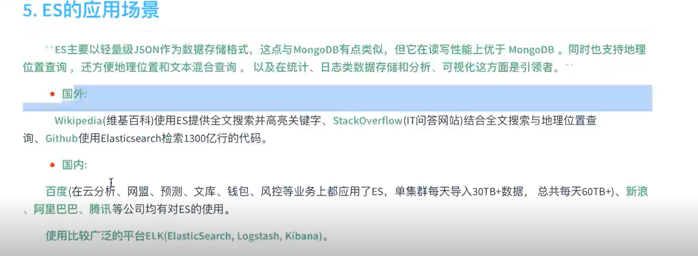
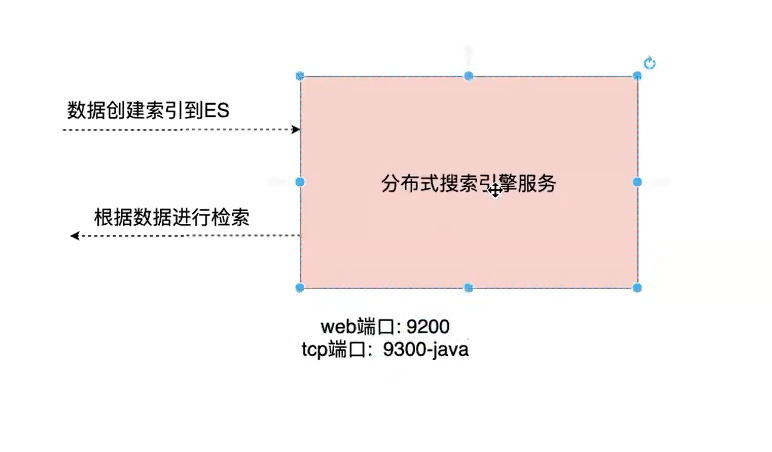

# 概念

1. Restful

   

2. 全文检索

   我们的项目用于 **站内搜索**

   

3. Es

   




# 安装

## elesticSearch

0. 准备

    - centeros

    - jdk8

      jps  jvm process status tool 是JDK提供的一个可以列出正在运行的Java虚拟机进程信息的命令行工具 

      > future versions of Elasticsearch will require Java 11

    - wget 

      > yum install -y wget

1. wget https://artifacts.elastic.co/downloads/elasticsearch/elasticsearch-7.8.0-linux-x86_64.tar.gz

   wget https://artifacts.elastic.co/downloads/kibana/kibana-7.8.0-linux-x86_64.tar.gz

   在/opt下下载

2. 创建普通用户(es不能用root用户启动)

   ```
   groupadd add es
   useradd es -g es
   passwd es
   ```

3. 用普通用户登录 whoami

   > java.lang.RuntimeException: can not run elasticsearch as root

4. 解压 **不能指定到/usr/ 权限问题**

5. 启动服务  bin/elastisearch

6. VM测试 curl http://localhost:9200 （192.168.162.200）

   默认不允许远程连接

   默认单节点也是以集群启动cd

7. 开启远程连接权限

   config/elastisearch.yml 

   ```
   network.host: 0.0.0.0  # 代表允许所有服务访问
   ```

   问题: bootstrap check failed

   >[1]: max file descriptors [4096] for elasticsearch process is too low, increase to at least [65535][2]: max virtual memory areas vm.max_map_count [65530] is too low, increase to at least [262144][3]: the default discovery settings are unsuitable for production use; at least one of [discovery.seed_hosts, discovery.seed_providers, cluster.initial_master_nodes] must be configured

   

   解决(未生效可以退出用户再重新登入): 

   1. vim /etc/security/limits.conf 追加 并重新登录

      sudo chown 用户名:组名 文件名 

      ```shell
      * soft nofile 65536
      * hard nofile 65536
      * soft nproc  4096
      * hard nproc  4096
      ```

      ​	验证

      ```
      ulimit -Hn
      ulimit -Sn
      ulimit -Hu
      ulimit -Su
      ```

      

   2. vim /etc/security/limits.d/20-nproc.conf 修改

       \* soft nproc 4096  =>   启动es用户名 soft nproc 4096  

   3. vim /etc/sysctl.conf 追加
      vm.max_map_count=655360

      验证:  sysctl -p

8. 重新登录用户并重启es服务


  问题1： AccessDeniedException[/opt/elasticsearch-7.8.0/config/elasticsearch.yml]

  解决： 用普通用户先登入/重新解压(先改权限）

  问题2： [1]: the default discovery settings are unsuitable for production use; at least one of [discovery.seed_hosts, discovery.seed_providers, cluster.initial_master_nodes] must be configured

1 discovery.seed_hosts:  集群主机列表 

2 discovery.seed_providers: 基于配置文件配置集群主机列表 

3 cluster.initial_master_nodes: 启动时初始化的参与选主的node，生产环境必填 

解决： 

```
vim config/elasticsearch.yml

#添加配置
discovery.seed_hosts: ["127.0.0.1"]

cluster.initial_master_nodes: ["node-1"]
```

 	




## Kibana

*Kibana* is a free and open user interface that lets you visualize your Elasticsearch data and navigate(浏览) the Elastic Stack.

0. 与es版本一致 root用户

1. https://artifacts.elastic.co/downloads/kibana/kibana-7.8.0-x86_64.rpm

2. rpm -ivh kibana-7.8.0-x86_64.rpm

   会在系统中形成一个kibana服务

3. 修改配置文件

   > find / -name kibana.yml
   >
   > sever.port: "192.168.162.200"#Es服务器主机
   >
   > elesticsearch.hosts:["http://192.168.162.200:9200"]#Es服务器地址

4. http://192.168.162.200:5601 //kibana主机

# Es中的概念


注意: 基于同一个index中mapping可能存在相同字段而导致冲突,于是6.x以后,一个index中只能有一个type,自然也只能有一个mapping


# Kibana基本操作

## 参数配置

> {
>
> "settings";{
>
> ​	.....
>
> }
>
> }

## 操作索引

**新建**

> PUT /dangdang/ #小写+数字

**删除**

> DELETE　／dangdang
>
> DELETE　／＊

**查询**

> GET  /_cat/indices?v
>
> 健康状态、索引开关状态、分片数、副本数、文档数量、标记为删除的文档数量、占用的存储空间、索引的唯一标识等


## 操作type/mapping

**创建**

​	twitter/user

```js
PUT twitter
{
  "mappings": {
    "user": {
      "properties": {
        "name": { "type": "text" },
        "user_name": { "type": "keyword" },
        "email": { "type": "keyword" }
      }
    }
  }
```

### mediatype

Core data types

- **string**

  [`text`](https://www.elastic.co/guide/en/elasticsearch/reference/7.8/text.html) and [`keyword`](https://www.elastic.co/guide/en/elasticsearch/reference/7.8/keyword.html)

- **[Numeric](https://www.elastic.co/guide/en/elasticsearch/reference/7.8/number.html)**

  `long`, `integer`, `short`, `byte`, `double`, `float`, `half_float`, `scaled_float`

- **[Date](https://www.elastic.co/guide/en/elasticsearch/reference/7.8/date.html)**

  `date`

- **[Date nanoseconds](https://www.elastic.co/guide/en/elasticsearch/reference/7.8/date_nanos.html)**

  `date_nanos`

- **[Boolean](https://www.elastic.co/guide/en/elasticsearch/reference/7.8/boolean.html)**

  `boolean`

- **[Binary](https://www.elastic.co/guide/en/elasticsearch/reference/7.8/binary.html)**

  `binary`

- **[Range](https://www.elastic.co/guide/en/elasticsearch/reference/7.8/range.html)**

  `integer_range`, `float_range`, `long_range`, `double_range`, `date_range`, `ip_range`

Complex data types

- **[Object](https://www.elastic.co/guide/en/elasticsearch/reference/7.8/object.html)**

  `object` for single JSON objects

- **[Nested](https://www.elastic.co/guide/en/elasticsearch/reference/7.8/nested.html)**

  `nested` for arrays of JSON objects

Geo data types

- **[Geo-point](https://www.elastic.co/guide/en/elasticsearch/reference/7.8/geo-point.html)**

  `geo_point` for lat/lon points

- **[Geo-shape](https://www.elastic.co/guide/en/elasticsearch/reference/7.8/geo-shape.html)**

  `geo_shape` for complex shapes like polygons

Specialised data types

- **[IP](https://www.elastic.co/guide/en/elasticsearch/reference/7.8/ip.html)**

  `ip` for IPv4 and IPv6 addresses

- **[Completion data type](https://www.elastic.co/guide/en/elasticsearch/reference/7.8/search-suggesters.html#completion-suggester)**

  `completion` to provide auto-complete suggestions

- **[Token count](https://www.elastic.co/guide/en/elasticsearch/reference/7.8/token-count.html)**

  `token_count` to count the number of tokens in a string

- **[`mapper-murmur3`](https://www.elastic.co/guide/en/elasticsearch/plugins/7.8/mapper-murmur3.html)**

  `murmur3` to compute hashes of values at index-time and store them in the index

- **[`mapper-annotated-text`](https://www.elastic.co/guide/en/elasticsearch/plugins/7.8/mapper-annotated-text.html)**

  `annotated-text` to index text containing special markup (typically used for identifying named entities)

- **[Percolator](https://www.elastic.co/guide/en/elasticsearch/reference/7.8/percolator.html)**

  Accepts queries from the query-dsl

- **[Join](https://www.elastic.co/guide/en/elasticsearch/reference/7.8/parent-join.html)**

  Defines parent/child relation for documents within the same index

- **[Rank feature](https://www.elastic.co/guide/en/elasticsearch/reference/7.8/rank-feature.html)**

  Record numeric feature to boost hits at query time.

- **[Rank features](https://www.elastic.co/guide/en/elasticsearch/reference/7.8/rank-features.html)**

  Record numeric features to boost hits at query time.

- **[Dense vector](https://www.elastic.co/guide/en/elasticsearch/reference/7.8/dense-vector.html)**

  Record dense vectors of float values.

- **[Sparse vector](https://www.elastic.co/guide/en/elasticsearch/reference/7.8/sparse-vector.html)**

  Record sparse vectors of float values.

- **[Search-as-you-type](https://www.elastic.co/guide/en/elasticsearch/reference/7.8/search-as-you-type.html)**

  A text-like field optimized for queries to implement as-you-type completion

- **[Alias](https://www.elastic.co/guide/en/elasticsearch/reference/7.8/alias.html)**

  Defines an alias to an existing field.

- **[Flattened](https://www.elastic.co/guide/en/elasticsearch/reference/7.8/flattened.html)**

  Allows an entire JSON object to be indexed as a single field.

- **[Shape](https://www.elastic.co/guide/en/elasticsearch/reference/7.8/shape.html)**

  `shape` for arbitrary cartesian geometries.

- **[Histogram](https://www.elastic.co/guide/en/elasticsearch/reference/7.8/histogram.html)**

  `histogram` for pre-aggregated numerical values for percentiles aggregations.

- **[Constant keyword](https://www.elastic.co/guide/en/elasticsearch/reference/7.8/constant-keyword.html)**

  Specialization of `keyword` for the case when all documents have the same value.

Arrays

In Elasticsearch, arrays do not require a dedicated field data type. Any field can contain zero or more values by default, however, all values in the array must be of the same data type. See [Arrays](https://www.elastic.co/guide/en/elasticsearch/reference/7.8/array.html).

Multi-fields

It is often useful to index the same field in different ways for different purposes. For instance, a `string` field could be mapped as a `text` field for full-text search, and as a `keyword` field for sorting or aggregations. Alternatively, you could index a text field with the [`standard` analyzer](https://www.elastic.co/guide/en/elasticsearch/reference/7.8/analysis-standard-analyzer.html), the [`english`](https://www.elastic.co/guide/en/elasticsearch/reference/7.8/analysis-lang-analyzer.html#english-analyzer) analyzer, and the [`french` analyzer](https://www.elastic.co/guide/en/elasticsearch/reference/7.8/analysis-lang-analyzer.html#french-analyzer).

This is the purpose of *multi-fields*. Most data types support multi-fields via the [`fields`](https://www.elastic.co/guide/en/elasticsearch/reference/7.8/multi-fields.html) parameter.