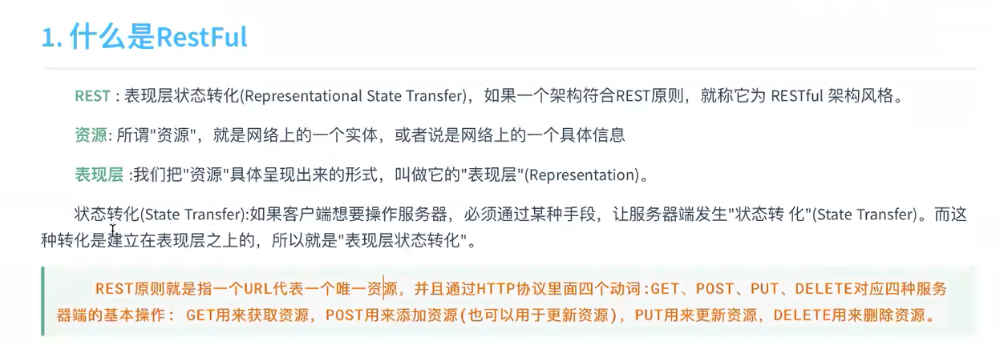

# 概念

1. Restful

   

2. 全文检索

   我们的项目用于 **站内搜索**

   

3. Es

   


# 安装

0. 准备

    - centeros

    - jdk8

      jps  jvm process status tool 是JDK提供的一个可以列出正在运行的Java虚拟机进程信息的命令行工具 

      > future versions of Elasticsearch will require Java 11

    - wget 

      > yum install -y wget

1. wget https://artifacts.elastic.co/downloads/elasticsearch/elasticsearch-7.8.0-linux-x86_64.tar.gz

   wget https://artifacts.elastic.co/downloads/kibana/kibana-7.8.0-linux-x86_64.tar.gz

   在/opt下下载

2. 创建普通用户(es不能用root用户启动)

   ```
   groupadd add es
   useradd es -g es
   passwd es
   ```

3. 用普通用户登录 whoami

   > java.lang.RuntimeException: can not run elasticsearch as root

4. 解压 **不能指定到/usr/ 权限问题**

5. 启动服务  bin/elastisearch

6. VM测试 curl http://localhost:9200 （192.168.162.200）

   默认不允许远程连接

   默认单节点也是以集群启动cd

7. 开启远程连接权限

   config/elastisearch.yml 

   ```
   network.host: 0.0.0.0  # 代表允许所有服务访问
   ```

   问题: bootstrap check failed

   >[1]: max file descriptors [4096] for elasticsearch process is too low, increase to at least [65535][2]: max virtual memory areas vm.max_map_count [65530] is too low, increase to at least [262144][3]: the default discovery settings are unsuitable for production use; at least one of [discovery.seed_hosts, discovery.seed_providers, cluster.initial_master_nodes] must be configured

   

   解决(未生效可以退出用户再重新登入): 

   1. vim /etc/security/limits.conf 追加 并重新登录

      sudo chown 用户名:组名 文件名 

      ```shell
      * soft nofile 65536
      * hard nofile 65536
      * soft nproc  4096
      * hard nproc  4096
      ```

      ​	验证

      ```
      ulimit -Hn
      ulimit -Sn
      ulimit -Hu
      ulimit -Su
      ```

      

   2. vim /etc/security/limits.d/20-nproc.conf 修改

       \* soft nproc 4096  =>   启动es用户名 soft nproc 4096  

   3. vim /etc/sysctl.conf 追加
      vm.max_map_count=655360

      验证:  sysctl -p

8. 重新登录用户并重启es服务


  问题1： AccessDeniedException[/opt/elasticsearch-7.8.0/config/elasticsearch.yml]

  解决： 用普通用户先登入/重新解压(先改权限）

  问题2： [1]: the default discovery settings are unsuitable for production use; at least one of [discovery.seed_hosts, discovery.seed_providers, cluster.initial_master_nodes] must be configured

1 discovery.seed_hosts:  集群主机列表 

2 discovery.seed_providers: 基于配置文件配置集群主机列表 

3 cluster.initial_master_nodes: 启动时初始化的参与选主的node，生产环境必填 

解决： 

```
vim config/elasticsearch.yml

#添加配置
discovery.seed_hosts: ["127.0.0.1"]

cluster.initial_master_nodes: ["node-1"]
```

 	


# Es中的概念


