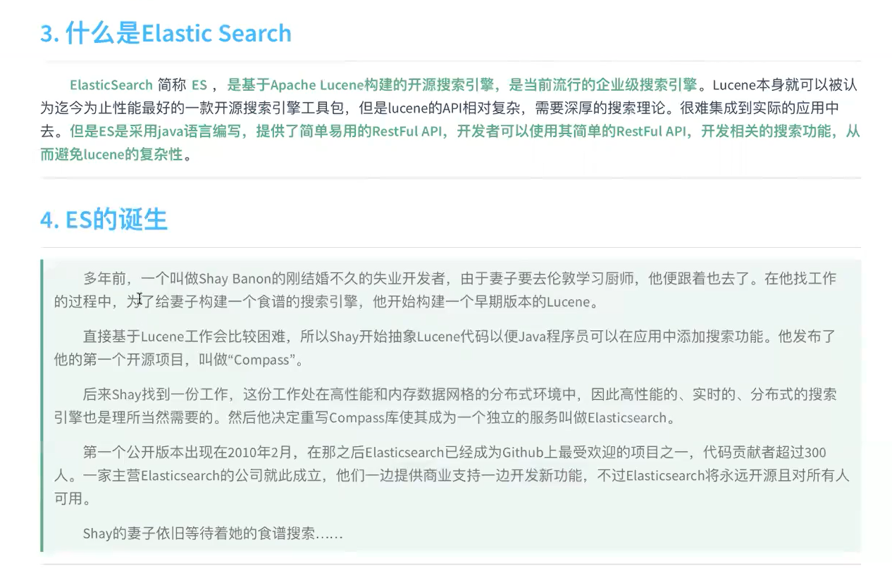

# 概念

1. Restful

   

2. 全文检索

   我们的项目用于 **站内搜索**

   

3. Es

   


# 安装

0. 准备

   - centeros
   - jdk8
   - elastic 7.8.0+

1. wget https://artifacts.elastic.co/downloads/elasticsearch/elasticsearch-7.8.0.tar.gz

   在/opt下下载

2. 创建普通用户(es不能用root用户启动)

   ```
   usergroup add es
   user add es -g es
   passwd es
   ```

3.  用普通用户登录 whoami

4. 解压

5. 启动服务  bin/elastisearch

6. 测试 curl http://localhost:9200

   默认不允许远程连接

   默认单节点也是以集群启动

7. 开启远程连接权限

   config/elastisearch.yml 

   ```
   network.host: 0.0.0.0  # 代表允许所有服务访问
   ```

   问题: bootstrap check failed

   解决(未生效可以退出用户再重新登入): 

   1.  vim /etc/security/limits.conf 追加 并 source

      ```shell
      * soft nofile 65536
      * hard nofile 65536
      * soft nproc  4096
      * hard nproc  4096
      ```

      ​	验证

      ```
      ulimit -Hn
      ulimit -Sn
      ulimit -Hu
      ulimit -Su
      ```

      

   2. vim /etc/security/limits.d/20-nproc.conf 修改

       \* soft nproc 4096  =>   启动es用户名 soft nproc 4096  

   3. vim /etc/sysctl.cnf 追加
      vm.max_map_count=655360

      验证:  sysctl -p

8. 重启es服务


# Es中的概念


