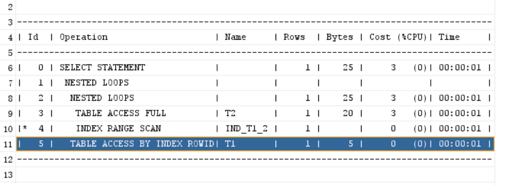

# 前置

**唯一索引可以为空且可以有多个**

**Oracle实例就是平常所说的数据库服务（service）**

* 实例可以操作数据库；任何时刻一个数据库相关联，访问一个数据库；
* 同一个数据库可以由多个实例访问

pdb 

A pluggable(可插拔) database (PDB) is a portable(可移植) collection of schemas, schema objects, and nonschema objects that appears to an Oracle Net client as a non-CDB（container）.

* 显示数据库名称 show con_name; 默认CDB$ROOT

* 切换（可插入）数据库 ALTER SESSION SET CONTAINER = xxx;

* 连接到数据库 sqlplus/connect username@database

* 10g之后默认表空间是users

  **表空间**是ORACLE**数据库恢复的最小单位**，容纳着许多**数据库实体**，如表、视图、索引、聚簇、回退段和临时段等。 每个ORACLE数据库均有 SYSTEM 表空间，这是数据库创建时自动创建的，用于存储系统的数据字典表、程序单元、过程、函数、包和触发器等。

* DQL select

  DML update/insert/delete

  DDL 表 库 索引等

  DCL grank rollback commit等

# 安装

* 安装server（12c）

  提供Oracle实例，实现数据库的管理，数据的存储，对服务器要求较高。服务端在安装时又可分为桌面类和服务器类。因为服务端不一定非要安装在服务器上，当数据库数据较少时也可安装在个人电脑上。但是一般情况下数据量小时并不会选择使用Oracle。 

  * 软件更新-跳过更新   问题：**[INS-30131] 执行安装程序验证所需的初始设置失败**，问题解决 

     1.1因为用户文件中含有中文，出错。（如你的账户名字包含汉字   C:\Users\张三）

    打开计算机管理——本地用户和组——用户——Administrator（右键属性）——账户已禁用（取消勾选）——确定

    打开计算机管理——本地用户和组——用户——Administrator（右键设置密码）——继续——输入新密码——确定 

    到此，就可以切换到Administrator用户。重启方可，在登陆界面选择Administrator。

    在Administrator账户下按照正常步骤安装即可，即   2.0安装步骤。 

     1.2因为未共享C盘，出错。

    这个原因的解决办法网上介绍很多，但是有一大部分人的原因却不是这个，其实就是 

    打开计算机管理——共享文件夹——共享（右键“新建共享”）——下一步——（文件路径填）C:\——下一步——是——共享名C$——下一步——选中（“管理员有完全访问权限；其他管理员只有读写权限”）——完成——完成

  * 创建和配置数据库

  * 桌面类

  * 使用windows内置账户

  * 全局数据库名 orcl 密码 orcl 可插入数据库 pdborcl **编码unicode utf-8**

  * 先决条件检查-全部忽略（显示失败项）

  * 安装产品

    * 文件缺失

    winx64_12102_database_1of2.zip、 winx64_12102_database_1of2.zip两个压缩包解压缩后，解压缩内容并不是合并到一个文件夹内，而是分别生成文件夹存放，而”setup”程序在第一个（winx64_12102_database_1of2）文件夹中，无法找到winx64_12102_database_1of2.zip解压缩后的文件 **将winx64_12102_database_2of2文件夹中database\stage\components目录下的所有文件夹，复制到winx64_12102_database_1of2文件夹中的database\stage\components目录中，重新安装** 

    * configuration assistant 口令管理 sys system soctt

  * 只保留xxxserviceORCL和xxxListener，其他禁用

    (Vss)Volume Shadow Copy Service 

* 安装client（可选）

  控制数据库的远程桌面，只是负责连接数据库，进行查询等操作，本身不存储数据库数据，操作的对象在服务端 

* 安装plsql developer
  * 安装plsql developerxxx
  * 安装完毕后，新建连接
  * 连接类型:基本  用户名:SYS 角色:SYSDBA sid:orcl 

* 创建用户

  1. 打开sql plus

  2. 账号 sys as sysdba

  3. 创建新用户 create  user c##OT identified by orcl123456; 

     * common user names ,username must begin with c##
     * local user names,the name cannot begin with c##

  4. 授权 grant connect,resource to  c##ot;

     系统权限：

     * connect 只能登陆 Oracle，不可以创建实体，不可以创建数据库结构 
     * resource 只可以创建实体，不可以创建数据库结构 
     * dba   拥有全部特权，是系统最高权限，只有 DBA 才可以创建数据库结构  

     只有dba才有回收权限

  5. 登录新用户 connect  c##ot@orcl

  6. 执行外部文件  @path_to_sql_file 

  7. 连接sql developer 角色：默认值

  8. 查看库中所有表 

     * select * from all_tables where owner='VTATEST';   VTATEST用户下的所有表
     * select * from tabs; 登录的用户下的表 

  

# DML

* select

* order by

  SELECT column_1, column_2, column_3, ... 

  FROM table_name 

  ORDER BY column_1 [ASC | DESC]\[NULLS FIRST | NULLS LAST], column_1 [ASC | DESC]\[NULLS FIRST | NULLS LAST], 

  * null默认最大
  * 可以按照位置排序 从1开始
  * 可以按照函数排序

* insert

  * ORA-01950: 对表空间 'USERS' 无权限

    用sys用户 alter table username  quota unlimited on users;

    quota 配额

  * 插入多条

    * union all

      insert into c##ot.demo(age,name,adress)
      select 18,'jinjianou','zhe' from dual
      union all select 20,'jinjianou2','zhe2' from dual;

    * insert all

      insert all
      into c##ot.demo(age,name,adress) values(10,null,null)
      into c##ot.demo(age,name,adress) values(10,'jin','zhe3')
      into c##ot.demo(age,name,adress) values(17,'jin3','zhe4')
      select * from dual;

  * distinct

    column_1，column_2和column_n中的值的组合用于确定数据的唯一性。 

    DISTINCT将NULL值视为重复值 (也就是多个null视为一个)

  * where

    * 比较运算符

      ANY/SOME/ALL ：将值与列表或子查询进行比较。它必须以另一个运算符(例如：`=`，`>`，`<`)作为前缀。 

      [NOT] EXISTS ：如果子查询返回至少一行，则返回`true` 

  * And

    在声明中使用多个逻辑运算符时，Oracle始终首先评估AND运算符。 先and 再or

  * Fetch

    [OFFSET offset ROWS]

    FETCH NEXT/FIRST [row_count|percent PERCENT] ROWA [ONLY|WITH TIES]

    * offset 跳过行数相当于skip 如果不配置，则偏移量为0,行限制从第一行开始计算

      如果偏移量是负值，则将其视为 0。

      如果偏移量为 NULL 或大于查询返回的行数，则不返回任何行。

      如果偏移量包含一个分数，则分数部分被截断 。

    * WITH TIES 返回与最后一行相同的排序键。请注意，如果使用 WITH TIES，则**必须在查询中指定一个 ORDER BY 子句**。如果不这样做，查询将不会返回额外的行。 

      Specify WITH TIES to return additional rows with **the same sort key** (field_value)as the **last row**

      fetched.

  * like

    expresion [NOT] LIKE pattern [ ESCAPE escape_characters ] 

    * pattern从字段文本首字符开始

    *  ESCAPE escape_characters转义字符

      将% _转义成原本字符

      where name like 'jin\%' escape '\'

* CROSS JOIN 笛卡尔积  result in all possible combinations of the tables  `x CROSS JOIN y` is `x INNER JOIN y ON 1=1` 

  * 复制表结构和数据 create table demo2 **as** select * from demo
  * 不可以加on筛选 之后可以跟where
  * **self join 只是个逻辑的概念 并没有这个关键字**

* union intersect minus

* INSERT INTO SELECT - 从查询结果中将数据插入到表中。 

  INSERT INTO Websites (name, country) SELECT app_name, country FROM apps; 

* MERGE - 使用单个语句逐步完成**插入，更新**和删除操作。 

  ```
  MERGE [INTO [schema .] table [t_alias] 
  USING [schema .] { table | view | subquery } [t_alias] 
  ON ( condition ) 
  WHEN MATCHED THEN merge_update_clause 
  WHEN NOT MATCHED THEN merge_insert_clause;
  ```

  * **null=null==>false   null!=null==>false** 

* 自增

  

# 基本数据类型

SELECT * FROM DBA_TYPES WHERE OWNER IS NULL

- 字符串

  - char(size [BYTE|CHAR]) 默认BYTE
    - select  'a','b' from dual
  - NCHAR  UNICODE格式数据的定长字符串
  - VARCHAR 不要使用VARCHAR数据类型
  - VARCHAR2 推荐使用
  - NVARCHAR2  UNICODE格式数据的变长字符串

- 数字类型

  - number(p,s)

    p精度

    s为正 从小数点到最低有效数字的位数

    s为负 从小数点到最高有效数字的位数

    123.89 number(6,1)  123.9

    123.89 number(6,-2)  100

  - integer number子类型 相当于number(38,0)

  - binary_float

  - binary_double

  - float  number子类型 
**   float，double等非标准类型，在DB中保存的是近似值，而Decimal则以字符串的形式保存数值。**

- 日期类型

  - date

  - timestamp

  - timestamp with time zone 包含了时区偏移量的值

  - timestamp with  local  time zone

  - interval year to month

  - interval day to second

  - api

    

- lob

  - clob 字符数据
  - Nclob unicode类型数据
  - blob 二进制数据大对象
  - bfile  二进制文件

- raw & long raw

  - long 变长字符串

    - 限制

      1.一个表中只有一列可以为LONG型。(Why?有些不明白)

      2.LONG列不能定义为主键或唯一约束，

      3.不能建立索引

      4.LONG数据不能指定正则表达式。

      5.函数或存储过程不能接受LONG数据类型的参数。

      6.LONG列不能出现在WHERE子句或完整性约束（除了可能会出现NULL和NOT NULL约束）

  - long raw 原始二进制数据

  - raw 变长二进制或字符集类型数据

- rowid & urowid

  **ORACLE使用通用的ROWID（UROWIDs）的存储地址的索引组织表和外表**

# 分区表

分区：水平分割，把一个大表分割成多个部分

方式：

- range  按时间范围划分

  - 分散IO 不同的分区可以放在不同的表空间 
  - 可靠性

  创建：

  create table t_range( hiredate date,id number(10)) partition by range(hiredate)
  (
  partition p1 values less than (to_date('2010-01-01','yyyy-mm-dd')),
  partition p2 values less than (to_date('2014-01-01','yyyy-mm-dd'))
  );

  SQL> insert into t_range values (to_date('2008-01-01','yyyy-mm-dd'),1);
  SQL> insert into t_range values (to_date('2009-01-01','yyyy-mm-dd'),2);
  SQL> insert into t_range values (to_date('2010-01-01','yyyy-mm-dd'),3);

  select * from t_range partition(p1)

  - 如果想插入一条分区关键字中没有的记录

    - 添加非最大分区

    - 添加最大分区

      alter table t_range add parition p_max values less than (maxvalue);

      添加了最大分区后还想添加分区

      - alter table t_range split patition p_max

        at (to_date('2010-01-01','yyyy-mm-dd')
        into (partition p4,partition p_max)
        需要保证p_max分区数据量少（alter table加的锁是6级别的锁啊）可以先expdp导出数据 split后再impdp导入进去

- hash

  为了解决hash数据不均匀的问题

  特点：

  - 分区自动管理
  - hash分区的个数最好是2^n

  缺点：

  range能精确的把某一行分到某一个分区上，hash却不能

  

  create tablespace ts1 datafile '/oradata/vicdb/ts1.dbf' size 30m autoextend off;

  create tablespace ts2 datafile '/oradata/vicdb/ts2.dbf' size 30m autoextend off;

  create table t_hash (hiredate date,id number(10)) **partition by hash**(hiredate)
  ( **partition p1 tablespace ts1,**
  partition p2 tablespace ts2
  );--insert 数据
  insert into t_hash values (to_date('2008-01-01','yyyy-mm-dd'),1);
  insert into t_hash values (to_date('2009-01-01','yyyy-mm-dd'),2);
  insert into t_hash values (to_date('2010-01-01','yyyy-mm-dd'),3);
  insert into t_hash values (to_date('2011-01-01','yyyy-mm-dd'),4);
  insert into t_hash values (to_date('2012-01-01','yyyy-mm-dd'),5);

  --验证数据平均分布
  select * from t_hash partition(p1);
  select * from t_hash partition(p2);

  在hash分区中，**对于不等值连接**，如> <等，分区消除不可用，也就是说**会扫描所有的分区**。
  比如，大于xx就可能意味结果不止一行，对于结果不止一行的情况，无法判断那些结果是否在同一个分区（**range可以判断，因为他是有序的**）

- list

  create table list_t
  **partition by LIST**(DEPTNO)
  ( **PARTITION D10_20 VALUES ('10','20') TABLESPACE users,**
  PARTITION D30 VALUES ('30') TABLESPACE users,
  **PARTITION D00 VALUES (DEFAULT) TABLESPACE USERS**)
  AS SELECT * FROM EMP;

  SELECT * FROM EMP3 PARTITION (D10);
  SELECT * FROM EMP3 PARTITION (D20);
  SELECT * FROM EMP3 PARTITION (D00);

- 组合分区

  分区还可以进行分区 也就是子分区

  create table comp
  (range_key date,
  hash_key int,
  data date)
  partition by range(range_key)
  subpartition by hash(hash_key) subpartitions 2
  (
  partition p1 values less than(to_date('2014-04-01','yyyy-mm-dd'))
  (subpartition h1,
  subpartition h2
  ),
  partition p2 values less than(to_date('2015-04-01','yyyy-mm-dd'))
  (subpartition h11,
  subpartition h22
  )
  )

# 索引

rowid 定位记录相对唯一地址值,在该行数据插入到数据库表时即被确定且唯一.ROWID它是一个伪列，它并不实际存在于表中

在某列上创建索引后，如果该列出现在查询条件中，Oracle 会自动的引用该索引，**先从索引表中查询出符合条件记录的 ROWID**，**由于 ROWID 是记录的物理地址**（定位记录相对唯一地址值），因此可以根据 ROWID 快速的定位到具体的记录。

- 何时建立

  - 主键和包含唯一约束的列自动创建索引
  - 某列经常作为where的查询条件，并且检索的出来的行数经常是小于总表的5%
  - 对于两表连接的字段
  - 不应该在小表上建立索引
  - 经常进行DML操作，即经常进行增删改的操作的表，创建表索引时就要权衡一下

- 分类

  - b-tree索引 最常见的索引 create index 默认索引

    每个索引条目=索引值组合（单列单值，多列多值组合）+ rowId

  - bitmap位图索引： 只有几个枚举值的情况

  - 函数索引

  - hashs索引创建 hash索引必须使用**hash集群**，相当于定义了一个hash集群键

  - reverse索引  某个叶子节点太密集

  - 分区索引 应用到分区表

- 查看
**  表名必须要大写**
  select * from all_indexes where table_name='T1'; //系统视图
  select * from user_ind_columns where table_name='T2'; 

- 新建

  create unique index ind_t1_1 on t1(id);

- 删除

  drop index 索引名

- 查看索引作用的字段

   select * from user_ind_columns

# 单双引号区别

1. 关键字，对象名、字段名加双引号，则示意 Oracle将严格区分大小写 

   如select * from emp where "ENAME" = scott; 

   不等同于 select * from emp where "ename" = scott; 

2. 单引号的作用

   * 引用一个字符串常量 
   * 转义符，对紧随其后出现的字符(单引号)进行转义 
   * 表示它本身，也就是它作为一个字符串的一部分而出现在一个字符串常量中 这点与2密不可分 

# 存储过程(详情见oracleSP.md)

- 创建 create or replace procedure mydemo1

  as

  begin

  ​	 dbms_output.put_line('hello world');

  end; 

注意: ORACLE BEGIN END 关键字表示一个完整的块。而不是类似mysql的事务的含义
- 调用

  - call procedure_name();
  - declare
    begin
        procedure_name;
    end;
  - begin
        mydemo1;
    end;

- 带参数的存储过程

  create or replace procedure myDemo2(name in varchar2,age in integer)
  as
  begin
      dbms_output.put_line('name='||name||', age='||age);
  end;

- 带返回值的存储过程

  create or replace procedure myDemo3(name out varchar2,age in integer)
  as
  begin
      dbms_output.put_line('age='||age);
      select 'jinjianou' into name from dual;
  end;

  declare 
      name varchar2(10);
      age int;
  begin
       myDemo3(name=>name,age=>18);
        dbms_output.put_line('name='||name);
  end;

- 异常

  create or replace procedure myDemo4
  as
  age int;
  begin
      age:=1/0;
      dbms_output.put_line('age='||age);
      

  ```
  exception when others then
          dbms_output.put_line('error');
  ```

  end;

  call myDemo4();

- 循环

  - while

    create or replace procedure myDemo5
    as
    age int:=0;
    begin
        while age<5 loop
            dbms_output.put_line(age);
            age:=age+1;
        end loop;

```
end;

call myDemo5();
```

- for

  create or replace procedure myDemo6 is
      cursor cur is select * from a;
  begin
      For tmp in cur loop
          dbms_output.put_line(tmp.USER_NAME);
      end loop;
  end;

# 更新操作

* insert all

  - 无条件 

    //把stu表中数据插入到stu1 stu2

    insert all

    into  stu1(id,name,sex)

    into stu2(id,name,sex)

    select id,name,sex from stu;

  - 有条件

    - insert all when

      满足条件就会插入

      ```sql
      insert all
      when name='A' then
      into T2(name,money) values(name,money+10)
      else
      into T3(name,money) values(name,money)
      select name,money from T1;
      ```

    - insert first when

      有数据同时满足多个when条件,则只执行第一个then插入语句

* merge:

  **从T1表更新数据到T2表中**。假设T2表的条件字段 在T1表中已存在，就更新字段，假设不存在，将T1表的记录插入到T2表中。

  ```sql
  merge into T2
  using T1 on(T1.name=T2.name)
  when matched then update set T2.money=T1.money+10[delete] [where claus]
  when not matched then insert values(T1.name,T1.money)
  ```

  - update insert可只出现一次
  - merge可增加语句
  - 用delete删除行
  - 可采用无条件 insert  merge into T2 using T1 on(1=2) when not matched then insert values(...)
  - insert时都要补全全部字段（无论字段是不是自动生成）

* IDENTITY列

  - GENERATED ALWAYS AS IDENTITY

    此时该字段**无法**指定数据（自动生成）所以此时必须指定插入字段

  - GENERATED BY DEAFULT AS IDENTITY

    此时该字段**可以**指定数据，但**id列不能是null**

  - GENERATED BY DEAFULT ON NULL　AS IDENTITY

    此时该字段**可以**指定数据，但i**d列可以是null**

  - **alter table xxx  modify id int default xxx;**

    只能改变字段类型，无法取消自增属性

    ```
    1.临时取消 插入
    SET IDENTITY_INSERT TableName ON INSERT INTO tableName(xx,xx) values(xx,xx) SET IDENTITY_INSERT TableName OFF
    
    2. 新增一列，删除自增列，修改列明
    alter table a add xxx int ;update a set xxx=id ;alter table a drop column id;
    ```

    

* ALTER TABLE *old_name* RENAME TO *new_name*

* *check((password like '00\[0-9][0-9]/*\[a-z,A-Z][a-z,A-Z][a-z,A-Z]%’ escape ‘/’)and(length(password)=8) )

  escape免于转义，为字符本身的含义


# 删除操作

mysql 删除允许，oracle不允许

delete t1 from T1 t1,T2 t2 where t1.id=t2.id;

oracle删除有两种方式

```
delete from T1 where exists(
    select 1
    from T2
    where T1.id=T2.id
)
```

```
delete from( 
select T1.*
from T1 ,T2  
where T1.id=T2.id);

```

后者必须保证有且只有一个key-preserved 表 

A table is key-preserved if every key of the table can also be a key of the result of the join.So,a  key-preserved table has its keys  preserved  through a join.

如果一张表的主键/唯一键是join连接结果集的主键/唯一键，那么这张表就叫做key-preserved表 


关键字（保留字） 不允许作为列名，可以加'' 或``（不推荐)

# 事务

确保一组SQL语句所有的操作要么都成功执行，要么一个也不执行的机制。

**原子性(Atomicity)** 一个事务里面所有包含的SQL语句都是一个整体，是不可分割的

**一致性(Consistency)： ** **在事务开始之前和事务结束以后，数据库的完整性约束没有被破坏**

**隔离性(Isolation)： ** **数据库允许多个并发事务同时对其中的数据进行读写和修改的能力**，隔离性可以防止事务在并发执行时，由于他们的操作命令交叉执行而导致的数据不一致状态。

**持久性(Isolation)：**数据也不会丢失

- COMMIT \[ WORK ]\[ COMMENT clause ]\[ WRITE clause ][ FORCE clause ];

  - WORK：使用或不使用 WORK 参数来执行 COMMIT 将产生相同的结果。
  - COMMENT clause： 它用于指定与当前事务关联的注释。
  - WRITE clause：用于指定将已提交事务的重做信息写入重做日志的优先级
    - WAIT 或 NOWAIT (如果省略，WAIT是默认值)
    - IMMEDIATE 或 BATCH(IMMEDIATE是省略时的默认值)
  - FORCE clause：用于强制提交可能已损坏或有疑问的事务
    - FORCE'string'，[integer]或FORCE CORRUPT_XID'string' 或 FORCE CORRUPT_XID_ALL

- ROLLBACK [ WORK ][ TO [SAVEPOINT] savepoint_name  | FORCE 'string' ];

  TO [SAVEPOINT]  savepoint_name： 如果省略该子句，则**当前会话**所有更改都将被撤消。

- SET TRANSACTION [ READ ONLY | READ WRITE ]        

  [ ISOLATION LEVEL [ SERIALIZE | READ COMMITED ] 

  [ USE ROLLBACK SEGMENT 'segment_name' ]               

  [ NAME 'transaction_name' ];

  READ ONLY：可以将事务设置为只读事务。

  READ WRITE：可以将事务设置为读/写事务。

  ISOLATION LEVEL： 与上述参数不兼容,如果指定，它有两个选项：

  ​    1.ISOLATION LEVEL SERIALIZE：如果事务尝试更新由另一个事务更新并未提交的资源，则事务将失败。

  ​    2.ISOLATION LEVEL READ COMMITTED：如果事务需要另一个事务持有的行锁，则事务将等待，直到行锁被释放。

​    USE ROLLBACK SEGMENT：可选的。 如果指定，它将事务分配给由 'segment_name' 标识的回退段，该段是用引号括起来的段名称。

​    NAME：为 'transaction_name' 标识的事务分配一个名称，该事务用引号括起来。

oracle不推荐指定事务回滚到指定回滚段，**尽量使用自动回滚**

事务范围 begin end;
 查看默认隔离级别
 1 SELECT s.sid, s.serial#,
 2     CASE BITAND(t.flag, POWER(2, 28))
 3        WHEN 0 THEN 'READ COMMITTED'
 4        ELSE 'SERIALIZABLE'
 5     END AS isolation_level
 6  FROM v$transaction t
 7  JOIN v$session s ON t.addr = s.taddr AND s.sid = sys_context('USERENV', 'SID');


- LOCK TABLE tables IN lock_mode MODE [ WAIT [, integer] | NOWAIT ];

  - tables：用逗号分隔的表格列表。

  - lock_mode：它是以下值之一：

    | lock_mode           | 描述                                                         |
    | ------------------- | ------------------------------------------------------------ |
    | ROW SHARE           | 允许同时访问表，但阻止用户锁定整个表以进行独占访问。         |
    | ROW EXCLUSIVE       | 允许对表进行并发访问，但阻止用户以独占访问方式锁定整个表并以共享方式锁定表。 |
    | SHARE UPDATE        | 允许同时访问表，但阻止用户锁定整个表以进行独占访问。         |
    | SHARE               | 允许并发查询，但用户无法更新锁定的表。                       |
    | SHARE ROW EXCLUSIVE | 用户可以查看表中的记录，但是无法更新表或锁定`SHARE`表中的表。 |
    | EXCLUSIVE           | 允许查询锁定的表格，但不能进行其他活动。                     |

  - WAIT：它指定数据库将等待(达到指定整数的特定秒数)以获取 DML 锁定；NOWAIT：它指定数据库不应该等待释放锁

# 外键

- 参照完整性

- 被引用的表称为父表，而带有外键的表称为子表

- CONSTRAINT fk_column    

  FOREIGN KEY (column1, column2, ... column_n)   

  REFERENCES parent_table (column1, column2, ... column_n)

  [ON DELETE CASCADE]

  

  alter table add CONSTRAINT fk_column    

  FOREIGN KEY (column1, column2, ... column_n)   

  REFERENCES parent_table (column1, column2, ... column_n)

  [ON DELETE CASCADE]

- alter table  "表名" drop constraint "键名"

- 禁用外键 ALTER TABLE table_name **DISABLE** CONSTRAINT constraint_name;

  启动外键 ALTER TABLE table_name **ENABLE** CONSTRAINT constraint_name;

# 字符串函数

- substr(string,start,[length]) 

  start  

  - when zero from 1
  - when negative 从 字串末尾开始

- instr(string,child_str,[start],[show_time])

  - start  默认从1开始
  - show_time 子串第几次出现在字串中，负数报错

- ascii（single_character） asciistr(string) 对每个character将其转换为数据库字符集中的ASCII字符串

- chr(number_code):character

- compose(string):unicode_string 

  compose('o' || unistr('\0300')）

- CONCAT( string1, string2 ) 

  - 多个字串嵌套
  - 引号中的'用''表示

- string1 || string2 [ || string_n ]

  - 引号中的'用''表示

- CONVERT( string1, char_set_to [, char_set_from] )

  CONVERT 函数返回特定字符集中的字符串值。 可用的字符集是：

  | 字符集       | 描述                          |
  | ------------ | ----------------------------- |
  | US7ASCII     | 美国 7 位 ASCII 字符集        |
  | WE8DEC       | 西欧 8 位字符集               |
  | WE8HP        | 惠普西欧 Laserjet 8 位字符集  |
  | F7DEC        | DEC 法语 7 位字符集           |
  | WE8EBCDIC500 | IBM 西欧 EBCDIC 代码第 500 页 |
  | WE8PC850     | IBM PC 代码第 850 页          |
  | WE8ISO8859P1 | ISO 8859-1 西欧 8 位字符集    |

- DUMP( expression [, return_format][, start_position] [, length] )

  **return_format：**决定了返回值的格式，该参数可以是以下任何值：

     ● 8 ：八进制符号

     ● 10 ：十进制符号

     ● 16 ：十六进制符号

     ● 17 ：单个字符

     ● 1008 ：带字符集名称的八进制符号

     ● 1010 ：带字符集名称的十进制符号

     ● 1016 ：带字符集名称的十六进制符号

     ● 1017 ：带字符集名称的单个字符

- Initcap(string) 将每个单词中的第一个字符设置为大写，其余的设置为小写

# JDBC

```java
 Class.forName("oracle.jdbc.driver.OracleDriver");//加载数据库驱动类
        //thin  一种瘦客户端的连接方式 oci 一种胖客户端的连接方式
/*        胖客户端和瘦客户端是相对的，之间的区别在于是否有大量的业务逻辑需要放在客户端。
        c/s结构中，主要的逻辑程序放在客户端，很多时候服务器是指的数据库服务器，所以是胖客户端
        而在b/s结构中业务逻辑都放在服务器上，客户端只有个浏览器，服务器发送给客户端的只有遵循了html规则的字符串，这是瘦客户端。
        当然如果你用到了applet(ajax)之类的东西就相当于把一些业务逻辑放置在客户端上。*/
        String url="jdbc:oracle:thin:@127.0.0.1:1521:orcl";
        String username="c##ot";
        String password="orcl123456";
        //连接数据库
        try(Connection conn = DriverManager.getConnection(url, username, password)){
            PreparedStatement ps = conn.prepareStatement("select * from demo");
            ResultSet rs = ps.executeQuery();
            while (rs.next()){
                int age = rs.getInt("age");
                String name = rs.getString("name");
                String address = rs.getString("adress");
                System.out.println("age= "+age+" name="+name+" address="+address);
            }
        } catch (SQLException throwables) {
            throwables.printStackTrace();
        }
```

# 操作细节

## 查看当前的所有数据库

 select * from v$database;

GV$：全局视图，针对多个实例环境。
V$：针对某个实例的视图。
X$：是GV$视图的数据来源，[Oracle](https://so.csdn.net/so/search?q=Oracle)内部表。

## 赋权

grant select on v$mystat to test;

这里授权的v$mystat不是固有视图，不能直接授权，实际这里test访问的v$mystat是一个同义词，sys不能给同义词授权，只能授权给固定的表或视图，同义词在Oracle中可以理解为一个对象的别名，有私有和共用之分，每个用户都可以给自己的对象创建自己的同义词，这样创建的同义词只能自己使用。

## 查看当前库的所有数据表 

 select TABLE_NAME from all_tables;

## 查看表结构 

* desc 只有在命令行模式（比如sqlplus或者pl/sql的命令模式下）才能这么写。其他时候很少有命令模式，一般都是通过各种客户端连接的，这些客户端不是命令模式的，而是查询模式，这种情况下，非sql语句的命令是不好使的
* select COLUMN_NAME,DATA_TYPE,DATA_LENGTH
  from user_tab_cols where table_name='ORDER_INFO'

## 数据字典

数据字典表里的数据是Oracle系统存放的系统数据，这些表的名字都是用"$"结尾，这些表属于SYS用户

## 数据存储方式

在Oracle10G中，数据的存储有好几种。

第一种是文件形式，也就是在你的磁盘中创建一批文件，然后在这些文件中存储信息。

第二种就是磁盘阵列形式，这个是什么意思呢，这个就是说明数据库不是存放为某个文件，而是把一个或者多个磁盘格式化成Oracle的一种格式了，等于整个磁盘就是存放Oracle数据库的，不能作为别的用途。这样的优点是存储性能高，因为不再借助别的文件格式了，而是把整个磁盘都成为Oracle最适应的文件系统格式。

## instacne & serviceName

ORACLE实例 = 进程 + 进程所使用的内存(SGA)

打个比方，你的名字叫小明，但是你有很多外号。你父母叫你小明，但是朋友都叫你的外号。这里小明就是sid，你的父母就是oracle实例，service name就是你的外号。sid用于实例区分各个数据库，service name用于外部链接

## shema

在[Oracle](https://so.csdn.net/so/search?q=Oracle)数据库中，模式是一个逻辑容器。它像是windows的一个文件夹，方便我们对一组数据库对象进行管理。**Schema objects** are the logical structures that directly refer to the database’s data.

 通常，一个大的系统由许多小的系统组成，我们可以给每个小的系统创建一个模式，把该系统中用到的数据库对象都创建在这个模式中。A **schema** is a collection of database objects (used by a user.). 

我们可以在模式中创建表（Table）, 分区（Partition）, 视图（View）, 索引（Indexe）, 包（Package）,存储过程（Procedure）,函数（Function）,触发器（Trigger）,类型（Type）, 序列（Sequence）, 同义（Synonym）等数据库对象。

查看表在某个模式下 select * from dba_tables where table_name=‘xxx’  同时可以看某个模式下所有表


# 分页

## 内置一个序号字段rownum

1. rowid 与 rownum 虽都被称为伪列，但它们的存在方式是不一样的：rowid 是物理存在的，**标识记录在表空间中的唯一位置ID，在DB中是唯一的**。rowid 相对于表来说又像表中的一般列，所以，以 rowid 为条件就不会有rownum那些莫名其妙的结果出现。

    rownum>2，没有查询到任何记录, 因为rownum总是从1开始的，第一条不满足去掉的话，第二条的rownum 又成了1。依此类推，所以永远没有满足条件的记录。

    可以这样理解：**rownum是一个序列，是Oracle数据库从数据文件或缓冲区中读取数据的顺序。**  它取得第一条记录则rownum值为1，第二条为2。依次类推。  当使用“>、>=、=、between...and”这些条件时，从缓冲区或数据文件中得到的第一条记录的rownum为1，不符合sql语句的条件，会被删除，接着取下条。

   1）select rownum,id,age,name from loaddata where rownum != 10 返回前9条数据

   2) rownum >1时查不到一条记录，而 rownum >0或rownum >=1 却总显示所有记录

   3)between 1 and 10 或者 between 0 and 10 能查到结果，而用 between 2 and 10 却得不到结果

   1. 第n条

      select * from (select t1.*,rownum no from tb) where no=n;

   2. 前n条

      select * from (select * from tb) where rownum<=n;

   3. m<=x<=n

      select * from (select t2.*,rownum as no from tb t2 ....) t1

      where t1.no>=m and t1.no<=n

   4. n<=x

      select * from (select t1.*,rownum no from tb) where no>=n;

## 通过窗口函数排序

select * from (select t1.*,row_number() over(order by xx desc) no from xx t1) where no>=m and no<=n

## rowid 写法复杂

## 推荐格式：

select t3.* from (

​	select t2.* ,rownum no from (:subsuqery) t2

​	where rownum<= (:pageIndex*:pageSize)

) t3 where t3.no >= (（:pageIndex-1)*:pageSize+1)


# 日期

## 当前日期

- select sysdate from dual  返回**操作系统**当前日期
- select systimestamp from dual  返回系统当前日期(含时间戳+时区)
- select localtimestamp from dual 返回**会话**中的时间日期（不含时区）
- select current_timestamp from dual 返回**会话**中的时间日期（含时区）
- select dbtimezone from dual  数据库时区
- select sessiontimezone from dual  当前会话区时区
- alter database set time_zone='+8:00'  修改数据库时区


## 修改日期

1 使用内置函数numtodsinterval增加天，小时，分钟和秒
2 加一个简单的数来增加天
3 使用内置函数add_months来增加年和月

- select sysdate,sysdate+numtodsinterval(n,timeunit) from dual  **day/hour/minute/second**
- select sysdate,sysdate+numtoyminterval(n,timeunit) from dual  **year/month**
- select sysdate,sysdate+n  from dual  n days
- sysdate - to_date(ch,format) 天数+时间戳
- month_between(dt1,dt2)  月数+时间戳

# 临时表
## 特点:
1. session级的临时表，只有在truncate table、session结束才能释放对表的锁定，等所有session释放bounding临时表，才能drop临时表
2. 临时表不产生redo、undo信息
   重做日志(redo log)用来保证事务的持久性,用于数据库的崩溃恢复
   undo log主要记录的是数据的逻辑变化，为了在发生错误时回滚之前的操作，需要将之前的操作都记录下来，然后在发生错误时才可以回滚
4. **临时表各个session间的数据是不可见的，只能看到自己session的数据**

## 创建
  1.会话特有的临时表
  CREATE GLOBAL TEMPORARY <TABLE_NAME> (<column specification>)
  ON COMMIT PRESERVE ROWS；

  2.事务特有的临时表
  CREATE GLOBAL TEMPORARY <TABLE_NAME> (<column specification>)
  ON COMMIT DELETE ROWS；
  CREATE GLOBAL TEMPORARY TABLE MyTempTable
  所建的临时表虽然是存在的，但是你试一下insert 一条记录然后用别的连接登上去select，记录是空的，明白了吧，我把下面两句话再贴一下：
  --ON COMMIT DELETE ROWS 说明临时表是事务指定，每次提交后ORACLE将截断表（删除全部行）
  --ON COMMIT PRESERVE ROWS 说明临时表是会话指定，当中断会话时ORACLE将截断表。

# 执行计划

or涉及到多个列的时候，每次select只能选取一个index，如果选择了area，population就需要进行table-scan，即全部扫描一遍，但是使用union就可以解决这个问题

oracle中查看执行计划 

```
explain plan FOR 【sqlplus 】

```

## 简单

1. explain plan FOR

   该命令会将生成的执行计划保存到全局的临时表 PLAN_TABLE 中 

2. select * from table(dbms_xplan.display);

   使用系统包 DBMS_XPLAN 中的存储过程格式化显示该表中的执行计划 

   同一个sql会使用同一个hash，此时需要用系统账号分配权限bing删除缓存

   ```
   grant alter system to c##ot;
   
   alter system flush shared_pool;
   alter system flush buffer_cache;
   alter system flush global context;
   ```

   结果并没有效果，于是去尝试去v$sql删除plan_hash_value=？数据试试

    You may only select rows from fixed tables/views.

   也不行

   最后通过修改表字段实现.....

   - Plan hash value 是该语句的哈希值。SQL 语句和执行计划会存储在库缓存中，哈希值相同的语句可以重用已有的执行计划，也就是软解析;

   - Id 是一个序号，但不代表执行的顺序。执行的顺序按照缩进来判断，缩进越多的越先执行，同样缩进的从上至下执行。Id 前面的星号表示使用了谓词判断，参考下面的 Predicate Information;

   - Operation 表示当前的操作，也就是如何访问表的数据、如何实现表的连接、如何进行排序操作等; 

     表访问方式：

     1. **Full Table Scan (FTS) 全表扫描** 

        表扫描模式下会读数据到表的高水位线（HWM即表示表曾经扩展的最后一个数据块），读取速度依赖于Oracle初始化参数db_block_multiblock_read_count 

     2. **Index Lookup 索引扫描** 

        * **index unique scan**   --索引唯一扫描 

          e.g.  =

        * **index range scan**   --索引局部扫描 

          e.g. > < <> >= <= between 

        * **index full scan**   --索引全局扫描 

          want the data to be ordered in the index order. 

          e.g. order by

        * **index fast full scan**   --索引快速全局扫描，不带order by情况下常发生 

        * **index skip scan**   --索引跳跃扫描，where条件列是非索引的前导列情况下常发生 

          the column is not the leading column of a concatenated index 

          eg: SQL> create index i_emp on emp(empno, ename); SQL> select  job from emp where ename='SMITH'; 

     3. **Rowid 物理ID扫描**

        Rowid扫描是最快的访问数据方式 

   

   ​	表连接方式：

   https://www.cnblogs.com/operationMaltz/archive/2013/03/19/2967169.html

   - Name 显示了访问的表名、索引名或者子查询等，前提是当前操作涉及到了这些对象;
   - Rows 是 Oracle 估计的当前操作返回的行数，也叫基数(Cardinality);
   - Bytes 是 Oracle 估计的当前操作涉及的数据量
   - Cost (%CPU) 是 Oracle 计算执行该操作所需的代价;
   - Time 是 Oracle 估计执行该操作所需的时间;
   - Predicate Information 显示与 Id 相关的谓词信息。access 是访问条件，影响到数据的访问方式(扫描表还是通过索引);filter 是过滤条件，获取数据后根据该条件进行过滤。


- 基数(Rows)：Oracle估计的当前步骤的返回结果集行数
- 字节(Bytes)：执行SQL对应步骤返回的字节数
- 耗费(COST)、CPU耗费：Oracle估计的该步骤的执行耗费和CPU耗费
- 时间(Time)：Oracle估计的执行sql对于步骤需要的时间

案例一：

explain plan for select T1.id2,T1.name,T2.id,T2.name from T1 inner join T2 on t1.name=t2.name;

首先会先扫描右侧的t2表，该字段无索引，全表扫，T1


**Oracle组合索引 where筛选没有先后顺序区别，这点跟mysql不同**

# 其他

## bulk collect

采用bulk collect可以将查询结果一次性地加载到collections中，而不是通过cursor一条一条地处理。

可以在select into,fetch into,returning into语句使用bulk collect。

注意：在使用bulk collect时，所有的into变量都必须是collections 

方式一：select into

```
declare
    type object_list is table of T1.name%type;
    name_list object_list;
begin
    select name bulk  collect
    into name_list
    from T1
    where id2<1000;
    
    for i in name_list.first .. name_list.last loop
        dbms_output.put_line(name_list(i));
    end loop;
end;
/
```

**注意：必须保证sql%rowcount>0，否则循环报错**

方式二： fetch into

```
declare
    type object_list is table of T1.name%type;
    name_list object_list;
    cursor cob is select name from T1  where id2<1000;
begin
    open cob;
    fetch cob bulk collect
    into name_list;
    close cob;
    
    for i in name_list.first .. name_list.last loop
        dbms_output.put_line(name_list(i));
    end loop;
end;
/
```

还可以通过分页参数达到最优的性能，分页参数会影响PGA(内存管理。当用户进程连接到数据库并创建一个对应的会话时，**Oracle**服务进程会为这个用户专门设置一个PGA区，用来存储这个用户会话的相关内容 )

```
declare
    type object_list is table of T1.name%type;
    name_list object_list;
    cursor cob is select name from T1  where rownum<=1000;
begin
    open cob;
    loop
        fetch cob bulk collect
        into name_list limit 100;
        exit when cob%notfound;
        for i in name_list.first .. name_list.last loop
            dbms_output.put_line(name_list(i));
        end loop;
    end loop;  
    close cob;
end;
/
```

 

方式三：returning into 一般用于更新（返回新值）

```
declare
    type object_list is table of T1.name%type;
    name_list object_list;
    type id_list is table of T1.id2%type;
    ids id_list;
begin
    delete from T1
    where id2>1000 returning id2,name bulk collect into ids,name_list;

    dbms_output.put_line( sql%rowcount);

end;
/
```


方式四： 用于动态语句

```
declare
    --index-by-table 内存表 类似java数组  使用BINARY_INTEGER 类型构成的索引主键
    ---varchar2(80)表示下标可以通过字符串来访问
    type object_list is table of T1%rowtype index by binary_integer; 
    t1_row object_list;
    v_sql varchar(200);
begin
    --需要转义
    v_sql:='select * from T1 where name=''xxx'''; 
   execute immediate v_sql   bulk collect into t1_row ;

   if sql%rowcount>0 then
    for i in t1_row.first .. t1_row.last loop
        dbms_output.put_line(t1_row(i).name);
    end loop;
   else 
    dbms_output.put_line('no result matched');
   end if; 

end;
/
```

```
declare
    type name_list is table of T1.name%type index by binary_integer; 
    names name_list;
begin
   update T1 set name='xxxxy' where id2=23 returning name bulk collect into names;
   for i in 1..names.count loop
    dbms_output.put_line(names(i));
   end loop;
end;
/ 
```

##select for update [of column] | [nowait]

Oracle provides the FOR UPDATE NOWAIT clause in SQL syntax to allow the developer to lock a set of Oracle rows for the duration of a transaction.

* for update  行级锁 多表时锁住所有相关行
* of column 锁住涉及到列所在表的行记录
* wait n|nowait 等待n sec 或不等待; 若锁冲突,则提示报错,资源正忙

involving GROUP BY, DISTINCT, UNION, INTERSECT, or MINUS. ORA-01786
也就是只能是普通的select语句

其他session能读吗?
 select userenv('sid') from dual 获取当前session id
 其他session不可写,除非其commit或rollback
 如果普通的select则可以读,但如果select for update则取决与选中行是否已经被其他session锁定


## execute immediate && using

解析并马上执行动态的SQL语句或匿名pl/sql块

```
v_sql varchar(100):='begin p_test(:v1,:v2,:v3); end;';
execute immediate v_sql using in '1',in '2',out c;
```

值得注意的是：默认为in，in可省，out不可省！

using还可以实现表等值连接(sql/92标准)

select emptno,ename,sal,deptno,dname from emp e inner join dept d using(deptno);

等价于

select emptno,ename,sal,deptno,dname from emp e inner join dept d  where e.deptno=d.deptno;

select * 最后select deptno结果只有一列