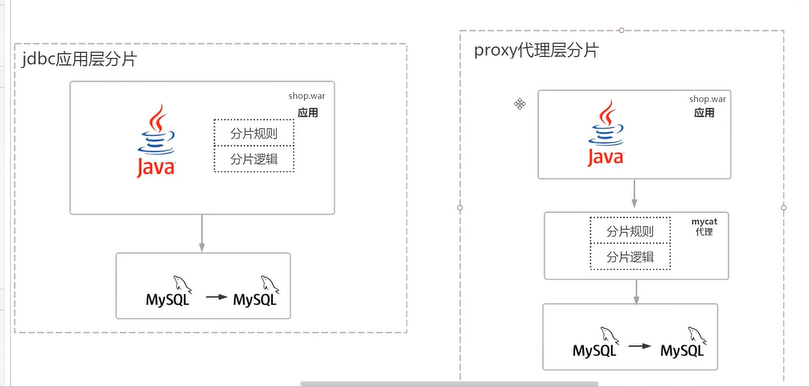
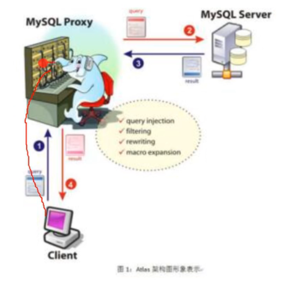
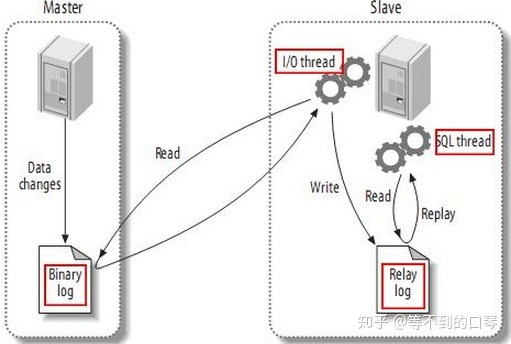
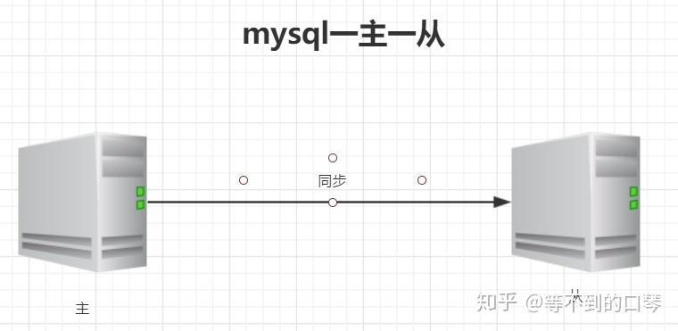
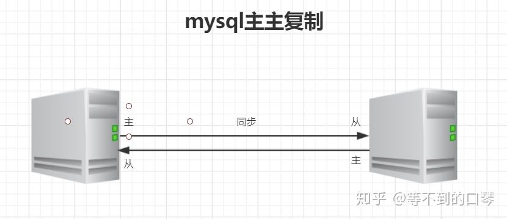
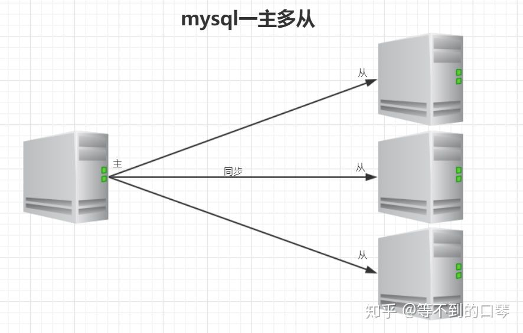
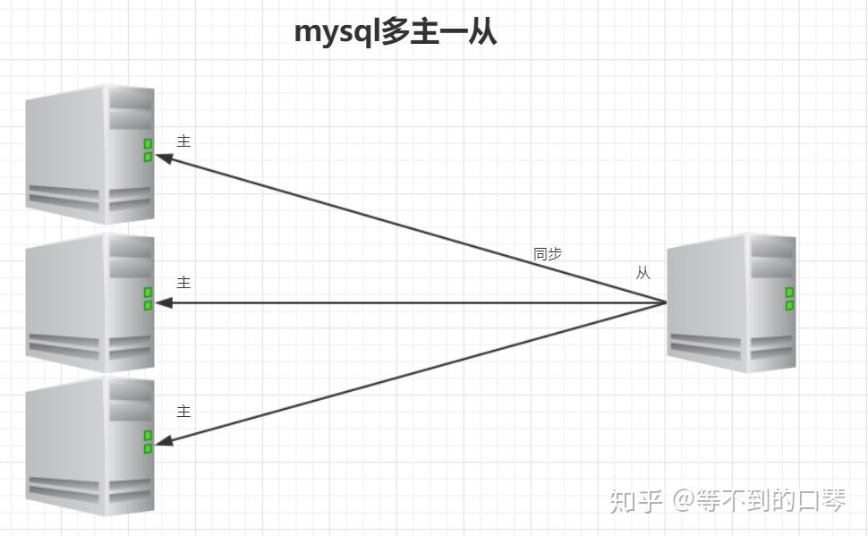
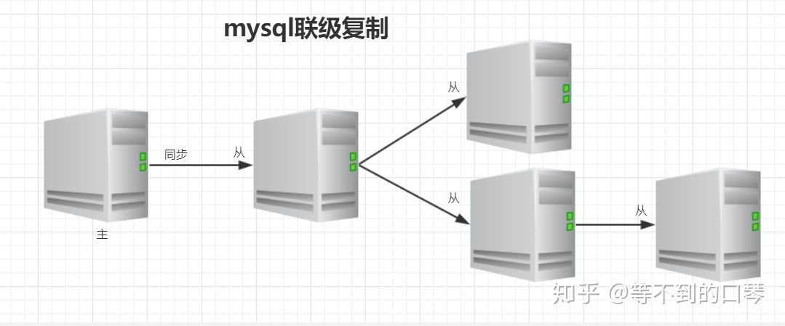

# 为什么要分库分表

如果业务量剧增(qps)，数据库可能会出现性能瓶颈，这时候我们就需要考虑拆分数据库。  提升性能,提高可用性

1. 换数据库 缓存 Nosql
2. 慢sql,索引,字段
3. 读写分离
4. 分库分表
5. 数据归档 比如把之前半年前的数据迁移到另一种新建的表里

# 什么是分库分表

单库单表的数据分散到n个库或n个表


# 分库分表的几种方式

 分库(垂直|水平):

​	垂直:按业务拆分总库->多个库

​	水平拆库:按照某种规则 将某个库拆成相同结构的若干个库

 分表(垂直|水平):

​	mysql单表最大容量是4GB(3.22以前)/64pb(对记录数没限制),推荐500w行或2GB考虑分表


​	垂直:按列拆分(确定关联列),本质也是按业务拆分

​	水平: 按照某种规则 将某个表拆成相同结构的若干个表(保证均衡)


垂直 特点:

1. 每个库(表)结构不一样
2. 每个库(表)数据至少有一列是一样的
3. 每个库(表)的并集是全量数据

垂直 优点:

1. 拆分后业务清晰(专库专用)
2. 数据维护简单

垂直 缺点:

1. 单表数据量大,写读压力大(读写速度变慢) 

   磁盘 扇区 512字节 文件系统 块 4K  innodb存储引擎 页 16K

   **当一个表的索引无法放入到内存中会导致性能下降**(需要把部分索引装载到磁盘中，此时出现了性能的明显下降)，而与实际记录的条数无关


水平特点:

1. 每个库(表)结构一样
2. 每个库(表)数据是不一样的
3. 每个库(表)的并集是全量数据

水平优点:

1. 单库(表)数据量保持一定的数据量,有助于性能的提升
2. 提高了系统的稳定性和负载能力

水平缺点:

1. 数据扩容有难度,维护量大
2.  分片事务的一致性的问题 ,部分业务无法关联jion,只能通过java程序接口调用


场景:

​	订单数据库应该怎么拆分? 分情况:

​	前端(我的订单 订单详情 以我为中心) userid

​	后台(统计 以订单为维度) orderid


# 分库分表会带来什么问题

1. 分布式事务
2. 跨库join
3. 分布式全局唯一id


解决

框架:

jdbc 直连层: shardingsphere   ttdl

proxy代理层:mycat  mysql-proxy





性能上 jdbc>proxy

**proxy跨语言跨平台 但不兼容数据库**

**jdbc兼容支持jdbc的数据库**


# 主从分离

### **0、为什么需要主从复制？**

1、在业务复杂的系统中，有这么一个情景，有一句sql语句需要锁表，导致暂时不能使用读的服务，那么就很影响运行中的业务，使用主从复制，让主库负责写，从库负责读，这样，即使主库出现了锁表的情景，通过读从库也可以保证业务的正常运作。

2、做数据的热备

3、架构的扩展。业务量越来越大，I/O访问频率过高，单机无法满足，此时做多库的存储，降低磁盘I/O访问的频率，提高单个机器的I/O性能。

### **1、什么是mysql的主从复制？**

MySQL 主从复制是指数据可以从一个MySQL数据库服务器主节点复制到一个或多个从节点。MySQL 默认采用异步复制方式，这样从节点不用一直访问主服务器来更新自己的数据，数据的更新可以在远程连接上进行，从节点可以复制主数据库中的所有数据库或者特定的数据库，或者特定的表。


### **2、mysql复制原理**

### **原理：**

（1）master服务器将数据的改变记录二进制binlog日志，当master上的数据发生改变时，则将其改变写入二进制日志中；

（2）slave服务器会在一定时间间隔内对master二进制日志进行探测其是否发生改变，如果发生改变，则开始一个I/OThread请求master二进制事件

（3）同时主节点为每个I/O线程启动一个dump线程，用于向其发送二进制事件，并保存至从节点本地的中继日志中，从节点将启动SQL线程从中继日志中读取二进制日志，在本地重放，使得其数据和主节点的保持一致，最后I/OThread和SQLThread将进入睡眠状态，等待下一次被唤醒。

**也就是说**

从库会生成两个线程,一个I/O线程,一个SQL线程;

I/O线程会去请求主库的binlog,并将得到的binlog写到本地的relay-log(中继日志)文件中

SQL线程,会读取relay log文件中的日志,并解析成sql语句逐一执行;

主库会生成一个log dump线程,用来给从库I/O线程传binlog;


**注意**

1--master将操作语句记录到binlog日志中，然后授予slave远程连接的权限（master一定要开启binlog二进制日志功能；通常为了数据安全考虑，slave也开启binlog功能）。 2--slave开启两个线程：IO线程和SQL线程。其中：IO线程负责读取master的binlog内容到中继日志relay log里；SQL线程负责从relay log日志里读出binlog内容，并更新到slave的数据库里，这样就能保证slave数据和master数据保持一致了。 3--Mysql复制至少需要两个Mysql的服务，当然Mysql服务可以分布在不同的服务器上，也可以在一台服务器上启动多个服务。 4--Mysql复制最好确保master和slave服务器上的Mysql版本相同（如果不能满足版本一致，那么要保证master主节点的版本低于slave从节点的版本） 5--master和slave两节点间时间需同步



### **具体步骤：**

1、从库通过手工执行change master to 语句连接主库，提供了连接的用户一切条件（user 、password、port、ip），并且让从库知道，二进制日志的起点位置（file名 position 号）； start slave

2、从库的IO线程和主库的dump线程建立连接。

3、从库根据change master to 语句提供的file名和position号，IO线程向主库发起binlog的请求。

4、主库dump线程根据从库的请求，将本地binlog以events的方式发给从库IO线程。

5、从库IO线程接收binlog events，并存放到本地relay-log中，传送过来的信息，会记录到[http://master.info](https://link.zhihu.com/?target=http%3A//master.info)中

6、从库SQL线程应用relay-log，并且把应用过的记录到[http://relay-log.info](https://link.zhihu.com/?target=http%3A//relay-log.info)中，默认情况下，已经应用过的relay 会自动被清理purge


### **3、mysql主从形式**

**(一) 一主一从**



**（二）主主复制**



**（三）一主多从**



**（四）多主一从**



**（五）联级复制**




### **4、mysql主从同步延时分析**

mysql的主从复制都是单线程的操作，主库对所有DDL和DML产生的日志写进binlog，由于binlog是顺序写，所以效率很高，slave的sql thread线程将主库的DDL和DML操作事件在slave中重放。DML和DDL的IO操作是随机的，不是顺序，所以成本要高很多，另一方面，由于sql thread也是单线程的，当主库的并发较高时，产生的DML数量超过slave的SQL thread所能处理的速度，或者当slave中有大型query语句产生了锁等待，那么延时就产生了。

解决方案：

1.业务的持久化层的实现采用分库架构，mysql服务可平行扩展，分散压力。

2.单个库读写分离，一主多从，主写从读，分散压力。这样从库压力比主库高，保护主库。

3.服务的基础架构在业务和mysql之间加入memcache或者redis的cache层。降低mysql的读压力。

4.不同业务的mysql物理上放在不同机器，分散压力。

5.使用比主库更好的硬件设备作为slave，mysql压力小，延迟自然会变小。

6.使用更加强劲的硬件设备


## 4、在docker安装master主从环境

https://gitee.com/lookingdreamer/SPPPOTools

- 初始化以及一键安装
  `/bin/bash setup.sh install [宿主机IP]`
- 初始化以及一键安装(取默认配置文件hostip)
  `/bin/bash setup.sh`
- 删除数据文件且停止和删除容器
  `/bin/bash setup.sh clean`
- 初始化容器(build)
  `/bin/bash setup.sh init`
- 初始化配置容器
  `/bin/bash setup.sh config`


1. git clone https://gitee.com/lookingdreamer/SPPPOTools.git

2. 修改docker-compose.yml或setup.sh配置信息(可选)

3.  cd SPPPOTools\docker\docker-mysql-replication

   /bin/bash setup.sh install 192.168.228.193

   sh setup.sh install 192.168.228.193(windows git)

4. 连接数据库 主3307 从3308


问题1:failed to solve: rpc error: code = Unknown desc = failed to solve with frontend dockerfile.v0: failed to create LLB definition: failed to copy: httpReadSeeker: failed open: failed to do request: Get "http://daohub.ufile.ucloud.com.cn/docker/registry/v2/blobs/sha256/11/1195b21c3a45d9bf93aae497f2538f89a09aaded18d6648753aa3ce76670f41d/data?Expires=1660283765&Signature=bYJ4nrp2NO6gNhzQ7GyHlKdnS0k%3D&UCloudPublicKey=ucloudit%40daocloud.io14149252192085992294": EOF
sh: __git_ps1: command not found

解决: 把 docker engine的配置文件中的“features”: { buildkit: true}将"features": { buildkit: false}

buildkit 是下一代 docker 构建组件,基于一种称为 LLB 的二进制中间格式，该格式用于为构建流程定义依赖关系图，依赖 LLB 的优点，它为构建流程提供强大的特性


问题2: [docker](https://so.csdn.net/so/search?q=docker&spm=1001.2101.3001.7020) the input device is not a TTY. If you are using mintty, try prefixing the command with 'winpty'

解决: 增加winpty &  bin/bash->bash  winpty docker exec -it xxx bash


问题3: stdout is not a tty(未解决)

先进入bash  >bash

> sh setup.sh install 192.168.228.193


**在虚拟机里安装docker在执行文件**


# 批量导入导出

通过JDBC执行[sql语句](https://so.csdn.net/so/search?q=sql语句&spm=1001.2101.3001.7020)时，**update和delete执行sql的语句是一条一条发往数据库执行**

但是！**数据库的处理速度是很快，单次吞吐量是很大，执行效率极高**

**addBatch()是把若干sql语句装载到一起，然后一次性传送到数据库执行，即是批量处理sql数据的**。

## 批量插入

方式一: 统一插   >30min

```
Connection conn = DriverManager.getConnection("jdbc:mysql://localhost:3306/pagehelper?characterEncoding=UTF-8&useUnicode=true&useSSL=false&serverTimezone=UTC"
,"root","123456");
PreparedStatement statement = conn.prepareStatement("insert into t_vue(title) values(?)");
long start = System.currentTimeMillis();
for (int i = 0; i < 50000; i++) {
    statement.setString(1,String.valueOf(i));
    statement.addBatch();
}
System.out.println(System.currentTimeMillis()-start);
statement.executeBatch();
System.out.println(System.currentTimeMillis()-start);
```

方式二: 拆分插  >30min

```
for (int j = 0; j < 50; j++) {
    for (int i = 0; i < 1000; i++) {
        statement.setString(1,String.valueOf(j*1000+i));
        statement.addBatch();
    }
    statement.executeBatch();
}
```

发现并没有明显的提升,经过分析

1. addBatch后并没有清空导致内存中数据不断增加 statement.clear();

   源码分析

   ```
   this.batchedArgs.add(batch);//batch:ClientPreparedQueryBindings   batchedArgs List
   
   
   ```

   

2. executeBatch

   ```
      if (!this.batchHasPlainStatements && (Boolean)this.rewriteBatchedStatements.getValue()) {
                           if (this.getParseInfo().canRewriteAsMultiValueInsertAtSqlLevel()) {
                               var3 = this.executeBatchedInserts(batchTimeout);
                               return var3;
                           }
   
                           if (!this.batchHasPlainStatements && this.query.getBatchedArgs() != null && this.query.getBatchedArgs().size() > 3) {
                               var3 = this.executePreparedBatchAsMultiStatement(batchTimeout);
                               return var3;
                           }
                       }
   
                       var3 = this.executeBatchSerially(batchTimeout);
                       return var3;
   ```

   分为以下三种情况

   1. !this.batchHasPlainStatements && (Boolean)this.rewriteBatchedStatements.getValue() 
      - canRewriteAsMultiValueInsertAtSqlLevel -> executeBatchedInserts
      - !canRewriteAsMultiValueInsertAtSqlLevel&&!this.batchHasPlainStatements && this.query.getBatchedArgs() != null && this.query.getBatchedArgs().size() > 3  ->  executePreparedBatchAsMultiStatement

   b. else 

   ​		executeBatchSerially

   由此可知,没有rewriteBatchedStatements相当于走单行串行插入,效率极低

   **url 添加&rewriteBatchedStatements=true**

   走executeBatchedInserts

   Rewrites the already prepared statement into  multi-value insert statement of 'statementsPerBatch'

    就是拼装成insert into xxx(xxx) values(xxx),(xxx)....

   ```
   for (int j = 0; j < 50; j++) {
       for (int i = 0; i < 1000; i++) {
           statement.setString(1,String.valueOf(j*1000+i));
           statement.addBatch();
       }
       statement.executeBatch();
       statement.clearBatch();
   }
   ```

   47s

   不拆分依旧>30min