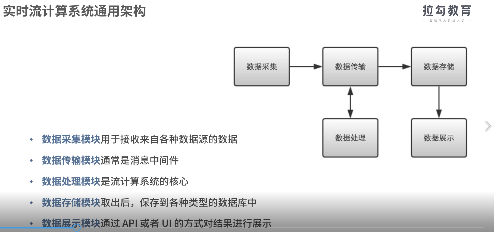
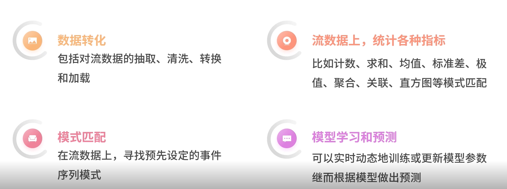
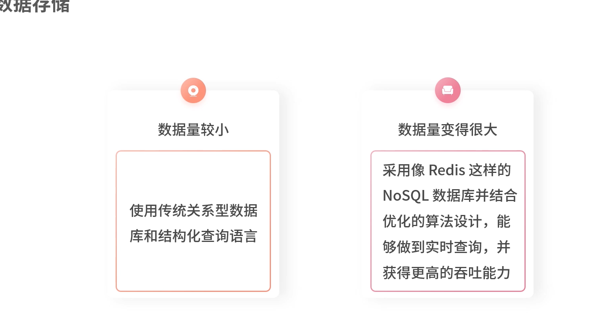
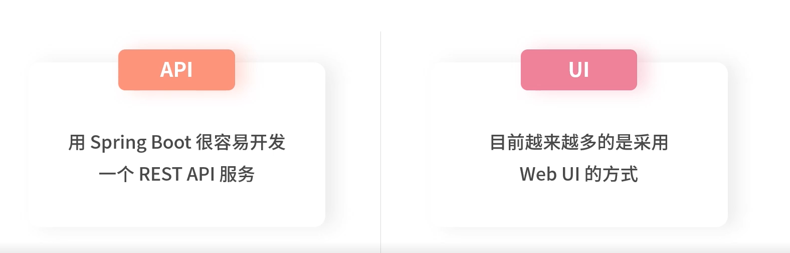

# 通用架构

## 数据采集

可以用SpringBoot开发一个Rest服务,通过Http请求的方式,从浏览器,手机等中端设备将数据发送到数据采集服务器.

**指标**

1. TPS (Transaction per sencods) 表示吞吐量

   要求高,需要通过非堵塞IO框架

2. 时延 CDN

3. 发送方式 netty非堵塞IO框架

4. 连接方式

   - 大量连接需要维持 netty非堵塞IO框架

   - 连接数较少 长连接+连接池

5. 连接数量

   若数据源相对固定 长连接+连接池

## 数据传输

数据传输-流数据在各个模块间流转的过程

流计算系统化: 一般采用消息中间件进行数据传输

微服务系统: 一般采用Http或RPC的方式进行数据传输

**指标**

1. 吞吐量
2. 时延
3. 高可用: 一个或多个结点发生故障时,仍能持续提供正常服务
4. 持久化
5. 水平扩展: 业务量提升,原本消息中间件的处理能力跟不上,需要增加新的结点,以提升消息中间件的处理能力

## 数据处理

## 数据存储

## 数据展示

