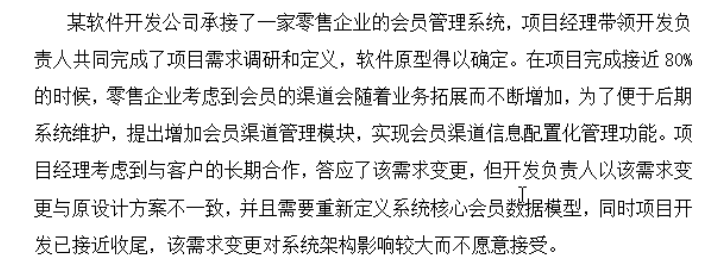

1. 截图

ctrl+printSrc   & mspaint

或者用wun7自带的截图软件(附件)  C:\Windows\System32 

snipping tool   可以修改快捷键

# 网络数据库权限管理与配置

1. 创建数据库 create a new schema
2. 创建新用户 server -> user and privilege -> add account
3. 新用户权限管理 schema privileges -> add entry
4. 新用户参数管理 account limits
5. 配置文件参数修改  定位my.ini文件
6. 赋予dba的操作权限 administrative role
7. 过期密码 login -> expire password

# 开发文档识读与编1写

1. UML类图 属性 方法 关联关系 枚举类(enumeration)
2. UML用例图识读 参与者 用例(功能)
3. UML用例图设计 model -> add diagram->user case

# 软件需求分析

（1）根据项目需求进行系统相关人员分析

（2）针对原始需求不清晰、不明确的内容编写调研提纲

（3）描述在处理需求变更过程中存在哪些问题，需求变更正确的处理步骤

（4）简要描述频繁的需求变更会对软件开发工作带来的哪些影响

（5）设计模式应用分析（单例、抽象工厂、适配器）

如

**相关人员分析**

| 角色名       | 角色说明                                          |
| ------------ | ------------------------------------------------- |
| 零售管理集团 | 系统的用户                                        |
| 分公司       | 系统的输入人群,系统的数据来源                     |
| 门店客户     | 系统的输入人群,系统的数据来源                     |
| 开发人员     | 系统的制作者和维护者                              |
| 市场分析人员 | 对市场,运营,用户等进行分析,及时调整优化开发的人员 |
|              |                                                   |

**针对原始需求不清晰、不明确的内容编写调研提纲**

| 序号 | 调研对象     | 调研方式 | 调研内容                                 | 目的                                                   |
| ---- | ------------ | -------- | ---------------------------------------- | ------------------------------------------------------ |
| 1    | 零售管理集团 | 访谈     | 1.了解服务器情况2.集团组织架构和管理流程 | 1.了解系统实际运行,以便于系统开发   2.获取用户需求功能 |
| 2    | 分公司       | 访谈     | 1. 分公司管理流程 2.销售管理流程         | 获取用户需求功能                                       |
| 3    | 维护人员     | 访谈     | 系统代码如何编写以更高效地维护           | 提高系统的安全性和可用性                               |
|      |              |          |                                          |                                                        |

**在需求变更过程中存在的问题**

- 缺失**需求变更管理**以保证整个项目顺利完成
- 应安排**专人负责**需求变更管理工作确保工作同步完成
- 需**契约化管理需求变更**
- **为每个开发阶段设定转折点**,超过这个转折点不允许改变

**正确处理步骤**

1. 需求变更**申请**
2. 需求变更**评审**
3. 评审结果**执行**
4. 执行过程**跟踪**
5. 变更结果**验证**

**频繁需求变更会对软件开发工作带来哪些影响**

- 增加项目开支
- 影响项目进度
- 影响软件质量
- 影响开发者与用户之间的合作关系
- 影响双方互信

设计模式应用分析（单例、抽象工厂、适配器）

# 软件功能设计

1. 时序图
2. 数据模型
3. 实体关系模型
4. 功能设计分析(类 接口 关系)

# 软件测试

（1）分析制定测试计划的一般过程
（2）分析制定与审核测试计划流程

**编制测试计划的基础和依据**

- 软件测试任务书(或合同)

- 被测软件的需求规格说明书

- 测试需求

- 类似或同一产品旧版本的测试计划

  

**测试计划评审会议人员是否合适**

不合适

应由软件开发人员,测试负责人,测试人员,其他有关项目负责人

**5W1H**

- what 明确测试内容和范围
- why 测试的目的
- when 测试开始和结束日期
- where  给出测试文档和软件存放位置
- who 测试人员分配
- how 指出测试的工具和方法

（3）分析测试用例设计

**测试用例的设计原则**

- 基于测试执行的可重复原则
- 基于测试充分性效率原则
- 基于测试方法的原则
- 基于测试需求可追踪的原则

**测试用例的基本要素**

1. 测试目标
2. 唯一标识符
3. 测试的输入数据和边界
4. 翔实的实施步骤
5. 系统的预期行为
6. 结果解释的准则
7. 用于判定测试用例的可行的准则

（4）分析测试评估过程控制
（5）分析测试总结报告编制

**测试总结报告的目的**

1. 总结测试活动的结果
2. 根据这些结果对测试进行评价

**测试总结报告的结构**

1. 测试总结报告标识符
2. 摘要
3. 差异
4. 测试充分性评价
5. 结果汇总
6. 评价
7. 活动总结
8. 批准

# 软件项目管理

（1）软件项目团队管理与沟通管理
（2）软件项目人力资源管理
（3）软件项目变更管理
（4）软件项目质量管理
（5）软件项目收尾管理

**张伟在项目团队管理和沟通管理过程中的不恰当之处**

1. 项目管理经验不足,无法完成角色转换
2. 缺乏团队领导经验
3. 缺乏有效的沟通和交流
4. 没有建立绩效评估体系
5. 冲突管理做的不好
6. 没有掌握相关的人际关系技能

 **针对模块负责人陈铭在项目中的问题,张伟应该如何预防和改进**

1. 跟踪个人和团队的执行情况,提供反馈
2. 提高项目绩效,保证项目进度
3. 管理冲突,解决问题
4. 评估团队成员的绩效
5. 提高沟通交流能力
6. 掌握一些人际关系能力

**虚拟团队的利弊**

利:

- 为项目团队增加特殊技能,即时相应专家不在同一地理区域

- 将在家办公/行动不便的员工纳入团队
- 将工作班次或工作日不同的员工之间组建团队

 

弊:

- 沟通受限 可能产生误解
- 有孤立感
- 团队成员之间难以分享经验和知识
- 采用通信技术的成本

**人力资源管理的主要内容**

- 角色和职责的分配
- 项目的组织结构图
- 人员配备管理计划

 

**人力资源管理的主要输入**

- 项目管理计划
- 活动资源需求
- 事业环境因素
- 组织过程资产

**项目实施过程中存在哪些主要问题**

1. 没有建立变更控制委员会和变更控制流程
2. 没有遵循正确的变更管理流程
3. 对客户变更需求没有正确的评估和认证
4. 没有提交书面,正式的变更请求,或对变更没有记录
5. 对变更影响评估,论证,评审
6. 缺少对变更实施过程的有效监控
7. 缺少变更结果的验证

 

**项目变更管理的主要工作程序**

- 提出与接受变更申请
- 对变更初审
- 变更方案论证
- 项目管理委员会审查
- 发出变更通知并组织实施
- 变更实施的监控
- 变更结果的评估
- 判断发生变更后的项目是否已纳入正常轨道

**做的好的地方**

1. 指派专人担任项目的质量管理员
2. 制定了质量管理计划
3. 在项目过程中进行了质量检查等工作

**质量管理中存在哪些问题**

1. 没有制定合理的,可操作性的质量管理计划
2. 缺少质量标准和质量规范
3. 没有建立质量保证体系
4. 质管人员经验,能力不足
5. 质量保证做的不好,比如没有进行评审等
6. 项目经理缺少对项目质量管理工作监督指导
7. 质量控制做得不到位,检查工作颗粒度不一
8. 在质量管理中,没有采用合适的工具,技术和方法
9. 对团队成员质量意识和质量管理方面培训不足

**分析项目经理在收尾管理上主要存在哪些问题**

1. 项目结束过程太过于简单,缺乏必要的流程
2. 项目总结会议没有让全部项目人员参与
3. 催甲方支付剩余款项前没有向甲方提供必要的依据
4. 项目首尾没有提交全部的常规性文件
5. 甲方的需求变更缺乏流程处理
6. 项目收尾没有满足收尾条件

# 编程题

1. elipse ee ,基于ssm的 java web项目, maven
2. 类和对象操作
3. mysql数据库 DML和 DQL操作
4. jsp el表达式