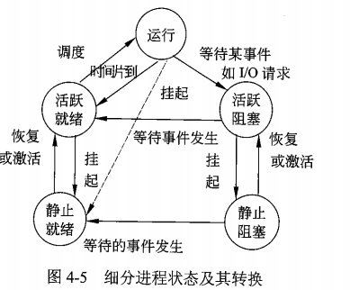

# 试题分布

## 综合知识

| 数据结构                     |
| ---------------------------- |
| 算法设计与分析               |
| 面向对象技术                 |
| 数据库技术基础               |
| 标准化和软件知识产权基础知识 |
| 程序设计语言基础             |
| 操作系统                     |
| 计算机网络                   |
| 软件工程                     |
| 结构化开发知识               |
| 网络与信息化安全基础         |
| 英语                         |
|                              |
|                              |
|                              |


## 案例分析

软件系统分析与设计


# 考试说明

1.考试目标

通过本考试的合格人员能根据软件开发项目管理和软件工程的要求,按照系统总体设计规格说明书进行软件设计编写程序设计规格说明书等相应的文档,组织和指导程序员编写、调试程序,并对软件进行优化和测试,开发出符合系统总体设计要求的高质量软件;具有工程师的实际工作能力和业务水平

2.考试要求

（1）掌握计算机内的数据表示、算术和逻辑运算方法;

（2）掌握相关的应用数学及离散数学基础知识；

（3）掌握计算机体系结构以及各主要部件的性能和基本工作原理；

（4）掌握操作系统、程序设计语言的基础知识，了解编译程序的基本知识；

（5）熟练掌握常用数据结构和常用算法；

（6）熟悉数据库与网络基础知识；

（7）熟练掌握一种结构化程序设计语言（C语言）和一面向对象程序设计语言（C++或Java）；（8）熟悉软件工程、软件过程改进和软件开发项目管理基础知识；

（9）掌握软件设计的方法和技术；

（10）了解信息化、常用信息技术标准、安全性,以及有关法律、法规的基础知识；

（11）正确阅读和理解计算机领域的英文资料。

[51CTO项目管理：软考电子版官方教材&辅导教材 + 官方真题+ 必考知识点6G资料包zhuanlan.zhihu.com/p/458476886](https://zhuanlan.zhihu.com/p/458476886)


3.考试科目设置

（1）计算机与软件工程知识,考试时间为150分钟；

（2）软件设计,考试时间为150分钟。

**二、考试范围**

考试科目1.计算机与软件工程知识

1.计算机系统基础知识

1.1计算机内数据的表示及运算

数的表示

非数值表示（字符和汉字表示、声音表示图像表示）

计算机中的二进制数运算方法

逻辑代数的基本运算

1.2其他数学基础知识

常用数值

计算排列组合、概率论应用、应用统计（数据的统计分析）

编码基础

命题逻辑、谓词逻辑、形式逻辑的基础知识

运筹基本方法

1.3计算机硬件基础知识

1.3.1计算机系统的组成、体系结构分类及特性

CPU、存储器的组成、性能和基本工作原理

常用I/O设备、通信设备的性能以及基本工作原理

I/O接口的功能、类型和特性

CISC/RISC、流水线操作、多处理机、并行处理

1.3.2存储系统

虚拟存储器基本工作原理，多级存储体系

RAID类型和特性

网络存储技术

1.3.3可靠性与系统性能评测基础知识

诊断与容错

系统可靠性分析评价

计算机系统性能评测方法

1.4计算机软件知识

1.4.1数据结构与算法知识

数组

链表

队列、栈

树

图的定义、存储和基本运算

杂凑（Hash表）

常用的排序算法、查找算法、数值计算、字符串处理、数据压缩算法、递归算法、图的相关算法

算法设计与分析

1.4.2操作系统知识

操作系统基本概念

处理机管理

存储管理

设备管理

文件管理

作业管理

操作系统的配置

1.4.3程序设计语言和语言处理程序知识

汇编、编译、解释系统的基础知识和基本工作原理

程序设计语言的基本成分(数据、运算、控制和传输),函数调用机制

各类程序设计语言的主要特点

1.4.4数据库知识

数据库系统基本概念

关系数据库理论

数据库设计

数据库语言

数据库新技术(非关系型数据库等)

1.5计算机网络知识

协议体系结构

传输介质与交换技术

常用网络设备与服务器

局域网络连接

Internet基础知识

TCP/IP协议

简单网络管理

1.6多媒体基础知识

2.系统开发和运行知识

2.1软件工程基础知识

软件生存周期与软件生存周期模型

软件开发方法

软件开发项目管理

软件工具与软件开发环境

软件过程改进(CMM等)

软件开发文档

2.2系统分析基础知识

系统分析方法与模型

2.3系统设计基础知识

系统设计的基本原理

软件体系结构基本概念

系统设计方法与模型

2.4软件测试基础知识

软件测试的基本概念

软件测试阶段

测试方法

测试用例设计

2.5系统运行和维护基础知识

系统维护的概念

系统转换

系统评价

2.6软件质量管理基础知识

软件质量特性(ISO/IEC9126软件质量模型)

软件质量保证

软件复杂性的概念及度量方法(Mccabe度量法)

软件评审(设计质量评审、程序质量评审)

软件容错技术

3.面向对象基础知识

面向对象的基本概念

面向对象分析与设计

分析模式与设计模式

面向对象程序设计

面向对象测试

4.网络与信息安全知识

信息安全基础

信息安全技术(加密与解密、认证、数字签名、摘要等)

网络安全技术

计算机安全等级及相关法律法规

5.标准化、信息化和知识产权基础知识

5.1标准化基础知识

5.2信息化基础知识

全球信息化趋势、国家信息化战略、企业信息化战略和策略

互联网相关的法律、法规知识

个人信息保护规则

远程教育、电子商务、电子政务等基础知识

企业信息资源管理基础知识

5.3知识产权基础知识

[51CTO项目管理：软考电子版官方教材&辅导教材 + 官方真题+ 必考知识点6G资料包zhuanlan.zhihu.com/p/458476886](https://zhuanlan.zhihu.com/p/458476886)


保护知识产权有关的法律、法规

6.软件开发新进展

软件开发新技术

云计算

大数据

应用领域进展

7.计算机专业英语

具有工程师所要求的英语阅读水平

理解本领域的英语术语

考试科目2.软件设计

1.结构化分析与设计

1.1需求分析

数据流图(DFD)

数据字典与加工逻辑

1.2数据流图变换

2.面向对象分析与设计

2.1统一建模语言(UML)

2.2基于用例的需求描述

2.3软件建模

2.4设计模式应用

3.数据库应用分析与设计

3.1E-R模型

3.2设计关系模式

3.3数据库语言(SQL)

3.4数据库访问

4.软件实现

4.1算法设计与分析

算法设计策略

算法分析

4.2程序设计

选择合适的程序设计语言

C语言程序设计

面向对象程序设计(C+或Java)

5.软件测试

单元测试

集成测试

系统测试

测试方法和测试用例

6.软件评审

6.1软件设计评审

6.2程序设计评审


# 标准化和软件知识产权基础知识P587

## 按范围划分

**国际标准**

**国家标准**

GB 国标 拼音首字母

ANSI  美国标准协会

BS british standard

JIS japanese industrialstandard 日本工业标准

**国家标准有效期一般是5年**


**区域标准**

CEN 欧洲标准化委员会

PASC 太平洋地区标准会议

**行业标准**

IEEE **美国电气与电子工程师协会**

**企业标准**

**项目标准**


## 性质分类

技术标准 管理标准 工作标准

## 对象和作用分类

卫生标准 安全标准 服务标准.....

## 法律约束性分类

强制 推荐

保障人体健康/人身/财产安全 必须是强制性标准

## 格式

ISO+标准号+[杠+分标准号]+冒号+发布年号

强制国标  GB sequence(最高5位)-Year(固定4位)

推荐国标  GB sequence(最高5位)-Year(固定4位)


行业: 金融(JR) 电子(SJ)...

地方: DBxx  如 北京11

企业 Q/企业代号


## 采用程度

1. 等同采用 国家标准对于国际标准 不改变技术内容的修改 idt
2. 等效采用 技术内容只有很小差异 eqv
3. 非等效采用  neq


## 知识产权

1. 文学 艺术和科学产品
2. 表演艺术家的表演 唱片和广播节目
3. 人类一切活动领域的发明
4. 科学发现
5. 工业品外观设计
6. 商标 商业名称 标志....
7. 制止不正当竞争
8. 工业/科学/文学艺术....


### 特点

1. 无形性

2. 双重性 财产权和人身权(没有直接财产内容的民事权利)的组合

3. 确认性

4. 独占性

5. 地域性

6. 时间性

   我国发明 20 年,实用新型10年,商标10年(可展期),

### **著作权(版权 无论是否发表)**

- **作者的署名权/修改权/保护作者完整权 没有限制**
- **作品发表权,财产权** **死后50年内**
- 软件著作权翻译: 原软件从一种设计语言转化成另一种程序设计语言
- 中华人民共和国著作权法+计算机软件保护条例

试卷是否是著作权的保护对象要看是否构成作品

**根据一件已有作品,利用改编 翻译 注释 整理等派生(演绎)作品,演绎作者对其具有完整的著作权(不得侵犯原作者的著作权)**

独占许可和独家许可的区别: 前者权利人不能使用该软件 


计算机软件著作自软件开发完成之日起50年内

1. 非职务期间创作(非本职工作的结果)

2. 与从事工作内容无关
3. 未使用单位的物质技术条件

满足以上条件,著作权属于开发者


委托开发的软件著作权

1. 书面合同
2. 无合同 属于受托人(开发者)


商业秘密的构成条件: 1. 未公开性 2.实用性 3.保密性


### 专利

**智力活动的规则和方法不能取得专利权,如游戏规则,算法,程序等.但进行智力活动的机器设备或程序等可以取得**

当多个申请人对同一种(相似)商品申请相同(相似)商标

1. 看申请时间
2. 同日申请,使用在先
3. 同日使用或均未使用,协商
4. 协商不成,抽签


# 面向对象技术 P363

## 基本概念

面向对象=对象(Object)+分类(Classification)+继承(inheritance)+消息通信(communication with message)

​	对象之间进行通信的一种构造叫做消息

​	类: 一组对象共同的行为和属性

​		实体类+接口类(边界类)  为用户提供一种与系统交互的方式+控制类


多态: 发送和接受消息的不同实现


绑定: 过程调用和响应调用需要执行的代码相结合

静态绑定: 编译时进行

动态绑定: 运行时进行


面向对象分析方法活动(OOA 面向对象分析):

**问题是什么**

1.  认定对象(**确定问题域)**
2. 组织对象(分析对象间的关系 继承)
3. 对象间相互作用(聚合 组合 关联)
4. 确定对象的操作
5. 确定对象的内部消息


OOD 面向对象设计

问题的解决方案,需要考虑细节问题

1. 识别类及对象
2. 定义属性
3. 定义服务
4. 识别关系
5. 识别包

原则:

1. 单一 责任原则 SRP   对于一个类而言,应该仅有一个原因引起它的而变化

2. 开发-封闭原则 OCP

3. 里氏替换原则 LSP 任何父类出现的地方都可以用子类替换

4. 依赖倒置原则 DIP  抽象不应该依赖细节,反之则是

   且高层模块/底层模块都 依赖抽象

5. 接口分离原则 ISP
6. 重用发布等价原则 REP 重用的粒度就是发布的粒度
7. 共同封闭原则 CCP  包内的类封闭性等价
8. 共同重用原则 CRP 包内的类重用性等价
9. 无环依赖原则 ADP
10. 稳定依赖原则 SDP
11. 稳定抽象原则 SAP


重置/过载 就是重写


类属是一种参数多态机制 类似于泛型


面向对象测试

1. 算法层  方法  单元测试
2. 类层
3. 模板层 一组协同工作的类之间相互作用
4. 系统层


## UML

基本构造块+构造块方式规则+ 公共机制

### 基本构造块

1. 事物

   - 结构 名词

     类 接口  协作 用例  主动类 构件 制品  结点

   - 行为 动词

     交互(消息)

     状态机

     动作

   - 分组

     包

   - 注释

2. 关系

   1. 依赖 描述了一组链 链是对象之间的连接
   2. 依赖关系: 一件事物发生改变影响到另一个事物
   3. 聚合关系: 整体和部分生命周期不同的关系
   4. 组合关系: 整体和部分生命周期相同的关系

   依赖 有方向的虚线 

   ​	变体: 精华/跟踪/包含/延伸

   关联 无方向的实线 重复度+角色

   ​	聚合是一个特殊的关联 

   泛化  generalization 继承

   实现

    1. 接口和实现类

    2. 用例和协作

       ​	

3. 图

   类图 对象图 用例图 序列图  通信图

   状态图 活动图  构件图  组合结构图 部署图

   包图 交互概览图  计时图

   序列图  通信图 交互概览图  计时图 被称为交互图


序列图: 以时间顺序组织对象之间的交互活动


状态图


状态+转化(事件+监护条件+动作/原子计算)+事件+活动


通信图


**对象之间的消息流及顺序**


活动图

时间计算


活动	前驱	最早开始时间	最晚开始时间	时差（冗余时间）
AB		1	1	0
BD	AB	4	4	0
BI	AB	4	5	1
DI	AB,BD	9	9	0
IJ	AB,BD,DI,BI	11	11	0
AE		1	4	3
EG	AE	5	8	3
GJ	AE,EG	8	11	3
JL	AB,BD,BI,DI,IJ,AE,EG,GJ	13	13	0
AC		1	5	4
CF	AC	6	10	4
FH	AC,CF	9	13	4
GH	AE,EG	8	11	3
HK	AE,EG,GH,AC,CF,FH	11	14	3
JK	AB,BD,BI,DI,IJ,AE,EG,GJ	13	16	3
KL	AB,BD,BI,DI,IJ,AE,EG,GJ,JK,GH,AC,CF,FH,HK	15	18	3

正推求最早开始时间

ETB⋅=MAX(ETAB+wAB)

正推求最晚开始时间

LTJK=MIN(LTK⋅−wJK)

由上述表格可知，A B 、 B D 、 D I 、 I J 、 J L AB、BD、DI、IJ、JLAB、BD、DI、IJ、JL 活动的时差为 0 00，即为关键节点，因此关键路径为 A → B → D → I → J → L = 20 


部署图(网络图) 软件组件和硬件之间的物理关系

组件图 物理结构和构建之间的依赖关系

## 设计模式

构建型模式

- 抽象工厂

  **围绕一个超级工厂创建其他工厂。该超级工厂又称为其他工厂的工厂**

  一个产品族 就是同一个品牌下的产品

  一个产品等级 就是同一种不同品牌的产品

  

  缺点: 产品等级扩展困难

- 生成器(Builder)

  复杂对象的构建与表示分离,使得同样的构建过程可以创建不同的表示

- 工厂方法(Factory method)

  工厂父类负责定义创建对象的公共接口，而子类则负责生成具体的对象

  **将类的实例化（具体产品的创建）延迟到工厂类的子类（具体工厂）中完成**，即由子类来决定应该实例化（创建）哪一个类

- 原型

  用原型实例指定创建对象种类，并通过拷贝原型创建新的对象

  实现深拷贝:

  1. 重写clone 对每一个引用属性单独clone
  2. serializable 通过io流

  ```
              // 序列化
              bos = new ByteArrayOutputStream();
              oos = new ObjectOutputStream(bos);
              oos.writeObject(this);
              // 反序列化
              bis = new ByteArrayInputStream(bos.toByteArray());
              ois = new ObjectInputStream(bis);
              return (DeepPrototype) ois.readObject();
  
  ```

  

- 单例  保证一个类仅有一个实例,并提供一个全局访问点

结构型模式

- 组合模式

  体现部分和整体的层次结构时,以及你希望用户忽略组合对象与单个对象的不同,统一的使用组合结构中所有的对象时,就可以考虑使用组合模式

行为型模式 对象间职责分配

- 模板模式

  定义一个方法的操作骨架,将步骤延迟到子类中

  ```
  public abstract class Game {
     abstract void initialize();
     abstract void startPlay();
     abstract void endPlay();
   
     //模板
     public final void play(){
   
        //初始化游戏
        initialize();
   
        //开始游戏
        startPlay();
   
        //结束游戏
        endPlay();
     }
  }
  ```

  ```
  public abstract class Game {
     abstract void initialize();
     abstract void startPlay();
     abstract void endPlay();
   
     //模板
     public final void play(){
   
        //初始化游戏
        initialize();
   
        //开始游戏
        startPlay();
   
        //结束游戏
        endPlay();
     }
  }
  ```

- 责任模式

  使多个对象都有机会处理请求,从而避免请求的发送者和接受者之间的耦合关系.将这些对象连成一条链,并连着这条链传递该请求,直到有个对象处理 它为止

- 命令

  将一个请求封装为一个对象，使发出请求的责任和执行请求的责任分割开。这样两者之间通过命令对象进行沟通，这样方便将命令对象进行储存、传递、调用、增加与管理

  

- 解释器模式

  **给定一个语言，定义它的文法表示，并定义一个解释器，这个解释器使用该标识来解释语言中的句子**

  

  比如三加八加九减二乘五除三->3+8+9-2*5/3


* 迭代器模式

* 中介者

  **用一个中介对象来封装一系列的对象交互，中介者使各对象不需要显式地相互引用，从而使其耦合松散，而且可以独立地改变它们之间的 。**

  


# 数据结构


## 线性结构

特点: 数据元素之间呈现一种线性关系

### 线性表

1. 顺序存储
2. 链式存储


### 栈 队列

链栈

循环队列(环 通过整除取余运算实现)

​	判断队列满还是空 牺牲一个存储单元

​	队满 -队首指针在队尾指针的下一个位置时

​			Q.front == (Q.rear + 1) % MAXSIZE

​	队空 Q.front == Q.rear;


### 串


## 数组 矩阵 广义表

- 数组

  行向量形式的线性表 或 列向量形式的线性表

  这里的数组可以看作矩阵

- 特殊矩阵

- 稀疏矩阵

-  广义表

  线性表的推广 0个或多个单元素或子表组成的有限序列

  表尾=表-表头


## 树

- 一个结点的子树个数称为该结点的度

- 高度 根为第1层

- 结点数目=边(分叉)+1

- n个结点的完全二叉树  floor(log2n)+1

- 遍历

  - 先序
  - 中序
  - 后序
  -  层序

  二叉树的遍历本质上就是对一个非线性结构线性化的过程,二叉链表存储结构中,任意结点的前驱/后序只能在遍历的动态过程中才能得到,需要线索二叉树保存他们.

### 线索二叉树


其中0代表 某种遍历顺序的前驱/后继


### 最优二叉树

又称哈夫曼树,带权路径最短的树


- 构造

  每次取权值最小的叶子节点构成一颗新的二叉树,直到所有权值加入(权值和需要重新加入计算)

  构造的二叉树不唯一 但权值和唯一

  

- 哈夫曼编码

  等长编码->不等长编码

  频率越小 编码长度越长
  


## 图

## 定义

G=(V,E)  V是顶点  E是边

- 有向边(弧) <vi,ji>

-  无向边 (vi,ji)

- 完全图 任意结点跟其余n-1个结点都有边

- 度 [出度,入度]

- 回路/环  路径上第一个结点和最后一个结点相同

- 子图  G1的V,E 都是G2 V,E 的子集

- 连通图: 无向 G中任意两个结点连通(vi,vj有路径)

  连通分量: 极大连通子图

  强连通图/强连通分量   有向图

+ 网: 带权值的图
+ 有向树: 有向图有且仅有一个顶点入度为0,其他均为1


## 存储

### 邻接表

### 邻接矩阵


## 遍历

从某个结点触发,沿着某条搜索路径对图中所有结点进行访问且仅访问一次的过程

### DFS

[回溯法](https://so.csdn.net/so/search?q=回溯法&spm=1001.2101.3001.7020)（探索与回溯法）是一种选优搜索法，又称为试探法，按选优条件向前搜索，以达到目标。但当探索到某一步时，发现原先选择并不优或达不到目标，就退回一步重新选择(不一定需要访问所有结点)

```
public class DFSDemo {

    boolean found = false;//found：判断我们是否已经找到了终止顶点t，找到就不继续递归了
    

    public void dfs(int s, int t) {
        found = false;
        boolean[] visited = new boolean[v];//v:顶点的个数  visited：记录被访问的顶点，以防重复访问
        for (int i = 0; i < v; ++i) {
            prev[i] = -1;//prev：用来记录搜索路径。比如从是从顶点2访问到的顶点3，那么prev[3]=2，相当于反向存储
        }
        recurDfs(s,t,visited,prev);
        System.out.println(prev,s,t);
    }

    private void recurDfs(int w, int t, boolean[] visited, int[] prev) {
        if (found == true) {
            return;
        }
        visited[w] = true;
        if (w == t) {
            found = true;
            return;
        }
        for (int i = 0; i < adj[w].size(); ++i) {//adj相当于是一张邻接表矩阵
            int q = adj[w].get(i);
            if (!visited[q]) {
                prev[q] = w;
                recurDfs(q, t, visited, prev);
            }
        }
    }

}

```


### BFS


首先访问起始节点的所有子节点。这些孩子被视为“第二层”。 依次类推

如果最后存在未被访问的节点,再继续访问

queue+visited[]


### 生成树

n个结点 n-1条边 图的生成树不唯一

- 最小生成树(权值)

  - prime

    初始结点U={u0} 开始找最小的边 (u0,u1) 把u1添加到U中,对U的中所有结点求与非U结点构成的最短的边,依次添加,直到U=V

    适合边稠密的网

  - kruskal

    T=(V,{})

    选择代价最小的边,若该边的两结点分别在不同的连通分量则添加,否则舍去 直到所有结点在同一连通分量

    适合边稀疏的网

  ### AOV

  在现代化管理中，人们常用有向图来描述和分析一项工程的计划和实施过程，一个工程常被分为多个小的子工程，这些子工程被称为活动（Activity)，在有向图中若以顶点表示活动，有向边表示活动之间的先后关系，这样的图简称为AOV网

  - 拓扑排序

    AOV网中所有结点排成一个线性序列的过程

    有向图所有结点都在 拓扑序列中则认为无环

    

  - AOE 带权值有向图

  - 关键路径 从源点到汇点的路径中,长度最长的路径成为关键路径

  ### 最短路径

  迪杰斯特拉(dijkstra)

  

## 查找

#### 静态

1. 顺序 o(n)
2. 折半  o(logn)
3. 分块 索引顺序查找   优于1 差于2


#### 动态

1. 二叉查找树
2. avl=自平衡+二叉查找树
3. B树
4. hash表


### 排序

1. 冒泡 沉底算法

2. 选择 

   每次在未排序元素中选择极值与当前索引元素交换

3. 插入

   前n个元素是有序序列,插入新元素形成新的有序序列

4. 希尔 递减增量排序

   gap->h=ceil((h-1)/3)  h=arr.length

    每次间隔gap的序列进行排序(最后gap=1 整体插入排序)

5. 归并

   递归地对待排序序列左右排序,分为分解和合并排序两部分.

6. 快排

   在待排数列中,找到一个基准数字,小于排左边,大于排右边.然后对每个分区执行上述操作,直到每个分区只有1个数字

7. 堆排序

   堆: 每个节点都大于(小于)其子节点的值

   1. 创建最大堆
   2. 堆排序(堆调整) 将堆顶元素和底部元素交换,底部元素成为有序区,不参与之后的排序
   3. 调整堆有序

   不断重复2,3 直到全部有序

8. 基数排序

   1. 补全

   2. 按个位排序

   3. 按十位排序

      ......


# 操作系统

系统软件=操作系统+语言处理软件+链接程序+....

功能

1. 进程管理
2. 文件管理
3. 存储管理
4. 设备管理
5. 作业管理


分类:

1. 批处理= 单道(一次只有一个作业装入内存执行)+多道
2. 分时
3. 实时
4. 网络 = 集中模式+c/s+对等模式
5. 分布式
6. 微型计算机操作系统
7. 嵌入式


## 进程管理




静止指的是进程切换到了辅存 活跃则是在主存

### 同步与互斥

同步是合作进程的直接制约的问题,互斥是申请临街资源进程间的间接制约的问题

对互斥临界区管理的原则

1. 有空则进
2. 无空则等
3. 有限等待
4. 让权等待


**信号量**

S的意义: S>=0资源的可用数,S<0,其绝对值表示堵塞队列中等待该资源的进程数

P  申请资源

V  释放资源


高级通信原语(解决低级通信原语的缺陷)

1. 共享存储模式
2. 消息传递模式  send receive
3. 管道通信


### 管程Ｍｉｎｉｔｏｒ

采用资源集中管理的方法，将系统中的资源用某种数据结构抽象的表示出来．


### 进程调度

三级调度

1. 高级调度  输入池后备作业->就绪态
2. 中级调度 处于内存中的进程和盘交换区的进程交换
3. 低级调度  决定哪个就绪进程占用cpu


调度算法

1. FCFS

2. 时间片

   - 固定
   - 可变

3. 优先级

   - 静态
   - 动态

4. 多级反馈调度

   


### 死锁

产生的原因

1. 互斥条件
2. 请求保持条件
3. 不可剥夺条件
4. 环路条件


死锁的处理

1. 死锁预防  使系统时刻都不同时满足上述4个条件

   - 预先静态分配 预先分配资源 破坏不可剥夺
   - 资源有序分配 破坏环路

2. 死锁避免

   银行家算法: 保证分配资源后系统仍然处于安全状态

3. 死锁检测

   对资源分配不加限制,允许自锁产生

4. 死锁解除

   - 资源剥夺
   - 撤销进程 按照某种策略


### 线程

线程分为 用户级线程+内核支持线程

用户级线程不依赖内核,即创建,撤销,切换都不通过系统调用.而进程则不然,无论是用户进程,系统进程切换都依赖内核.

