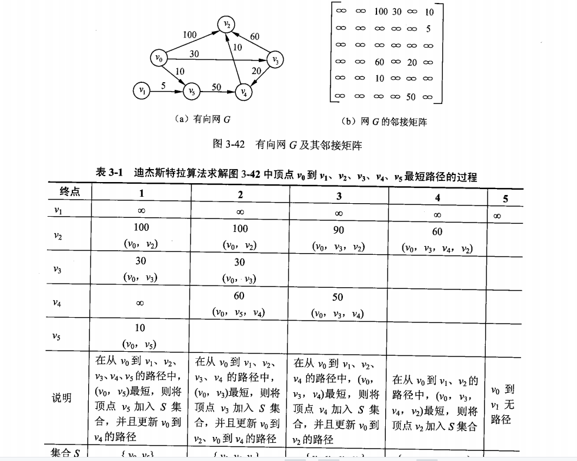
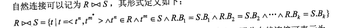
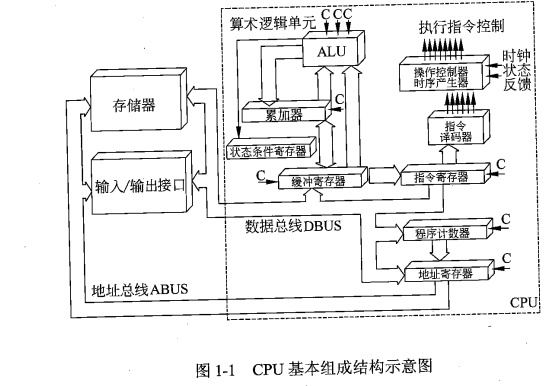
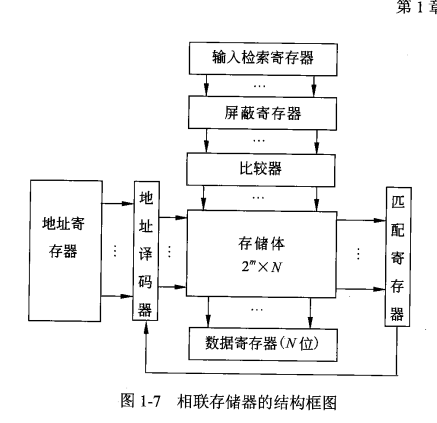
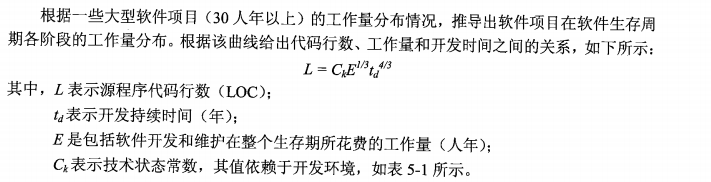

# 试题分布

## 综合知识

| 数据结构                     |
| ---------------------------- |
| 算法设计与分析               |
| 面向对象技术                 |
| 数据库技术基础               |
| 标准化和软件知识产权基础知识 |
| 程序设计语言基础             |
| 操作系统                     |
| 计算机网络                   |
| 软件工程                     |
| 结构化开发知识               |
| 网络与信息化安全基础         |
| 英语                         |
|                              |
|                              |
|                              |


## 案例分析

软件系统分析与设计


# 考试说明

1.考试目标

通过本考试的合格人员能根据软件开发项目管理和软件工程的要求,按照系统总体设计规格说明书进行软件设计编写程序设计规格说明书等相应的文档,组织和指导程序员编写、调试程序,并对软件进行优化和测试,开发出符合系统总体设计要求的高质量软件;具有工程师的实际工作能力和业务水平

2.考试要求

（1）掌握计算机内的数据表示、算术和逻辑运算方法;

（2）掌握相关的应用数学及离散数学基础知识；

（3）掌握计算机体系结构以及各主要部件的性能和基本工作原理；

（4）掌握操作系统、程序设计语言的基础知识，了解编译程序的基本知识；

（5）熟练掌握常用数据结构和常用算法；

（6）熟悉数据库与网络基础知识；

（7）熟练掌握一种结构化程序设计语言（C语言）和一面向对象程序设计语言（C++或Java）；（8）熟悉软件工程、软件过程改进和软件开发项目管理基础知识；

（9）掌握软件设计的方法和技术；

（10）了解信息化、常用信息技术标准、安全性,以及有关法律、法规的基础知识；

（11）正确阅读和理解计算机领域的英文资料。

[51CTO项目管理：软考电子版官方教材&辅导教材 + 官方真题+ 必考知识点6G资料包zhuanlan.zhihu.com/p/458476886](https://zhuanlan.zhihu.com/p/458476886)


3.考试科目设置

（1）计算机与软件工程知识,考试时间为150分钟；

（2）软件设计,考试时间为150分钟。

**二、考试范围**

考试科目1.计算机与软件工程知识

1.计算机系统基础知识

1.1计算机内数据的表示及运算

数的表示

非数值表示（字符和汉字表示、声音表示图像表示）

计算机中的二进制数运算方法

逻辑代数的基本运算

1.2其他数学基础知识

常用数值

计算排列组合、概率论应用、应用统计（数据的统计分析）

编码基础

命题逻辑、谓词逻辑、形式逻辑的基础知识

运筹基本方法

1.3计算机硬件基础知识

1.3.1计算机系统的组成、体系结构分类及特性

CPU、存储器的组成、性能和基本工作原理

常用I/O设备、通信设备的性能以及基本工作原理

I/O接口的功能、类型和特性

CISC/RISC、流水线操作、多处理机、并行处理

1.3.2存储系统

虚拟存储器基本工作原理，多级存储体系

RAID类型和特性

网络存储技术

1.3.3可靠性与系统性能评测基础知识

诊断与容错

系统可靠性分析评价

计算机系统性能评测方法

1.4计算机软件知识

1.4.1数据结构与算法知识

数组

链表

队列、栈

树

图的定义、存储和基本运算

杂凑（Hash表）

常用的排序算法、查找算法、数值计算、字符串处理、数据压缩算法、递归算法、图的相关算法

算法设计与分析

1.4.2操作系统知识

操作系统基本概念

处理机管理

存储管理

设备管理

文件管理

作业管理

操作系统的配置

1.4.3程序设计语言和语言处理程序知识

汇编、编译、解释系统的基础知识和基本工作原理

程序设计语言的基本成分(数据、运算、控制和传输),函数调用机制

各类程序设计语言的主要特点

1.4.4数据库知识

数据库系统基本概念

关系数据库理论

数据库设计

数据库语言

数据库新技术(非关系型数据库等)

1.5计算机网络知识

协议体系结构

传输介质与交换技术

常用网络设备与服务器

局域网络连接

Internet基础知识

TCP/IP协议

简单网络管理

1.6多媒体基础知识

2.系统开发和运行知识

2.1软件工程基础知识

软件生存周期与软件生存周期模型

软件开发方法

软件开发项目管理

软件工具与软件开发环境

软件过程改进(CMM等)

软件开发文档

2.2系统分析基础知识

系统分析方法与模型

2.3系统设计基础知识

系统设计的基本原理

软件体系结构基本概念

系统设计方法与模型

2.4软件测试基础知识

软件测试的基本概念

软件测试阶段

测试方法

测试用例设计

2.5系统运行和维护基础知识

系统维护的概念

系统转换

系统评价

2.6软件质量管理基础知识

软件质量特性(ISO/IEC9126软件质量模型)

软件质量保证

软件复杂性的概念及度量方法(Mccabe度量法)

软件评审(设计质量评审、程序质量评审)

软件容错技术

3.面向对象基础知识

面向对象的基本概念

面向对象分析与设计

分析模式与设计模式

面向对象程序设计

面向对象测试

4.网络与信息安全知识

信息安全基础

信息安全技术(加密与解密、认证、数字签名、摘要等)

网络安全技术

计算机安全等级及相关法律法规

5.标准化、信息化和知识产权基础知识

5.1标准化基础知识

5.2信息化基础知识

全球信息化趋势、国家信息化战略、企业信息化战略和策略

互联网相关的法律、法规知识

个人信息保护规则

远程教育、电子商务、电子政务等基础知识

企业信息资源管理基础知识

5.3知识产权基础知识

[51CTO项目管理：软考电子版官方教材&辅导教材 + 官方真题+ 必考知识点6G资料包zhuanlan.zhihu.com/p/458476886](https://zhuanlan.zhihu.com/p/458476886)


保护知识产权有关的法律、法规

6.软件开发新进展

软件开发新技术

云计算

大数据

应用领域进展

7.计算机专业英语

具有工程师所要求的英语阅读水平

理解本领域的英语术语

考试科目2.软件设计

1.结构化分析与设计

1.1需求分析

数据流图(DFD)

数据字典与加工逻辑

1.2数据流图变换

2.面向对象分析与设计

2.1统一建模语言(UML)

2.2基于用例的需求描述

2.3软件建模

2.4设计模式应用

3.数据库应用分析与设计

3.1E-R模型

3.2设计关系模式

3.3数据库语言(SQL)

3.4数据库访问

4.软件实现

4.1算法设计与分析

算法设计策略

算法分析

4.2程序设计

选择合适的程序设计语言

C语言程序设计

面向对象程序设计(C+或Java)

5.软件测试

单元测试

集成测试

系统测试

测试方法和测试用例

6.软件评审

6.1软件设计评审

6.2程序设计评审


# 标准化和软件知识产权基础知识P587

## 按范围划分

**国际标准**

**国家标准**

GB 国标 拼音首字母

ANSI  美国标准协会

BS british standard

JIS japanese industrialstandard 日本工业标准

**国家标准有效期一般是5年**


**区域标准**

CEN 欧洲标准化委员会

PASC 太平洋地区标准会议

**行业标准**

IEEE **美国电气与电子工程师协会**

**企业标准**

**项目标准**


## 性质分类

技术标准 管理标准 工作标准

## 对象和作用分类

卫生标准 安全标准 服务标准.....

## 法律约束性分类

强制 推荐

保障人体健康/人身/财产安全 必须是强制性标准

## 格式

ISO+标准号+[杠+分标准号]+冒号+发布年号

强制国标  GB sequence(最高5位)-Year(固定4位)

推荐国标  GB sequence(最高5位)-Year(固定4位)


行业: 金融(JR) 电子(SJ)...

地方: DBxx  如 北京11

企业 Q/企业代号


## 采用程度

1. 等同采用 国家标准对于国际标准 不改变技术内容的修改 idt
2. 等效采用 技术内容只有很小差异 eqv
3. 非等效采用  neq


## 知识产权

1. 文学 艺术和科学产品
2. 表演艺术家的表演 唱片和广播节目
3. 人类一切活动领域的发明
4. 科学发现
5. 工业品外观设计
6. 商标 商业名称 标志....
7. 制止不正当竞争
8. 工业/科学/文学艺术....


### 特点

1. 无形性

2. 双重性 财产权和人身权(没有直接财产内容的民事权利)的组合

3. 确认性

4. 独占性

5. 地域性

6. 时间性

   我国发明 20 年,实用新型10年,商标10年(可展期),

### **著作权(版权 无论是否发表)**

- **作者的署名权/修改权/保护作者完整权 没有限制**
- **作品发表权,财产权** **死后50年内**
- 软件著作权翻译: 原软件从一种设计语言转化成另一种程序设计语言
- 中华人民共和国著作权法+计算机软件保护条例

试卷是否是著作权的保护对象要看是否构成作品

**根据一件已有作品,利用改编 翻译 注释 整理等派生(演绎)作品,演绎作者对其具有完整的著作权(不得侵犯原作者的著作权)**

独占许可和独家许可的区别: 前者权利人不能使用该软件 


计算机软件著作自软件开发完成之日起50年内

1. 非职务期间创作(非本职工作的结果)

2. 与从事工作内容无关
3. 未使用单位的物质技术条件

满足以上条件,著作权属于开发者


委托开发的软件著作权

1. 书面合同
2. 无合同 属于受托人(开发者)


商业秘密的构成条件: 1. 未公开性 2.实用性 3.保密性


### 专利

**智力活动的规则和方法不能取得专利权,如游戏规则,算法,程序等.但进行智力活动的机器设备或程序等可以取得**

当多个申请人对同一种(相似)商品申请相同(相似)商标

1. 看申请时间
2. 同日申请,使用在先
3. 同日使用或均未使用,协商
4. 协商不成,抽签


# 面向对象技术 P363

## 基本概念

面向对象=对象(Object)+分类(Classification)+继承(inheritance)+消息通信(communication with message)

​	对象之间进行通信的一种构造叫做消息

​	类: 一组对象共同的行为和属性

​		实体类+接口类(边界类)  为用户提供一种与系统交互的方式+控制类


多态: 发送和接受消息的不同实现


绑定: 过程调用和响应调用需要执行的代码相结合

静态绑定: 编译时进行

动态绑定: 运行时进行


面向对象分析方法活动(OOA 面向对象分析):

**问题是什么**

1.  认定对象(**确定问题域)**
2. 组织对象(分析对象间的关系 继承)
3. 对象间相互作用(聚合 组合 关联)
4. 确定对象的操作
5. 确定对象的内部消息


OOD 面向对象设计

问题的解决方案,需要考虑细节问题

1. 识别类及对象
2. 定义属性
3. 定义服务
4. 识别关系
5. 识别包

原则:

1. 单一 责任原则 SRP   对于一个类而言,应该仅有一个原因引起它的而变化

2. 开发-封闭原则 OCP

3. 里氏替换原则 LSP 任何父类出现的地方都可以用子类替换

4. 依赖倒置原则 DIP  抽象不应该依赖细节,反之则是

   且高层模块/底层模块都 依赖抽象

5. 接口分离原则 ISP
6. 重用发布等价原则 REP 重用的粒度就是发布的粒度
7. 共同封闭原则 CCP  包内的类封闭性等价
8. 共同重用原则 CRP 包内的类重用性等价
9. 无环依赖原则 ADP
10. 稳定依赖原则 SDP
11. 稳定抽象原则 SAP


重置/过载 就是重写


类属是一种参数多态机制 类似于泛型


面向对象测试

1. 算法层  方法  单元测试
2. 类层
3. 模板层 一组协同工作的类之间相互作用
4. 系统层


## UML

基本构造块+构造块方式规则+ 公共机制

### 基本构造块

1. 事物

   - 结构 名词

     类 接口  协作 用例  主动类 构件 制品  结点

   - 行为 动词

     交互(消息)

     状态机

     动作

   - 分组

     包

   - 注释

2. 关系

   1. 依赖 描述了一组链 链是对象之间的连接
   2. 依赖关系: 一件事物发生改变影响到另一个事物
   3. 聚合关系: 整体和部分生命周期不同的关系
   4. 组合关系: 整体和部分生命周期相同的关系

   依赖 有方向的虚线 

   ​	变体: 精华/跟踪/包含/延伸

   关联 无方向的实线 重复度+角色

   ​	聚合是一个特殊的关联 

   泛化  generalization 继承

   实现

    1. 接口和实现类

    2. 用例和协作

       ​	

3. 图

   类图 对象图 用例图 序列图  通信图

   状态图 活动图  构件图  组合结构图 部署图

   包图 交互概览图  计时图

   序列图  通信图 交互概览图  计时图 被称为交互图


序列图: 以时间顺序组织对象之间的交互活动


状态图


状态+转化(事件+监护条件+动作/原子计算)+事件+活动


通信图


**对象之间的消息流及顺序**


活动图

时间计算


活动	前驱	最早开始时间	最晚开始时间	时差（冗余时间）
AB		1	1	0
BD	AB	4	4	0
BI	AB	4	5	1
DI	AB,BD	9	9	0
IJ	AB,BD,DI,BI	11	11	0
AE		1	4	3
EG	AE	5	8	3
GJ	AE,EG	8	11	3
JL	AB,BD,BI,DI,IJ,AE,EG,GJ	13	13	0
AC		1	5	4
CF	AC	6	10	4
FH	AC,CF	9	13	4
GH	AE,EG	8	11	3
HK	AE,EG,GH,AC,CF,FH	11	14	3
JK	AB,BD,BI,DI,IJ,AE,EG,GJ	13	16	3
KL	AB,BD,BI,DI,IJ,AE,EG,GJ,JK,GH,AC,CF,FH,HK	15	18	3

正推求最早开始时间

ETB⋅=MAX(ETAB+wAB)

正推求最晚开始时间

LTJK=MIN(LTK⋅−wJK)

由上述表格可知，A B 、 B D 、 D I 、 I J 、 J L AB、BD、DI、IJ、JLAB、BD、DI、IJ、JL 活动的时差为 0 00，即为关键节点，因此关键路径为 A → B → D → I → J → L = 20 


部署图(网络图) 软件组件和硬件之间的物理关系

组件图 物理结构和构建之间的依赖关系

## 设计模式

构建型模式

- 抽象工厂

  **围绕一个超级工厂创建其他工厂。该超级工厂又称为其他工厂的工厂**

  一个产品族 就是同一个品牌下的产品

  一个产品等级 就是同一种不同品牌的产品

  

  缺点: 产品等级扩展困难

- 生成器(Builder)

  复杂对象的构建与表示分离,使得同样的构建过程可以创建不同的表示

- 工厂方法(Factory method)

  工厂父类负责定义创建对象的公共接口，而子类则负责生成具体的对象

  **将类的实例化（具体产品的创建）延迟到工厂类的子类（具体工厂）中完成**，即由子类来决定应该实例化（创建）哪一个类

- 原型

  用原型实例指定创建对象种类，并通过拷贝原型创建新的对象

  实现深拷贝:

  1. 重写clone 对每一个引用属性单独clone
  2. serializable 通过io流

  ```
              // 序列化
              bos = new ByteArrayOutputStream();
              oos = new ObjectOutputStream(bos);
              oos.writeObject(this);
              // 反序列化
              bis = new ByteArrayInputStream(bos.toByteArray());
              ois = new ObjectInputStream(bis);
              return (DeepPrototype) ois.readObject();
  
  ```

  

- 单例  保证一个类仅有一个实例,并提供一个全局访问点

结构型模式

- 组合模式

  体现部分和整体的层次结构时,以及你希望用户忽略组合对象与单个对象的不同,统一的使用组合结构中所有的对象时,就可以考虑使用组合模式

行为型模式 对象间职责分配

- 模板模式

  定义一个方法的操作骨架,将步骤延迟到子类中

  ```
  public abstract class Game {
     abstract void initialize();
     abstract void startPlay();
     abstract void endPlay();
   
     //模板
     public final void play(){
   
        //初始化游戏
        initialize();
   
        //开始游戏
        startPlay();
   
        //结束游戏
        endPlay();
     }
  }
  ```

  ```
  public abstract class Game {
     abstract void initialize();
     abstract void startPlay();
     abstract void endPlay();
   
     //模板
     public final void play(){
   
        //初始化游戏
        initialize();
   
        //开始游戏
        startPlay();
   
        //结束游戏
        endPlay();
     }
  }
  ```

- 责任模式

  使多个对象都有机会处理请求,从而避免请求的发送者和接受者之间的耦合关系.将这些对象连成一条链,并连着这条链传递该请求,直到有个对象处理 它为止

- 命令

  将一个请求封装为一个对象，使发出请求的责任和执行请求的责任分割开。这样两者之间通过命令对象进行沟通，这样方便将命令对象进行储存、传递、调用、增加与管理

  

- 解释器模式

  **给定一个语言，定义它的文法表示，并定义一个解释器，这个解释器使用该标识来解释语言中的句子**

  

  比如三加八加九减二乘五除三->3+8+9-2*5/3


* 迭代器模式

* 中介者

  **用一个中介对象来封装一系列的对象交互，中介者使各对象不需要显式地相互引用，从而使其耦合松散，而且可以独立地改变它们之间的 。**

  


# 数据结构


## 线性结构

特点: 数据元素之间呈现一种线性关系

### 线性表

1. 顺序存储
2. 链式存储


### 栈 队列

链栈

循环队列(环 通过整除取余运算实现)

​	判断队列满还是空 牺牲一个存储单元

​	队满 -队首指针在队尾指针的下一个位置时

​			Q.front == (Q.rear + 1) % MAXSIZE

​	队空 Q.front == Q.rear;


### 串


## 数组 矩阵 广义表

- 数组

  行向量形式的线性表 或 列向量形式的线性表

  这里的数组可以看作矩阵

- 特殊矩阵

- 稀疏矩阵

-  广义表

  线性表的推广 0个或多个单元素或子表组成的有限序列

  表尾=表-表头


## 树

- 一个结点的子树个数称为该结点的度

- 高度 根为第1层

- 结点数目=边(分叉)+1

- n个结点的完全二叉树  floor(log2n)+1

- 遍历

  - 先序
  - 中序
  - 后序
  -  层序

  二叉树的遍历本质上就是对一个非线性结构线性化的过程,二叉链表存储结构中,任意结点的前驱/后序只能在遍历的动态过程中才能得到,需要线索二叉树保存他们.

### 线索二叉树


其中0代表 某种遍历顺序的前驱/后继


### 最优二叉树

又称哈夫曼树,带权路径最短的树


- 构造

  每次取权值最小的叶子节点构成一颗新的二叉树,直到所有权值加入(权值和需要重新加入计算)

  构造的二叉树不唯一 但权值和唯一

  

- 哈夫曼编码

  等长编码->不等长编码

  频率越小 编码长度越长
  


## 图

## 定义

G=(V,E)  V是顶点  E是边

- 有向边(弧) <vi,ji>

-  无向边 (vi,ji)

- 完全图 任意结点跟其余n-1个结点都有边

- 度 [出度,入度]

- 回路/环  路径上第一个结点和最后一个结点相同

- 子图  G1的V,E 都是G2 V,E 的子集

- 连通图: 无向 G中任意两个结点连通(vi,vj有路径)

  连通分量: 极大连通子图

  强连通图/强连通分量   有向图

+ 网: 带权值的图
+ 有向树: 有向图有且仅有一个顶点入度为0,其他均为1


## 存储

### 邻接表

### 邻接矩阵


## 遍历

从某个结点触发,沿着某条搜索路径对图中所有结点进行访问且仅访问一次的过程

### DFS

[回溯法](https://so.csdn.net/so/search?q=回溯法&spm=1001.2101.3001.7020)（探索与回溯法）是一种选优搜索法，又称为试探法，按选优条件向前搜索，以达到目标。但当探索到某一步时，发现原先选择并不优或达不到目标，就退回一步重新选择(不一定需要访问所有结点)

```
public class DFSDemo {

    boolean found = false;//found：判断我们是否已经找到了终止顶点t，找到就不继续递归了
    

    public void dfs(int s, int t) {
        found = false;
        boolean[] visited = new boolean[v];//v:顶点的个数  visited：记录被访问的顶点，以防重复访问
        for (int i = 0; i < v; ++i) {
            prev[i] = -1;//prev：用来记录搜索路径。比如从是从顶点2访问到的顶点3，那么prev[3]=2，相当于反向存储
        }
        recurDfs(s,t,visited,prev);
        System.out.println(prev,s,t);
    }

    private void recurDfs(int w, int t, boolean[] visited, int[] prev) {
        if (found == true) {
            return;
        }
        visited[w] = true;
        if (w == t) {
            found = true;
            return;
        }
        for (int i = 0; i < adj[w].size(); ++i) {//adj相当于是一张邻接表矩阵
            int q = adj[w].get(i);
            if (!visited[q]) {
                prev[q] = w;
                recurDfs(q, t, visited, prev);
            }
        }
    }

}

```


### BFS


首先访问起始节点的所有子节点。这些孩子被视为“第二层”。 依次类推

如果最后存在未被访问的节点,再继续访问

queue+visited[]


### 生成树

n个结点 n-1条边 图的生成树不唯一

- 最小生成树(权值)

  - prime

    初始结点U={u0} 开始找最小的边 (u0,u1) 把u1添加到U中,对U的中所有结点求与非U结点构成的最短的边,依次添加,直到U=V

    适合边稠密的网

  - kruskal

    T=(V,{})

    选择代价最小的边,若该边的两结点分别在不同的连通分量则添加,否则舍去 直到所有结点在同一连通分量

    适合边稀疏的网

  ### AOV

  在现代化管理中，人们常用有向图来描述和分析一项工程的计划和实施过程，一个工程常被分为多个小的子工程，这些子工程被称为活动（Activity)，在有向图中若以顶点表示活动，有向边表示活动之间的先后关系，这样的图简称为AOV网

  - 拓扑排序

    AOV网中所有结点排成一个线性序列的过程

    有向图所有结点都在 拓扑序列中则认为无环

    

  - AOE 带权值有向图

  - 关键路径 从源点到汇点的路径中,长度最长的路径成为关键路径

  ### 最短路径

  迪杰斯特拉(dijkstra)

  

## 查找

#### 静态

1. 顺序 o(n)
2. 折半  o(logn)
3. 分块 索引顺序查找   优于1 差于2


#### 动态

1. 二叉查找树
2. avl=自平衡+二叉查找树
3. B树
4. hash表


### 排序

1. 冒泡 沉底算法

2. 选择 

   每次在未排序元素中选择极值与当前索引元素交换

3. 插入

   前n个元素是有序序列,插入新元素形成新的有序序列

4. 希尔 递减增量排序

   gap->h=ceil((h-1)/3)  h=arr.length

    每次间隔gap的序列进行排序(最后gap=1 整体插入排序)

5. 归并

   递归地对待排序序列左右排序,分为分解和合并排序两部分.

6. 快排

   在待排数列中,找到一个基准数字,小于排左边,大于排右边.然后对每个分区执行上述操作,直到每个分区只有1个数字

7. 堆排序

   堆: 每个节点都大于(小于)其子节点的值

   1. 创建最大堆
   2. 堆排序(堆调整) 将堆顶元素和底部元素交换,底部元素成为有序区,不参与之后的排序
   3. 调整堆有序

   不断重复2,3 直到全部有序

8. 基数排序

   1. 补全

   2. 按个位排序

   3. 按十位排序

      ......


# 操作系统

系统软件=操作系统+语言处理软件+链接程序+....

功能

1. 进程管理
2. 文件管理
3. 存储管理
4. 设备管理
5. 作业管理


分类:

1. 批处理= 单道(一次只有一个作业装入内存执行)+多道
2. 分时
3. 实时
4. 网络 = 集中模式+c/s+对等模式
5. 分布式
6. 微型计算机操作系统
7. 嵌入式


## 进程管理


静止指的是进程切换到了辅存 活跃则是在主存

### 同步与互斥

同步是合作进程的直接制约的问题,互斥是申请临街资源进程间的间接制约的问题

对互斥临界区管理的原则

1. 有空则进
2. 无空则等
3. 有限等待
4. 让权等待


**信号量**

S的意义: S>=0资源的可用数,S<0,其绝对值表示堵塞队列中等待该资源的进程数

P  申请资源

V  释放资源


高级通信原语(解决低级通信原语的缺陷)

1. 共享存储模式
2. 消息传递模式  send receive
3. 管道通信


### 管程Ｍｉｎｉｔｏｒ

采用资源集中管理的方法，将系统中的资源用某种数据结构抽象的表示出来．


### 进程调度

三级调度

1. 高级调度  输入池后备作业->就绪态
2. 中级调度 处于内存中的进程和盘交换区的进程交换
3. 低级调度  决定哪个就绪进程占用cpu


调度算法

1. FCFS

2. 时间片

   - 固定
   - 可变

3. 优先级

   - 静态
   - 动态

4. 多级反馈调度

   


### 死锁

产生的原因

1. 互斥条件
2. 请求保持条件
3. 不可剥夺条件
4. 环路条件


死锁的处理

1. 死锁预防  使系统时刻都不同时满足上述4个条件

   - 预先静态分配 预先分配资源 破坏不可剥夺
   - 资源有序分配 破坏环路

2. 死锁避免

   银行家算法: 保证分配资源后系统仍然处于安全状态

3. 死锁检测

   对资源分配不加限制,允许自锁产生

4. 死锁解除

   - 资源剥夺
   - 撤销进程 按照某种策略


### 线程

线程分为 用户级线程+内核支持线程

用户级线程不依赖内核,即创建,撤销,切换都不通过系统调用.而进程则不然,无论是用户进程,系统进程切换都依赖内核.


## 存储管理

1. 分区

   - 固定分区 内碎片
   - 可变分区  算法:
     - 最佳适应算法  将分区一分为二(最接近作业大小) 外碎片
     - 最差适应算法  将分区一分为二(最大)
     - 首次适应 低地址找到能装入的空白区
     - 循环首次适应 刚分配的开始找

   - 可重定位

     解决碎片问题  移动已分配的分区,使之成为连续区域

2. 分页

   

   

   ​	改进

   - 快表

     存储**最近活跃**的逻辑页号与物理块号的映射

   - 两级页表(目录)

3. 分段

   

   

4. 段页式

   

   

   5. 虚拟存储

      程序局部性:

      - 时间局限性 - 循环操作
      - 空间局限性 - 顺序执行

      实现:

      1. 请求分页
      2. 请求分段
      3. 请求段页

      在原机制基础上添加请求调页和页面置换功能

      每当所有访问的页面不在主存时便产生一个缺页中断

      

      **页面置换算法**

      1. 最佳置换算法

         需要确定哪个页面未来最晚被访问,很难,通常用来评价其他算法

         缺页率=缺页中断次数/访问次数

      2. FIFO

         淘汰最先进入主存的页面

         最直观,性能最差

         可能出现Belady现象 : 分配的物理块增多缺页率反而增多

      3. LRU 最近最少使用

         每个页面设置一个访问字段,记录这个页面自上次被访问以来经历的时间 T,淘汰T最大的

      4. NUR 最近未用

         类似于LRU 

         被访问置1

         被淘汰时,1->0 继续检查下一页 ; 0直接被淘汰


​		工作集: 某段时间间隔里进程实际要访问的页面集合


## 设备管理

分类

1. 数据组织方式分: 块设备(以数据块为单位组织和传送数据)+字符设备

2. 按照功能

3. 从资源分配角度 独占设备 共享设备 虚拟设备等

4. 数据传输率

   

   


### 设备管理采用的技术

1. 通道

   使数组传输独立于CPU,使CPU从繁琐的I/O工作中解脱出来 

2. DMA  直接内存存取

   主存与I/O设备间数据块传输 实际操作由DMA硬件直接完成,并且在传输结束发出一个cpu中断请求(程序切换)

3. 缓冲技术

   主存与I/O设备

4. spooling

   	


### 磁盘调度

访问磁盘最耗时的是寻道时间

算法

1. FCFS 未对寻道优化 平均寻道时间长

2. SSTF 最短寻道时间优先

   访问的磁道与磁头距离最近 但不能保证平均寻道时间最短

3. SCAN

   磁头方向 从里->外 从外->里 执行SSTF

4. CSCAN 单向SCAN

   规定磁头方向只能一向


### 文件管理

文件逻辑结构

1. 有结构的记录式文件

   - 定长记录
   - 非 定长记录

2. 无结构的流式文件

   Unix中所有文件都视为流式文件


文件物理结构

1. 连续

2. 链接

3. 索引

   每个文件建立一个索引表,记录文件信息的逻辑块号与物理块号的映射

4.  多个物理块的索引

   组织方式:

   - 链接文件
   - 多重索引


文件控制块 FCB

1. 基本信息类
2. 存取控制类
3. 使用信息类


目录结构

1. 一级 单用户环境
2. 二级 主目录+用户目录 
3. 多级 树形目录结构


文件存取

1. 顺序
2. 随机


文件存储空间管理

1. 空闲区表

2. 位示图

3. 空闲块链

4. 成组链接

   若干空闲块分成若干组,每组的第一个空闲块登记了下一组空闲块的物理块号和空闲总数;0代表最后一组


文件共享

1. 硬链接 不同文件名与同一文件实体的链接 ln
2. 软链接 ln -s


文件保护

rwx


文件系统的安全

1. 系统级
2. 用户级
3. 目录级
4. 文件级


文件系统的可靠性

1. 转储和恢复
2. 日志文件
3. 文件系统的一致性


## 作业管理

作业是系统为完成一个用户的计算任务(或一次事务处理)所做的工作总和.

作业=程序+数据+作业说明书


作业控制

1. 脱机 全自动
2. 联机 需要人工干预


作业调度算法

1. FCFS

2. 短作业优先

3. 响应比高优先  R=作业响应时间/作业执行时间

   作业响应时间=作业等待时间+作业执行时间

4. 优先级调度

5. 均衡调度


作业调度算法评估

提交时间a,执行事件b,完成时间c

平均周转时间 t1=SUM(c-a)/n

平均带权周转时间 SUM((c-a)/b)/n

平均周转时间和平均带权周转时间越小越好


用户界面

用户+计算机通信的软/硬件部分


# 数据库技术基础 P469

数据是描述事物的符号记录,具有多种表现形式,如文字 图形等

信息是具有特定意义的数据


DBS组成

1. DB 数据集合
2. 硬件
3. 软件 包括操作系统 DBMS 应用程序
4. 人员
   - 系统分析员和数据设计人员
   - 应用程序员
   - 用户
   - DBA


DBMS组成

1. DDL
2. DML crud
   - 宿主型 嵌入到某种主语言
   - 自含型 单独使用

3. 数据库运行管理
4. 数据的组织 存储和管理
5. 数据库的建立和维护
6. 其他功能 DBMS的网络通信功能


DBMS的特征

1. 数据结构化且统一管理
2. 有较高的数据独立性(**数据与程序独立**)
3. 数据控制功能
   - 安全性
   - 完整性
   - 并发控制
   - 故障恢复


DBMS分类

1. 关系型数据库系统

2. 面向对象的数据库系统

   支持以对象形式对数据建模的数据库管理系统

3. 对象关系数据库系统

   在关系型数据库系统基础上提供元组/数据/集合等数据可行和相关操作

   

DBS的体系结构

1. 集中式 DBS

   所有功能都放在一台服务器上

2. C/S DBS

   一些功能放在前端机(C),一些功能放在后台机(S)


​	数据库服务器分类

- 事务服务器(查询服务器)  c发出执行一个动作的请求,服务器响应c的请求,并将执行结果返回给c

- 数据服务器 cs交互,以文件或页为单位对数据进行读取或更新

3. 并行体系结构

   多个物理上连在一起的CPU

   - 共享内存式
   - 无共享式

4. 分布式
   - 物理上分布 逻辑上集中
   - 物理上分布 逻辑上分布


数据库的三级模式


1. 概念模式(模式)

   数据库中全部数据的**逻辑结构**和特征的描述,由若干概念记录(元记录)组成.概念模式的具体值成为模式的一个实例

2. 外模式(用户模式)

   用户与数据库系统的接口,是用户用到的那部分数据的描述

3. 内模式(存储模式)

   数据**物理结构**和存储方式的描述,是数据在数据库内部的表示方式 如按照B树存储


数据库的两级映像

1. 模式/内模式

2. 外模式/模式


## 大数据

特征

1. 大量化 体量巨大
2. 多样化 数据类型繁多
3. 价值密度低  大量不相关的信息
4. 快速化 处理速度快


## 数据模型

模型是对现实世界特征的模拟和抽象

数据模型是对现实世界数据特征的抽象

1. 概念数据模型

   主要用于数据库设计 如E-R

2. 基本数据模型

   用于DBMS的实现

   层次模型 网状模型 关系模型和面向对象模型


三要素

1. 数据结构
2. 数据操作
3. 数据的约束条件


### E-R

​	E-R模型只能说明实体间的语义联系,不能进一步详细说明数据结构.

1. 实体 矩形

2. 联系 菱形

   1:1  E1的一个实体**最多**与E2的一个实体相联系

   1:n

   m:n

   同一个实体集的二元联系

   

3. 属性 椭圆
   - 简单属性和复合属性
   - 单值属性和多值属性
   - NULL属性
   - 派生属性

线段: 属性+实体集  实体集+联系集 联系集+属性


扩充的E-R

1. 弱实体

   该实体必须以另一个实体为前提

2. 特殊化 普遍化

   学生 <-> 大专生 本科生 研究生

   

    双线 全特殊化

   U  特殊化

   d 不相交特殊化 o重叠特殊化


## 基本数据模型

1. 层级 树状
2. 网状 特殊的层级模型,并且允许两个结点有多种联系
3. 关系 表格  描述的一致性
4. 面向对象 存储对象以对象为单位


关系数据库

1. 属性和域(取值范围集合)
2. 笛卡尔积和关系


3. 模式

   关系的描述称为关系模式

   R(U,D,dom,F)

   U组成关系的属性名集合

   D 属性的域

   dom 属性向域的映射 如dom(A)=B  指A属性的取值为B属性的值 A相当于B的别名列

   F 属性间数据的依赖关系集合

4. 完整性约束

   - 实体完整性 关系R的主键不能为null
   - 参照完整性 外键
   - 用户完整性  反映某一具体应用所涉及的数据必须满足的语义要求

5. 关系运算

   

   R,S具有相同的关系模式  并/差

   笛卡尔积

   投影(垂直)  在关系R中选出若干属性列A组成新的关系

   

   选择(水平)

   

   

6. 关系运算(扩展)

   

   

   等值连接 X=Y

   自然连接

   1. 一种等值连接(属性组 每个属性等值)
   2. 比较分量必须是相同的属性组  
   3. 结果集中去掉重复属性列 即返回列为R并S

   

   R/S 

   1. 列是R-S
   2. 属性值为同时拥有所有S值的记录在R-S的投影

   

   广义投影 允许在投影列表中使用算数运算

7. 外连接

   左外连接

   右外连接

   全外连接  左外连接 并 右外连接


## 关系数据库SQL

标准

1. ANSI SQL
2. ANSI SQL修改后采用的标准SQL92(SQL2)
3. 在SQL2上的  SQL-99(SQL3)


## 视图

```
create view cs-student
as
select Sno,Snmae
form student
where Sd='计算机'
with check option;
```

1. with check option保证进行更新操作时满足视图定义中的子查询条件表达式

   **视图(虚拟表)对用户表来说跟普通表没有差异,都可以crud**

2. 由于view没有指定列,则为select子查询目标列


## SQL


比如

```
select a,b
form t1
where c<ALL(select d ...)
```


## 		权限控制

grant <权限>[,<权限>] on <对象类型><对象名> TO <用户>[,<用户>] [with grant option]


1. public指代是全部用户
2. 指定with grant option,则该用户还可以将这些权限给其他用户


revoke<权限>[,<权限>] on <对象类型><对象名> from <用户>[,<用户>] 


## 嵌入式SQL与主语言通信

1. SQL通信区向主语言传递SQL语句执行的状态信息
2. 共享变量  into xxx
3. 游标


## 关系数据库的规范化

关系数据库设计理论的核心是**数据间的函数依赖**

数据依赖是通过一个关系中属性间值的相等与否体现出来的数据间的相互关系

函数依赖是一种基本的数据依赖

1. 函数依赖  R(U)是属性集U上的关系模式(关系类型),X Y是U的子集

   对于R(U)任何一个可能的关系r(笛卡尔积的子集,记录集),r中不可能存在两个元组在X上的属性值相同

   Y则不一定  哪个X决定Y X->Y

2. 非平凡函数依赖  Y不是X的子集

3. 完全函数依赖 对于X的任何一个真子集都不能决定Y

4. 依赖传递  X->Y  Y->Z  => X->Z

5. 码(键 候选键)

6. 主属性 包含在任何一个候选键中的属性


## 范式

范式有1NF 2NF  3NF 4NF 5NF

**1NF**

若关系模式R的每一个分量都是不可再分的数据项,则R为第一范式

如FIRST(Sno,Sname,Status,City,Pno,Qty)

F={Sno->Sname,Sno->Status,Status->City,(Sno,Pno)->Qty}

问题:

1. 冗余度大
2. 引起修改操作的不一致性
3. 插入异常 关系模式实体完整性(主键不能为空或部分取空值)
4. 删除异常


**2NF**

当1NF消除了非主属性对码的部分依赖

FIRST的码是Sno,Pno  Sno->Status 部分依赖

FIRST1=(Sno,Sname,Status,City)

FIRST2=(Sno,Pno,Qty)


**3NF**

当2NF消除了非主属性对码的传递函数依赖 X->Y  Y->Z  => X(码)->Z(非主属性)

FIRST1  Sno->Status Status ->City

FIRST11 =(Sno,Sname,Status)

FIRST12 =(Status,City)


## 数据库的控制功能

### 事务

事务定义语句

1. begin transaction
2. commit
3. rollbcak


ACID

Atomic 原子性

consistency 一致性: 事务的执行结果必须保证数据库从一个一致性状态转变到另一个一致性状态

isolation 隔离性 : 事务的隔离 多个事务并发执行时,任一事务的更新操作直到成功提交的整个过程,对其他事务都是不可见的

durability 持久性: 一旦事务成功提交,其更新操作将永久有效


### 备份与恢复

故障: 

1. 事务故障
2. 系统故障
3. 介质故障
4. 计算机病毒


备份方法

1. 静态转储和动态转储(转储过程中允许对数据库进行存取更新等操作)

2. 海量(全量)转储和增量转储

3. 日志文件

   

通过日志恢复

-  反向扫描日志文件(从最后往前扫)
- 对事务更新操作执行逆操作
- 重复上述操作,直到事务的开始标志


### 并发控制

1. 并发带来的问题

   

2. 解决

   排他锁 X 共享锁 S

   三段封锁协议

   - 一级封锁协议 

     事务在修改数据R之前必须要对其加上X锁,直到事务结束后释放(R/C)

     解决了丢失修改和读脏数据

   - 二级封锁协议 

     在一级封锁协议基础上,加上事务读数据R之前必须对其加S锁,对完后即释放

   - 三级封锁协议 

     在一级封锁协议基础上,加上事务读数据R之前必须对其加S锁,直到事务结束后才释放S锁

     解决了不可重复读

3. 多个事务并发执行时正确的,当且仅当可串行化(两者执行结果相同)

4. 封锁的粒度: 封锁对象的大小

   ​	


# 程序设计语言基础

## 基本概念

1. 低级语言: 机器语言(0, 1)+汇编语言

   高级语言

2. 汇编程序: 汇编源程序->机器程序 

   解释: 翻译源程序时不生成独立的目标程序

   编译:  翻译源程序时生成独立保存的目标程序

3. 程序设计语言=语法+语义+语用+语境

   语法: 程序设计语言的基本符号组成程序中各个语法成分的一组规则

   语义: 各个语法成分的含义

   - 静态 编译时就能确定
   - 动态 运行时刻才能确定

   语用: 符号和使用者的关系

   语境: 理解和程序设计语言的环境 包括编译环境 和运行环境 


 程序设计语言分类

1. 命令式(结构化)
2. 面向对象
3. 函数式 lambda
4. 逻辑型  prolog 建立在关系理论和一阶谓语理论基础上


 程序设计基本成分

1. 数据
   - 常量和变量
   - 全局量和局部量
   - 数据类型
2. 运算  允许使用的运算符号和运算规则
3.  控制
   - 顺序
   - 选择
   - 循环
4. 传输 赋值,数据的输入/输出
5. 函数


## 汇编语句

1. 指令语句

   传动,算数,逻辑,移位,转移和处理 如add and

2. 伪指令语句

   经汇编后不产生机器代码,指令语句则不然

   如为变量分配存储空间等

    汇编时完成,指令语句运行时完成

3. 宏指令语句

   将多次重复使用的程序定义为宏


## 编译程序原理


1. 词法分析

   对源程序(看作一个多行字符串)拆分成单词并分析其结构(类型 如保留字,标识符等)

2. 语法分析

   用语法规则(语法单位的构成规则)将单词符号序列分解成各类语法单位

   如果源程序没有语法错误,则语法分析后就能正确构造其语法树

   

3. 语义分析

   分析各语法结构的含义,主要工作是进行类型分析和检查 如取余运算只能对整型数据进行.

4. 中间代码生成

   与具体的机器无关

   其实现方式通常采用四元式 形式为

   

5. 代码优化

6. 目标代码生成

   把中间代码转变成特定机器上的绝对指令(或可重定位)代码或汇编指令代码

   也就是机器指令形式和汇编语言形式

7. 符号表管理 记录源程序中各个符号的必要信息
8. 出错处理


## 文法


语言L是字母表字符串的集合

文法四元组:
$$
G=\left( V_N,V_T,P,S \right)
$$
Vn  非终结符集 非空

Vt  终结符集 非空

V=Vn U Vt

P 产生式集合  
$$
\alpha \rightarrow \beta
$$
a 产生式左部  V+元素 且至少包含一个非终结符号

b 产生式右部  V*元素 即可以为null
$$
S\in V_N
$$
开始符号至少要从一个产生式左边出现


### 文法分类

符合上述文法定义 即为0型文法

**1型文法**

对于任何产生式a->b 均满足 |a|<=|b| (|x|表示x中文法符号个数)

上下文有关文法 对 非终结符的替换必须考虑上下文


**2型文法**

对于任何产生式A->b
$$
A\in V_N,b\in V^*
$$
上下文无关文法


**3型文法**

对于任何产生式 A->a 或 A-> aB(或A->Ba)
$$
A,B\in V_N,a\in V_T
$$
正规文法


### 句子和语言

1. 推导

   从S出发,反复使用产生式,将产生式中的非终结符替换为右部的文法符号序列,直到产生一个终结符序列为止

   直接推导: 显然每个产生式都是一次直接推导

2. 规约/直接规约(推导的逆过程)

   a=>b  b 可规约成a

3. 


## 词法分析

语言中具有独立含义的最小语法单位是符号(单词)

此法规则可以用3型(正规)文法描述


**有限状态机**

1. DFA 确定有限状态机

   

   

   状态转化矩阵M[A,a]=b 当前状态为A,输入为a	时应转化为的下一个状态时b

   DFAM所能识别的语言L(M)={w|w是从M的初态到终态的路径上的弧上标记所形成的串}

   

2. NFA

   


3. NFA到DFA的转化

   

   


4. DFA最小化

      当且仅当任意可能的输入序列，无论哪个状态作为起始状态，只要两个状态Si和Sj产生的输出序列相同，则认为两个状态Si和Sj是等效的

   2-10中 q1和q3等效 留下q3即可

   

5. 正规式转有限机

   

6. 有限机转正规式

   

7. 词法分析器的构造

   

8. 语法分析

   

   - 上下文无关(2型)

     对于任何产生式A->b
     $$
     A\in V_N,b\in V^*
     $$
     

     

   - 自顶而下语法分析

     最左推导

     

     1. 消除文法左递归
        - 消除直接左递归
        - 消除文法中的一切左递归
     2. 提取公共左因子
     3. LL(1)文法
     4. 递归下降分析法
     5. 预测分析法
     6. 

   - 自底而上语法分析

     移进-规约 

     LR分析法

9. 语法制导翻译

   一种静态语义分析

10. 中间代码

    - 后缀式(逆波兰式)

      运算符写在运算对象的后面

      x=(a+b)*(c+d)   xab+cd+\*=

    - 树形

    - 三元表达式 OP ARG1 ARG2

    - 四元表达式 OP ARG1 ARG2 RESULT

    其中树和后缀适合解释器,而编译器多采用与机器指令格式较接近的四元式形式

11. 常见语法结构的翻译

    如算数表达式 布尔表达式 赋值表达式 控制语句等


# 计算机网络P11

## 计算机系统基础



cpu修改PC的内容,以便使其保持的总是将要执行的下一条指令地址

多核即在一个单芯片上集成两个甚至更多个处理器内核,

每个内核部件的完整性与单核cpu内核完全一致


原码


反码


补码


​	小数是最低位+1 即 2^-(n-1)

移码 

常用于表示浮点数中阶码

整数 2^(n-1)+X   小数 1+X


定点小数 小数点在最高有效数值位之前 也就是纯小数

浮点数


## 校验码

1. 奇偶校验码

   增加1位校验位 使编码中1的个数是奇数(奇校验)或者偶数(偶数)

   0表示是 1表示否

2. 海明码

   k位校验码

   

   偶校验 G1...G4 全为0 表示无错(奇校验 全为1)

3. 循环冗余校验码 CRC

   模2算法


## 计算机体系结构

分类

指令系统

- CISC complex
- RISC reduced
  - 重叠寄存器窗口技术

- 指令控制方式

  - 顺序方式

  - 重叠方式 通常是一次重叠

  - 流水方式

    


## 存储系统

- 构成材料分类: 磁 半导体 光
- 工作方式 
  - ＲＡＭ　读写
  - ＲＯＭ
    - ROｍ　read  only
    - PROM
    - EPROM
    - EEPROM 电可擦除
    - FLASH　MEMORY 介于EPROM和EEPROM 之间

- 按访问方式: 按地址访问和按内容访问

  相联存储器(按内容访问)

  

  

- 按寻址方式分类

  - 随机存储器 访问任何一个存储单元所需的时间是相同的
  - 顺序存储器 访问数据所需要的时间根数据所在存储位置有关,如磁带
  - 直接存储器 介于上述两者之间


### 高速缓存映射


1. 直接映射法

   主存地址=区号+区内块号+块内地址

   缺点: cache只能映射**不同区号相同块号**的内存块(相联存储器的key为区号)

2. 全相联映像

   主存地址=块号+块内地址

   缺点: 无法从主存块号直接获得cache块号,变换复杂,速度慢

   

3. 组相联映像

   前面两种的折中

   先将cache的块在分组 N;主存分区,区内同样分N组

   组直接映射(也就是主存的X组只能存到Cache的X组中)

   组内的块全相联映像


### 替换算法

尽可能提高Cache的命中率

1. 随机替换
2. FIFO
3. RLU 最近最少使用
4. 优化替换 需要先执行一次程序,统计cache替换情况


### 虚拟存储器


逻辑存储器,对物理存储设备的逻辑化处理,用户可以充分利用异构平台的存储空间,从而达到最优的使用效率


### 磁盘


磁盘阵列技术

RAID 冗余磁盘阵列


## IO

外设数据的I/O

- 直接程序控制 CPU执行程序控制
  -  无条件传送 外设总是准备好的
  - 程序查询方式 

- 中断

  cpu接到中断信号后,保存正在执行程序的现场,**转入I/O中断服务的执行**

  - 多中断信号线
  - 中断软件查询
  - 菊花链法 硬件查询法
  - 总线仲裁法 一个I/O发送中断信号之前,必须先获得总线控制权
  - 中断向量法 中断向量表保存保存各个中断源的中断 服务程序的入口地址

  中断优先级

  存在优先级更高的中断源发出中断请求,**cpu暂时中断正在执行的中断服务程序转而执行该中断服务程序**,存在中断嵌套

- DMA

- 通道,又称IOP 分担了一部分CPU的功能,实现了外围设备的统一管理


## 总线

1. 数据总线 

   传送数据 双向 决定了cpu和计算机其他设备交换数据的位数

2. 地址总线

   传送Cpu发出的地址信息 单向 决定了CPu最大的寻址能力

3. 控制总线

   传送控制信号 时序信号和状态信息等


## 计算机安全

技术安全性,管理安全性和政策法律安全性

A1,B1~B3,C1~C2,D


### 加密

数据加密技术的关键在于加密/解密算法和密钥管理

- 对称加密 

  **使用相同的密钥而不是加密/解密算法相同**

  - DES
  - 3DES 三重DES
  - AES

- 非对称加密

  需要公钥和私钥

  如果用公钥加密,只能用对应的私钥解密;反之亦然

  加密时间长,速度慢,只适用少量数据加密

  - RSA

    


密钥管理

1. 密钥产生  密钥对产生是申请证书的重要一步
2. 密钥备份和恢复
3. 密钥更新
4. 多密钥管理 KDC 类似注册中心


认证技术

解决网络通信过程中通信双方的身份认可.认证的过程涉及加密和密钥交换

认证方一般有账户/口令认证 摘要算法认证 PKI(public key infrastructure)认证

- PKI 密钥管理平台 提供加密和数字签名等加密服务和密钥和证书管理体系

- 摘要算法认证

  信息摘要(Message digest)简要地描述了体格较长的信息或文件

  MD5

- 数字签名

  1. 生成MD
  2. 用私钥加密(签名)MD
  3. 发送信息和加密后的MD
  4. 接收方同样对信息生成MD,解密MD,两者比较


- SSL  secure sockets layer
  1. 用户和服务器的合法性认证
  2. 加密传送的数据
  3. 保护数据完整性
- 数字时间戳技术


## 计算机可靠性

平均无故障时间(两次故障之间系统能正常工作的时间)

 1/入

串联 R=R1R2....Rn

并联(只要有一个子系统能正常工作系统就能正常工作)

R=1-(1-R1)(1-R2)...(1-Rn)

​	


## 计算机性能评价

1. 时钟频率

2. 指令执行速度  MPIS

3. 等效指令速度法

   

4. 数据处理速率 PDR 对CPU和主存额速度进行度量 

   指令和操作数位数/指令的平均执行速度

   

5. 核心程序法
6. 基准测试程序
   - 整数
   - 浮点
   - SPEC
   - TPC


# 计算机网络P531

分类

按通信距离 LAN MAN(城域网) WAN(广域网)


### 拓扑结构

网络中通信线路和结点的几何排列


## 网络互联设备

1. 物理层的互联设备

   - 中继器 两个局域网段间实现电气信号的恢复和整型
   - 集线器 特殊的多路中继器,也具有信号放大功能(有源)

2. 数据链路层的互联设备

   - 网桥 滤帧
   - 交换机 地址表(端口-MAC地址) 不存在广播
     - 端口交换
     - 帧交换
     - 信元交换

3. 网络层的互联设备

   路由器 路由转发

4. 应用层的互联设备

   网关 连接不同类型且协议差别较大的网络(协议转换)


## 传输介质

有线介质

- 双绞线
- 同轴电缆
- 光纤

无线介质

- 微波
- 红外线和激光
- 卫星


## LAN协议


以太网 IEEE802.3

CSMA/CD  载波监听多路访问/冲突检测 协议

- 竞争方式获取传送的权利


令牌环网 IEEE802.5

环型(最典型),星型(采用最多)

差分曼特斯特编码

只有拥有令牌(很小的帧)的工作站才有权利发送信息


FDDI 光纤分布式数据接口


CSMA/CD -> CSMA/CA


## TCP/IP 协议族

特征

1. 逻辑编址
2.  路由选择
3. 域名解析
4. 错误检测和流量控制
5. 对应用程序的支持


1. ip

   无连接: a在没有确定目标系统在做好接收数据准备之前就发送数据

   不可靠的: 目标系统不对成功接收的分组进行确认

   错误检测和流量控制让其他各层协议实现

2. ARP 地址解析协议  ip->Mac地址 通过高速缓存

3. RARP 反地址解析协议  Mac地址->ip

4. ICMP 利用IP传送报文,并在次基础上添加发生差错时报告的机制  如ping

5. TCp

   面向连接

   可靠

   全双工: 可以同时（瞬时）进行信号的双向传输（A→B且B→A） 如电话  半双工则是同一时间段A或B只能有一个动作发生 如对讲机

   重发技术


6 UDP

​	不可靠

​	无连接


## Internet


NAT 解决IPV4地址短缺

A 类：10.0.0.0～10.255.255.255

B 类：172.16.0.0～172.31.255.255

C 类：192.168.0.0～192.168.255.255

上述三个范围内的地址不会在因特网上被分配，因此可以不必向ISP 或注册中心申请而在公司或企业内部自由使用。

借助于NAT，私有（保留）地址的"内部"网络通过[路由器](https://baike.baidu.com/item/路由器?fromModule=lemma_inlink)发送[数据包](https://baike.baidu.com/item/数据包?fromModule=lemma_inlink)时，[私有地址](https://baike.baidu.com/item/私有地址?fromModule=lemma_inlink)被转换成合法的IP地址，一个局域网只需使用少量IP地址（甚至是1个）即可实现私有地址网络内所有计算机与Internet的通信需求。


ipv6 32->128

DNS 域名地址 <-> ip地址  本地域名服务器 -递归->高层域名服务器 

Email  C/S  SMTP(发信) POP3(收信和发信)


## 信息安全

1. 机密性
2. 完整性
3. 可用性
4. 可控性
5. 可审查性


信息存储安全

1. 用户的标识与验证
2.  用户存取权限限制
   - 隔离控制法
   - 限制权限法 用户权限
3. 系统安全监控
4. 计算机病毒防治


计算机信息安全保护等级

1. 用户自主
2. 系统审计
3. 安全标记
4. 结构化
5. 访问验证


# 软件工程 P251

## 概述


基本原理

1. 用分阶段的生命周期计划严格管理
2. 坚持进行阶段评审
3. 实现严格的产品管理
4. 采用现代程序设计技术
5. 结果应能清楚地审查
6. 开发小组的人员应该小而精
7. 承认不断改进软件功能实践的必要性


软件生命周期

1. 可行性分析与项目开发计划

2. 需求分析

3. 概要设计 每个模块都跟某些功能需求相对应

4. 详细设计  对每个模块完成的功能进行具体描述

   ​					精确的,结构化的过程描述

5. 编码

6. 测试

7. 维护


## 软件过程模型

软件过程: 软件开发中所遵循的一系列可预测的步骤(路线图)

CMM(阶段式模型)

1.  初始级
2. 可重复级
3. 已定义级
4. 已管理级
5. 优化级

CMMI=CMM+连续式模型


1. 瀑布模型

   生命周期的各个活动规定为依线性顺序连接

   

   

    容易理解,管理成本低

   项目风险控制能力差

2. 增量模型

   

   瀑布模型的改进

   管理发生的成本 进度和配置复杂

3. 演化模型 

   迭代的过程模型,适用于对软件需求缺乏准确认识的情况

   - 原型

     系统规模不是很大也不复杂

     开始于沟通交流

     

   - 螺旋

     复杂的大型软件

     螺旋模型=瀑布模型+演化模型

     强调风险分析

     

4. 喷泉模型

   以用户需求为动力,以对象为驱动的模型,适合面向对象的开发方法

   允许各个阶段交叉 迭代地进行

   

   

5. 基于构件

   利用预先包装的构件来构造应用系统

   本质上是演化模型,需要以迭代方式构建软件

   

6. 形式化方法模型

   建立在严格数学基础上

7. 统一过程(UP)模型

   用例和风险驱动,以架构为中心,迭代且增量

   这里的迭代指的是将整个软件开发项目划分成许多小的"袖珍"项目

8. 敏捷方法

   - 极限编程
   - 水晶法
   - 并列争求
   - 自适应软件开发
   - 敏捷同一过程

## 测试

确认测试(验收测试)

- alpaha 开发者的场所  客户测试	
- beta  最终用户场所执行


系统测试

- 恢复
- 安全性
- 压力
- 性能

- 部署


测试方法

黑盒

- 等价类划分 有效等价集合+无效等价集合
- 边界值分析
- 错误推测 经验和直觉
- 因果图 判定表


白盒

- 逻辑覆盖
  - 语句覆盖
  - 判定覆盖 每个判断的取真分支和取假分支至少经历一次
  - 条件覆盖 使**每个判断中每个条件**的可能取值至少满足一次,条件覆盖不一定包含判定覆盖，条件覆盖并不考虑判定结果
  - 判定-条件覆盖
  - 条件组合覆盖 条件组合覆盖准则满足判定覆盖，条件覆盖和判定-条件覆盖
  - 路径覆盖 所有可能的执行路径 
- 循环覆盖
- 基本路径测试


## 维护

系统维护包括硬件维护,软件维护和数据维护


## 系统评价

1. 立项评价
2. 中期评价
3. 结项评价


## 软件项目管理

范围

1. person
2. product
3. procedure
4. project


成本估算

1. 自顶而下 参照以前完成的项目分解
2. 自底而上
3. 差别估算
4. 其他


COCOMO2 层次结构

1. 应用组装模型
2. 早期设计阶段模型
3. 体系结构阶段模型

putnam




进度安排

1. gantt图

   

2. pert图

   


## 软件配置管理

1. 基线

   可以理解为断点,回滚点


# 结构化开发方法P327

面向数据流

自顶而下,逐层分解

结构化方法=结构化分析+结构化设计+结构化程序设计


