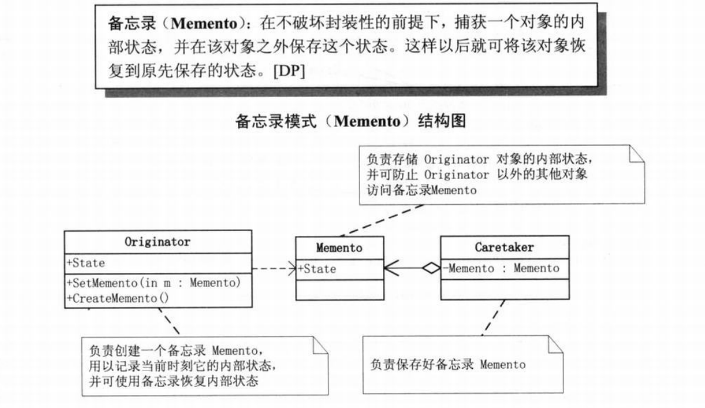

# 初识

1.设计模式是前人对代码开发经验的总结,是解决特定问题的一系列套路.不是语法规定.

2.gof  gang of four 一般有23种 

3.本质是面向对象设计原则的实际运用

4.分类:创建者模式  5/结构型 7/行为型 11 

* oop七大原则

  **开闭原则:**对扩展开放,对修改关闭

  **里氏替换原则**:继承必须保证超类拥有的性质在子类种依然成立

  **依赖倒置原则**: 要面向接口编程,而不是面向实现编程

  **单一职责原则**:控制类的粒度 低耦合,高内聚

  **接口隔离原则**:控制接口的粒度,通过组合的方式或则需要的

  迪米特法则:只与你的直接朋友交谈,不跟'陌生人'讲话

  **合成复用原则:优先考虑组合/聚合 其次才是继承**

  ​	**用对象的职责而不是结构来考虑问题**


# 分类

## 根据目的

1、创建型模式：作用于**对象的创建**，将对象的创建与使用分离。

2、结构型模式：将类或对象按某种布局**组成更大的结构**

3、行为型模式：作用于类或对象之间**相互协作**共同完成单个对象无法单独完成的任务，以及怎样分配职责


## 根据作用范围

1、类模式：用于处理类与子类之间的关系，这些关系通过**继承**来建立，在编译时刻便确定下来了

2、对象模式：用于处理对象之间的关系，这些关系可以通过**组合或聚合**来实现，在运行时刻是可以变化的，更具动态性。


# 装饰器模式P65

动态地给一个对象添加一些额外的职责	


如果只有一个ConcreteComponent而没有抽象的Component,那么Decorator可以是ConcreteComponent的一个子类

同理,如果只有一个ConcreteDecorator,那么也没有必要建立一个单独的 Decorator类,而可以吧Decorator和ConcreteDecorator的责任合并到一个类


Component

```
public abstract class Component {
   abstract void operation();
}
```


ConcreteComponent

```
public class ConcreteComponent extends Component{
    @Override
    void operation() {
        System.out.println("ConcreteComponent operation");
    }
}
```

Decorator

```
public abstract class Decorator extends Component {
     protected Component component;
     public Decorator(Component component){
        this.component=component;
     }

    @Override
    void operation() {
        component.operation();
    }
}
```

ConcereteDecoratorA

```
public class ConcereteDecoratorA extends Decorator{
    private String addState;

    public ConcereteDecoratorA(Component component) {
        super(component);
        System.out.println("具体装饰对象Ａ的操作");
    }

    @Override
    void operation() {
        component.operation();
    }
}
```

ConcereteDecoratorB & main

```
public class ConcereteDecoratorB extends Decorator{
    public ConcereteDecoratorB(Component component) {
        super(component);
    }

    @Override
    void operation() {
        super.operation();
        addBehavior();
        System.out.println("具体装饰对象Ｂ的操作");
    }

    private void addBehavior(){
        System.out.println("add additional functionality");
    }

    public static void main(String[] args) {
        Component component = new ConcreteComponent();
        ConcereteDecoratorA d1 = new ConcereteDecoratorA(component);
        ConcereteDecoratorB d2 = new ConcereteDecoratorB(component);
        d1.operation();
        System.out.println("=======");
        d2.operation();
    }
}
```


# 适配器模式

**将一个类的接口转化成客户需要的另外一个接口**。Adapter模式使得原本由于不兼容而不能工作的类一起工作。

GOF适配器模式有两种，类适配模式和**对象适配模式**，其中类适配模式通过多继承模式对一个接口与另一个接口进行匹配


```
public class Target {
    public void request(){
        System.out.println("request");
    }
}
```

```
public class Adaptee {
    public void specificRequest(){
        System.out.println("SpecificRequest");
    }
}
```

```
public class Adapter extends Target {
    //private
    private Adaptee adaptee=new Adaptee();

    @Override
    public void request() {
        adaptee.specificRequest();
    }
}
```

```
public class Client {
    public static void main(String[] args) {
        Target target=new Adapter();
        target.request();
    }
}
```


**在双方都不容易做出修改的时候使用适配器模式**


# 桥接模式P237

架构的演进

1. 有N品牌手机游戏，M品牌手机游戏

   

2. 此时两个又新增通讯录软件

   

3. 在增加mp3功能 在手机品牌下新增子类

4. 如果再增加一个手机品牌S,尝试另一种结构  当手机品牌和软件增多，类和类的继承层次规模就很大

   

   5. **用对象的职责而不是结构来考虑问题** 优先聚合/组合而非继承  也就是桥接模式

      


桥接模式（bridge）:将抽象部分与其实现部分分离，使他们都可以独立变化


```
public abstract class Implementor {
    public abstract void operationImpl();
}
```

```
public class ConcreteImplementorA extends Implementor{
    @Override
    public void operationImpl() {
        System.out.println("ConcreteImplementorA");
    }
}
```

```
//可以不是抽象类
public  class Abstraction {
    protected Implementor implementor;

    public void setImplementor(Implementor implementor){
        this.implementor=implementor;
    }

    public  void operation(){
        implementor.operationImpl();
    }
}
```

```
public class RefinedAbstraction extends Abstraction{
    @Override
    public void operation() {
        implementor.operationImpl();
    }

    public static void main(String[] args) {
        Abstraction ra = new RefinedAbstraction();
        ra.setImplementor(new ConcreteImplementorA());
        ra.operation();
    }
}
```


**总结：实现系统可能有多角度分类，每一个分类都可能变化，那么就把多角度分离出来让他们独立变化，减少他们之间的耦合**


# 备忘录模式 P298



```
public class Originator {
    //多个需要保存的状态
    private String state;

    public void setState(String state) {
        this.state = state;
    }

    public void setMemento(Memento memento){
        this.state=memento.getState();
    }

    public Memento createMemento(){
        return new Memento(state);
    }

    public void show(){
        System.out.println("State "+state);
    }
}
```

```
// 备忘状态的集合
public class Memento {
    private String state;

    public String getState() {
        return state;
    }

    public Memento(String state) {
        this.state = state;
    }
}
```

```
public class CareTaker {
    private Memento memento;

    public void setMemento(Memento memento){
        this.memento=memento;
    }

    public Memento getMemento() {
        return memento;
    }
```

```
public class Client {
    public static void main(String[] args) {
        Originator o = new Originator();
        o.setState("On");
        o.show();

        CareTaker c = new CareTaker();
        c.setMemento( o.createMemento());// snapshot of cur tick
        o.setState("Off");
        o.show();

        o.setMemento(c.getMemento());
        o.show();
    }
}
```


Memento模式比较适用于功能比较复杂的,但是**需要维护或记录属性历史的类** 或 需要保存的属性只是**众多属性中的一小部分时**,Originator可以根据保存的Memento信息还原到前一状态


# 组合模式composite  P207

**整体与部分可以被一致对待**


```
public abstract class Component {
    protected String name;

    public Component(String name) {
        this.name = name;
    }

    protected abstract void add(Component comp);
    protected abstract void remove(Component comp);
    protected abstract void display(int depth);
}
```

```
public class Leaf extends Component{

    public Leaf(String name) {
        super(name);
    }

    //add  remove leaf没有 但依旧实现以消除叶节点和非叶子结点在抽象层次上的区别
    @Override
    protected void add(Component comp) {
        System.out.println("cannot add to leaf");
    }

    @Override
    protected void remove(Component comp) {
        System.out.println("cannot remove from  leaf");
    }

    @Override
    protected void display(int depth) {
        String prefix=String.join("",Collections.nCopies(depth,"-"));
        System.out.println(prefix+name);
    }
}
```

```
public class Composite extends Component{
    List<Component> children=new ArrayList<Component>();
    public Composite(String name) {
        super(name);
    }

    @Override
    protected void add(Component comp) {
        children.add(comp);
    }

    @Override
    protected void remove(Component comp) {
        children.remove(comp);
    }

    @Override
    protected void display(int depth) {
        String prefix=String.join("", Collections.nCopies(depth,"-"));
        System.out.println(prefix+name);
        for (Component child : children) {
            child.display(depth+1);
        }
    }
}
```

```
public class Client {
    public static void main(String[] args) {
        Composite root = new Composite("root");
        root.add(new Composite("A"));
        root.add(new Composite("B"));

        Composite comp1 = new Composite("X");
        comp1.add(new Composite("XA"));
        comp1.add(new Composite("XB"));
        root.add(comp1);

        Composite comp2 = new Composite("XY");
        comp2.add(new Composite("XYA"));
        comp2.add(new Composite("XYB"));
        comp1.add(comp2);

        Component leaf=new Composite("C");
        root.add(leaf);
        root.add(new Composite("D"));
        root.remove(leaf);
        root.display(1);
    }
}
```


上述消除叶节点和非叶子结点在抽象层次上的区别的方式成为**透明方式**,对外而言具有完全一致的行为接口

而不实现这些无意义的方法成为**安全方式**(Coponent不声明,leaf不实现,composite声明实现),**缺点就是不够透明,leaf和composite不具有相同的接口,客户端的调用需要相应的判断,带来了不便**


**需求中是体现部分和整体的层次结构时,以及你希望用户忽略组合对象与单个对象的不同,统一的使用组合结构中所有的对象时,就可以考虑使用组合模式**


# 迭代器模式 P218


```
public interface Iterator {
    Object first();
    Object next();
    boolean isDone();
    Object currentItem();
}
```

```
public class ConcreteIterator implements Iterator{
    protected ConcreteAggregate aggregate;
    private int current=0;

    public ConcreteIterator(ConcreteAggregate aggregate) {
        this.aggregate = aggregate;
    }

    @Override
    public Object first() {
        return aggregate.get(0);
    }

    @Override
    public Object next() {
        Object ret=null;
        current++;
        if(current<aggregate.count()){
            ret=aggregate.get(current);
        }
        return ret;
    }

    @Override
    public boolean isDone() {
        return current>=aggregate.count();
    }

    @Override
    public Object currentItem() {
        return aggregate.get(current);
    }
}
```

```
public abstract class Aggregate {
    abstract Iterator createIterator();
}
```

```
public class ConcreteAggregate extends Aggregate{
    List<Object> items=new  ArrayList<Object>();
    @Override
    Iterator createIterator() {
        return new ConcreteIterator(this);
    }

    public ConcreteAggregate(List<Object> items) {
        this.items = items;
    }

    public int count(){
        return items.size();
    }

    public Object get(int index){
        return items.get(index);
    }
}
```

```
while (!iterator.isDone()){
    System.out.println(iterator.currentItem());
    iterator.next();
}
```


# 外观模式 P126


```
public class FaCade {
    SubSysOne one;
    SubSysTwo two;
    SubSysThree three;
    SubSysFour four;
    public FaCade(){
         one=  new SubSysOne();
         two=  new SubSysTwo();
         three=  new SubSysThree();
         four=  new SubSysFour();
    }
    public void methodA(){
       one.methodOne();
       four.methodFour();
    }
    public void methodB(){
        two.methodTwo();
        three.methodThree();
    }

    public static void main(String[] args) {
        FaCade faCade = new FaCade();
        faCade.methodA();
        faCade.methodB();
    }

}

class SubSysOne{
    void methodOne(){
        System.out.println("one");
    }
}
class SubSysTwo{
    void methodTwo(){
        System.out.println("Two");
    }
}
class SubSysThree{
    void methodThree(){
        System.out.println("Three");
    }
}
class SubSysFour{
    void methodFour(){
        System.out.println("Four");
    }
}
```


1. 在设计之初,有意识的将两个不同的层分离.比如经典三层架构,业务逻辑层和数据访问层建立外观Facade

2. 在开发的时候,子系统演化的越来越复杂

3. 维护老系统,可能这个系统已经很难维护或扩展

   **让新系统与Facade对象交互,Facade与遗留代码交互所有复杂工作**

   


# 享元模式 flyweight P285

假设现在要开发100家网站,其功能比较相似,如果常规做法,申请100个空间,100个数据库,相似代码赋值100遍,那无论是资源来是维护都是大问题.


```
public abstract class Flyweight {
    abstract void operation(int externalState);
}
```

```
public class ConcreteFlyweight extends Flyweight{
    @Override
    void operation(int externalState) {
        System.out.println("ConcreteFlyweight: "+externalState);
    }
}
class UnsharedConcreteFlyweight extends Flyweight{
    @Override
    void operation(int externalState) {
        System.out.println("UnsharedConcreteFlyweight: "+externalState);
    }
}
```

```
public class FlyweightFactory {
    //userId,Flyweight
    static Map<String,Flyweight>  flyweights=new HashMap<>();

    public static Flyweight getFlyweight(String key){
        if(!flyweights.containsKey(key)) {
            flyweights.put(key,new ConcreteFlyweight());
        }
        return flyweights.get(key);
    }
}
```

```
        Flyweight  fx= FlyweightFactory.getFlyweight("X");
        fx.operation(1);
        Flyweight  fy= FlyweightFactory.getFlyweight("Y");
        fy.operation(2);
```


**内部状态与外部状态**

相同的参数放在共享对象内部

不同的参数由客户端从外部传入


**如果app中使用了大量的对象,造成了很大的存储开销应该考虑使用**