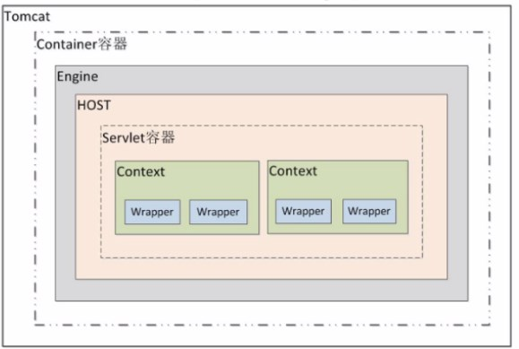

all: https://www.processon.com/view/link/617be37ee0b34d7894fcf545#map

p5: https://www.processon.com/view/link/62246a886376895389217f88#map

# P5

## 不清楚的点

1. 多线程需要再看看

   ```
   BlockingQueue
   ```

2. file

   java.io.File的prefixLength可用作File包含的路径类型的标识符 

   ```
   public File(String pathname)
   public File(String parent, String child) 
   public File(File parent, String child) 
   public File(URI uri)
   ```

3. 多线程实现文件上传 - socket+io

   

4. 1.8新特性 新时间Api

   java.time

   - LocalDate ：表示日期，包含年月日，格式为 2019-10-16
   - LocalTime ：表示时间，包含时分秒，格式为 16:38:54.158549300
   - LocalDateTime ：表示日期时间，包含年月日，时分秒，格式为 2018-09-06T15:33:56.750
   - DateTimeFormatter ：日期时间格式化类。
   - Instant：时间戳，表示一个特定的时间瞬间。
   - Duration：用于计算2个时间(LocalTime，时分秒)的距离
   - Period：用于计算2个日期(LocalDate，年月日)的距离
   - ZonedDateTime ：包含时区的时间

5. mysql 自定义函数

   函数与存储过程的区别：函数**只会返回一个值**，不允许返回一个结果集。函数强调返回值，所以函数不允许返回多个值的情况，即使是查询语句

   - 标量值函数 返回一个标量值

     **无法返回一个记录集,所以下述操作均无法实现**

   - 表格值函数

     - 内联表格值函数：返回一个表格
     -  多句表格值函数

6. jdbc四大核心对象

   DriverManager Connection Statement ResultSet

   conn.commit/rollback

   apache.commons-dbutils 

   开源的JDBC连接池 c3p0/druid 

7. 盒子

   - block-box

   		每个盒子都会换行

   		width和height属性可以发挥作用
		
   		如h1 p 自然文本

   - inline-box

   		每个盒子不会换行

   		width和height属性不会发挥作用
		
   		如span display:inline-block 自然文本
   
   **inline-block**
   
   - 设置`width` 和`height` 属性会生效。
   - `padding`, `margin`, 以及`border` 会推开其他元素。
   
   但是，它不会跳转到新行，如果显式添加 `width` 和 `height` 属性，它只会变得比其内容更大。


​	外边距 margin 把其他元素从盒子旁边推开(兄弟元素和父容器),可以为负,可能重叠

​	边框 border 往content内部方向扩展,而不是外部 此时**width/height不包含border**

   内边距 padding  边框和内容区域之间 **>=0**


8. 弹性盒子

   按行或按列布局元素的一维布局方法

   ```
   display:flex
   设置行内元素为 flexible box，也可以置 display 属性的值为 inline-flex。(inline-flex根据元素内容设宽,而flex撑满父容器)
   ```


主轴(水平) 交叉轴(垂直)

```
flex-direction: column; 默认row reverse指的是元素排列的方式 布局[0,1]->reverse-> [1,0]
```


换行 默认在一行排列所有flex-item,数量过多时,固定长宽		失效

```
flex-wrap: wrap
```

​	同时可以设置flex-item**最小**宽度

```
flex: 200px
flex: 1 每个元素占用空间都是相等的，占用的空间是在设置 padding 和 margin 之后剩余的空间
```


对齐

​	align-items  

​	控制 flex 项在垂直轴上(main->cross,cross->main)的位置

```
align-items:flex-end  默认的值是 stretch
```

​	

​	justify-content

​	控制 flex 项在同轴上(main->main,cross->cross)的位置

​	space-around margin-left/right 参与计算 元素之间距离相同

​    space-between margin-left/right 不参与计算

​	 space-evenly 每个元素之间和元素距离边距的距离都相等，但是兼容性比较差

​	属性相同(如flex-end) justify-content/justify-items同轴上方向相反; align-items /align-content 垂直轴上方向**相同**


排序

​	order:1  越大越靠后 默认0


**flex-grow：代表子元素占弹性盒的比例**

```
<div class="grow">
      <!-- flex-grow占用父元素的比例 -->
      <div class="grow-child1">flex-grow: 2</div>
      <div class="grow-child2">flex-grow: 6</div>
    </div>

.grow {
  width: 800px;
  height: 200px;
  background-color: aqua;
  display: flex;
}
.grow-child1 {
  flex-grow: 2;
  background-color: red;
}
.grow-child2 {
  flex-grow: 6;
  background-color: royalblue;
}
```

红蓝比例依次为800*2/(2+6)=200px  同理 600px


**flex-basis：flex-basis当前子弹性盒的尺寸**

```
 <div class="basis">
      <div class="basis-child1">basis-child1</div>
      <div class="basis-child2">basis-child2</div>
    </div>
    <hr />
 
/* css部分 */
.basis {
  width: 800px;
  height: 200px;
  background-color: aqua;
  display: flex;
}
.basis-child1 {
  flex-basis: 80%;
  background-color: red;
}
.basis-child2 {
  width: 100px;
  background-color: royalblue;
}

```

child1 800*80%=640px  也就是basis还有60px的空间没填充


**flex:1**

**自动填充满剩余空间**，如果有两个地方设置了flex，按着**flex-grow的规则分配剩余空间**

**同一个元素flex：1优先于width属性生效**

```
<div class="flex">
  <div class="flex-child1">flex-child1</div>
  <div class="flex-child2">flex-child3</div>
  <div class="flex-child3">flex-child3</div>
</div>

<style>
  /* css部分 */
  .flex {
    width: 800px;
    height: 200px;
    background-color: aqua;
    display: flex;
  }
  .flex-child1 {
    flex: 1;
    background-color: red;
  }
  .flex-child2 {
    flex: 2;
    /* width: 100px; */
    background-color: royalblue;
  }
  .flex-child3 {
    width: 200px;
    background-color: sandybrown;
  }
</style>
```

child1和child2按比例瓜分剩余800-200=600空间


补充

选择器:伪类   对选择器中筛选出来的列表取第n个

p:first-child/last（是p标签**且是指定范围内( 可以是每层后代的)第一个子元素**)
p:first-of-type/last
p:only-of-type/p:only-child
p:nth-child(2)/p:nth-of-type(2)
p:nth-last-child(2)/p:nth-last-of-type(2)


9. 静态资源: 可以理解为前端的固定页面，这里面包含HTML、CSS、JS、图片等等，不需要查数据库也不需要程序处理，直接就能够显示的页面

10. tomcat目录结构

    - bin .sh .bat

    - conf

      server.xml可以设置端口号、设置域名或IP、默认加载的项目、请求编码 
      web.xml可以设置tomcat支持的文件类型 
      context.xml可以用来配置数据源之类的 
      tomcat-users.xml用来配置管理tomcat的用户与权限 

    * lib tomcat运行需要加载的jar把

    * logs 存放tomcat在运行过程中产生的日志文件

      在windows环境中，控制台的输出日志在catalina.xxxx-xx-xx.log文件中 
      在linux环境中，控制台的输出日志在catalina.out文件中

    * temp

      tomcat在运行过程中产生的临时文件

    * webapps 存放应用程序

      **可以以文件夹、war包、jar包的形式发布应用**

    * work

      tomcat在运行时的编译后文件,如jsp编译后文件

      **清空work目录，然后重启tomcat，可以达到清除缓存的作用**

      

     补充:

    1. catalina 就是Tomcat服务器使用的 Apache实现的servlet容器的 名字

    Tomcat的核心分为3个部分:
     （1）Web容器---处理静态页面；
     （2）catalina --- 一个servlet容器-----处理servlet;
     （3）还有就是JSP容器，它就是把jsp页面翻译成一般的servlet。

    2. redirectPort

		当用户用http请求某个资源，而该资源本身又被设置了必须要https方式访问，此时Tomcat会自动重定向到这个redirectPort设置的https端口

3. `Tomcat`的容器分为四个等级，

   Engine是个引擎容器

   HOST是主机容器

   `Servlet`的容器管理`Context`容器，一个`Context`对应一个`Web`工程

   

   


11. servlet 运行在 Web 服务器或应用服务器上的程序

12. Servlet 通过调用 init () 方法进行初始化。 Servlet 调用 service () 方法来处理客户端的请求。 Servlet 通过调用 destroy () 方法终止（结束）。 最后，Servlet 是由 JVM 的垃圾回收器进行垃圾回收的

2. 实现方式
   1. implement `servlet`
   2. extends `GenericServlet`
   3. extends `HttpServlet`

3. Servlet默认是以多线程模式执行的

   Servlet体系结构是建立在Java多线程机制之上的，它的生命周期是由Web容器负责的。当客户端第一次请求某个Servlet时，Servlet容器将会根据web.xml配置文件实例化这个Servlet类。当有新的客户端请求该Servlet时，一般不会再实例化该Servlet类，也就是有**多个线程在使用这个实例**

   比如 该Servlet中定义了一个实例变量PrintWriter  output,当多个用户并发访问时,可能会出现其它用户的信息显示在另外一些用户的浏览器上的问题

   解决:

   - 实现 SingleThreadModel 接口,　该接口指定了系统如何处理对同一个Servlet的调用。
   - 同步对共享数据的操作
   - 避免使用实例变量

12. JSP 9个隐式对象

    **JSP容器为每个页面提供的Java对象**

    out

    page

    exception

    request/response/session/pageContext/application

    

13. filter实现登录验证

    静态资源或login  chain.doFilter(req, resp);放行

    没登录  response.sendRedirect('/login')

17. interface ServletContextListener  extends EventListener

18. Map put

    key hash+取模相同

    1. equals为true,比如hash('')=hash(''),此时直接替换,返回旧值

       **String.equals比较字串而不是hashCode**

       测试:

       建一个类 equals always return true;hash值一样

       

    2. equals为false 追加到链表 返回null

       equals always return false


## 不清楚的点实现

3.

```
//发送文件,并获取server response
public class Client {
    public static void main(String[] args) throws IOException {
        for (int i = 0; i < 10; i++) {
            Socket socket = new Socket("127.0.0.1", 8088);


            int len;
            byte[] buffer = new byte[1024 * 1024];
            try(BufferedOutputStream bo = new BufferedOutputStream(socket.getOutputStream())){
                try(FileInputStream fs = new FileInputStream("test.png")){
                    while((len=fs.read(buffer))!=-1){
                        bo.write(buffer, 0, len);
                        bo.flush();
                    }
                }

                //写入完成
                socket.shutdownOutput();

                try(BufferedInputStream bi = new BufferedInputStream(socket.getInputStream())){
                    while((len=bi.read(buffer))!=-1){
                        System.out.println(new String(buffer,0,len));
                    }
                }

            }
            socket.close();
        }
    }
}
```

```
//接受cli的文件,并通过多线程写进文件中
public class Server {
    public static void main(String[] args) throws IOException {
        ServerSocket socket = new ServerSocket(8088);
        System.out.println("server is starting..");
        ThreadPoolExecutor pool = new ThreadPoolExecutor(2, 3, 1000
                , TimeUnit.MILLISECONDS, new SynchronousQueue());

        while (true){
            Socket client=socket.accept();
            if(client!=null) {
                System.out.println("client upload is arrived");
                pool.execute(new FileWriteThread(client));
            }
        }
    }
}
class FileWriteThread implements Runnable{

    private Socket socket;
    public FileWriteThread(Socket socket){
        this.socket=socket;
    }

    @Override
    public void run() {
       try(BufferedInputStream bi= new BufferedInputStream(socket.getInputStream())){
           int len;
           byte[] buffer = new byte[1024 * 1024];
           //文件命名格式：当前系统毫秒值+随机数
           String fileName=new StringBuilder().append(System.currentTimeMillis())
                                                .append("-").append(new Random().nextInt(100))
                                                .append(".png").toString();
           try(FileOutputStream fo = new FileOutputStream(fileName)){
               while((len=bi.read(buffer))!=-1){
                   fo.write(buffer,0,len);
               }
           }
       } catch (IOException e) {
           e.printStackTrace();
       }
    }
}
```

4.

```
LocalDate now = LocalDate.now();
String str = now.format(DateTimeFormatter.ofPattern("yyyy/MM/dd"));
LocalDate localTime = LocalDate.parse(str, DateTimeFormatter.ofPattern("yyyy/MM/dd"));

```

```
        LocalDate now = LocalDate.of(2021,1,1);
        System.out.println(now.plusDays(10));
        System.out.println(now.getDayOfWeek());
        System.out.println(now.isAfter(LocalDate.now()));
```

```
//时间戳
System.out.println(Instant.now().getNano());
//计算时间差
Duration duration = Duration.between(LocalTime.of(10, 0, 0), LocalTime.now());
System.out.println(duration.toHours());
//计算日期差
Period period = Period.between(LocalDate.of(2022, 7, 1), LocalDate.now());
System.out.println(period.getMonths());
```

5.

- 标量值函数 返回一个标量值

  ```sql
  Create function 函数名（参数）
  Returns 返回值数据类型
  begin
  	SQL语句(必须有return 变量或值)
  End
  ```

  ```
  例子：
  1.创建函数：
  delimiter //
  CREATE  FUNCTION  MySTR(strs VARCHAR(50))
  RETURNS VARCHAR(50) 
  BEGIN
   DECLARE num SMALLINT;
   select count(*) into num from test where label=strs;
   # SET str2=strs;
   RETURN num;
  END//
  delimiter ;
  2.执行函数：
  
  SELECT dbxx.MySTR('aa') AS result
  在sql语句中执行：
  
  delimiter //
  create function callMyStr()
  returns VARCHAR(50) 
  begin
  	declare res VARCHAR(50);
  	set res= test.MySTR('一级 1');
  	return res;
  end//
  delimiter ;
  ```

  问题:This function has none of DETERMINISTIC, NO SQL, or READS SQL DATA in its declaration and binary log

  原因: 默认只有 DETERMINISTIC, NO SQL 和 READS SQL DATA 被支持

  在mysql数据库中执行以下语句 （临时生效，重启后失效）

  >  set global log_bin_trust_function_creators=1;


8.

**position** 

1. `static`

   该关键字指定元素使用正常的布局行为，即元素在文档常规流中当前的布局位置。此时 `top`, `right`, `bottom`, `left` 和 `z-index` 属性无效。

2. `relative`

   该关键字下，元素先放置在**未添加定位时的位置**，再在不改变页面布局的前提下调整元素位置（因此会在此元素未添加定位时所在位置**保留空白**）。position:relative 对 table-*-group, table-row, table-column, table-cell, table-caption 元素无效。

3. `fixed`

   元素会被移出正常文档流，并不为元素预留空间，而是通过指定元素相对于**屏幕视口**（viewport）的位置来指定元素位置。元素的位置在屏幕滚动时不会改变。打印时，元素会出现在的每页的固定位置。`fixed` 属性会创建新的层叠上下文。当元素祖先的 `transform`, `perspective` 或 `filter` 属性非 `none` 时，容器由视口改为该祖先。

4. `absolute`

   元素会被移出正常文档流，并不为元素预留空间，**通过指定元素相对于最近的非 static 定位祖先元素的偏移**，来确定元素位置。绝对定位的元素可以设置外边距（margins），且不会与其他边距合并。

5. `sticky`

   元素根据正常文档流进行定位，然后相对它的*最近滚动祖先（nearest scrolling ancestor）*和 [containing block](https://developer.mozilla.org/zh-CN/docs/Web/CSS/Containing_block) (最近块级祖先 nearest block-level ancestor)，包括 table-related 元素，基于`top`, `right`, `bottom`, 和 `left`的值进行偏移。偏移值不会影响任何其他元素的位置。 该值总是创建一个新的[层叠上下文（stacking context](https://developer.mozilla.org/zh-CN/docs/Web/CSS/CSS_Positioning/Understanding_z_index/The_stacking_context)）。注意，**一个 sticky 元素会“固定”在离它最近的一个拥有“滚动机制”的祖先上（当该祖先的`overflow` 是 `hidden`, `scroll`, `auto`, 或 `overlay`时）**，即便这个祖先不是最近的真实可滚动祖先。这有效地抑制了任何“sticky”行为（详情见[Github issue on W3C CSSWG](https://github.com/w3c/csswg-drafts/issues/865)）。 


## 未完成的点